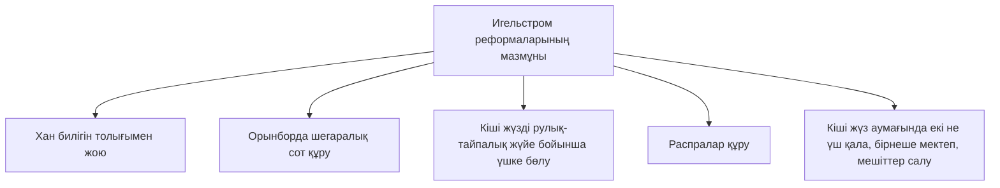

START OF PAGE: 1
3. Е. Қабылдинов, Ж. Н. Қалиев, А. Т. Бейсембаева

# ҚАЗАҚСТАН ТАРИХЫ  
*(XVIII–XIX ғасырлар)*

Жалпы білім беретін мектептің 7-сыныбына арналған оқулық

# 7

Қазақстан Республикасының Оқу-ағарту министрлігі ұсынған

Алматы «Атамұра» 2025

END OF PAGE: 1
START OF PAGE: 2
  
ӨӨЖ 373.167.1  
КБЖ 63.3(5 Қазақ)72  
Қ 13  
  

# Пікір жазғандар:  
**М. Ж. Өбдіров**, тарих ғылымдарының докторы, профессор  
**З. Т. Сәдуақасова**, тарих ғылымдарының докторы, профессор  

# ШАРТТЫ БЕЛГІЛЕР:  

|  | – сұрақтар мен тапсырмалар |  
|---------------------------------------|----------------------------|  
|       | – ұғымдар мен терминдер     |  
|         | – тарихи тұлғалар          |  
|       | – құжаттар                 |  
|  | – құжат бойынша сұрақтар |  
|        | – QR-кодпен берілген мәтіндер, бейнежазбалар |  

----

**Қабылдинов З. Е. т.б.**  
Қ 13 Қазақстан тарихы (XVIII–XIX ғасырлар). Жалпы білім беретін мектептің 7-сыныбына арналған оқулық / З. Е. Қабылдинов, Ж. Н. Қалиев, А. Т. Бейсембаева. – Алматы: Атамұра, 2025. – 240 бет.  

ISBN 978-601-10-0693-4  

Оқулық XVIII–XIX ғасырлар аралығындағы Қазақстан тарихының жаңа кезеңін қамтиды.  

----

**ISBN 978-601-10-0693-4**  

© З. Е. Қабылдинов, Ж. Н. Қалиев,  
А. Т. Бейсембаева, 2025  
© «Атамұра», 2025

END OF PAGE: 2
START OF PAGE: 3
# КІРІСПЕ

Құрметті оқушылар! Сендер 6-сыныпта Түрік қағанатынан бастап XVII ғасырдың соңына дейін еліміз басынан кешірген тарихпен таныстыңдар. XV ғасырдың ортасынан қалыптасып, нығайып, орталықтандырыла бастаған Қазақ хандығы туралы тыңғылықты білім алдыңдар.

Қолдарыңдағы 7-сыныпқа арналған оқулықта еліміздің XVIII–XIX ғасырлардағы тарихының маңызды оқиғалары қамтылған. Мәселен, XVIII ғасырдың бірінші жартысында халқымызды аса ауыр зардаптарға душар еткен қазақ-жоңғар соғыстары туралы оқып білесіңдер. Ата-бабаларымыз қатыгез басқыншылардың шабуылынан туған жеріміздің әр сүйемін қорғап қалуда ерең ерлік пен теңдесі жоқ батырлықтың ғажайып үлгісін көрсетті.

Сонымен қатар қазақ халқының өз тәуелсіздігін жоғалтудың қиын да қарама-қайшылықты үрдісі туралы да білетін боласыңдар. Ресей империясы Қазақстан аумағын өз қарамағына қосып алу жоспарын біртіндеп жүзеге асыра бастады. Бұл жағдайда аса көрнекті мемлекет қайраткері, айбынды Абылай хан ел тәуелсіздігін мүмкіндігінше сақтап қалуға күш салды. Оған өз Отаны мен халқына адал берілген сұлтандар, билер мен батырлар көмектесті.

Патша үкіметінің отаршылдық саясатына қазақ халқының айтулы тұлғалары: Сырым Датұлы, Жоламан Тіленшіұлы, Исатай Тайманұлы, Махамбет Өтемісұлы, Жанқожа Нұрмұхамедұлы, Есет Көтібарұлы, Кенесары Қасымұлы және басқалар қарсы шықты.

Осы оқулықтан сендер Қазақстан жеріне әртүрлі ұлт өкілдерінің қалай қоныстана бастағаны туралы да оқып білесіңдер. Басқарудың отарлық сипатта болғанына қарамастан, әртүрлі діндер мен халық өкілдері арасында түсіністіктің негізі қаланды.

Оқулықтың бұл басылымында тақырыптар тарихи оқиғалардың ретімен баяндалды. Күрделі ұғымдар мен деректерге тиісті түсініктер берілді.

END OF PAGE: 3
START OF PAGE: 4
Естерінде болсын! Қазақстан тарихын терең оқып-үйрену өз Отанынды құрметтеп, мақтан тұту сезімін қалыптастырады. Әрқайсысың еліміздің тарихын жақсы білулерің керек, сонда ғана дұрыс бағыт-бағдар алып, өз болашақтарыңды болжай аласыңдар.

Бұл – жаңартылған мазмұндағы оқулық. Оған мектептегі тарихшы ұстаздар мен ата-аналар тарапынан алуан түрлі құнды ескертпелер, маңызды ұсыныстар жасалуы әбден мүмкін. Оның бәрі де ескеріліп, келесі басылымдарда оқулықтың сапасын одан әрі жақсарта түсетін болады.

**Қымбатты оқушылар!** Оқулықтың соңында берілген мазмұнымен мұқият танысып шығыңдар. Ол алты бөлімнен тұрады. Әр бөлімнің өзі бірнеше тақырыпқа бөлінген. Оқулықтың мазмұны ондағы материалды жүйелі, рет-ретімен қалай оқып-үйренуге болатынын көрсетеді.

Оқулықтағы жазбаша және әдеби дереккөздерден келтірілген үзінділер мен суреттер, карталар, кестелер сендерге Қазақстанның жаңа тарихының басты оқиғалары туралы кеңірек білулеріңе көмектеседі. Сендердің сонау алысқа, өткен замандар қойнауына терең бойлауларыңа, дәуір «тамырының қалай соққанын» сезінулеріңе мүмкіндік береді.

Әр тақырыптың соңында **сұрақтар** мен **тапсырмалар** келтірілген. Берілген сұрақтарға дұрыс жауап беріп, тапсырмаларды сапалы орындау үшін сол тақырыптың материалдарын мүмкінше мұқият оқып шығу керек. Сұрақтар мен тапсырмалар сендердің жаңа тақырыпты қаншалықты меңгергендеріңді тексеріп көрулеріңе көмектеседі.

Тақырыптың мәтінін оқу кезінде **қара** немесе *курсив* әріптермен терілген сөздерді кездестіресіңдер. Сендер ол сөздерге айрықша назар аударуларың керек. Қара әріптермен терминдердің мазмұнына, тарихи тұлғаларға берілген түсініктерді әр тақырыптың соңынан таба аласыңдар. Сондай-ақ елеулі даталар да қара әріптермен терілген. Мұның өзі сендердің оларды есте сақтауларың үшін жасалған.

Әр тақырыпқа сабақтың мақсаты берілген. Онымен тақырыпты оқуға кірісерден бұрын міндетті түрде танысуға тиістіңдер. Бұл өткен тақырыптарды пысықтау үшін жасалған.

END OF PAGE: 4
START OF PAGE: 5
```markdown
Сонымен бірге әр тақырыптың соңында маңызды құжаттардан сол кезеңге қатысты үзінділер келтірілген. Сондықтан да оларды міндетті түрде оқып шығыңдар. Құжаттың әр үзіндісінен кейін бірқатар сұрақтар берілген. Сұрақтарға жауап іздеу, белгілі бір оқиғалар жайлы өзара пікір алмасу жыл бойына алған білімдеріңді одан әрі жетілдіре түседі. Мұның бәрі де тақырыпты неғұрлым тыңғылықты меңгерулерің үшін жасалып отыр. Оқулықтың соңында қайталаулар мен пысықтауға арналған тарихи материалдар бар. Сендердің өткен тақырыптарды тағы бір рет пысықтап шығып, XVIII–XIX ғасырлардағы Қазақстан тарихының негізгі даталарын, аса маңызды деректер мен оқиғаларды қайтадан еске түсірулерің үшін қажет.

Оқулық материалдарын сапалы меңгеруге «Хрестоматия» да көп көмектесе алады.

Біз сендердің білімдеріңнің кеңейе түсуіне, табысқа жете берулеріңе тілек білдіреміз!

Авторлар
```

END OF PAGE: 5
START OF PAGE: 6

БІРІНШІ БӨЛІМ | ҚАЗАҚ-ЖОҢҒАР СОҒЫСТАРЫ

# §1–2. ЖОҢҒАР БАСҚЫНШЫЛАРЫНА ҚАРСЫ ОТАН СОҒЫСЫНЫҢ БАСТАЛУЫ

> Бүгінгі сабағымызда Жоңғар мемлекетінің құрылуы мен басқыншылық жорықтарының себептерін талқылаймыз. Жоңғар шапқыншылығының зардаптарын, демографиялық өзгерістерді анықтаймыз. Халық ауыз әдебиеті мен музыка туындыларының тарихи дереккөз ретіндегі құндылығын бағалаймыз.

Қазақтар жоңғарлармен ұзақ уақыт бойы кескілескен қанды шайқастар жүргізіп келді. Алайда соның ішіндегі ең ауыры «Ақтабан шұбырынды, Алқакөл сұлама» атанған, қайғы мен қасіретке толы апатты кезең болды.

----

### 1. Қазақ хандығының XVIII ғасырдың бас кезіндегі ішкі және сыртқы жағдайы.

Тәуке хан билік еткен жылдары Қазақ хандығы орталықтандырылған мемлекет болып қала берді. Қазақ хандығында саяси тұрақтылық орнады, ішкі алауыздық азайды. Ауызбіршіліктің арқасында елдің орасан зор аумағының тұтастығы сақталды.

Тәуке ханнан кейін оның мұрагері **Қайып хан** қазақ мемлекетінің бұрынғы ұлылығын берік ұстап тұра алмады. Сұлтандардың тарапынан наразылық күшейіп, елде хандық билікке талас өрши түсті. Мұның өзі дәстүрлі Қазақ хандығын дағдарыс пен күйзелісге ұшыратты. Ру-тайпа мен жүздер арасында алауыздық орын алды. Сұлтандардың аймақтық **сепаратизмі** күшейді. Орталық хандық биліктің әлсіреуі Кіші жүзде – *Әбілқайырдың*, Орта жүзде – *Болат, Сәмеке, Күшіктің*, Ұлы жүзде *Жолбарыс* хандардың жағдайын нығайта түсті.

----

<div style="border:1px solid #c0c0c0; padding:10px; width:250px; margin-top:10px;">
<b>Тірек сөздер:</b><br>
• Жоңғар<br>
• Қайып хан<br>
• Канси<br>
• Сепаратизм<br>
• Цеван-Рабтан<br>
• «Елім-ай»
</div>

<div style="border:1px solid #c0c0c0; padding:10px; width:250px; margin-top:10px;">
<b>Анықта!</b><br>
Қазақ қоғамында сепаратизмнің күшеюіне не әсер етті?
</div>

6

END OF PAGE: 6
START OF PAGE: 7


```
Еділ қалмақтары       Жоңғарлар       Башқұрттар

          XVIII ғасырдың басында Қазақстан аумағына қауіп төндірді

Орал қазақтары                             Сібір қазақтары
```

XVIII ғасырдың бас кезінде Қазақ мемлекеті іштей ыдырай баста- ды. Бұл сыртқы алпауыт мемлекеттердің жіті назарында болды. Ресей Қазақстан мен Орта Азияға көз сала бастады. Қытай және Ресей империясы Қазақ хандығы мен Жоңғария хандығы сияқты көшпелі мемлекеттердің әлсіреуіне мүдделі еді. Ресей империясы Қазақстанның шегаралық аймағына дипломатиялық және әскери барлау ісін кеңінен жүзеге асырды. Кейіннен бұл шаралар әскери бекіністер салумен қатар жүрді.

**2. Жоңғар мемлекетінің құрылуы.** 1635 жылы Батыр қонтайшы бастаған Жоңғар хандығы құрылды. Ол Қазақстанның оңтүстік-шығыс жағында еді. 1640 жылы жоңғарлар «Далалық жарғы» деген атпен әскери және азаматтық заңдар жинағын шығарды. Жоңғарлардың бірлігі нығайды, әскери күш-қуаты арта түсті. Әскердегі тәртіп күшейтілді. Майдан алаңын тастап кеткендерге мал- мүліктік айып салынды. Сатқындар қатаң жазала- нып, өлім жазасына кесілді. Соғыс жағдайы кезінде әрбір ру өте қысқа мерзімнің ішінде жауынгер- лік бірлік күшіне айналып шыға келді. Жоңғар хандығы жауынгерлерінің жалпы саны 100 мың- ға дейін жететін қуатты атты әскер шығара ала- тын еді. Жоңғар әскерінің қатарында мылтықпен қаруланғандар да болды. XVIII ғасырдағы неміс ғалымы И. Георги: *«Олар мылтықтарын аттан түсіп ататын»*, – деп жазды.

Жоңғарлар соғысұра машықтана түсті. Оқ- дәріні селитра мен күкірттен өздері жасап алатын. Қолдарынан қылыш, сауыт, дулыға және басқа қару-

----

### Анықта!

Жоңғар мемле- кетінің күшеюіне әсер еткен жағ- дайлар.

----

### Картамен жұмыс

XVIII ғасырдың басындағы Қазақ хандығының сыртқы саяси жағдайына талдау жаса.

7

END OF PAGE: 7
START OF PAGE: 8


Анықта!  
Иоган Густав Ренат жоңғарларға қалай тұтқынға түсті?

жарақ түрлерін жасау да келетін. XVII ғасырдың аяғына қарай жоңғарларда білтелі мылтық пайда болды. Тіпті зеңбірек жасауды да үйреніп алды. Оларға зеңбірек құюды тұтқынға түскен швед Иоган Густав Ренат үйретті. Сонымен қатар шегаралас жатқан мемлекеттердің аумағында жүріп, құпия ақпараттар жинаумен айналысатын тыңшылар жүйесі де құрылды.  
1698 жылы 40 мың сарбазды құрайтын жоңғар әскері Ұлы жүздің аумағына жойқын жорық жасады. Жоңғарлар бұдан кейін де қазақтарға әскери жорықтарын үдете бастады. Қазақстанға ең ірі жорықтары 1710 және 1717 жылдары орын алды, нәтижесінде әскер саны мен әскери техниканың жақсы жабдықталуы арқасында жоңғар жасақтары Жетісудың бір бөлігін басып алды. Әскери әлеуеті мықты көшпелі мемлекетке айналған Жоңғария Қазақ хандығына ғана емес, Орта Азия хандықтарына, Ресей мен Циндік Қытай сияқты ірі империяларға да қауіп төндірді.  
Жоңғария көрші елдердің жерін тартып алуды көздеген, барынша әскерилендірілген мемлекетке айналды. Халық қазақтар сияқты көшпелі және жартылай көшпелі өмір салтын ұстанды. Негізінен малшаруашылығымен айналысатын.  

### 3. Қазақстан аумағына жоңғарлардың басқыншылық жасау себептері.  
Қазақ жері Жоңғария билеушілерін бұрыннан қатты қызықтырған. Жоңғарлар Жетісу мен Сырдария өңіріндегі маңызды сауда жолдарына бақылау орнатуға, қазақтың кең-байтақ шұрайлы жерлерін басып алуға тырысты.

| Жоңғарлардың Қазақ хандығына шапқыншылықтарының себептері      | Жоңғарлардың Қазақ хандығына шапқыншылықтарының себептері | Жоңғарлардың Қазақ хандығына шапқыншылықтарының себептері |
| -------------------------------------------------------------- | --------------------------------------------------------- | --------------------------------------------------------- |
| Жоңғарлардың сауда жолы торабына бақылау орнатуға тырысуы      | Еділ қалмақтарымен байланыс орнату                        |                                                           |
| Алым-салық төлейтін тәуелді халықтың санын ұлғайту             | Жергілікті тұрғындарды тәуелділікте ұстау                 |                                                           |
| Шұрайлы жайылымдықтар мен сауда-қолөнер орталықтарын басып алу |                                                           |                                                           |


8

END OF PAGE: 8
START OF PAGE: 9
«Ақтабан шұбырынды». М. Қаспаұтың суреті

# 4. XVIII ғасырдың басындағы жоңғар шапқыншылығы. «Ақтабан шұбырынды, Алқакөл сұлама».

XVIII ғасырдың 20-жылдарының бас кезінде жоңғарлардың қазақ жеріне кезекті ірі жорық жасауына қолайлы жағдай қалыптасты. 1722 жылы жоңғарлармен ұзақ уақыт бойы соғыс жүргізіп келген Қытай императоры (боғдыханы) **Канси** қайтыс болды. Сөйтіп, жоңғарларға Қытаймен бейбіт келісім жасауға мүмкіндік туды. Жоңғар билеушілері Еділ бойындағы қалмақтардың ханы Аюкеге елші жіберіп, қазақтарға қарсы бірлескен соғыс қимылдарын жүргізу мақсатын көздеді. Ертіс бойында жақында салынған әскери бекініс желісін нығайтуымен әуре болып жатқан Ресей Жоңғар мемлекетіне қауіп төндіре алмайтын еді. Оның үстіне, Ресей көрші жатқан екі көшпелі мемлекеттің қарым-қатынасына байланысты бейтарап саясат ұстауға тырысты. Себебі Ресей империясына қазақ мемлекетінің де, Жоңғар хандығының да өзара шайқаста әбден әлсіреп, бытыраңқы болғаны тиімді еді.

> ### Шығармашылық тапсырма  
> Суретке қарап, жоңғарлардың шапқыншылығы туралы әңгіме құрастыр.

9

END OF PAGE: 9
START OF PAGE: 10
```markdown
1723 жылдың көктемінде алдағы болатын жойқын соғысқа мықтап әзірленген әрі қазақ жүздерінің алауыздығын пайдаланған Цеван-Рабтан өз әскерінің қалың қолын қазақ жеріне қарай аттандырды. Жоңғар шапқыншылығының алғашқы соққысына ұшыраған Жетісу мен Ертіс бойындағы қазақтар еді. Жоңғарлар ауылдарды өртеді, малдарды айдап әкетті, бейбіт халықты аяусыз қырып салды. Шабуыл тұтқылдан басталғандықтан амалы қалмаған халық малына да, үй-жайларына да, дүние-мүліктеріне де қарамай, бас сауғалап қашуға мәжбүр болды.

Жау әскерінің сан жағынан басымдығына қарамастан, қазақ жауынгерлері төгеурінді қарсылық көрсетті. Қазақ жауынгерлері қарттарды, әйелдер мен балаларды жаудың өкшелеп қууынан құтқару үшін шегіне жүріп, қорғаныс соғысын жүргізді. Ташкент тұрғындары қазақ әскери жасақтарының басшылығымен қаланы жаудан бір ай бойы дерлік қорғады. Жоңғарлар Ташкенттен кейін Сайрам, Түркістан сияқты басқа да қалаларды басып алды. Жойқын соғыс қимылдарының нәтижесінде елдің шөлді және таулы аймақтарынан өзге бүкіл аумағы іс жүзінде жоңғарлардың қолына қарады. Салыстырмалы түрде алғанда Қазақстанның батысындағы алыс аймақтар ғана аман қалды.

Бұл кезең (1723–1727 жылдар) қазақ тарихында «Ақтабан шұбырынды, Алқакөл сұлама» деген атпен қалды. Оның қазақ халқына тигізген зардабы, қайғы-қасіреті, аштық пен қайыршылық халге душар етуі өте ауыр болды. Мыңдаған адам қырылды, тұтқын ретінде айдалып кетті. Мал-мүлік талан-таражға түсті, сауда байланысы үзілді, бір кезде гүлденіп тұрған қалалар жау қолында қалып, аяусыз қиратылады. Көптеген ауыл қатты күйзелісге ұшырады.

Халық қырғыннан аман қалу үшін елдің батыс аймақтарына қарай жылжып, Жайық бойына дейін жетті. Қазақтардың жаппай қоныс аударуы Ресей империясын және оның қол астындағы башқұрттар мен қалмақтардың едәуір мазасын қашырды. Патша үкіметі оларды қорғау үшін бірқатар кешенді шаралар қабылдады: шекара күзеті күшейтілді, жаңадан әскери бекіністер салу қолға алынды.

Қазақтардың едәуір бөлігі Орта Азия мемлекеттерінің аумағына қарай ойысты. Мәселен, Сырдария өзенінен өтіп кеткен Орта жүз руларының көпшілігі Самарқан қаласының төңірегіне, ал Кіші жүз қазақтарының едәуір бөлігі Хиуа мен Бұхар хандықтарына көшіп кетті.

> **Ойлан!**  
> Не себепті «Елім-ай» бүкілхалықтық әнге айналды?

Жоңғар шабуылының өрт-жалын өзбектерді де, қырғыздарды да, қарақалпақтарды да шарпығанымен, ең ауыр соққы қазақтарға тиді.

Қазақ халқының басынан кешірген сол бір орасан ауыр қайғы-қасіреттің белгісіндей болған «Елім-ай» атты зарлы жыры туды:
```

END OF PAGE: 10
START OF PAGE: 11
Қаратаудың басынан көш келеді,  
Көшкен сайын бір тайлақ бос келеді.  
Ел-жұртынан айырылған жаман екен,  
Екі көзге мелтілдеп жас келеді...  

Қазақ халқының рухын көтеретін Ақтамбердінің мына жыры да халық жадына сақталған:  

Жауға шаптым ту байлап,  
Шепті бұздым айғайлап.  
Душпаннан көрген қорлықтан,  
Жалынды жүрек қан қайнап,  
Ел-жұрты қорғайлап,  
Өлімге жүрміз бас байлап.  

Батырлардың Отан қорғаудағы ерлік істерін Үмбетей, Тәтіқара, Бұқар, Көтеш т.б. жыраулар жазып қалдырды.  
**5. Жоңғар шапқыншылығының қазақ қоғамына тигізген әсері.**  

<div style="text-align:center;">
| Қазақтардың жоңғарлардан жеңілу себептері                                   | Қазақтардың жоңғарлардан жеңілу себептері        | Қазақтардың жоңғарлардан жеңілу себептері                                              |
| --------------------------------------------------------------------------- | ------------------------------------------------ | -------------------------------------------------------------------------------------- |
| Бытыраққылық, ауызбіршіліктің болмауы                                       | Қазақтардың жұтқа ұшырауы                        | Тұтқылдан шабуыл жасауы                                                                |
| Жоңғарлардың геосаяси жағдайды ескере білуі, Қытаймен бейбіт келісім жасауы | Жоңғарлардың мықты қарулануы, күштің тең болмауы | Шабуыл басталар уақытта қазақ ауылдары бір-бірінен алыс, қыстаудан көктеуге көшкен еді |


</div>

«Ақтабан шұбырынды, Алқакөл сұламаның» қазақ қоғамына тигізген зардабы орасан зор болды. Далалықтардың көші-қон бағыттары өзгеріске ұшырады. Қазақтар шұрайлы мал жайылымдарынан айырылды. Жетісудағы және Қазақстанның оңтүстік аймақтарындағы бір кезде гүлденіп тұрған жасыл жазиралы өлкесі енді қараусыз қаңырап бос жатты.  

11

END OF PAGE: 11
START OF PAGE: 12


«Ақтабан шұбырынды, Алқакөл сұлама» тарихи оқиғасы Шәкәрім Құдайбердіұлының «Қалқаман–Мамыр» дастанында сипатталған. Танысып шық.

Көршілес мемлекеттермен сауда-саттық байланысы да уақытша үзіліп қалды.  
Ең ауыр қайғы-қасірет туған-туыстар мен жақын жандардың қазасы болды. Шәкәрім Құдайбердіұлының келтірген деректері бойынша, қазақтардың үштен екі бөлігі қырғынға ұшыраған. Бірқатары құлдыққа сатылып кеткен. Халық ашаршылыққа душар болды. Өлмей, аман қалу үшін қайыңның сөлін ішкен. «Қайың сауған» деген сөз содан қалған. Осы қиыншылықтардан тірі қалғандар басқыншыларға шектен тыс ауыр алым-салық төлеп тұрған. Қазақ халқы елдің әртүрлі алыс аймақтарына, тіпті шегаралас жатқан шет мемлекеттерге де тарап, босып кетті. Олардың батысқа қарай жаппай ағылуы қарақалпақ, түрікмен, өзбек, башқұрт және қалмақтармен жерге таласқан дау-дамайларға алып барды. Қазақтардың Орал қазақтарымен де, Батыс Сібірдегі орыстармен де өзара қарым-қатынастарын шиеленістіріп жіберді. Міне, мұның бәрі әбден әлсіреген Қазақ хандығын Ресей империясының отарлап алуымен аяқталды.

1. Қазақ-жоңғар соғысына Ресей империясының саясаты қандай еді?  
2. Сөйлемдегі көп нүктенің орнына тиісті сөздерді қой.

1635 жылы Батыр қонтайшы бастаған ... құрылды. «Ақтабан шұбырынды, Алқакөл сұлама» сынды қиын тарихи кезең ... жылдарды қамтыды. Бұл тарихи оқиғаны Шәкәрім Құдайбердіұлы ... дастанында суреттеді. Қайғы-қасіреттің символы ... атты зарлы жыр болды.

3. Жоңғар шапқыншылығынан кейін қазақ жүздерінің жылжыған аймақтарын сәйкестендір.

| Кіші жүз | Самарқанға қарай бет алды. |
|----------|----------------------------|
| Орта жүз | Хиуа мен Бұхар хандықтарына көшті. |

4. Оқиғаларды хронологиялық ретімен орналастыр:  
А. «Ақтабан шұбырынды, Алқакөл сұлама» жылдары.  
Ә. Батыр қонтайшының Жоңғар хандығында билік құруы.  
Б. Қытай императоры Кансидің өлімі.  
В. Цеван-Рабтанның қазақ жеріне әскер аттандыруы.

**Сепаратизм** – өзінше бөлініп шығуға, жеке билікке ұмтылу.  
**Миграция** – адамдардың тұрғылықты мекенінен әртүрлі себептермен басқа жерге қоныс аударуы, көшіп-қонуы.

12

END OF PAGE: 12
START OF PAGE: 13
```markdown
Жұт – қыс қатты болған жылдары аштықтан, суықтан малдың қырылуы, мал өлімі, індет.  
Қарақалпақтар – Оңтүстік Арал аймағын мекен ететін түркі тектес халық.  

Қайып (XVII ғасырдың ортасы – 1719) – 1716–1719 жылдары билік еткен қазақ ханы. Оның тұсында Қазақ хандығының сыртқы саяси жағдайы өте шиеленісті болды.  
Канси (1654–1722) – Қытайдағы Цин династиясының екінші императоры.  
Цеван-Рабтан (1663–1727) – жоңғар билеушісі. Жоңғарлардың Қазақстан аумағына жаппай баса-көктеп шабуылға шығуы соның атымен тығыз байланысты.  

«Орта жүз қырғыздарына (қазақтарына, – авт.) Ертіс пен Есіл өзендері бойында көшіп-қонып жүрген уақ және керей (руларының), Әбілмәмбет пен Барақ сұлтандардың иелігіндегі (жерлерге) жоңғарлардың 15 000 қолмен шабуыл жасауы салдарынан ондағы қырғыздар (қазақтар) өздерінің мал-мүлкін тастап, Жайықтың (Оралдың) бойына көшіп кетті. Қысқа қарай қалмақтар мен башқұрттар жағына өтпек ниетте болды. Ұлы мәртебелі императрицаға шын берілген қырғыздарды (қазақтарды. – авт.) күйзелтіп, мал-мүлкін талан-таражға салуына ешқандай да жол бермеу туралы алдын ала бұйрық берілді».  
Крафт И. И. Далалық аймақтардағы қырғыздар (қазақтар) туралы заңдар жинағы. СПб., 1901, 8-бет.  

1. Қазақтардың Жайыққа қарай көшіп кетуіне қандай оқиғалар әсер етті?  
2. Неліктен Ресей империясы қазақтардың қоныс аударуына алаңдаушылық білдірді?  

----

§3–4.  
# БІРТҰТАС ХАЛЫҚ ЖАСАҒЫНЫҢ ҰЙЫМДАСТЫРЫЛУЫ  

Бүгінгі сабағымызда Қазақ хандығының ішкі саяси жағдайын талдап, Қарақұм және Ордабасы құрылтайының халықты жоңғар басқыншылығына қарсы жұмылдырудағы рөліне баға береміз.  

*Ұлы Дала тұрғындарының ежелден-ақ әскери өнерімен даңқы шықты. Қазақ халқы арғы ата-бабаларының жауынгерлік рухын мұра етіп алды. Туған жері, Отаны мен халқын сыртқы жаулардан қорғауда ерліктің өшпес үлгісін танытты.*  

1. **Халық жасағы.** Қазақтар кәсіби және тұрақты әскер жасақтауға кірісе бастады. Ел басына қауіп-қатер төнген кезде, дұшпанның ша-
```

END OF PAGE: 13
START OF PAGE: 14
```markdown
<div style="float:left; width: 25%; border: 1px solid #c0c0c0; padding: 5px; margin-right: 10px;">
<b>Тірек сөздер:</b><br>
• Халық жасағы<br>
• «Алаш»<br>
• Қарақұм құрылтайы<br>
• Ордабасы құрылтайы<br>
• Сардар
</div>

<div style="float:left; width: 25%; border: 1px solid #c0c0c0; padding: 5px; margin-right: 10px;">
<b>Анықта!</b><br>
Қазақ қоғамындағы батырлардың рөлі.
</div>

<div style="float:left; width: 25%; border: 1px solid #c0c0c0; padding: 5px;">
<b>Ойлан!</b><br>
Батырлық, ар-намыс жайлы қандай мақал-мәтелдерді білесің?
</div>

<p>
буылына тойтарыс беру үшін халық жасағы құрылды. Ол ру-тайпалық негізде ұйымдастырылды. Хан мен сұлтандар төлеңгіттерден тұратын шағын қарулы сарбаз ұстады.
</p>
<p>
Әрбір ер кісі жауынгер болуға міндетті еді. Бұл туралы Қазақстанда XIX ғасырдың басында болған зерттеуші Я. Гавердовский: <i>«Қырғыздарда</i> (қазақтарда) <i>әскери өнер қасиетті саналып, оны мен біліп халық айналысты. Қару ұстай алатындардың барлығы өзімен бірге қылыш, кем дегенде пышақ алып жүруі, ал ел шетіне жау тигенде халық жасағы құрамына қосылуы тиіс болды»</i>, – деп жазды. Қазақтар көп және қуатты әскер жасақтай алды. Желекелеген рулардың күш құрылымдары қысқа мерзімде бүкілхалықтық жасақ жиналатын жерге келіп жетіп, ірі әскер құрамына қосылды. Ірі әскери құраманы даңқты батырлар басқарған. Бүкілхалықтық әскери жасаққа <b>хан</b> қолбасшылық етті.
</p>
<p>
Әр жауынгердің алыс жорықтарға арналған екі немесе одан да көп аты болды. Бірін шайқасқа дайындаса, екіншісін өзі мінген, қалғандарымен азық-түлігін және қару-жарағының бір бөлігін алып жүрген. Әрбір жасақтың <i>ұраны</i> ата-бабасының рулардағы қасиетті саналатын тұлғаның есімімен аталды. Жалпы қазақтың ұраны – «Алаш» (түркі тілдес халықтар мен қазақ халқының мифологиялық арғы атасының есімі). Ұрандар жауынгерлерге рух пен күш-жігер, жеңіске деген сенім берді.
</p>
<p>
Әскери жасақ жоғары жауынгерлік рухымен ерекшеленді. Туыскан руластардан құралған жасақ сарбаздары ұрыс алаңын тастап кетуді немесе қашуды ойламады. Далалықтар сатқындық пен қорқақтықты кешірмеді, ондайларды қатал жазалады.
</p>
<p>
Қазақ даласы жау шабуылына жиі ұшырап отырды. Өздері туып-өскен кең-байтақ даланың әр сүйем жерін қорғап қалу жолында үнемі күреске шығуға тура келді. Қазақтар шайқаста ерлігімен көзге түскен қатардағы жауынгерлер мен қолбасшыларды <b>батыр</b> атаған. Батыр атағы халық тарапынан қан майданда ерліктің ерен үлгісін көрсеткендерге ғана берілді және мұрагерлікке қалдырылмады. Бұл атақты хан-сұлтандар да, билер мен қарапайым халық өкілдері де алатын. XVIII–XIX ғасырларда Әбілқайыр, Абылай мен Кенесары
</p>
```

END OF PAGE: 14
START OF PAGE: 15
```markdown
хандар да батыр атанды. XVIII ғасырдағы қазақ қоғамында халықтың құрметіне бөлеген батырлар көп болды. Бұл қазақтардың жоңғарларға қарсы жүргізген азаттық күресіне байланысты еді. Басқыншыларға қарсы күресте Қабанбай, Бөгенбай, Наурызбай, Малайсары, Олжабай, Тайлак, Бәйімбет және т.б. батырлардың даңқы шықты. Ерлігімен айрықша танылғандар Түркістандағы Қожа Ахмет Ясауи кесенесінде жерлену құрметіне ие болды. Халық балаларына әйгілі батырлардың есімдерін бере бастады.

**2. Халық жасағының қару-жарағы мен жауынгерлік қабілеті.** Көшпелілер өздерінің қару-жарағы болуын мәртебе санаған. Қазақтардың қару-жарағы алыс және жақын қашықтықтағы қоян-қолтық ұрыстарға арналды. Алыс қашықтықтағы ұрыстарда *жебелі садақ* қолданылды. Қоян-қолтық ұрыста жауға соққы беру үшін жауынгерлер өткір қылыш *семсерді*, қайқы қылышты, екі жүзді *сапыны* пайдаланған. Қару болаттан соғылып, тері не барқыттан тігіліп, күміс және алтын бұйымдармен безендірілген қынапта – *қылышбауда* сақталды.

Қазақ жауынгерлері қарсыласын ұшын темірден істікдеп жасаған *найзамен* және ұшкір қырлы ұзын сапты *сүңгімен* жайратқан.

> **Шығармашылық тапсырма**  
> Төмендегі суретті пайдаланып, қазақтың қару-жарағына сипаттама бер.


*Қазақтардың қару-жарағы*
```

END OF PAGE: 15
START OF PAGE: 16


Сонымен қатар көшпенділер орташа сапты жауынгерлік **балтаны**, шабу-кесу арқылы жарақат салатын жарты ай түрінде дөңгелете соғылған **айбалтаны**, соққы беру үшін бір басы жұмыр келген ағаштан жасалған **шоқпарды** және оның ауыр түрі **гирзіні**, қолға ұстауға ыңғайлап жонылған, мықты, ұзын ағаштан істелген **сойылды** қолданған. Мүмкіндігі неғұрлым мол жауынгерлер үстіне болат сымнан тоқылған **сауыт**, басына темір **дулыға** киетін.

Қазақ жасағы түгелдей дерлік атты әскериден тұрды. Даланың әрбір тұрғыны Отанға қауіп төңгенде, елін қорғау үшін қару-жарағын асынып атқа қонды. Жорыққа шығар алдында **сардарлар** әскери кеңес шақырып, алда тұрған шайқас жоспарын жан-жақты талқылаған.

Ұрыс алдында екі жақтың батырлары **жекпе-жекке** шығып, күш сынасқан. Негізгі жасақтың алдында, жауды алыстан көздеп ату үшін садақшылар, олардан соң найзагер, қылышкерлер мен шоқпаршылар тұрған. Шабуыл сәтсіз аяқталған жағдайда, сарбаздар тез арада қайта шабуыл жасау үшін жауынгерлік шеп құраған. Жаудың үрейін ұшырып, дүрбелең тудыру мақсатында жан-жақтан соққы берген. Душпанды «артқа шегіну» арқылы алдын ала дайындалған торуылға (қақпанға) түсіру тәсілін де қолданған. Барлау мен байланыс ісі де жақсы дамыған. А. Левшиннің айтуынша, көрші руларға жаудың шабуылы туралы от жағу арқылы белгі беріп отырған.

Дала тұрғындарының жауынгерлік дайындығы балалық шақтан басталды. Үш-төрт жасында баланы атқа отырғызды, ат жарысы, аң аулау, көкпар ойыны, аударыспақ және т.б. ат ойындары арқылы жауынгерлік іске баулыды. Садақ ату, әсіресе шауып келе жатқан аттың үстінде нысанаға дәл тигізуді үйрету маңызды еді. Мұның бәрі күнделікті жаттығу, сондай-ақ түрлі ойындар (**садақ тарту, жамбы ату** және т.б.) арқылы жүзеге асты. Ұзақ уақыт атқа міну төзімділік, ептілік және күш-қуатты жетілдіруге игі әсер еткен.

Баланың жауынгерлік қабілетінің қалыптасуына ерте жастан бастап ұлттық спорт түрі, оның қатарында **қазақ күресімен** айналысуы да зор септігін тигізген.

Дала тұрғындары табиғи қырағылығымен және **мергендігімен** танымал болды. Садақ немесе мылтықпен бір рет ату арқылы көкке лақтырылған теңгеге дәл тигізген.

16


END OF PAGE: 16
START OF PAGE: 17
Жалпы, қазақ күресі және аударыспақ, түрлі ойындар мен аң аулау дағдылары соғыста өте жақсы көмектесті. Сондықтан қазақтар керемет жауынгерлер саналды.  
Далалықтарға шыдамдылық пен төзімділік, батылдық пен ержүректік тән еді. Қазақ даласында қыз-келіншектер де жауынгерлік қабілеті жағынан ер кісілерден қалыпсапған. Бұған Ресей зерттеушісі Ф. Назаровтың мына сөзі айқын дәлел: *«Қырғыздар* (қазақтар) әсіресе атқа мықты, өйткені балалары төрт жасқа келер-келместен, оларды атқа мінгізіп үйретеді. Бұлардың әйелдері де қолдарына сойым алып жауға шапқанда, еркектерге бергісіз».  
Жаңа заманның белгілі ағылшын ғалымы Д. Флэтчер де қазақ жауынгерлерінің ерлігі жайлы таңдана жазған: *«Олар өлімнен қорықпайды, жау қолына түскеннен гөрі қолына қару ұстап, ақырғы демі шыққанша шайқасып өлгенді ерлік санайды».*  
Дала тұрғындарының жоғары дәрежедегі жауынгерлік қабілеті мен өр рухы олардың үлкен аумақты алып жатқан Отанын қорғап, ұрпақтарына аманаттап жеткізді.  

### 3. Жауға соққы беруді ұйымдастыру.  
Сыртқы жауларға қарсы тұру үшін қазақтарға ұлт болып күш-жігерін біріктіру өте қажет еді. Осы мақсатпен **1710** жылы қазақ халқының беделді өкілдері жиынға шақырылып, Қарақұмда **құрылтай** өткізді. Онда бүкілқазақтық жауынгерлік жасақ құру жөнінде шешім қабылданды. Құрылтайға жиналғандар жаумен соңына дейін күресуге ант берді.  
Жоңғар басқыншыларына тойтарыс беруді ұйымдастырушылардың бірі **Әбілқайыр хан** болды. Оның басшылығымен қазақ жасақтары жауды шығысқа қарай ығыстыра бастады.  
Қазақ-жоңғар арасындағы кескілескен қанды шайқастарда бастапқыда біріккен, орталық басшылықтың болмауы себепті қазақ жасақтары жеңіліп қалды. Жоңғарлар қазақ жеріне кіре бастады. Жаудың жойқын шабуылдары қазақтарды қалайда күш біріктіруге мәжбүр етті. Осындай ету қажеттігін үш жүздің өкілдері түгел түсінді.  
Әбілқайыр хан **1723** жылы 20 мың жауынгері бар жасақты бастап, жоңғарлардың қандас одақтасы Еділ бойындағы қалмақтарға қарсы бірнеше жеңісті жорық жасады. Өз тылын осылайша қауіпсіз еткен ол қалың қолын бастап, Сырдария бойына қарай бет алды.  

  
*Әбілқайыр хан*  

17

END OF PAGE: 17
START OF PAGE: 18


<div style="border:1px solid #a0522d; padding:10px; width:fit-content; margin-bottom:10px;">
<b>Пікір білдір</b><br>
Құрылтайлар өткізудің қажеттілігі жайлы өз ойыңды айт.
</div>

<p><b>1724</b> жылдың көктемінде Қазақ хандығының астанасы Түркістан қаласына жетіп, оны тікелей шабуылмен азат етті. Қаланы бір жыл бойы өз уысында ұстап тұрды. Алайда еселенген көп күшінің тепеурінді қысымынан қаланы жауға қалдырды.</p>

<p>Әбілқайыр хан құрамында 50 мың жауынгері бар бірлескен қазақ-қарақалпақ әскерінің қолбасшысы болды. Сөйтіп, жоңғарларға қарсы бірнеше сәтті жорық жасады. Осы кезде оның ұйымдастырушылық таланты, ірі әскери қолбасшы ретіндегі қабілеті, жеке басының қаһармандығы айқын танылды.</p>

<p>Отан қорғауда Орта Азия тұрғындары – қырғыз, өзбек, қарақалпақ және басқа да халықтар жауға қарсы қазақтармен бірге соғысты. Халық ру және жүзаралық қайшылықтарды ұмытып, ортақ мақсат туған жерді азат ету жолында өзара келісімге келді.</p>

<p>Жауға неғұрлым жылдам әрі күйрете соққы беруді ұйымдастыру қажеттігі бүкіл қазақтың күш-жігерін біріктіруді талап етті. Осы мақсатпен <b>1726</b> жылдың күзінде Ордабасы деген жерде Бүкілқазақтық құрылтай өткізілді. Оған қазақтың хандары, үш жүздің сұлтандары, билері мен батырлары қатысты.</p>

<p style="text-align:center;">
  
</p>

<p style="text-align:center;">Бүкілқазақтық құрылтай өткізілген Ордабасы жері</p>

18

END OF PAGE: 18
START OF PAGE: 19
Қазақтар бір-біріне адал болуға осы Ордабасыда ант берісті. Құрылтайға қатысушылардың бірауыздан ұйғаруы мен Әбілқайыр хан бүкілқазақтық әскери жасақтың бас қолбасшысы болып сайланды. Құрылтай жиналысының шешімдері қазақ халқының жоңғар басқыншылығына қарсы азаттық күресінде өте маңызды рөл атқарды. Қазақ қоғамының бүкіл күш-жігерін нақты іс жүзінде біріктіру қолға алынды. Әрбір ру өзінің жауынгерлік жасақтарын құрып, бүкілқазақтық үлкен жасаққа қосылуды қасиетті міндетіміз деп білді.

<div style="border:1px solid #c49a6c; padding:10px; width:250px; float:right; margin-left:10px;">
<b>Анықта!</b><br>
Неліктен Ордабасы ел бірлігінің нышаны болды?
</div>

1. Қазіргі таңда құрылтайлар өткізіліп тұра ма? Ол жерде қандай мәселелер көтеріледі?  
2. Мемлекеттіклікті сақтап қалудағы әлеуметтік топ өкілдерінің (хан-сұлтандар, батырлар, билер) рөліне баға бер.  
3. 1710, 1726 жылдардағы ұйымдастырылған құрылтайларға салыстырмалы талдау жаса.

| Салыстыру сұрақтары  | Қарақұм | Ордабасы |
| -------------------- | ------- | -------- |
| Орналасқан жері      |         |          |
| Қабылдаған шешімдері |         |          |
| Нәтижесі             |         |          |


**Сардар** – әскери басшы. Қазақтар қолбасшыларын сардар деп атаған.  
**Құрылтай** – аса маңызды мемлекеттік шешімдер қабылдайтын жиналыс, яғни түркі-монғол халықтарының ең жоғарғы билік жүйесі.  

**Әбілқайыр (1693–1748)** – мемлекет қайраткері, Кіші жүз ханы.

> «Жорыққа аттанар алдында әрбір салт атты 20 жебе салынған қорамсақ асынады, жауға атылған әрбір жебенің мүлт кетпеуін қадағалайды... Жаудың қаупі төңгенде өз отандастарына күндіз аттың үстінде оңға-солға бұрылу, түнде алау жағу арқылы белгі береді».  
>  
> Гавердовский Я. П. Қырғыз-қайсақ даласы (2-бөлім) немесе қырғыз-қайсақ елі мен халқы жайлы шолу (1803). XVI–XX ғасырлардағы орыс деректеріндегі Қазақстан тарихы. – Алматы, 2006, VII том, 433–436-беттер.

1. Далалықтар өз отандастарына жаудың қаупі жайлы қалай ескерткен?

END OF PAGE: 19
START OF PAGE: 20
§5–6. ҚАЗАҚ-ЖОНҒАР ШАЙҚАСТАРЫ

Бүгінгі сабағымызда жоңғар шапқыншылығына қарсы тұрған хандар мен батырлардың ерлік істерімен танысамыз.

Қазақ халқы қиын-қыстау уақытта тек өз күштеріне ғана үміт артып, біріге бастады. Бүкіл халықтың күш-жігерін жұмылдыру қазақтардың Бұланты және Аңырақай шайқастарында жеңістерге қол жеткізуіне мүмкіндік берді.

**Тірек сөздер:**
- Бұланты шайқасы
- Аңырақай шайқасы
- «Қалмаққырылған»
- Аманат

Жасанды интеллект арқылы дайындалған бейнежазбаны көр.


### 1. Ұлт-азаттық күрестің жетекшілері және оған қатысушылар.
Басқыншы жауға қарсы күреске бүкіл қазақ халқы көтерілді. Ірі-ірі әскери жасақтарды Әбілмәмбет, Барақ, Сәмеке, Әбілқайыр, Жолбарыс сияқты хан-сұлтандар мен Шыңғысханның басқа да көптеген ұрпақтары басқарды. Жас сұлтан Абылайдың беделі дәл осы кезеңде көтерілді. Ол кейін қазақтың аса құрметті, беделді де айбынды ханына айналды.

Азаттық күресіне идеялық басшылық жасауды қазақтың үш жүзінің аса көрнекті үш биі өз міндеттеріне алды.

Қарулы қарсылықты ұйымдастыруда қазақтың әр ру-тайпасы, жүзінен шыққан батырлар: Қаракерей Қабанбай, Қанжығалы Бөгенбай, Шақшақ Жәнібек, Тама Есет Көкiұлы, Малайсары батыр, Баян батыр, Шапырашты Наурызбай, Олжабай Толыбайұлы, Қожаберген Жәнібекұлы, Райымбек батыр және тағы басқалардың есімі халық жадына мәңгілік сақталды.

Жоңғар басқыншыларына қарсы күреске қазақтың қайсар қыз-келіншектері де белсене қатысты. Атап айтқанда, Абылай сұлтанның қызы Айтолқын, Қарасай батырдың қызы Есенбике, Бұланбай батырдың жары Айбике және басқалары қаһармандықпен шайқасты.

Сұрапыл шайқастағы жеңілістер халықтың ерік-жігері мен рухын жасыта алмаған жоқ. Жауынгерлердің

20

END OF PAGE: 20
START OF PAGE: 21
```markdown
қаһармандығы, олардың қайсарлықпен көрсеткен ерлігі, жауға табандылықпен төтеп беруі, шешуші кезеңде басқыншыларды тас-талқан етіп жеңуге елеулі үлес қосты.

Қазақ батырлары жоңғарларға қарсы кеңбайтақ жердің барлық аумағында бірдей шайқасты. Бұл соғыстың барысында қазақ халқы жүзеге, тайпаға және руға бөлінуді ұмытты. Жауға тойтарыс беруде жұдырықтай жұмылған ауызбіршілік танытты.

Батырлардың ерен ерлігін біздің заманымызға дейін өз шығармалары арқылы жеткізген ақын-жыраулар Ұмбетей, Ақтамберді, Татікқара, Бұқар және басқалары болды. Олардың көпшілігі сұрапыл соғысты өз көздерімен көрген куәгерлер ғана емес, сонымен қатар ерлікпен шайқасқан жаужүрек жауынгерлер де еді.

## 2. Бұланты шайқасы.

Қазақтардың жоңғарларға қарсы сәтті шабуылына 1727 жылы жоңғар билеушісі Цеван-Рабтанның жұмбақ өлімі белгілі дәрежеде ықпал етті. Көзі тірісінде ол хан тағын үлкен ұлы Галдан-Церенге (1671–1745) өсиет етіп қалдырды. Галдан-Церен қазақтармен соғысты уақытша тоқтатқанымен, әскери жаулап алушылық жоспарынан бас тартпады.

Жоңғар хандығымен ұзаққа созылған күресте **1728** жылы Ұлытаудағы Бұланты өзенінің бойында, Қарасир деген жерде қазақ жасақтары ірі жеңіске жетті. Қарулы күштердің құрамындағы жауынгерлердің жалпы саны 60 мың адамға жетті. Қанды шайқас болған жер «Қалмаққырылған» деген атаумен де қазақ халқының есінде мәңгі сақталып қалды. Соғыста жоңғарлардың он мыңға жуық жауынгерлері қаза тапты. Бұланты өзенінің бойындағы жеңіс жауынгерлерді рухтандырып, жігерлендіре түсті. Жоңғарлардың жер қайысқан қалың қолы жеңілістің не екенін білмейді деген аңызды жоққа шығарды. Бұл жеңіс Аңырақай шайқасында жауды есінен тандыра, ойсырата соққы берудің сенімді кепіліне айналды.


----

### Жұптық талқылау

Отан қорғауға қатысқан тағы қандай қыз-келіншектердің есімін білесің?

----

### Біліп жүр!

Қанжығалы Бөгенбайдың ұсынысымен жоңғарлармен шайқаста қаза тапқан қазақ жауынгерлерінің денесі Ұлытаудың басына шығарылып жерленді.
```

END OF PAGE: 21
START OF PAGE: 22


### 3. Аңырақай шайқасы.

Қазақ халқының жоңғарларға қарсы азаттық күресі барысындағы өте елеулі оқиға – **Аңырақай шайқасы**. Бұл шайқас **1730 жылғы көктемде** Балқаш көлінің оңтүстік-батыс жағындағы Итiшпес Алакөл деген жерде болды. Оған Кіші жүздің ханы Әбілқайыр тікелей басшылық етіп, қазақтың үш жүзінің жасағы қатысты.

Қазақтардың біріккен қолы сол кездегі әскери ілімнің озық тәсілін қолданып, шабуылға шықты. Шақпақты, білтелі мылтықтармен атқылай отырып, дұшпанның бекінісін басып алды. Бекіністің маңына топтасқан және бекіністі тастап шыққан жауды тықсыра қуып, тауға қашуға мәжбүр етті. Қашқан жауды Аңырақайдың орталық шатқалдарында бекінген садақшылар қырып салды.

Аңырақай шайқасында қазақтар жауға естерінен тандыра күшті соққы берді. Шайқас даласында жоңғарларды есенгіреген, жеңіліске ұшырап, аңырап қалған жері «Аңырақай» деп аталып кетті.

Үш жүздің хандары мен сұлтандары бұрынғы алауыздықты қойып, күш біріктірудің арқасында жауға қарсы жұмыла күресіп, тамаша жеңіске жетті. Бұл жеңіс үш жүздің күш-жігер біріктіруінің қисынды әрі заңды нәтижесі болды. Ұзақ жылдарға созылған қазақ-жоңғар соғысында түбегейлі өзгеріс жасалды. Жоңғарлар қазақтардан тартып алған жерлерін тастай қашты.

Қазақтар мен жоңғарлар арасындағы жауласулармен қатар бейбіт қарым-қатынастар, өзара тиімді сауда-саттық, дипломатиялық қатынастар да болған.

### 4. Билік үшін бақталастық және біртұтас халық бірлігінің ыдырай бастауы.

Аңырақай шайқасынан кейін жау түбегейлі жеңілген жоқ еді. Тап осы кезде сұлтандар мен хандар арасында тақ таласы басталды. Бүкіл қазақтың ұлы

----

<div style="border:1px solid #000; padding:10px; margin:10px 0; width:fit-content;">
  <b>Анықта!</b><br>
  Неліктен Аңырақай шайқасы қазақ-жоңғар соғысындағы түбегейлі бетбұрыс деп саналады?
</div>

<div style="border:1px solid #000; padding:10px; margin:10px 0; width:fit-content;">
  <b>Бағала</b><br>
  Орталық биліктің ыдырауына әсер еткен жағдайларды ата. Салдарына талдау жаса. Әбілқайыр мен Сәмекенің іс-әрекетіне баға бер.
</div>

22

END OF PAGE: 22
START OF PAGE: 23
Қазақ халқының жоңғар басқыншылығына қарсы Отан соғысы


**Шартты белгілер:**

- Қазақ әскері жоңғарларға қарсы соғыс жүргізген жерлер (қою көлденең сызықтармен белгіленген)
- Жоңғар әскерінің шабуыл бағыттары (қою көлденең сызықтармен белгіленген)
- Қазақ-жоңғар шайқастары өткен жерлер (қызыл крестпен белгіленген)

----

Page number: 23

</page_header>

END OF PAGE: 23
START OF PAGE: 24
```markdown
ханы болуға Әбілқайыр мен Сәмеке демелі болатын. Алайда қазақтың
төрелер тобы бұл ең жоғары лауазымды орынға іс жүзінде ешқандай
айтулы қызметімен көзге түспеген Әбілмәмбеттi сайлауды лайық деп
тапты. Өйткені аймақтық билеушілерге билік басында күшті тұлғаның
отыруы керек емес еді.

Қазақтың біріккен әскери күштерінің бас қолбасшысы, Кіші жүздің
ханы Әбілқайыр мен Орта жүздің ықпалды ханы Сәмеке бұл шешімге
келісті. Сондықтан олар соғыс қимылдары жүріп жатқан аумақтан өз
әскерлерін алып кетті.

Өкінішке қарай, зор қиыншылықпен құрылған жалпықазақтық әске-
ри жасақ аяқастынан ыдырап шыға келді. Қалыптасқан қиын жағдайдан
шығудың ендігі жолын әр жүз өздерінше жеке-жеке іздестіруге көшті.
Мәселен, Ұлы жүз жоңғарларға әлі де уақытша бағына тұруға мәжбүр
болды. Оларға аманат беріп, жыл сайын алым-салық төлеп тұрды.

Жоңғар шапқыншылығының зардабын бәрінен де көп тартқан Орта
жүздің жауға қарсы күресті одан әрі жалғастыра беруіне тура келді.

Ал Кіші жүз үшін мүлде басқаша жағдай қа-
лыптасты. Ол жан-жағындағы халықтардың
қоршауында қалып қойды. Олар хиуалықтар,
түрікмендер, Еділ қалмақтары, Жайық ка-
зақтары және башқұрттар еді. Өйткені бұл
кезде олардың қай-қайсымен де қарым-
қатынас нашарлап, шиеленісіп тұрған бола-
тын.

----

### Анықта!

Жоңғарлармен шайқаста өз өлкеден шыққан қандай ба-
тырларды білесің?

----

1. Жоңғарларға қарсы ұлт-азаттық күрестің жетекшілері кімдер болды?  
2. Қазіргі таңда қазақ-жоңғар соғысына қатысқан батырлар өз дәрежесінде ұлықтала ма?  
3. Бұланты және Аңырақай шайқастарын салыстырып, талдау жаса.

| Салыстыру сұрақтары | Бұланты | Аңырақай |
| ------------------- | ------- | -------- |
| Шайқас өткен жері   |         |          |
| Болған жылы         |         |          |
| Нәтижесі            |         |          |
| Тарихи маңызы       |         |          |


4. Қазақ-жоңғар соғысына өз өлкеден қатысқан батырлар туралы шағын әңгіме жаз.  
5. 23-беттегі картаны негізге ала отырып, Бұланты, Аңырақай шайқастарының тарихи маңызын анықта.
```

END OF PAGE: 24
START OF PAGE: 25
```markdown
**Аманат** – кепілдікке берілген адам. Көрші мемлекеттің билеушілері жасалған шартқа адалдық белгісі ретінде қазақ хандарының, сұлтандарының, билері мен батырларының балаларын кепілге алатын болған.

**Қанжығалы Бөгенбай** (1680–1778) – әскери қолбасшы, дипломат, жоңғарлармен болған соғыста бүкіл халықтың басын қосып, жауға қарсы күресті ұйымдастырушылардың бірі. Ол Абылай ханның ықпалды да беделді жақын серіктерінің бірі болған.  
**Қаракерей Қабанбай (Ерасыл)** (1691–1769) – әскери қолбасшы, даңқты батыр, жоңғар басқыншыларына қарсы күрес жетекшілерінің бірі. Қазақтардың ірі жауынгерлік жасағын басқарған. Соғыста көрсеткен ерлігі мен батырлығы үшін Абылай хан Қабанбайды Дарабозым, яғни «азуын Айға білеген батырым» деп атаған.  
**Райымбек Түкеұлы** (1705–1785) – Ұлы жүздің албан руынан шыққан белгілі батыр, жоңғарларға қарсы азаттық күресті ұйымдастырушылардың бірі.  
**Есет Көкіұлы** (1667–1749) – Кіші жүзден шыққан батыр, әскерабасы. Қалмақтарға қарсы азаттық күресті ұйымдастырушылардың бірі.

----

> «Баянауыл тауыдағы Жасыбай және Торайғыр көлдері жатқан екі үлкен шатқалды сай ең көркем таңдаулы жерлер деп саналады... Бір таудың басындағы көлдің жанына Жасыбай батыр жерленген екен. Әлгі көл соның атымен аталып кетіпті... Қазақтар қалмақтарды Баянауыл аймағынан ығыстырған сол бір алыс жылдарда Жасыбай сонда тұрыпты. Ол жағаласқан жауына есесін жібермеген, кегін алмай қоймаған белгілі батыр болыпты. Бір күні Жасыбайға қазақ жасақтарының қолбасшысы Олжабай батыр шағын ғана жасақ алып, мыңдаған қалың қалмақты қарсы алдынан тосқауыл қойып, тау ішінен шығармай, қамап ұстау туралы бұйрық беріпті. Сұрапыл соғыс басталып кетіпті. Онда Жасыбай ғажайып ерліктің үлгісін көрсетіпті. Қалмақ ханы оны өлімші етіп жаралағанда дейін қайтпай соғысыпты... Қазақтардың азғана тобы енді қайтеміз деп сескене бастағанда Олжабайдың қалың қолы келіп жетіпті де, тау іші қалмақтардың жандарын сауа сұрап, күңіренген дауысының жаңғырығына толып кетіпті...»  
> _Коншин Н._ Қазақ этнографиясы бойынша еңбектер (қайта басылымы). – Павлодар. «ЭКО» РӨФ. 2005, 42–43, 310-беттер.

----

1. Бұл құжатта Қазақстанның қай аймағының батырлары туралы айтылады?  
2. Қазақтар мен жоңғарлардың Баянауыл тауының ішіндегі шайқасы немен аяқталды?
```

25

END OF PAGE: 25
START OF PAGE: 26
БІРІНШІ БӨЛІМДІ ҚАЙТАЛАУ-ЖИНАҚТАУ ТАПСЫРМАЛАРЫ

# 1. Не артық? (әр тізбектен артық есім мен оқиғаны алып таста, қалғандарын не біріктіретінін анықта).

А. Болат, Сәмеке, Абылай, Жолбарыс.  
Ә. Төле би, Әйтеке би, Майқы би, Қазыбек би.  
Б. Еділ қалмақтары, жоңғарлар, башқұрттар, қырғыздар.  
В. «Ақтабан шұбырынды, Алқакөл сұлама», Бұланты шайқасы, Аңырақай шайқасы, Аягөз шайқасы.

# 2. Берілген сөзжұмбақтағы сөздерге сұрақтар құрастыр.

|   | С | Ә | М | Е | К | Е|---|---|---|---|---|---|---|
| 2.| Ц | Е | В | А | Н | - | Р | А | Б | Т | А | Н |---|
|   | П |   |   |   |   |   |   |   |   |   |   |   | |
| 3.| А | М | А | Н | А | Т |   |   |   |   |   |   | |
| 4.| Ж | О | Ң | Ғ | А | Р |   |   |   |   |   |   | |
| 5.| Қ | А | Б | А | Н | Б | А | Й |   |   |   |   | |
| 6.| Ж | Ұ | Т |   |   |   |   |   |   |   |   |   | |
| 7.| И | М | П | Е | Р | И | Я |   |   |   |   |   | |
| 8.| Н | А | З | А | Р | О | В |   |   |   |   |   | |
|   | М |   |   |   |   |   |   |   |   |   |   |   | |

1. _______________  
2. _______________  
3. _______________  
4. _______________  
5. _______________  
6. _______________  
7. _______________  
8. _______________

# 3. XVIII ғасырдағы Қазақ хандығының жағдайы қандай болды? (қиын, дамыған, артта қалған). 5 дәйек келтір.

1)  
2)  
3)  
4)  
5)  

# 4. Төмендегі мәліметтер кімдер туралы екенін тап.

1) Жоңғар басқыншыларына тойтарыс беруді ұйымдастырған тұлға.  
2) ... қазақтардың «Ақтабан шұбырынды» кезінде қырғынға ұшырағаны туралы жазды.

26

END OF PAGE: 26
START OF PAGE: 27
ЕКІНШІ БӨЛІМ | XVIII ҒАСЫРДАҒЫ ҚАЗАҚ ХАНДЫҒЫ

# §7–8. XVIII ҒАСЫРДЫҢ БАСЫНДАҒЫ ҚАЗАҚ-ОРЫС ҚАРЫМ-ҚАТЫНАСЫ

Бүгінгі сабағымызда XVIII ғасырдың басындағы Қазақ хандығының ішкі саяси жағдайын талдап, оның сыртқы саясатының нәтижелерін анықтаймыз.

*XVI–XVII ғасырларда қазақтардың орыс тұрғындармен қандай елшілік және сауда қатынастары болғанын естеріңе түсіріңдер.*

1. **Қазақ-орыс қарым-қатынасы.** Қазақ-орыс қатынасының тарихы терең. Ол XVI ғасырдан бастау алады. Негізінен олар дипломатиялық және сауда қатынастары мен шектелді. XVI ғасырда Орта жүз қазақтарының көпес **Строгановтармен** сауда байланыстары болғаны белгілі. Орыс патшасы I Петр (1672–1725) Қазақстанды Азияға шығатын «кілт пен қақпа» деп таныды.

Қазақ хандығының Ресеймен байланысының дамуы XVIII ғасырдың алғашқы отыз жылдығымен тұстас келеді. Оған екі жақ та мүдделі болды. Қазақ билеушілері көбіне солтүстік көршілерімен сауда-саттық байланысын нығайтуға тырысты. Олардың тарапынан Жоңғар мемлекетіне әскери-саяси қарсы тұру үшін Ресеймен әскери одақ құруға бірнеше рет талпыныс жасалды. Мысалы, 1716 жылы Қайып хан Ресейге жоңғарға қарсы күш біріктіруге өтініш жасаған. Осындай ұсыныстар Кіші жүз ханы Әбілқайыр тарапынан да болды. Алайда Ресей Швециямен ұзаққа созылған ауыр соғысты бастан кешіріп жатқандықтан, дала билеушілерінің ұсыныстарын қарауға мұршаы болмады.

2. **XVIII ғасырдың басындағы Ресей империясының Қазақстанды өз ықпалына алу себептері.** XVIII ғасырдың 30-жылдарында Ресей үшін дипломатиялық байланыстарды нығайтуға қолайлы жағдайлар қалыптасты. Патшалық Қазақстанды өзінің геосаяси ықпал ететін

----

### Тірек сөздер:
- Бекініс
- Форпост
- Елшілік
- Строгановтар

----

### Ойлан!
Неліктен Ресей Қазақстанды Азияға шығудың «кілтi мен қақпасы» деп санайды?

27

END OF PAGE: 27
START OF PAGE: 28


|                                                                                   |                                                                                   |
|-----------------------------------------------------------------------------------|-----------------------------------------------------------------------------------|
| Қазақстан Орта Азия, Үндістан, Ауғанстан және басқа да Азиялық мемлекеттерге әскери іс-әрекеттерін алға қарай жылжытуға қолайлы болды. | Ресей империясының фабрика-зауыт өнімдерін өткізу үшін Қазақ хандығы үлкен нарық саналды. |
|                                                                                   |                                                                                   |
|                                                                                   |                                                                                   |
| **Ресей империясының Қазақ хандығын өз ықпалына алу себептері**                    |                                                                                   |
|                                                                                   |                                                                                   |
| Қазақ хандығы болашақта Ресейге түрлі шикізат, пайдалы қазбалар, малшаруашылығы өнімдерін жеткізіп тұратын аймақ болар еді. | Ресей қазақтарды өзге де көпшіліктер сияқты алым-салық төлеудің қайнар көзі деп білді. |

аймағына қосып алуды көздеді. Ресей империясы билеуші Шыңғыс ұрпақтары арасындағы ішкі ыдырауды да көрмей қалмады. Осының бәрі Ресей империясының шегаралас Қазақ хандығы жерімен дипломатиялық, әскери-барлау қимылдарын жандандыруға түрткі болды.

### 3. Патша үкіметінің әскери бекіністер желісін салуы.

Ресей империясы қазақ жерінде әскери бекіністер желісін құра бастады. 1716 жылы көктемде И. Бухгольц отряды Омбы бекінісінің негізін қалады. Кейінірек, патша үкіметі қазақ-жоңғар әскери-саяси қайшылығы жағдайында Ертіс жағалауы аймағына басқа да бекіністер салуға кірісті.


**Картамен жұмыс**  
Ертіс шебінің қалыптасуы Орта жүз қазақтарының тұрмысына қандай өзгерістер әкелуі мүмкін?

Бекіністердің арасында **форпосттар** мен **редуттар** пайда болды. Жоңғар билеушілеріне бекіністердің салыну себептерін патша әкімдігінің өкілдері қазақтардың шапқыншылығынан қорғаныс деп, ал қазақтарға жоңғар шапқыншылығынан қорғану шаралары деп түсіндірді. Алайда бекіністер Ертіс өзені бойындағы патшалықтың ықпалын күшейтуге қолайлы еді. Олардың негізгі мақсаты Қазақ хандығы мен Жоңғар қонтайшысына тиесілі жерлерді өзіне қосып алу еді. Бұл туралы орыс зерттеушісі

**Н. Коншин** былай деп жазды:  
*«Ертіс бойындағы бекіністер шебі осылай құрылды. Оның міндеті – оң жағалаудағы жерлерді жоңғарлардан, ал одан соң, көп ұзамай-ақ, қырғыздардан* (қазақтардан) *қорғау еді»*. Мұндай шаралар Кіші жүзбен шектесетін қазақ қоныстарының солтүстік-батыс шегарасында да жүргізілді.

28

END OF PAGE: 28
START OF PAGE: 29
```markdown


### 4. Ресейдің Қазақ даласына жіберген елшіліктері.

XVIII ғасырдың басынан Ресей мен Қазақ хандығы арасында елші алмасу күшейе түсті. 1716 жылы қазақ даласында Тобыл бояры Никита Белоусов, 1717–1718 жылдары Борис Брянцев пен Федор Жилин болып қайтты. Зайсан көлі мен Қара Ертісті зерттеу үшін Колмаков, Урусов және Сомовтың жетекишілігімен елшілік жіберілді. Барлық елшіліктердің жүру бағыттары қазақ жері арқылы өтті деуге болады. Сауда қатынастары, одақ болу мәселелерімен қатар, Ресей Қазақ хандығын өз қол астына қарату жолдарын да іздестірді. Патша үкіметінің бұл әрекеттері қазақ билеушілері тарапынан қарсылыққа ұшырап отырды. Шекара аудандарында жерге талас негізінде шиеленісті оқиғалар орын алды.

### 5. Ресей мен Қазақ хандығы арасындағы шекаралық қақтығыстар.

Қазақ хандығы мен Ресейдің дипломатиялық қатынастар орнатуға тырысқан әрекеттеріне қарамай, шекара аймақтарында едәуір шиеленісті оқиғалар орын алды. Патша үкіметінің Еділ-Жайық аймағында өзінің

----

> ### Есіңе сақта!
> 1716 жылы Ертістің жағалауына Жәмішев және Омбы,  
> 1717 жылы – Железинск,  
> 1718 жылы – Семей,  
> 1720 жылы Өскемен, Коряковск бекіністері тұрғызылды.

29
```

END OF PAGE: 29
START OF PAGE: 30


# Шегаралық қақтығыстардың себептері

- Мал жайылымы үшін күрес күшейді  
- Қазақтар өз жерінде Ресей империясының әскери бекіністер шебін салуына қарсы болды  
- Өзара мал барымтасы орын алды  
- Қазақтар башқұрттардың патша үкіметіне қарсы күресіне жиі-жиі қатысып жүрді  

----

### Қажетті дерек  
1711 жылы 16 мың жауынгері бар қазақ жасағы **Жайық қаласына** бара жатқан астық керуеніне шабуыл жасап, 300 казақты тұтқынға алды. 1718 жылы қазақтар мен қарақалпақтардың 20 мың жауынгері Жайық қаласын бір ай бойы қоршауда ұстады.

----

жағдайын жақсартып, нығайта түсуі қазақ елі билеушілерінің белгілі дәрежедегі қарама-қарсы іс-әрекеттерін туғызды.  
1723–1724 жылдары Әбілқайырдың әскерлері Жайық пен Еділдің арасындағы бүкіл аумақты басып алды. Қазақтардың **Жайық өзені** бойындағы алқапта мәңгілік көшіп-қонып жүру құқығын белсенді түрде қорғаған Әбілқайыр ханның мына сөзі халықтың есінде ұмытылмастай қалды:  
_«Жайық өзені қашан сарқылып, арнасы кеуіп қалғанша, қазақтар оның бойынан кетпейді»._  
Кіші және Орта жүздің әскери жасақтары да патша үкіметінің әскери-отаршыл күштерінің ілгері жылжуын тоқтатуға тырысты. 1731 жылы Омбы бекінісінің маңында қазақтар мен жергілікті әскери гарнизонның арасында қанды қақтығыс болды.  
Патша үкіметі қазақтар тарапынан шегара шебіне шабуыл жасалуын тоқтатуға бағытталған шаралар қабылдады. Ол үшін бекініс қорғандар салуға кірісті, шегарадағы күзет әскерлерінің саны арттырылды. Қазақ ауылдарына дүркін-дүркін шабуыл жасалып тұрды.

30

END OF PAGE: 30
START OF PAGE: 31
```markdown
1. Қазақ даласына жіберілген елшіліктердің негізгі мақсаты қандай?  
2. Қазақ жерінде салынған бекіністерді ата.

| Бекіністер | Салынған жылы |
|------------|---------------|
|            |               |
|            |               |

Қорытынды жаса:

----

**Жайық өзені** – 1775 жылы Е. И. Пугачев көтерілісі талқандалған соң, тарихи атауын естең шығару үшін өзеннің атын Оралға ауыстырған.  
**Жайық қаласы** – қазіргі Орал қаласы.  
**Жәмішев бекінісі** – қазіргі Павлодар облысының Жәмішев (Ямышево) ауылы.  
**Форпост** – алдыңғы жақтағы шепте салынған қорғаныс орны, бекініс.  
**Редут** – ұрыста әскері қорғау үшін айналасы топырақ үйіндісімен, ағаш не тастан жасалған уақытша немесе тұрақты әскери бекініс.

----

**Коншин Николай Яковлевич (1864–1937)** – белгілі орыс ғалымы, тарихшы әрі фольклоршы, Орыс география қоғамы Семей бөлімінің мүшесі. Ол Семей қаласында өлкетану мәселесімен айналысты.  
**Строгановтар** – орыс көпестері, Ермақтың Батыс Сібірге жасаған жорығында шешуші рөл атқарған. Строгановтар қазақтармен сауда-саттықты жандандырып отырған.

----

«1716 жылы князь Гагарин өзінің жіберген қателгін түзетіп, жүзбасы Чередов арқылы қонтайшыға Жәмішев бекінісінің салыну себебін оны өздері шабуылға айдап салып отырған қырғыздар (қазақтар) тарапынан жасалатын шабуылдан қорғау үшін деп түсіндірді, содан кейін бояр ұлы Мартемьянниковты қонтайшыға жіберіп, одан қазына-мүлік пен тұтқындарды қайтарып беруді талап етті».

_Словцов П. А. Мемлекеттік байлықты молайту туралы // Сібірге тарихи шолу. СПб., 1886, 225-бет._

----

1. Патша үкіметі Ертістің оң жағалауына бекініс-қамалдарды не мақсатпен салды?  
2. Патша үкіметі орыс-жоңғар қатынасталарында қазақтарға қатысты қандай бағыт ұстанды?
```

END OF PAGE: 31
START OF PAGE: 32
§9–10. РЕСЕЙ ИМПЕРИЯСЫНЫҢ ҚАЗАҚ ХАНДЫҒЫН ҚОСЫП АЛА БАСТАУЫ

Бүгінгі сабағымызда Қазақ хандығының ішкі саяси жағдайын талдап, сыртқы саясатында Ресей бодандығын қабылдауға итермелеген алғышарттар мен салдарын анықтаймыз.

*Ресей империясы қазақтардың жоңғарлармен соғысып жатқанын пайдаланып, қазақ жерін біртіндеп қосып алуға кірісті. 1731 жылы қазақ даласына А. И. Тевкелев бастаған арнайы елшілік жіберілді.*

<div style="border:1px solid #c0c0c0; padding:10px; margin:10px 0; width:250px;">
<b>Тірек сөздер:</b><br>
• Нұралы<br>
• Оппозиция<br>
• А. И. Тевкелев<br>
• Әбілқайыр<br>
• Анна Иоанновна
</div>

### 1. Кіші жүздің Ресейге отарлануының алғышарттары мен себептері.

Қазақ хандығының ішкі саяси жағдайы. Жоңғариямен ұзаққа созылған аса ауыр соғыста қазақ жасақтары тамаша жеңіске жеткенімен, ол табыс баяны бола қоймады. Хандар мен сұлтандардың тақ таласына байланысты алауыздығы салдарынан бұл күреске Ресей империясы да тартылды. Ресей қалайда Қазақстанды өзіне қосып алуды көксеп, қолайлы кезеңді күтумен болды.

Әбілқайыр Қазақ хандығында жеке өз билігін нығайту жолдарын жатпай-тұрмай тынымсыз іздестіре бастады. Кіші жүздің ханы Ресей мемлекетінің қолдауына сүйенуге бел буды. Бұл ретте оның жеке басының ерекшеліктері де шешуші рөл атқарды. Сонымен қатар Әбілқайыр Ресеймен одақтасу арқылы башқұрттардың, Еділ қалмақтарының, Орал қазақтарының және жоңғарлардың шабуылдарын тоқтатуға тырысты.

1730 жылы Кіші жүздің билері ханға Ресеймен әскери одақ жасауды ұсынды. Сол жылғы шілде айының аяғында Әбілқайыр ханның елшілері Уфа губерниялық кеңесіне қазақтар орыстардың «қорғауын» қабылдағысы келетіні туралы хабарлады. Оның ішінде, төмендегі мына мәселені ескертті: *«40 мың көшпелі қазақ халқының билеушісі Әбілқайыр хан, одан басқа барлық көшпелі және отырықшы (қала) тұрғындары оған*

<div style="border:1px solid #c0c0c0; padding:10px; margin:10px 0; width:250px;">
<b>Ойлан!</b><br>
Әбілқайырға Қазақ хандығындағы жағдайды Ресей бодандығын қабылдамай-ақ шешуіне болар ма еді?
</div>

32

END OF PAGE: 32
START OF PAGE: 33
```markdown
бағынады..., олар қонтайшы және Еділ қалмақтарымен бітімгершілік жасады, бірақ башқұрттар қазақтармен ұлы мәртебелі патшаның еркінен тыс келісімге келмейді».

Өбілқайыр өзінің мүмкіндіктері мен көршілері арасындағы беделін асыра көрсетуге тырысты, оның көрінісі ретінде ол Петербург елшісі А. И. Тевкелевке өз билігінің Хиуа мен Бұхараға жүретінін мәлімдеді:  
*«Бұхара билеушісі Өбілфейіз хан менің үкімімді мойындайды, інім Хиуа ханы да құзіретіме бағынады».* Алайда Ресеймен келіспес мүлде басқаша сипат алды. Ресейдің өкімет билігімен неғұрлым жақын бола түсу мақсатында 1730 жылғы қыркүйекте Өбілқайырдың елшілігі Петербургке келді. Елшілік Кіші жүзді Ресейдің қарамағына алу туралы императрица Анна Иоанновнаның атына жазылған өтінішті табыс етті. 1730 жылғы қазан айында қазақ елшілері Өбілқайырдың қарамағындағы қазақтың үш ірі қаласының халқы туралы былай деп мәлімдеді:  
*«Қазақтың қалалары да бар. Бас қаласы – Ташкент, мұнда қырық мың шаңырақ тұрады, билеушісі – Жолбарыс хан, Өбілқайыр ханның інісі. Екінші қала – Түркістан, мұнда отыз екі мың үй. Үшінші қала – Сайрам, мұнда отыз екі мың немесе одан да көп шаңырақ тұрады, билеушісі – Күшік хан».*

Өбілқайырдың елшілігіне зор құрмет көрсетіліп, оны үлкен ықыласпен қарсы алды. Ресей үшін Кіші жүзді империяның құрамына қосып алудың ең қолайлы сәті туды. Бұған дейін Ресейдің құрамына Еділ қалмақтары, Қабарда князьдығы қосылған болатын.

Ханның императрицаға жазған хатында Ресей бодандығын қабылдау туралы өтініш және Өбілқайырдың Ресей империясының пайдасына мемлекеттілік дәстүрлерінен бас тартуы көрсетілмеген: тек жақсы достық қарым-қатынас орнату мәселесі ғана қаралған. Хаттың негізгі нұсқасы мемлекетті нығайтуға және башқұрттармен бейбітшілік орнатуға арналған.

**1731** жылы императрица Анна Иоанновна Кіші жүздің қазақтарын Ресейдің қол астына алу туралы грамотаға (ресми құжатқа) қол қойды. Бұл құжаттың сипаты үстірт, жасанды болды. Дегенмен бұл Қазақ хандығын Ресей империясы отарлауының басы еді.

Ресей үкіметі қолайлы жағдайды пайдаланып, Кіші жүзді империя құрамына енгізуге ұмтылды. 1731 жылы 19 ақпанда императрица Анна Иоанновна екі тарап үшін бірқатар маңызды шарттарды қарастыратын құжатқа қол қойды. Бірақ кейіннен бұл тармақтардың ешқайсысы орындалмады, өйткені олардың әрқайсысы өздеріне пайдалы жақты көздеген еді.
```

END OF PAGE: 33
START OF PAGE: 34
Сол дәуір жағдайында Ресеймен қарым-қатынас екі мемлекеттің әскери-саяси одағы ретінде, бірақ мемлекеттіліктің негізін жоймай, толық тәуелсіз ішкі және сыртқы саясат жүргізумен түсіндірілді. Алайда Ресей империясы дипломатиялық, саяси және әскери құралдар арқылы оған қосылған көптеген халықтарға қатысты мұндай қатынастарды өзіне қолайлы түрде орнықтырды.

## 2. А. Тевкелев бастаған елшіліктің Кіші жүзде болуы.
Қазақтардан ант алу үшін патша үкіметі Әбілқайырға 1731 жылғы көктемде Петербургтен **А. И. Тевкелев** бастаған елшілікті жіберді. Оған Кіші жүздің билеушілерін Ресейдің қол астына қалай өткізуі керектігі жөнінде жан-жақты нұсқау берілді. Кіші жүздің ат төбеліндей билеуші тобына қалағанынша сый-сияпат беріп, парамен сатып алу жарын да қарастырып көруді тапсырды. Ол үшін 1 миллион орыс рубліне дейін жұмсауға рұқсат етілді. Әбілқайырға императрица Анна Иоанновнаның атынан қымбат бағалы болат қылыш, бұлғын ішік, екі берік, шұға маталар мен басқа да сыйлықтар беру көзделді. Бірақ оларды Құран ұстап ант берілгеннен кейін және құжатқа қол қойылған соң ғана тапсыру қарастырылды. Дипломатиялық тапсырмамен келгендердің құрамында башқұрттың ықпалды старшыны әрі батыры, далалықтардың арасында үлкен құрметке ие **Таймас Шайымов** та болды.

Бұл дипломатиялық тапсырмамен келген елшілік барлау деректерін де жинауға – жер бедерін суреттеуге, қазақтардың тілі, әдет-ғұрпы және

----

### Талдау
**А. И. Тевкелевке жүктелген міндеттің мақсаты неде?**

----

| Құжатта көрсетілген маңызды шарттар                                                       | Құжатта көрсетілген маңызды шарттар                                                                            | Құжатта көрсетілген маңызды шарттар | Құжатта көрсетілген маңызды шарттар |
| ----------------------------------------------------------------------------------------- | -------------------------------------------------------------------------------------------------------------- | ----------------------------------- | ----------------------------------- |
| Кіші жүз қазақтары Ресейге адал болып, башқұрттардың үлгісімен салық төлеуге міндеттенді. | Ресей қазақтарды сыртқы шабуылдар кезінде қорғауға тиіс еді.                                                   |                                     |                                     |
| Ресей қазақ жерін басып алуды уақытша тоқтатуға мәжбүр болды.                             | Әбілқайыр тұтқынға түскен орыс азаматтарын қайтарып, қалмақ, башқұрттармен тату-тәтті өмір сүруге міндеттенді. |                                     |                                     |


----

34

END OF PAGE: 34
START OF PAGE: 35
```markdown
салт-дәстүрлері туралы мәліметтер жинақтауға, сондай-ақ тұрғындардың империя қол астына өтуі қабыл алынған кездегі көңіл күйінің қандай болғанын да білуі тиіс еді. Сонымен қатар А. Тевкелевке қазақтарға ең жақын көрші халықтар туралы да деректер жинау тапсырылды.

### 3. Әбілқайыр ханға қарсы оппозицияның қалыптасуы.
Кіші жүздегі халықтың едәуір бір бөлігі Ресейдің қол астына өтуге қарсылық көрсетті. Ресейдің қол астына өту туралы шешім Әбілқайыр ханның жеке өзінің бастамасы бойынша қабылданған болып шықты. **Оппозициялық көңіл күйдегі көптеген қазақ билеушілері Ресеймен екі арадағы келіссөздерді жүзеге асырмай, ашықтан-ашық үзіп тастауға тырысып бақты.** Ресей елшілерін өлтіріп жіберуге әрекет жасағандар да болды. Сондықтан дипломатиялық тапсырмамен келген елшілерді қорғау ісі Әбілқайырдың ұлы **Нұралы сұлтанға** тапсырылды.

Қазақ билеушілері сенімді де тиімді одақтас табу мүддесін басшылыққа алды, одақтастар олардың бостандығына озбырлық жасап, қол сұқпауы керек деп үміттенді. Ал Ресей империясы «бодандықты» көрші елдердің жерін өзіне қосып алу деп түсінді.

### 4. Әбілқайыр хан мен оның төңірегіндегідердің Ресейдің қол астына өтуін қабылдауы.
А. Тевкелев Ресей империясының сенімді өкілі екенін алға тартып, дүние-мүлікке қызықтыру, пара беру, уәделі келісімге көндіру, кей-кейде ашықтан-ашық қоқан-лоқы жасап қорқыту арқылы келіссөздерді ақыры өз пайдасына шешті.

**1731 жылдың 10 қазан күні** Әбілқайыр хан, бірқатар сұлтандар және ірі билер мен батырлардың шағын тобы Ресей империясының қол астына өту туралы ант қабылдады. Бұл оқиға Ырғыз және Тобыл өзендерінің арасындағы Майтөбе деген шатқалда өтті. Ант қабылдауға қазақ старшындарының бірқатары қатысты. Бірінші болып Әбілқайыр хан, одан соң оның төңірегіндегілер ант қабылдады. Қазақтардың Ресейдің қол астына өтуі, міне, осылай басталды. Әбілқайыр Ресей патшасының тағына адалдықтың кепілі ретінде өзінің ұлдарының бірін Ресейге аманатқа жіберуге уәде етті.

<div style="border:1px solid #ccc; padding:10px; margin:10px 0;">
<b>Сөзінді дайекте</b><br>
Әбілқайыр ханға оппозицияның (қарсы топтардың) қалыптасу себептерін талда.
</div>

<div style="border:1px solid #ccc; padding:10px; margin:10px 0;">
<b>Пікірің қажет</b><br>
Әбілқайыр ханның жоспары неліктен жүзеге аспады?
</div>

<div style="border:1px solid #ccc; padding:10px; margin:10px 0;">
<b>Түсіндір</b><br>
А. И. Тевкелев пен Т. Шайымовка атақ-дәреженің берілу себептерін ата.
</div>
```

END OF PAGE: 35
START OF PAGE: 36
Ресейдің дипломатиялық тапсырмамен келген елшілері Қазақстан аумағында бір жылдан астам уақыт бойы жүрді. Олар қазақ қоғамын жан-жақты зерттеді, қаншалықты мол мүмкіндіктер бар екенін байқап қарады. А. Тевкелев Кіші жүзде атқарған сәтті дипломатиялық қызметі үшін әуелі полковник, одан сәл кейінірек орыс армиясының генералы әскери шенін алды. Ал оның ұрпақтары Орынбор өлкесіндегі ірі помещиктерге айналды. Олардың мыңдаған басыбайлы шаруалары бар еді. Ал башқұрт старшинасы Таймас Шаймовқа тархан атағы берілді.

Әбілқайыр хан Ресейдің қол астына өтуді қабылдағаннан кейін Кіші жүз қазақтарының арасындағы беделі мен ықпалынан айырыла бастады. Оның Ресей қол астына өтуден күткен үміті ақталмады. Ол тек Кіші жүздің ханы болып бекітілді. Сондықтан ол өз ғұмырының соңғы күніне дейін патша әкімшілігіне бағынбауға тырысты. Оның үстіне, қазақтардың қалмақтармен, башқұрттармен және Орал қазақтарымен шекара аймағындағы шиеленісті қақтығыстары тоқтатылмады. Әбілқайырдың патша үкіметіне қарсы белсенді іс-әрекеттері оның саяси қарсыластарының қолынан қаза тапқанынан кейін ғана тоқтады.

Ресейдің қол астына өткен Кіші жүз қазақтарына патша үкіметі тарапынан ешқандай нақты әскери көмек көрсетілмеді. Сондықтан 1741 жылы

<div style="border:1px solid #f0c36d; padding:10px; width:250px; margin:10px 0;">
<strong>Шығармашылық тапсырма</strong><br><br>
Суретке қарап, шағын әңгіме құрастыр.
</div>

жоңғарлардың билеушісі Галдан-Церен Қазақстан аумағына жаңадан жойқын жорық жасады.

Кейінгі онжылдықтарда дала элитасы бірнеше рет Ресей мемлекетіне адал болуға ант бергенімен, шын мәнінде қазақ даласы ХІХ ғасырдың


36

END OF PAGE: 36
START OF PAGE: 37


20-жылдарына дейін өз тәуелсіздігін сақтап қалды. Ресей үкіметінің қазақ билеушілерінің толық бағынуын білдіретін талаптардың ешқайсысы іс жүзінде орындалмады. Қазақтарға ешқандай алымдар мен салықтар салынбады, ал қазақ билеушілері Ресейдің оңтүстік шегараларын және сауда керуендерін қорғауға асықпады. Дегенмен патшалық сый-сияпатты, ақшалай және астық түріндегі сыйлығын аямау арқылы Шығыс ұрпақтарының көңілін табуға жан-жақты тырысты. Шегара межесінде орын алған айырбас саудасына қазақтар да қызығушылық танытты.

### 5. XVIII ғасырдың 30–50-жылдарындағы Ресей империясының отаршылдық саясаты.

Әбілқайыр ханнан кейін бірқатар билеушілер Ресейдің қол астына өте бастады. Бұл қазақтарға қыс айларында шегара шебінің ішкі жағына еніп, уақытша тұрақтауына мүмкіндік беретін еді. Ресейдің иелігіне, негізінен, шегара шебіне таяу тұратын қазақтар өтті.

Ресей империясы қазақ өлкесінде жағдайын нығайтып, бекіте түсу үшін бекіністер салуды одан әрі жалғастырды. Кіші жүздің аумағын жан-жақты зерттеу мақсатымен 1734 жылы **Қырғыз-қайсақ** (Орынбор) экспедициясы құрылды. XVIII ғасырдың 30–40-жылдарында әскери бекіністері бар **Үй** шегара шебі салынды. Ол Жоғарғы Жайық бекінісінен Зверино-головская бекінісіне дейінгі 770 шақырымға созылды. Патша үкіметі 1734 жылдан бастап қазақтардың Жайық өзенінің оң жақ өңірінде көшіп-қонып жүруіне қатаң тыйым салды.

Ресей империясы қазақ-жоңғар соғыстарын пайдаланып, қазақ жерін одан әрі жаулап алу әрекетіне кірісті. 1752–1755 жылдары Орта жүз қазақтары жерінің солтүстік аймағында Жаңа Есіл шегара шебіндегі әскери бекіністер мен шағын дала бекіністері тұрғызылды. Ол Үй өзенінен басталатын шегара шебін Ертіс шегара шебімен жалғастырды. Оның жалпы ұзындығы шамамен 540 шақырым болды. Бойында көптеген ащы сулы көлдер бар бұл шепті халық «Қасірет белдеуі» (Горькая линия) деп атады.

Даламен шектесетін жер Жайық өзені болуы керек еді. Оның оң жағалауына қазақтардың қоныс аударуына рұқсат етілмеді. Дәл сол себепті Әбілқайырға және басқа да қазақтың беделді топ өкілдеріне арнап қала сыртында үй салу жоспарланды, өйткені «олардың Жайықтың арғы бетіне өтіп кетпеуін қадағалау» керек еді. Кейінірек бұл ереже 1742 жылғы 19 қазандағы Жарлықта бекітіліп, қазақтардың Жайық қаласы мен тұрғызылып жатқан бекініс-

----

<div style="border:1px solid #d2b48c; background:#fff8dc; padding:10px; margin:10px 0; width:fit-content;">
<b>Біліп жүр!</b><br>
1735 жылы Ор (Орынбор) қаласының негізі қаланды. Патша үкіметі Орынборды одан әрі шығысқа қарай жылжу үшін Ресей империясының әскери алаңы ретінде қарастырды.
</div>

37

END OF PAGE: 37
START OF PAGE: 38
тердің маңында жүруіне тыйым салынды, бұл кейіннен қазақтардың мал шаруашылығына кері әсер етті.

**6. Қазақтардың Ресейдің қол астына өтуінің салдары.** Кіші жүз бен Орта жүз қазақтарының бір бөлігі Ресейдің қол астына өтуіне байланысты жағымсыз салдар орын алды. Қазақ халқы бірте-бірте өз тәуелсіздігінен айырылды. Патша үкіметі хандар мен сұлтандарды уақыт өткен сайын өзінің айтқанын екі етпейтін бағынышты шенеуніктеріне айналдыра бастады.

<div style="border:1px solid #000; padding:10px; width:300px; margin:10px 0;">
<b>Ойталқы</b><br>
Қазақтардың Ресейдің қол астына өтуінің ішінaра жағымды салдары болды деп ойлайсың ба? Сөзіңді дәлелде.
</div>

Патша үкіметі жалпықазақ хандығы болуын мойындамау арқылы Қазақ мемлекетінің аумақтық тұтастығын бұзып, бірлігін ыдыратты. Іс жүзінде қазақ билеушілерінің келісімінсіз-ақ, қазақ-орыс шекарасының бүкіл өң бойына әскери бекіністер, қамалдар, далалық шағын бекіністер салуды үсті-үстіне үдете берді. Жайылымдық жерлердің тарыла түсуі мал өсірумен айналысатын көшпелі және жартылай көшпелі қазақтардың шаруашылық негізін қатты шайқалтты. Жұт болған жылдары қазақтардың мал басын аман сақтап қалуы үшін шекара шебіндегі аймақтарға көшіп баруына рұқсат етілмеді.

Қазақстанның Ресей ықпалына көнуі кейінгі жылдары қазақтардың Орта Азия мемлекеттерімен қарым-қатынасның едәуір нашарлап кетуіне әкеліп соқты. Хиуа мен Бұхардың әскерлері Қазақстанның оңтүстігіндегі қазақтарға оқтын-оқтын жорық жасап тұрды, алым-салық төлетті.

----

❓ 1. 1731 жылғы негізгі оқиғаларды анықта.

```
1731 жыл  →  ___________
           →  ___________
           →  ___________
```

2. Егер сен Әбілқайыр хан заманында өмір сүрсең, қай тарапта болар едің? Үш дәлел келтір.

| Жақтаушы | Қарсы |
|----------|--------|
|          |        |
|          |        |
|          |        |

----

38

END OF PAGE: 38
START OF PAGE: 39
3. «Әбілқайыр ханның Ресей империясының қол астына өтудегі көздеген мақсаты қандай болды?» атты тақырыпта шағын эссе жаз (100–120 сөз).

🌟  
**Басыбайлы шаруа** – Ресейдің 1861 жылға дейін тағдыры іс жүзінде помещик-тер мен дворяндардың еркіне толық тәуелді болған ауылдық жердің тұрғыны.  
**Оппозиция** – қарама-қайшылық, қарсылық көрсету.  
**Экспедиция** – бұл жерде сөздің мәні «мекеме» ретінде айтылған.

👤  
**Нұралы** (Нұр-Әли) – Кіші жүзді 1748–1786 жылдары билеген хан. 1741 жы-лы Хиуаны бір жылға жуық билеп тұрды, Әбілқайыр ханның үлкен ұлы.  
**Тевкелев Алексей Иванович** (1674–1766) – Ресей дипломаты, Сыртқы істер алқасының аудармашысы, генерал әрі ірі помещик, Кіші жүздің Ресейдің қол астына өтуіне түрлі айла-шарғымен ықпал еткен.

🗒️  
«Тевкелевтің Ордаға келуі Әбілқайырдың ойын түгелдей ашып берді. Ресейдің қол астына жаңадан өтетіндерден ант алу үшін келген шенеу-ніктердің өздеріне жүктелген қызметіне сай жылы қарсы алынбағаны былай тұрсын, олар тіпті келген бойда-ақ өз өмірлерінен айырылып қала жаздады. Қырғыздар (қазақтар) өздерінің еркіндігін жоғалтатаны жөнінде ойлаған кезде ашу-ызаға булықты, орталарına келген орыстарды көріп, қатты толқиды. Тевкелевті тіпті сол жерде-ақ құрбандыққа шалып жіберe жаздады. Оны ханның өзі қорғап қалды. Бірақ ол өзгелердің ашу-ызаға толы толқуын баса алмады. Оның қол астындағы ержүрек жандар ешқайсысының келісімсіз шетелдік мемлекетпен неге келісім жасасқаны, оған бас иіп, бағынуға өз атынан ғана емес, бүкіл орданың атынан уәде еткені туралы ханнан есеп беруді талап етті. Сол бір қулыққа толы батылдық оның өз өміріне қауіп төндірген еді…»  
_Левшин А. И._ Қырғыз-қазақ немесе қырғыз-қайсақ ордалары мен далаларының сипаттамасы. Алматы, 1996, 181-бет.

❓  
1. Әбілқайырдың ордасында Ресей елшілері қалай қабылданды?  
2. Қазақ ханы өз қол астындағылардың ашықтан-ашық қарсылығына қалай тап болды?  

39

END OF PAGE: 39
START OF PAGE: 40
§11-12.  
АБЫЛАЙ ХАННЫҢ ІШКІ ЖӘНЕ СЫРТҚЫ САЯСАТЫ

Бүгінгі сабақта Абылай ханның ішкі және сыртқы саясатына талдау жасаймыз.

_XVIII ғасырдағы аса көрнекті қазақ билеушілерінің бірі айбынды Абылай хан болды. Ол өте қиын жағдайдың өзінде Қазақ хандығының тәуелсіздігі мен аумақтық тұтастығын сақтай білді._

### 1. Абылай – Қазақ хандығының аса көрнекті саяси және мемлекет қайраткері.  
XVIII ғасырдағы Қазақ хандығы билеушілерінің бірі Абылай аса көрнекті мемлекет қайраткеріне тән қасиеттерімен елге танылды. Абылай хан өзінің бүкіл ғұмырын қазақ мемлекеттілігін нығайту мен халықтың бірлігін қамтамасыз ету ісіне арнады.

Абылай ханның өмір жолы оңай болған жоқ. Ол **1711** (кейбір деректерде 1713) жылы Түркістан қаласында дүниеге келді. Оның азан шақырып қойылған аты Әбілмансұр болатын. Абылай мұсылманша жақсы білім алды. Өзара бақталастық салдарынан болған соғыстар кезінде жастайынан жетім қалған еді. Ол бес жасқа толған кезінен бастап жоңғар басқыншыларына қарсы соғысқа белсене қатысты.

Оның бойы ортадан жоғары болатын. Жауырын ы қақпақтай, дене күші зор еді. Замандастары оны батылдығы мен ержүректігі үшін ерекше құрметтейтін. Ол өз ғұмырының ең соңғы күндеріне дейін жауынгерлерімен бірге болды. Соғыста қолға түскен барлық олжаны әскеріме бөлесті. Жау мен шайқастар кезінде бірнеше рет жараланды.

Сөзге шебер әрі тапқыр еді. Өз замандастары арасында сөзіне берік, озық ойлы, барынша адал әрі әділдігімен көзге түсетін. Керемет шешендігімен, қазақтардың ежелден келе жатқан әдет заңдарын және **шежіресін** өте жақсы білетіндігімен ерекшеленетін. Абылай өз төңірегіне халықтың құрметіне бөленген ең беделді әрі адал адамдарды топтастырды.

----

#### Тірек сөздер:  
- Абылай хан  
- Қазақ-қытай қарым-қатынасы  
- Қазақ-қырғыз байланысы  
- Бұқар жырау  
- Шежіре  
- Стела  
- Керуен  

  

40

END OF PAGE: 40
START OF PAGE: 41
# Өбілмәмбет хан жасағының құрамында 1733 жылы «Абылайлап» ұрандап шығып, жекпе-жекте жоңғардың атақты қолбасшысы Шарышты жеңді. Бұдан кейін ол Абылай атанып, қазақтар арасында танымалдылық пен зор беделге ие болды.

Абылай шамамен XVIII ғасырдың 30-жылдарының басында Атығай ұлысын басқарған еді. Уақыт өте келе оның ықпалы Орта және Кіші жүздің басқа да бірқатар рулары мен тайпаларына тарады.

## 2. Абылайдың ішкі саясаты.
Абылайдың бүкіл ішкі саяси қызметі бір орталықтан басқарылатын тәуелсіз мемлекет құруға бағытталды. Ол үлкен билікке ие болды, оны халық қолдады. Ш. Уәлиханов былай деп жазды:  
*«Қазақтардың аңыз-әңгімелерінде Абылай айрықша қасиеті бар киелі, керемет құдірет иесі болып саналады. Ешбір ханның Абылайдай шексіз билікке қолы жеткен жоқ».*

Ресейдің қол астына өтуді қабыл алғанына қарамастан, ол іс жүзінде Ресейге мүлде тәуелсіз ішкі және сыртқы саясат жүргізді.  
**1759** жылы патша үкіметінің әкімшілігі Өбілмәмбетті тағынан тайдырып, оның орнына Абылайдың отыруын ұсынды және оған барлық жағынан қолдау көрсетуге уәде етті. Алайда ел арасында беделі зор әрі алыстан болжайтын көреген сұлтан бұл ұсынысты қабыл алмады. Өйткені ол ұсыныс елдің өз ішінде қазақтардың

----

### Ойлан!  
Абылай ханның азаматтық тұлғасына сипаттама бер.

### Сенің көзқарасың  
Ш. Уәлихановтың пікірімен келісесің бе?

### Бағала  
Кестені пайдалана отырып, Абылай ханның ішкі саясатына баға бер.

----

| Абылай ханның ішкі саясаты                 | Абылай ханның ішкі саясаты                                    | Абылай ханның ішкі саясаты |
| ------------------------------------------ | ------------------------------------------------------------- | -------------------------- |
| Бір орталықтан басқарылатын мемлекет құрды | Егіншілікке, шөп шабуға, балық аулау кәсібіне қолдау көрсетті |                            |
| Сот билігін күшейте түсті                  | Керуен саудасын күшейтуге көңіл бөлді                         |                            |
| Қақтығыстар мен барымтаны тоқтатты         | Темір ұстаханаларын салудың бастамашысы болды                 |                            |


----

41

END OF PAGE: 41
START OF PAGE: 42
бірлігін ыдыратуға соқтыратын еді. Әбілмәмбет қайтыс болғаннан кейін ғана Абылай үш жүздің билеушісі болуға келісті.  
Абылай ханға бір орталықтан басқарылатын мемлекет құрудың сәті түсті. **1771** жылы Түркістан қаласында қазақтың бүкіл үш жүзінің ханы болып жарияланды. Бұған жоңғарлар мен Еділ бойы қалмақтарын талқандаудағы үлесі игі ықпал етті.  
Патша үкіметі 1778 жылы Абылайды бір ғана Орта жүздің ханы деп таныды. Бірақ хан ант қабылдаудың және патшаның сенім грамотасы мен тарту-таралғыларын тапсырудың салтанатты рәсіміне барудан бас тартты. Өйткені: *«Мені хан етіп сайлаған халқым, олай болса, орыс патшасының тағына тағзым етіп, ант беруге міндетті емеспін»*, – деп білді.  
Әрбір ру-тайпаларды басқару үшін Абылай ықпалды сұлтандарды билеуші етіп тағайындады, олардың көпшілігі өзінің туыстары еді. Абылай хан Жетісу жерін – Әділ мен Сүйік сұлтандарға, Орталық Қазақстанды – Қасым сұлтанға, Ертіс өңірін – немере ағасы және сенімді серігі Сұлтанмәмет сұлтанға, Шығыс Қазақстанды Әбілмәмбет сұлтанның ұлы Әбілпейізге әкімшілік билікке берді. Хан өз билігін адал төлеңгіттердің, батырлар мен билердің жасақтарына сүйене отырып жүзеге асырды. Ол сот билігін күшейте түсті. Белгілі қазақ билерінің, атақты қазақ батырларының беделіне арқа сүйеді. Сондай күшті, ықпалды саяси тұлға Абылайдың кеңесшісі **Бұқар жырау** болды.  
Абылай қазақ рулары мен тайпаларының арасындағы өзара қырқыс, алауыздықтан туындайтын қақтығыстар мен *барысқа* алуды тоқтатты.  

  

42

END OF PAGE: 42
START OF PAGE: 43
Қазақтардың егіншілікпен, шөп шабумен және балық аулаумен айналысуына қолдау көрсетті. Хан қазақ даласындағы керуен саудасын күшейтуге барынша көңіл бөлді. Ол қазақ даласында теміршілік ұстаханаларын салудың бастамашысы болды. Абылай хан ақын-жырау, әнші-күйшілер мен діни қайраткерлерге қамқорлық жасап отырды.

### 3. Абылайдың сыртқы саясаты.
Абылайдың сыртқы саясаты өзінің икемділігімен әрі алыстан болжайтын көрегендігімен ерекшеленді. Абылайдың сыртқы саяси қызметі Қазақстан аумағының ешкім қол сұға алмайтын тұтастығын қамтамасыз етуге бағытталды. Мәселен, Абылай Ресеймен қарым-қатынасында өзара тиімді көршілік саясатын ұстануға тырысты. Патша үкіметімен дипломатиялық және сауда байланыстарын орнатты. Өз қол астындағы халықты Ресей әскери қызметкерлерінің орынсыз талаптары мен әрекеттерінен батыл қорғап білді.

Абылай өз иелігіндегі сауда қауіпсіздігін қамтамасыз етті. Олардан алымдар алынып, саудагерлердің қауіпсіздігі қадағаланды.

Патша үкіметінен табанды түрде талап ету арқылы Ертіс өзенінің оң жағалауындағы жайылымдарды, яғни шекара сызығының ішкі жағындағы аймақты қайтарып алуда Абылайдың еңбегі орасан зор еді.

Ресей империясы ханның саяси ұстанымын әлсіретуге тырысып, Абылай мен оның ең жақын серігі Сұлтанмәметті биліктен кетіру жолдарын қарастырды. Олардың орнына Кіші жүз ханы Нұралы және оның ұрпақтары сияқты қазақ элитасының Ресейге адал өкілдерін тағайындауды ойластырды. Тіпті ханның өзін ұстап алып, Омбы бекінісіне қамау ұсынылды.

Абылай күш-жігерін жоңғар шапқыншылығын әлсіретуге бағыттады. Бұл ретте Ресейдің ықпалды әскери көмегі бола ма деген үміті ақталмады. Жоңғарлар Цин империясымен бейбіт келісім жасағаннан кейін барлық күшін батысқа қарай бұрды. Сөйтіп, **1741 жылы қазақтарға қарсы тағы бір ірі жорыққа шықты. Жоңғарлардың**


----

43

END OF PAGE: 43
START OF PAGE: 44


тұтқылдан баса-көктеп кіруі салдарынан Абылай олардың қолдарына тұтқынға түсіп қалды. Абылайды тұтқыннан босатып алу Жоңғар мемлекетімен бейбіт келісім жасалғаннан соң ғана мүмкін болды.

Галдан-Церен қайтыс болғаннан кейін, оның мұрагерлері арасында кескілескен тақ таласы басталды. Мұны қазақ сұлтандары оңтайлы пайдалана білді. Олар жоңғар билеушілерінің билік үшін қырқыстарына араласып кетті. Абылай жоңғарлардың тастан үміткер мұрагерлеріне қолдау көрсетуп арқылы жауын әлсіретіп, Қазақстанның оңтүстік және оңтүстік-шығыс аудандарын қайтарып алуға септігін тигізді.

**1761** жылы Қытай өзінің Жоңғариядағы жағдайын біржолата нығайту үшін онда империяның _Синьцзянь_ немесе Шыңжан (Жаңашен) атты аймағын құрды. 1771 жылы жалпы саны 180 мың адам болатын Еділ қалмақтары Қытай шебіне көшуге әрекет жасады. Кіші жүз бен Орта жүздің жерлерін басып өткен әрі жорыққа қапсыз дайындалғанына қарамастан қалмақтар қазақтардың әскери жасақтарынан күйрей жеңілді. Қазақтардың қалмақтармен ең ірі шайқасы Жем өзені бойында, Балқаш көлінің жағасында өтті. Абылай бастаған қалың қол қалмақтарға ойсырата соққы берді. Бұл Абылай хан билігі тұсындағы орасан зор оқиға қазақ тарихында «Шанды жорық» деген атпен қалды.

### 4. Абылайдың қазақ жерлерін біріктіру жолындағы күресі.
Абылай хан Қазақ хандығының қауіпсіздігі мен тәуелсіздігін қамтамасыз ету үшін сыртқы саясатты асқан көрегендікпен жүргізді. Ресейдің қол астына сырт көзге ғана формалды түрде қарап, **1756** жылы Қытай үкіметімен де дипломатиялық қатынас орната бастады. Бұл шара оран Ресейдің Қазақстан аумағындағы отаршылдық әрекеттерін тоқтатуына, сонымен қатар Қытай тарапынан туындайтын қауіпке жол бермеуіне зор мүмкіндік берді.

<div style="border: 1px solid #c49a6c; padding: 10px; margin: 10px 0; width: fit-content;">
<b>Топтық жұмыс</b><br>
Қазақ-қытай қарым-қатынасның сипатына, негізгі оқиғаларына талдау жасаңдар.
</div>

Осы кезеңде қазақ билеушілері мен Қытай үкімет билігі арасында жер қатынастарына байланысты едәуір шиеленісті дау туды. Қытай шекара мәселелерін реттеп қайту үшін Абылай сұлтанға хат жазып, арнайы елшілік жіберді. Алайда Абылай Қытайдың Жоңғарияны басып алғаны мойындағысы келмеді. Онымен де қоймай, жоңғарлардың циндерге қарсы көтерілісін бастаған **Өмірсанаға** белсенді түрде көмек көрсете бастады. Қазақтың хан-сұлтандары Жоңғария жерінің бір бөлігін оның байырғы қожайыны есептелетін қазақтарға қайтарып берілуін заңды деп санады. Бірақ Қытай жоңғарлардың көзін жойған негізгі жеңімпаздың құқығы өзінде екенін

44

END OF PAGE: 44
START OF PAGE: 45
пайдаланып, ол жерлерді қайтарып беруден үзілді-кесілді бас тартты.

**1756** жылдың көктемінде қазақ жасақтары Қытай әскерлеріне қарсы Жоңғарияның ішкі бөлігіне жорық жасап, терең бойлап кірді. Бұған жауап ретінде Қытай императоры Қазақ хандығына шабуыл жасауға бұйрық берді. Қазақтар өз жеріне баса-көктеп кірген Цин әскеріме бірнеше рет шайқасты, олардың даланың ішкі жағына терең бойлап өтуіне жол бермей, бөгеп тұрды. Бұл шара қазақ ауылдарының соғыс қимылдары аймағынан аулаққа көшіп кетуіне жағдай туғызды. Қазақ жасақтары Қытай әскеріне күтпеген жерден үсті-үстіне шабуылдар жасады. Қытай әскері келген ізіммен кері қайтуға мәжбүр болды.

Орыс бодандығын қабылдаған Абылай **1757** жылы Цин империясымен дипломатиялық қарым-қатынас орнатып, оран бағынышты сыңай танытты. Бұл қадам Ресейдің Қазақстан аумағындағы отаршылдық пиғылын тоқтатуға, екінші жағынан, Қытайдың әскери басқыншылығының алдын алуға мүмкіндік берді.

Жеңіс қазақтар жағында болса да, алып империямен ұзақ соғысу өте тиімсіз еді. Екі ел арасында келіспеушдіктер басталып кетті. Қытайлар Іле өзенінің аңғары мен Тарбағатай аймағында әскери бекіністер сала бастады. Ондағы мақсаты босап қалған жоңғар жеріне қазақтардың қайта оралуына жол бермеу еді. Алайда қазақтар Тарбағатайдағы өз ата-бабаларының ежелгі жайылымдарын қытайлардың рұқсатынсыз өз беттерімен қоныстануын тоқтатпады.

Қытай әскерлері қазақтарды қайтадан кері қуып шығу үшін жаза-лау ұрыстарын бірнеше рет жүргізді. Бірақ қыс түсіп, қытайлар кеткен кезде қазақтар ол аймақтарға қайтадан көшіп баруын қоймады. Көшіп барушылардың саны ол жақта бірте-бірте арта түсті. Абылай қытайлармен келіссөз жүргізуді күшейтті. Соның нәтижесінде **1767** жылы Қытай жағы Тарбағатай аймағындағы және Іле өзені бойындағы қазақтардың ежелгі қоныстарын пайдалануға рұқсат етуге мәжбүр болды. Сөйтіп, XVIII ғасырдың аяқ кезінде Орта жүз бен Ұлы жүз қазақтарының бір бөлігі шөбі шүйгін жайылымдарға жайғасты.

Ресей мен Қытай арасында ықтимал әскери қақтығыстар болған жағдайда Абылай бейтарап саясатын ұстауға дайын еді. Орынбор

----

<div style="border:1px solid #d4a373; padding:10px; background:#fff0d9; width:250px; float:right; margin-left:10px; font-size:14px; line-height:1.4em;">

**Біліп жүр!**

Осы кезде қытай билеушілері Жоңғарияда болып жатқан оқиғаларды жіті бақылап, оны басып алуды көздеді. Сөйтіп, қытай-жоңғар соғысы басталып кетті. Әмірсана Ресей мемлекетінің қамқорлығына үміт артып, Сібірге қашып баруға мәжбүр болды. **1758** жылы Жоңғарияны Қытай әскері түгелдей бағындырып алды.

</div>

<p style="clear:both;"></p>

45

END OF PAGE: 45
START OF PAGE: 46
губерниялық кеңесінің 1759 жылы наурызда Абылай сұлтанға жіберілген елшілері «егер де олар мен Ресей арасында соғыс болған жағдайда, қырғыз (қазақ. – авт.) халқы қай жағын ұстанады» деп сұрағанда, ол: *«Олай болса, Абылай өз ордасымен бірге не орыс, не қытай жағына жақтаспайды, тек өз елінің амандығын қамтамасыз етуге тырысады»* деп жауап берген. Сол кезеңдегі саяси жағдайлар қазақ ханның ұстанымының дұрыстығын көрсетті.

XVIII ғасырдың 60-жылдары қазақтар мен Алатау қырғыздарының қарым-қатынасы шиеленісе түсті. Жоңғарлардан азат етілген жерлерге қазақтармен туысқан қырғыздардың да талап қойғаны белгілі. Жетісу қазақтары мен қырғыздар арасында өзара мал ұрлығы оқиғалары жиілеп кетті. Олар қазақтардың сауда керуендеріне шабуылдай бастады.

> **Пікір білдір**  
> Абылай қырғыз манаптарының балалаларын неліктен аманатқа алды деп ойлайсың?

Абылай хан қазақ пен қырғыз шекарасында тыныштық орнатуға арналған бірқатар шараларды жүзеге асырды.

Абылай **1779** жылы қазақтардың мазасын ала берген қырғыздарға жорық жасауға мәжбүр болды. Жорық бейбіт келісім жасумен аяқталды. Абылай ең атақты деген манаптардың балаларын аманатқа алып қайтты. Қыруар көп қырғыздарды тұтқынға алды. Олардан *Жаңақырғыз* және *Байқырғыз* деген екі болыс ел құрастырып, Қазақстан аумағына қоныстандырды. Абылай ханның бұл шаралары туысқан екі халықтың қарым-қатынасын жақсартуға үлкен себеп болды.

> **Анықта!**  
> Дербес Қазақ мемлекетін сақтап қалудағы Абылай ханның рөлі.

> **Талдау жаса**  
> Абылай хан туралы берілген деректерді талдап, қорытынды жаса.

| Ш. Уәлиханов | Ә. Бөкейхан | И. Крафт | Сенің пікірің |
|--------------|-------------|----------|---------------|

### 5. Абылайдың қазақ тарихында алатын орны.

Абылай хан 1780 жылы дүние салып, Түркістандағы Қожа Ахмет Ясауи кесенесіне жерленді. Абылай ханның қайтыс болғанын естіген Қытай өкіметі көңіл айтып, елшілерін жіберді.

Абылай хан қазақ халқының тарихында ерекше маңызды орын алады. Абылайдың күш-жігері, ең алдымен, мықты және тәуелсіз Қазақ мемлекетін құруға жұмалды. Орыс ғалымы И. Крафттың сөзімен айтқанда: *«Ол (Абылай. – авт.) қалыптасқан нақты жағдайларға қарай бірде Ресейге, бірде Қытайға, енді бірде Жоңғарияға шын берілген болып көріне білді, ал шын мәнінде ешкімге де бас иген жоқ»*.

46

END OF PAGE: 46
START OF PAGE: 47
```markdown
Абылай хан қазақтардың басын қосып біріктіру үрдісіне басшылық етті және ұлан-байтақ далада бір орталыққа бағынатын мемлекет құруға зор ықпал жасады. Жоңғар және Еділ қалмақтарын тас-талқан етіп жеңіп шығуда ол аса маңызды рөл атқарды. Қытай әскері­нің Қазақстан аумағымен ілгері қарай ішкі аймақтарға жылжуын тоқтатып қана қойған жоқ, сонымен қатар қазақтардың Тарбағатайдағы және Іле өзені өңіріндегі байырғы дәстүрлі мал жайылымдарын қайтарып алуына қол жеткізді. Алатау қырғыздарының қазақтарға шабуыл жасауын да тоқтатты.

Абылай хан қазақтардың ғана емес, сонымен қатар көрші халықтардың арасында да зор бедел мен сый-құрметке бөленді. Қазақтар жауға аттанғанда «Абылай! Абылай!» деп ұрандатты. Ә. Бөкейхан өзінің «Қырғыздар» (Қазақтар. – авт.) деген еңбегінде Абылайдың атын Сібір қазақтарының да ұран ретінде пайдаланатыны туралы былай деп жазады:  
*«Абылай!» деп ұран тастау тіпті Сібір қазақ-орыс­тарында да бар. Олардың біреуі өзінің ұлын 1904–1905 жылдардағы орыс-жапон соғысына аттандырып тұрып, оған бата ретінде: «Абылай! Абылай!» деп атой сал... «Абылай деп шабуыл жаса!» дегенін көрдім».*

Бүгінде Қазақстан қалаларының басты көшелері Абылай ханның атымен аталады. Алматыда Қазақ мемлекеттік халықаралық қатынастар және дүниежүзі тілдері университетіне Абылай ханның есімі берілген. Бурабайда Абылай ханның құрметіне алып ескерткіш стела орнатылған. Қазақтар аса көрнекті қазақ ханының есімін бүгінде өздерінің перзенттеріне зор ықыласпен қояды. Петропавлда «Абылай хан резиденциясы» музей кешені құрылды. Хан құрметіне «Абылай хан оқулары» өткізіліп, көптеген архив құжаттарының жинақтары мен монографиялық еңбектер жарық көрді.

----

### Қызықты дерек

«Әбілқайыр мен Әбілмәмбет хандар қайтыс болды. Олар өмірден өткеннен кейін, хандық биліктің кезегі маған келді. Барлық қырғыз-қайсақ ордасы, Ташкенттің ірі және кіші қалалары, Түркістан өлкесі, үш жүздің хандары мен сұлтандарының келісімімен 1771 жылы Түркістан қаласындағы мұсылмандардың киелі жері Қожа Ахмет Ясауи кесенесінде дұға оқылып, мені үш жүздің ханы деп таныды... Менің хандық лауазымымды ұлы мәртебелінің баршаға рақымы қолымен, алтын мөрі басылған марапаттау қағазымен растауыңызды сұраймын».

Абылайдың Ресей императрицасы II Екатеринаға өзін үш жүздің билеушісі ретінде хандық атаққа бекіту туралы 1778 жылы 28 ақпанда жолдаған хаты

----

### Ойлан!

Қазақ зерттеушісі Қошке Кеменгерұлының пікірі бойынша, «Абылай өмірінің соңына дейін Ресейге бағынбаған деуге болады». Бұл пікірмен келісесің бе?
```

END OF PAGE: 47
START OF PAGE: 48
```markdown
1. «Бір орталықтан басқарылатын мемлекет» дегенді қалай түсінесің?  
2. Абылай ханның ішкі және сыртқы саясатына баға бер.  
3. Төмендегі кестені толтыр.

# Абылай ханның көрші елдермен қарым-қатынасы

| Ресей | Жоңғар хандығы | Қытай империясы | Қырғыз елі |
| ----- | -------------- | --------------- | ---------- |
|       |                |                 |            |


**Шежіре** – қазақтардың генеологиялық кестесі, тарихи жылнама.  
**Стела** – ескерткіш құлпытас.  
**Манап** – қырғыз билеушілері мен қолбасшылары.  
**Керуен** – алыс жерге жүк тасуға немесе сауда жасауға арналған көлік тізбегі.

**Бұқар жырау Қалқаманұлы** (1693–1787) – қазақтың әйгілі ақын-жырауы, мемлекет қайраткері, Абылай ханның бас кеңесшісі.  
**Әмірсана** (1722–1757) – жоңғар нойоны, Давацидың бақталасы, елдің күйзелісге ұшыраған кезінде Жоңғар хандығын билеуге үміттенді. Әмірсана 1755 жылы қытайдың Қытай империясына қарсы көтеріліс ұйымдастырды.

> «…Сұлтан Абылай тап сол кезде күи өткен сайын күшейе түсті. Өзiмен замандас қырғыздардың (қазақтардың. – авт.) қай-қайсысынан болса да құлығы мен тәжірибесі жағынан артық, ақыл-парасаты жағынан әбден та-нымал, қол астындағы халықтың саны жағынан қуатты әмірші. Үш жүзге өзінің Орыс мемлекетінің императорымен де, Қытай боғдыханымен де қарым-қатынасы арқасында даңқы артқан Абылайдың бойында Орта жүздің билеушісі болуға қажетті құқықтың бәрі де сай еді. Өзінің артықшылықтарына әбден сенімді ол өз жақтастарының бәрін де айбынымен, салмақты мінез-құлықпен таңғалдыра қызықтырып, өзіне тарта білетін, өзінің жауларын күш көрсете қорқыта алатын, ал әрбір қалыптасқан нақты жағдайға қарай өзін бірде орыстардың, енді бірде қытайлардың қол астында болғандай ұстай білетін, бірақ іс жүзінде ешкімді мойындамайтын тәуелсіз билеуші еді. Оның бұл қасиеті әсіресе 1771 жылдан кейін ерекше айқын көрінді. Ол бұл кезде Ресейге сырттай болса да бағынышты сияқты болып көріну туралы ойлауды да қойды, екіжүзділік жасамай-ақ, өзін нағыз дербес те тәуелсіз ханмын деп атай бастады».

_Левшин А. И. Қырғыз-қазақ немесе қырғыз-қайсақ ордалары мен даласының сипаттамасы. – Алматы, 1996, 254-бет._

1. Абылайдың бойында қандай қасиеттер бар еді?  
2. Ол өзін Ресей мен Қытайға тәуелсіз сезіне алды деп ойлайсың ба?  
3. Абылайды XVIII ғасырдағы ең айбынды билеушілердің бірі деп атауға бола ма?
```

END OF PAGE: 48
START OF PAGE: 49
ЕКІНШІ БӨЛІМДІ ҚАЙТАЛАУ-ЖИНАҚТАУ ТАПСЫРМАЛАРЫ

1. Автор мен олардың айтқан сөздерін сәйкестендір.

| 1. | Әбілқайыр хан | «Жайық өзені қашан сарқылып, арнасы кеуіп қалғанша қазақтар оның бойынан кетпейді».                                                                        |
| -- | ------------- | ---------------------------------------------------------------------------------------------------------------------------------------------------------- |
| 2. | Н. Қоңшин     | «Ешбір ханның Абылайдай шексіз билікке қолы жеткен жоқ».                                                                                                   |
| 3. | Ш. Уәлиханов  | «Ертіс бойындағы бекіністердің мақсаты – оң жағалаудағы жерлерді жоңғарлардан, ал одан соң, көп ұзамай-ақ, қырғыздардан (қазақтардан. – авт.) қорғау еді». |


2. XVIII ғасырдың 30–60-жылдарына қатысты бір тарихи тұлға, бір хронология, бір оқиғаны жазып, соған қатысты өз пікіріңді білдір.

| Тарихи тұлға | Тарихи хронология | Тарихи оқиға | Сенің пікірің |
| ------------ | ----------------- | ------------ | ------------- |
|              |                   |              |               |


3. XVIII ғасырдағы оқиғаларға байланысты өз облысыңдағы тарихи нысанды (батырлардың зираты, шайқас өткен жерлер) ата.

49

END OF PAGE: 49
START OF PAGE: 50
ҮШІНШІ БӨЛІМ | XVIII ҒАСЫРДАҒЫ ҚАЗАҚСТАННЫҢ МӘДЕНИЕТІ

# §13–14. XVIII ҒАСЫРДАҒЫ ХАЛЫҚ АУЫЗ ӘДЕБИЕТІ

> Бүгінгі сабағымызда халық ауыз әдебиеті мен музыка өнері туындыларының тарихи дереккөз ретіндегі құндылығын бағалаймыз, салт-дәстүрлер мен әдет–ғұрыптардың маңызын айқындаймыз.

**XVIII ғасырда қазақ халқы өздерінің ежелгі бірегей мәдениетінің төл-тумалылығын сол қалпы сақтап қалған болатын. Олардың мәдениетінде ақындардың, жырау мен би-шешендердің шығармашылығы және музыка өнері көрнекті орын алды.**

### Тірек сөздер:
- Ақын
- Жырау
- Ақтамберді жырау
- Үмбетей жырау
- Тәтікқара
- Тарихи деректер


## 1. Ақын-жыраулар.

Көшпелі өмір салты жағдайында халықтың ауыз әдебиеті, жыраулық дәстүрі, музыка өнері дами түсті. Қазақтардың жоңғар басқыншыларына қарсы күресі, патша үкіметінің отаршылдық саясатына қарсы дала тұрғындарының ұлт-азаттық қозғалысы сол кездегі ақын-жыраулардың негізгі тақырыбына айналды. Қазақ әдебиеті тарихында XVIII ғасырдағы көрнекті ақындар мен жыраулар ерекше орын алады.

Қазақтың көрнекті жырауларының бірі – **Ақтамберді жырау Сарыұлы**. Ол жоңғарларға қарсы көптеген жорықтарға қатысқан және батыр ретінде де белгілі болған жырау. XVIII ғасырдың 50-жылдарында жоңғарлардан азат етілген жерлерге қазақтардың қайта оралуын басқарды. Ақтамберді жыраудың бүкіл шығармашылығы елді ерлікке, қаһармандық пен батылдыққа үндеуге арналды. Мәселен, оның «Күлдір-күлдір кісінетіп» жырында:

> Күлдір-күлдір кісінетіп,  
> Күреңді мінер ме екеміз?

50

END OF PAGE: 50
START OF PAGE: 51
```markdown
Күдеріден бау тағып,  
Ақ кіреукe киер ме екеміз?  
Жағасы алтын, жені жүз,  
Шығыршығы торғай көз  
Сауыт киер ме екеміз?  
...Қоңыраулы найза қолға алып,  
Қоңырсалқын төске алып,  
Қол төңкерер ме екеміз?  
Жалаулы найза жанға алып,  
Жау қашырар ма екеміз!

Жауынгерлік ержүректілікке, жаудан қаймықпай, батыл қарсы шабуға, оның алдында ешқашан шегінбеуге үндеу – Ақтамбердінің бүкіл шығармасының арқауы. Өйткені жеңіске жеткен жағдайда бостандық та, даңқ та болмақ, ал олай болмағанда ерді өлім күтеді, мұның өзі қалай дегенмен де өз халқын кіріптарлықта көргеннен әлдеқайда тәуір.

XVIII ғасырда қазақтардың арасында атақ-даңқы кеңінен таралған жырау, қазақтың әдет-ғұрып заңдары мен шежіресінің ғажайып білгірі, би әрі даңқышпан дипломат, мемлекет қайраткері Бұқар Қалқаманұлы болды. Ол қазіргі Павлодар облысының Баянауыл ауданындағы Далба тауының етегінде дүниеге келген. Әкесі Қалқаман батыр да ерлігімен және жаужүрек батылдығымен халыққа кеңінен танымал болған еді. Халық арасында Бұқар жырау «Көмекей әулие» атанды. Бұқар жырау көптеген терең ойлы, ғибрат аларлық өсиет өлеңдер шығарды. Жырларының негізі идеясы Қазақ хандығының тәуелсіздігін сақтау мен нығайту мәселесіне арналды. Бұқар жырау – Абылайдың тұсындағы данагөй билердің бірі. Ол ханның ең жақын кеңесшісі әрі сенімді серіктерінің бірі болды. Өзінің толғауларында Абылайдың мінін ашық та батыл айту мен бірге оны прогресшіл мемлекет қайраткері ретінде де мадақтады:

«...Хан Абылай атаның,  
Дүниеден шықпай еш мінiң,  
Алтын тақтың үстінде  
Үш жүздің басын құрадың,  
Жетім менен жесірге  
Ешбір жаман қылмадың,  
Әділдікпен жүрдің сен,  
Әдепті іске кірдің сен...»

<div style="float:right; width: 180px; margin-left: 10px; border: 1px solid #c0a060; padding: 5px; font-size: 0.9em; background-color: #fff8e1;">
  <b>Ойлан!</b><br>
  XVIII ғасырдағы тарихи оқиғалар ақын-жыраулар шығармаларында қалай көрініс тапты?
</div>


Бұқар жырау
```

END OF PAGE: 51
START OF PAGE: 52


# Ізден!

Неліктен Абылай хан өзінің ішкі және сыртқы саясатында Бұқар жыраудың кеңесіне жүгінді?

----

Бұқар жырау шындықты әрқашан тура айтқан. Ол өзінің жыр-толғауларында патша үкіметінің алысты көздейтін отаршылдық саясатының зардабы болашақта қандай болатынын күні бұрын сезіп, болжай білді. Бұқар жырау шығармаларының негізгі тақырыбы – туған елге, өскен жерге деген шексіз сүйіспеншілік, отаншылдық, қазақ батырларының ерлігін мадақтау.

Сыртқы жаулардан қатер төнген кезде халықты жұмылған жұдырықтай бірлікке, топтасуға шақырды. Ол қазақ елінің өз алдына күшті, бір орталыққа бағынған әрі тәуелсіз мемлекет болуын армандап өтті.

Бұқар жыраумен замандас және оған идеясы жағынан жақын **Үмбетей Тілеуқұл** болды. Ол жоңғарларға қарсы жорықтардың бәріне де қатысты. Қазақ батырларының көрсеткен ерлігін жырлады. Қазақ халқының қас батыры Қанжығалы қарт Бөгенбайды жоқтау және оның өлімін Абылай ханға естірту сияқты жырлары халық жадына сақталған.

XVIII ғасырдың аяғы мен XIX ғасырдың бас кезінде **Тәтіқара, Шал, Көтеш** жыраулардың жырлары халық арасында кеңінен таралды.

XVIII ғасырдағы қазақ ақындары мен жыраулары шығармаларының басым көпшілігі ұрпақтан ұрпаққа ауызша жеткізіліп келді. Тек XIX–XX ғасырларда ғана қазақ және орыс зерттеушілерінің ел аузынан жазып алуы арқасында баспа бетінде жарық көрді.

----

## 2. Тарихи деректер.

Қазақстанда жазба әдебиетінің өзіндік ұлттық нақыштағы түрі ерекше өріс алды. Соның ішінде халық ауыз әдебиетінің тарихи әңгімелер деген жанры ерекше дамыды. Онда қазақ халқының тарихы қамтылды. Әдетте әңгімелерді көпке белгілі **билер** мен **шешендер** айтатын. Дәстүрлі қазақ қоғамында олар керемет зор сый-құрметке бөленетін. **Той, астарда** даланың қызыл тілге шебер шешендері өз тыңдаушыларын қызықты тарихи **ертегі, әңгіме, хикаяттармен** таныстыратын.

Тарихи әңгімелерде ұлағатты нақыл сөздер мен мақал-мәтелдер жиі айтылатын. Мұның жастарды тәрбиелеуде маңызы зор болды. Жастар естігендерін есте сақтап, одан үлгі-өнеге алды. Атап айтқанда, «Төле би,

----

### Шығармашылық тапсырма

Үмбетей жырау өз жоқтауын кімге арнады?

----

### Тәтіқара жырау «Қамыстың басы майда...» жырында қазақ батырларының даңқын әспеттеді. Оқып, таныс.

![QR code image]

52


END OF PAGE: 52
START OF PAGE: 53
```markdown
Қазыбек би, Әйтеке би айтыпты» деген әңгімелер мен нақыл сөздер біздің заманымызға дейін жеткен.

XVIII ғасырдағы тарихи әңгімелердің негізгі тақырыбы қазақ халқының жоңғар шапқыншылығына қарсы күресі және Еділ қалмақтарымен болған соғыстар еді. Белгілі орыс ғалымы Б. Куфтин былай деп жазды: *«Жалпы, қазақтар — туа біткен шешен халық; өзінің ойын, пікірін сөз кестесіне салып, көркемдеп, мәнерлеп, бейнелеп жеткізеді»*.

### 3. Шежіре.  
XVIII ғасырда әрбір қазақ отбасының өзіндік шежіресі болатын. Көшпелі өмір салтын ұстанған қоғамда генеалогияны білу міндетті парыз еді, тегін білмеген тексіз саналды. Егер қожалар мен төрелер өздерінің шығу тегін жазбаша шежіре арқылы анықтаса, дала төсінде көшіп-қонып жүрген қазақтар бұл ақпаратты ауызша айтылатын деректерден алды.

<div style="border:1px solid #000; padding:10px; margin:10px 0; width:250px;">
<b>Шығармашылықпен айналыс</b><br><br>
Төле, Қазыбек, Әйтеке билердің нақыл сөздер топтамасын әзірле. Өмірлік ұстанымың ретінде қайсысын таңдар едің? Себебін түсіндір.
</div>

<div style="border:1px solid #000; padding:10px; margin:10px 0; width:250px;">
<b>Ойлан!</b><br><br>
Шежіренің қазақ қоғамындағы рөлі.
</div>

| Шежіренің қазақ қоғамындағы маңызы                       | Шежіренің қазақ қоғамындағы маңызы | Шежіренің қазақ қоғамындағы маңызы                       |
| -------------------------------------------------------- | ---------------------------------- | -------------------------------------------------------- |
| Ел билеушілеріне көшпелі қоғамды басқаруда маңызды болды |                                    | Ата тарихымызды кезең-кезеңімен есте сақтауға көмектесті |
| Қоғамды әлеуметтік реттеп отыру міндетін де атқарды.     |                                    |                                                          |


### 4. Музыка өнері және айтыс.  
XVIII ғасырдағы қазақтардың рухани өмірінде музыка өнері елеулі орын алды. Музыкалық шығармалардың негізгі түрлері ән мен күй болды. Олар халық арасына жеке орындаушылардың ән айтуы, күй тартуы арқылы таратылды. Бұл кезеңде қазақтарда 20-дан астам музыкалық аспап бар еді. Олар: *домбыра, қобыз, шертер, жетіген, сазсырнай, шаңқобыз, даңғыра, асатаяқ, сыбызғы, дауылпаз* т.б. аспаптар.
```

END OF PAGE: 53
START OF PAGE: 54
Атақты қобызшылардың бірі Тілеп Аспантайұлы (1757–1820) Торғай маңында туып-өскен. Ол 13 жасынан бастап қобызда ойнай бастады. Қобызшының «Толғау», «Аллам жар», «Бақсы» және т.б. күйлері бар. Тілеп Аспантайұлының музыкалық дарыны ұлы Байтелеске де дарыған.

Қазақтың әндері мен күйлері барлық мерекелік той-думанларда орындалады. Суырыпсалма талантты ақындарды анықтау үшін айтыс өткізіледі. Онда ақындар қоғамдық өмірдегі алуан түрлі оқиғаларға өздерінің пікірлерін жұрт алдында ашық айтады. Қоғам өмірінің жақсы жақтарын мадақтап үлгі етумен қатар, келеңсіз кемшіліктер, жаман мінез-құлықтар келеке етіліп, қатты сынаға алынады. Сондықтан да дала тұрғындары өздері мен руластарының қадір-қасиетіне кір жуытпауға тырысады. Олар қонақжайлылық, мырзалық, құдайға құлшылық ету, аруақтарды құрмет тұту, жасы үлкендерді сыйлау сияқты адамгершілік асыл қасиеттерді берік сақтауға күш салатын. Мұның өзі қоғамдық тәрбиенің ықпалды жағы еді.

Ән-жыр, айтыс сайыстарында жеңіп шыққандар бағалы жүлде, сыйлықтармен марапатталды. Атап айтқанда, ондай жүлделі сыйлықтарға алтын жамбы, күміс тайтуяк, үйірлі жылқы т.б. берілетін. Олардың даңқы ауыл-ауылға тез тарап, барлық жерде өнер саңлақтарын зор құрметпен қарсы алған.

Қыз ұзату, келін түсіру тойлары салтанатты жағдайда тойбас-тар өніммен басталатын, жар-жар айтылатын. Ұзатылып бара жатқан қыз өзінің ата-анасымен, жақын туған-туысқандарымен, ел-жұртымен қоштасарда қыздың мұңды әні сыңсуды айтады. Келін болып түскен қызға оның қайын жұртымен таныстыру, ғибрат аларлық ақыл-кеңес, өсиет айту мақсатымен беташар рәсімі жасалатын. Адам қайтыс болғанда жоқтау сияқты ерекше азалы ән орындалады.

XVIII ғасырдағы қазақ әншілері мен ақындарының, композиторларының шығармашылығы арқасында бізге «Қобыланды батыр», «Қозы Көрпеш–Баян сұлу», «Қыз Жібек» сияқты ғажайып жыр-дастандар, сондай-ақ «Ақсақ құлан», «Жошы хан» т.б. керемет күй туындылары жетті. Сонымен бірге бірегей халық дәстүрлері мен әдет-ғұрыптары (қонақжайлылық, үлкендерге құрмет, сыпайылық және т.б.) дала қоғамының беріктігін сақтады. Сыртқы жағымсыз әсерлерден қорғады.

----

1. XVIII ғасырдағы жыраулар шығармаларының атаулары мен негізгі бағыттарын ата.  
2. Бүгінгі таңда шежірені білу маңызды деп ойлайсың ба?

END OF PAGE: 54
START OF PAGE: 55
```markdown
3. Шығармашылық тапсырма. Дәстүрлі музыка өнерінің үлгілерінен үзінді тыңдап, алған әсеріңді айт.

| Дәстүрлі әдет-ғұрыптық әндер | Алған әсерің |
|-----------------------------|--------------|
| 1. Бесік жыры                |              |
| 2. Сыңсу                    |              |
| 3. Жар-жар                  |              |
| 4. Тойбастар                |              |

4. Айтыс өнері қазақтардан басқа қандай ұлттарда болуы мүмкін? Анықта.

----

**Айтыс** – ауыз әдебиетінде ежелден қалыптасқан поэзиялық жанр, топ алдында суырып салып айтылатын сөз сайысы, жыр жарысы.  
**Ақын** – өз жанынан өлең шығаратын сөз шебері.  
**Жырау** – жырды көп білетін және жанынан өлең шығаратын жыршы адам.  
**Күй** – қазақ халқының музыкалық шығармасының бір түрі.

----

**Тәтіқара (1705–1780)** – ақын-жырау. Олжабай, Бөгенбай батырлардың жоңғарға қарсы жорықтарына қатысып, олардың ерлік істерін мадақтаған. Жауынгерлерді табандылыққа, төзімділікке үндеген толғаулар шығарған.

----

> «Татар қазақтары арасында орфей табылып, бізге қырғыз (қазақ) флейтасында ойнап берді. Шығының бөлігі ойық келген, төмен қарай тартыла түсетін, жартысына дейін қақпақпен жабылған екі шекті бұл музыкалық аспап лютнаға ұқсас келеді екен. Жылқының құйрық қылы керілген таяқшамен шекті ысықлағанда аққудың қиқуына ұқсас әуезді дыбыс шықты, аспаптың өзі де сыртқы түрі жағынан аққуды еске түсіреді».

_Pаллас._ Ресей империясының әртүрлі провинцияларына саяхат//Деректер мен құжаттар бойынша Қазақстанның өткен тарихы. 2-басылымы. Алматы, 1967, 246-бет.

----

Орыс зерттеушісі Паллас қандай музыкалық аспапты суреттеген?
```

END OF PAGE: 55
START OF PAGE: 56
§15–16.  
XVIII ҒАСЫРДАҒЫ ҚАЗАҚТАРДЫҢ МАТЕРИАЛДЫҚ МӘДЕНИЕТІ

Бүгінгі сабағымызда қазақ халқының XVIII ғасырдағы қолданбалы өнерінің жетістіктерін бағалаймыз.

*Дәстүрлі қазақ қоғамында тұрмыстық заттардың көп бөлігін (киім-кешек, аяқкиім, әшекей бұйымдарын) өздері қолданып жасайтын болған. Кең көлемде малшарушылығымен айналысу көшпелі қауымды аса қажетті барлық жабдықтармен қамтамасыз етті.*

<div style="border:1px solid #b0b0b0; padding:10px; width: 200px; margin-bottom: 10px;">
<b>Тірек сөздер:</b><br>
• Ұста<br>
• Зергерлік<br>
• Кілем<br>
• Ою-өрнек
</div>

<div style="border:1px solid #b0b0b0; padding:10px; width: 200px;">
<b>Ойлан!</b><br>
Қазақтың ұлттық қолданбалы өнерінің бірегейлігі неде?
</div>

### 1. Ұлы Дала тұрғындарының шаруашылығы мен үй кәсібі.

Көшпелі және жартылай көшпелі өмір салтын ұстанған қазақ халқы үшін төрт түлік мал тіршіліктің негізгі көзі саналған. Бұл туралы далалық тұрмыстың білгірі Ш. Уәлиханов:  
*«Көшпелі адам малмен ішіп-жеп, киінеді, ол үшін мал өз тыныштығынан да бағалы. Қырғыздардағы* (қазақтардағы. – авт.) *амандасу да: «мал- жан аман ба?» деген сөзден басталады»,* – деп жазды. Малшаруашылығы өнімдері күнделікті тұрмыста кеңінен қолданылды. Мәселен, мал терісінен сырт киім, аяқкиім, түрлі ыдыстар т.б. даярлаған. Сүйек пен ағаштан күнделікті тіршілікке қажетті, тұтынатын барлық заттарын (түрлі қобдишалар, тұрмыстық заттар мен ыдыс-аяқ) жасаған. Жүннен және одан алынған материал киізден киім, аяқкиім, кілем және басқа да тұрмыстық заттар әзірлеген. Жылқының жалынан мықты арқан, ірі қараның мүйізінен тарақтар жасаған.

Мал өнімдері мен шикізатты өңдеу және қайта өңдеуден өткізу жеке отбасылық сипатта жүргізілді. Қазақтар күнделікті тұрмыс үшін қажеттінің барлығын өздері жасайтын. Қалдықсыз өнім өндіру олардың жоғары экологиялық және эстетикалық мәдениетін білдіреді. Далалықтар үшін мал өнімінің қандай да бір бөлігін керексіз етіп тастау ауыр күнә саналған. Сондықтан оларда артық және қажет емес дүниелер болмаған. Барлық мал өнімдері, тіпті оның қалдықтары да ішкі қолданыс пен өндіріске пайдаланылған.

56

END OF PAGE: 56
START OF PAGE: 57


## 2. Ағаш бұйымдар.

Ағаштан жасалған бұйымдар тұрмыста кеңінен қолданылған. Бұл материал өте қолжетімді әрі бұйым даярлауға, сондай-ақ тасымалдау үшін де жеңіл еді. Материал ретінде қатты ағаштар: қайың, қараағаш, үйеңкі қолданылды. Ағаштан киіз үйдің негізін жасайтын шеберлерді **үйші** деп атаған. Сонымен қатар шеберлер ұлттық музыкалық аспаптар домбыра, қобыз, сыбызғыны және түрлі еңбек құралдары: **айыр, тырма, кирек** т.б. жасаған.

Асқа қажет **құбы** (май шайқауға арналған ыдыс), **астау** (етке арналған ыдыс), **шара, тегене** (қымыз сақтауға арналған ыдыс), **тостаған** (шыныаяқ) және **ожау** (шөміштер) ыдыстарын қайыңнан ойып жасады. Жұмыстың ең көлемді және көп еңбекті қажет ететін түрлерінің бірі төсеқағаш (кереует), **асадал** (ыдыс-аяққа арналған кебеже), **жұқаяқ** (жүк астына не сандық қоятын төрт аяқты бұйым), сандық жасау болды. Көбінесе бұл бұйымдар сүйек пен күмістен дайындалып, күрделі ою-өрнектермен безендірілген.

## 3. Ұсталық және зергерлік өнер.

Темір өңдеумен айналысатын мамандарды далалықтар **ұста** деп атаған. Олар шаруашылыққа қажетті түрлі бұйымдар, қару-жарақ, ат әбзелдерін дайындап, әсемдеп-көркемдеп отырған. Ер-тұрман әбзелдері: тоқым, құйысқан, жүген, өмілдірік, тартпа, айыл, таралғы, қамшы жасаумен негізінен **ершілер** айналысқан. **Зергерлер** сырға, білезік, шолпы, жүзік, алқа, сақина, қаптырма, шашбау бұйымдарын жасаған. Қазақ зергерлері сәндік әшекейлерді өзірлеуде нақыштау, дәнекерлеу, шеку сияқты түрлі әдістерді меңгерген. Зергерлік өнерде негізінен күміс пайдаланылған. Күміс жамандықтан сақтайтын таза металл деп есептелінген. Сонымен қатар зергерлер ат әбзелдеріне сәндік бұйымдарды тамаша безендірді. Шеберлер мен зергерлердің қолынан шыққан бұйымдар көздің жауын алатындай өте керемет еді. Олардың өнімдері де, даңқтары да халық арасына кеңінен танылды.


## 4. Тері өңдеу.

Далалықтар тұрмысында аса кең таралған материалдардың бірі **тері** еді. Қазақтар малдың өңделген терілерінен сырт киім, ыдыс, белдік, аяқкиім, жиһаздар жасаған. Оларды дайындау технологиясы ғасырлар мен мыңжылдықтар бойы қалыптасқан. Тері өңдеу үшін алдын ала оның еті мен майы сыдырылған. Сосын оны кептіріп, іш жағынан ашыған сүт және ұнмен өңдеген. Одан кейін тұзды суға салып, бірнеше күнге осылай қалдырған. Тұзға қаныққан соң қайта кептірген және

----

> **Ойлан!**  
> Неліктен біздің күнделікті өмірімізде қолдан жасалған заттар аз?

57

END OF PAGE: 57
START OF PAGE: 58
```markdown


қалған шел қабатын пышақпен сыдырып тазалаған. Кейін механикалық және арнайы өңдеу арқылы теріні жұмсақ, иілгіш, шымыр, су өткізбейтін күйге жеткізген. Қолмен өңдеп, табиғи бояулармен бояған. Илеген теріден негізінен тон (қой терісінен), ішік (аң терісінен) тігілген. Жылқы мен түйе терісінен саба (қымыз ашытуға арналған), торсық (сусын құятын ыдыс), кісe (ерлерге арналған белдік), ат әбзелдерін т.б. дайындаған. Тері өңдеумен негізінен ерлер айналысқан.

### 5. Киіз басу.
Көшпелі қазақтарда кең таралған материалдардың бірі қой, ешкі және түйенің жүні еді. Одан киіз басып, көшпелі өмірге қолайлы бұйымдар әзірленді.

Киіз басумен айналысқан көшпелілер оның технологиясын барынша меңгеріп, бірегей өнер дәрежесіне жеткізген. Киіз басу көп уақытты қажет ететіндіктен, онымен негізінен әйелдер айналысты. Ол: тазартылып өңделген жүнді шиге жаю; оған ыстық су себу; домалату; білекпен басу және т.б. кезеңдерден тұрды.

Дайын киізден текемет (бетіне ою-өрнек басылып, еденге төселген кілем), сырмақ (оюлап, сырып жасалған төсеніш), түскиіз (жұқа киізден жасалып, қабырғаға ілінетін кілем) жасалған. Сондай-ақ әртүрлі тұрмыстық заттар: аяққап (ыдыс-аяққа арналған), жұқа киізден баскиім түрі қалпақ т.б. бұйымдар тігілді.

### 6. Кілем тоқу.
Дәстүрлі үй мүлкінің бірі – кілем. Ол тоқылу ерекшелігі мен ою-өрнектеріне қарай түкті және түксіз (тықыр) кілем болып бөлінеді. Кілем қарапайым құрылығ өрмек арқылы тоқылды. Өрмекпен түрлі түске боялған мақта, жүн жіптерінен тоқылған жолақтардан түксіз кілем алаша жасалды. Алаша түріне қарай тақыр, терме, қақпа т.б. деп аталады. Оны киіз үйдің еденіне төседі. Сонымен қатар өрмектен жолақтап қоржын, атқа арналған кежім де (ат жабуы) тоқылды.

XVIII ғасырдағы кілем тоқу ісі туралы көптеген деректерді кездестіруге болады. Мәселен, **И. Георги** қазақтардың киіз үйіндегі кілемдер туралы былай дейді: *«Үйге киіздер немесе кілемдер төселеді...»*. Далалықтарда

----

#### Image captions:
- Ер-тұрман
- Аяққап
- Түкті кілем
```

END OF PAGE: 58
START OF PAGE: 59
айтарлықтай дамыған кілем тоқу ісі жайлы **А. Гейнс**: *«Қой жүнінен киізден бөлек, жіп те иіреді, оларды түрлі түске бояп, ұзын маталар тоқиды; бұндай тоқыма­лар кілем орнына, ал кейде құймелі арбаның, жолым үйдің қоршауын даярлауға және онда шымылдық құруға қолданылады»*, – деп жазған. Қыздар кішкентай кезінен бастап кілем тоқу өнерін үйренген. Әдетте тоқылған кілемдер болашақта ұзатылатын қыздың жасауына қосылған. Дәстүрлі қазақ қоғамында кілемдерді өте қажет кезде, қиын жағдайда ғана сатылымға шығарған. Кілем тоқудың күрделілігіне байланысты **асар** жасалып отырған. Кілем тоқитын үйдің иесі ауылдастар мен туысқандарын көмекке шақырған. Олар іскер шебердің бақылауымен кілем тоқыған. Бұл тек ұжымдасқан еңбек түрі ғана емес, сонымен қатар өнердің осы түріне өзге әйелдерді, әсіресе жас­тарды үйретудің әдісі болатын.

### 7. Ұлттық ою-өрнек.
Далалықтарда ең саны көп әрі кең таралғаны ұсақ мал еді. Сондықтан да көшпелілердің негізгі ою түрі қошқардың мүйізіне ұқсатылып, «қошқармүйіз» аталуы тегін емес. Ою-өрнектің бұл түрі далалықтарда байлық пен еркіндікті, дербестікті және молшылықты білдіретін.

Ою-өрнек кез келген бұйымдарға немесе тұр­мыстық заттарға: ер-тоқым көрпешесіне, киімге, баскиімге, әйелдердің әшекейіне, аяқкиімге, ыдыс-аяққа, кілем, қоржындарға салынған. Музыкалық аспаптар, зергерлік бұйымдар, жиһаз, киіз үй жабдықтары, қару-жарақтар, бесік пен сандық, қамшы т.б. тұрмыстық заттар да өрнектермен безендірілген.

Қазақ ою-өрнектерінде алуан түрлер мен са­рындар: жан-жануарлардың (зооморфты), космо­гониялық, өсімдіктің бейнесі, геометриялық т.б. нақыштар кездеседі. Аса кең таралған зооморфты ою-өрнек түрлері: *қошқармүйіз, түйемойын, мүйіз, қосмүйіз, сынықмүйіз, сынармүйіз* т.б. Жануарларға байланысты *табан, қазмойын, өркеш, өрмекші* және өсімдік тектес *ағаш, жапырақ, гүл қауыздары, шижапырақ* өрнек түрлері де кең таралған.

Қазақ халқы ою-өрнек түсін таңдауға ерекше мән берген. Көк түс – аспанның, қызыл – от пен Күннің, ақ – тазалықтың, қуаныш пен бақыттың, сары – парасаттың, жасыл көктемнің, жастықтың белгісі саналған.

----

<div style="border:1px solid #c0c0c0; padding:10px; margin:10px 0; width:300px;">
  <b>Анықта!</b><br>
  Қазақтың негізгі ою түрі неге қошқардың мүйізіне ұқсатылып жасалған?
</div>

<div style="border:1px solid #c0c0c0; padding:10px; margin:10px 0; width:300px;">
  <b>Ойлан!</b><br>
  Ою-өрнектердің алуантүрлілігі не­мен байланысты?
</div>

59

END OF PAGE: 59
START OF PAGE: 60


# 8. Қазақтардың қысқы және жазғы тұрғын үйлері.

Қазақтар жаз кезінде киіз үйлерде тұрды. Кей жағдайларда ол қысқы баспана да болды. Мұндай кезде ол үйді бірнеше қабат киізбен қымтап, іргесін қармен бастырып тастайтын. Әсіресе елдің оңтүстіктегі жылы аймақтарында киіз үйде қысқы-жазы бірдей тұра беруге болатын. Неміс ғалымы *Ф. фон Шварц* былай деп жазады: *«Қырғыз-қайсақтардың қысқы-жазы бірдей тұра беретін бірден-бір баспанасы – киіз үй. Киіз үй адамның қашаннан бері ойлап тапқан ең ғажайып практикалық өнертабысының бірі екенінде дау жоқ»*. Киіз үйдің ағаштан жасалатын бөліктерін арнаулы шеберлер – үйшілер, ал киізден жасалатын жабдықтарын киіз басатын әйелдер әзірлейтін. Үйдің бау-шуларын құрастыру, тігу мен жығу да әйелдердің үлесіне тиетін.

Қазақтардың төбесі шошақ *калмақы* үйлері де болды. Бірақ олар өте сирек пайдаланылды. Киіз үйдің ішіндегі ең құрметті орын болып *төр* саналды. Төрге ең сыйлы адамдар мен қадірлі қонақтар шығарылады. Үйге бас сұққан қонақ ұлты мен дініне қарамастан, сол үй иесінің сенімді қорғауында болатын.

Қазақтар қыста тұратын баспанасын *қыстау* деп атады. Қыстау топырағы құнарлы жерлерге салынды. Оған жақын жерде әдетте рулық зират орналастырылды. Қыстаудың маңында егістік және шабындық жерлер болды. Далалықтар қыстауды адам өлімі көбейіп кеткен немесе мал қырылып, жұт болған кездері ғана тастап кететін. Қыстау әртүрлі құрылыс материалдарынан: *тастан, ағаштан, шымнан* және *шикі кесектен* салынатын.

Қазақтар төбесі шатырмен жабылатын үй салуды үйренді. Үйдің ішіне орнатылған пеш үстіне қазан асылып қойылатын. Терезенің көздері малдың тақыр қарнымен керіп тасталды. Қысқы баспана екі бөліктен тұрды. Оның бір жағы кіреберістегі *ауыз үй*, екінші жағы адамдар тұратын *төр үй* деп аталды. Олардың арасында пеш болды. Төр үйдегі жер еденнің үстіне *нар* – ағаштан салынған аласа орын жасалды. Ауқатты қазақтардың үйіндегі бөлмелердің саны 3–4-ке дейін жетті. Ағаштан қиып салынатын, ағаш едендері бар үйлер де пайда бола бастады. Қазақтар киіз үй мен қысқы тұрғын үйдің ішін қамыс пен құраған ағаш және тезек жағып жылытатын. Қазақтарда өсіп тұрған ағашты кесуге қатаң тыйым салынатын.

Тұрғын үй-жайлар мен қора бір-біріне жақын орналасты. Ол қыстың қатты суығы мен желіне байланысты ыңғайлы еді. Үй ауласына азық-түлік пен ет сақтауға арналған *тошала* салынды. Қыстыгүні малды

60

END OF PAGE: 60
START OF PAGE: 61


мал қорада ұстады. Қазақстанның солтүстік, солтүстік-шығыс және орталық аймақтарында мал қорлардың төбесі жабық болды. Көбінесе шатыр ретінде үстіне үйілген шөп қоры пайдаланылды.

1. Ата-бабамыздан келе жатқан қандай ағаш бұйымдары қазіргіге дейін қолданылып келеді?  
2. Қазақ қоғамында түрлі кәсіп иелерін қалай атағанын және олардың немен шұғылданғанын кестеде көрсет.

| №  | Кәсіп түрлері | Қандай шикізат пайдаланған? | Қандай бұйымдар дайындаған? |
| -- | ------------- | --------------------------- | --------------------------- |
| 1. |               |                             |                             |
| 2. |               |                             |                             |
| 3. |               |                             |                             |
| 4. |               |                             |                             |


3. Дәстүрлі қазақ қоғамындағы киіз үйдің маңыздылығы туралы айт.  
4. Тері өңдеу технологиясын ретімен орналастыр:  
1) Теріден ет пен май сыдырылады.  
2) Қайта кептіреді.  
3) Механикалық және арнайы әдіспен өңдейді.  
4) Теріні ашыған сүт және ұнмен өңдейді.  
5) Кептіріледі.  
6) Тұзды суға салып қояды.  
7) Шел қабатын пышақпен сыдырады.

**Зергерлік өнер** – металды асыл немесе жартылай асыл тастармен әшекейлеу. Алуан түрлі сәндік бұйымдар мен әшекей заттар (сақина, сырға, білезік, қаптырма т.б.) жасау.  
**Қолданбалы өнер** – тұрмысқа қажетті көркем, жиһаздық заттарды жасайтын шығармашылықтың түрі. Негізінен түрлі үй жиһаздары, сәндік заттар жатады.  
**Асар** – далалықтар арасында өзара көмек көрсету салты, ұжымдық еңбек.  
**Жолым үй** – көшіп келе жатқанда уақытша тігіл, жолда аялдайтын шағын үй.

61

END OF PAGE: 61
START OF PAGE: 62
```markdown
**Гейнс Александр Константинович** (1834–1892) – орыс әскерінің генерал-лейтенанты, этнограф. Қазақстанда қызмет жасап, қазақ халқының салт-дәстүрін зерттеген.

**Георги Иоганн Готлиб** (1729–1802) – табиғат зерттеуші, ғалым, этнограф. «Ресей мемлекетін мекендеген барлық халықтарды сипаттау» (Петербург, 1776–1777) деп аталатын еңбегінде қазақтарға қатысты құнды мәліметтер келтірген.

> **«Қырғыздар (қазақтар. – авт.) бір-біріне қолғабыс жасайды... бірнеше адам шақырылады. Үй иесі берген ас-ауақаттан соң, барлығы жұмысқа кіріседі; жұмыс біткеннен кейін әрқайсысы өз үйлеріне қайтады. ...көбінесе жақын ауылдардан көрші әйелдерді шақырып, бәрі бірдей киіз басады. Қырғыздар (қазақтар. – авт.) бұны «көмек» деп айтады».**
>
> Орынбор саудагері Д. У. Беловтың Сырдария алқабындағы қазақтардың шаруашылық, үй тұрмысы, салт-дәстүрлері мен әдет-ғұрыптары туралы жазбасы. 10 ақпан 1869 жыл. // XVIII ғасыр–XIX ғасырдың ортасындағы орыс шенеуніктері мен зерттеушілерінің қазақ даласы туралы күнделіктері. – Астана, 2012. 672-бет.
>
> 1. «Асар» салты қандай болды?  
> 2. Қазіргі уақытта киіз жасау технологиясы өзгерді ме?
```

62

END OF PAGE: 62
START OF PAGE: 63
ҮШІНШІ БӨЛІМДІ ҚАЙТАЛАУ-ЖИНАҚТАУ ТАПСЫРМАЛАРЫ

1. XVIII ғасырда өмір сүрген ақын-жырауларды белгіле:  
1) Бұқар жырау  
2) Шал  
3) Үмбетей  
4) Көтеci  
5) Тәтiқара  
6) Ақтамберді жырау  
7) Асанқайғы  
8) Сыпыра жырау  

2. XVIII ғасырдағы қазақ әншілері мен ақындарының арқасында бізге жеткен ғажайып жыр-дастандар мен күйлерді анықта:  
1) «Қобыланды батыр»  
2) «Тарихи-и-Рашиди»  
3) «Жошы хан»  
4) «Қыз Жібек»  
5) «Құдатту-Білік»  
6) «Қозы Көрпеш–Баян сулу»  

3. Кәсіп иелері мен олардың немен айналысатынын сәйкестендір:

| 1. Үйші   | А. Сәндік өшекей бұйымдар жасаушы     |
| --------- | ------------------------------------- |
| 2. Шебер  | Ә. Музыкалық аспаптар дайындаушы      |
| 3. Ұста   | Б. Темір өңдеумен айналысушы          |
| 4. Ерші   | В. Ағаштан киіз үйдің негізін жасаушы |
| 5. Зергер | Г. Ер-тұрман әбзелдерін әзірлеуші     |


4. Киіз үйдің суретіне қарап, оның негізгі бөліктері мен ішіндегі бұйымдардың құрылымдық ерекшеліктеріне сипаттама бер.  
5. Сен тұратын аумақта XVIII ғасырға тиесілі қазақ қолөнерінің қай түрі кездеседі?

63

END OF PAGE: 63
START OF PAGE: 64

| ТӨРТІНШІ БӨЛІМ | ОТАРЛАУ ЖӘНЕ ҰЛТ-АЗАТТЫҚ КҮРЕС |
|----------------|------------------------------|

# §17–18. ҚАЗАҚСТАНДАҒЫ ҚАЗАҚ-ӘСКЕРИ ОТАРШЫЛДЫҒЫ

Бүгінгі сабағымызда Ресей империясының отарлық саясатының себеп-салдарын анықтаймыз.

_Өлкеде әкімшілік реформаларды жүзеге асыруда, жергілікті халықтың көтерілістерін басуда қазақ әскері елеулі рөл атқарды. Олар Қазақстанмен шегаралас жерлерде де, оның тікелей ішкі аумақтарына да орналастырылды._

----

### Тірек сөздер:
- Қазақ әскері
- Десятина
- Басқа қалалық адамдар

----

## 1. Қазақ әскерлерінің атқарған негізгі қызметі.

Қазақстанда және онымен шектес аумақтарда төрт қазақ әскері болды. Олар Жайық, Сібір, Орынбор және Жетісу қазақ әскерлері еді.

Қазақтардың патша үкіметінің әкімшілігіне шын беріле адал қызмет етуі үшін ең таңдаулы құнарлы

----

### Ресей империясының аумағындағы қазақ әскерлерінің атқарған негізгі қызметі

| Ресей империясының аумағындағы қазақ әскерлерінің атқарған негізгі қызметі                       | Ресей империясының аумағындағы қазақ әскерлерінің атқарған негізгі қызметі        |
| ------------------------------------------------------------------------------------------------ | --------------------------------------------------------------------------------- |
| Орыс армиясының шетелдерге жасаған жорықтарына қатысу                                            | Ресейге жаңа жер қосып алуға белсене қатысу                                       |
| Ұлт-азаттық көтерілістер, шаруалар мен жұмысшылардың көтерілістерін аяусыз басуға белсене қатысу | Шегараны қорғау                                                                   |
| Орманнан ағаш кесу және оны тасып жеткізу, пошта қатынасы көліктерін қорғауды қамтамасыз ету     | Бекініс құрылыстарын, жолдар мен көпірлер салуға қатысу, полицейлік қызмет атқару |


64

END OF PAGE: 64
START OF PAGE: 65
```markdown
жерлер бөлінді. Оларға бөлінетін жер телімі Ресейден қоныс аударып келген шаруалардың жер телімінен әлдеқайда артық еді. Сонымен қатар тұз кәсіпшіліктерін, ормандарды, өзендер мен көлдерді пайдалануға да ерекше құқықтары болды.

Қазақтар әскери қызметке өз қару-жарағымен, киім-кешегімен, азық-түлігімен, өз атымен шығатын. **1835** жылға дейін қазақтар әскери қызметті өмір бойы жалдану тәртібімен атқаратын. Кейінірек Ресей империясындағы барлық қазақтар үшін әскери қызмет мерзімі **30 жыл** болып белгіленді.

XIX ғасырдың орта кезіндегі соғыс уақыттарында Ресей қазақтары 160 мыңға дейін жауынгер жасақтай алатын. Қазақтар қатары олардың табиғи өсуі есебінен ғана емес, сонымен қатар бұл топқа орыс шаруаларын қабылдау арқылы да арта түсті.

Қазақтардың, әсіресе Сібір қазақтарының құрамы тұтқынға түскен швед, француз, поляктардың есебінен де толығып отырды. Қазақтардың қатарына орыс емес халықтардың өкілдері – татар, башқұрт және қалмақтар да қабылданды.

**2. Жайық қазақтары.** Жайық (Орал) қазақтарының ең алғашқы елді мекендері XVI ғасырда қазіргі Қазақстан аумағының солтүстік-батыс бөлігінде (Жайық өзенінің бойында) құрылды. Сондықтан да оларда өзін-өзі басқарудың үлгілері көп болды. Қазақтардың қоғамдық өмірінің аса маңызды мәселелері әскери топта ұжымдық талқыға салу арқылы шешілетін.

Патша үкіметі қазақтардың еркіндігін шектеу саясатын ұстанды. Олардың тұрмысына бірте-бірте қатаң әскери тәртіп енгізіле бастады. Жайық қазақтарына оңтүстік-шығыс шекараны қорғау және әскери отарлау міндеттерін жүктеді. Жайық қазақтары 1773–1775 жылдарда Пугачев бастаған шаруалар көтерілісіне қатысты. Мұның өзі патша үкіметі тарапынан Жайық қазақтарының өзін-өзі басқару құқығына қысым жасап, шектеулер қоюына қатысты болған еді.

Жайық қазақтары ауқатты тұрды. Әрбір қазақ отбасына **80 десятинaдан** жер телімі берілді. Олар егіншілік пен балық аулау, тұз өндіру және аңшылықпен айналысты. Жайық қазақтары жерді

----

### Ойлан!

Қазақтардың атқарған негізгі қызметі қандай еді?

----

### Сөзіңді дәлекет

Қазақ отрядтарына қазақ жерінде жүктелген негізгі міндеттерді ата.

----

### Ойталқы

Қазақтар мен жергілікті қазақтар арасында бейбіт қарым-қатынастар болды деп ойлайсың ба?

----

### Топтық жұмыс

Ресей империясы неліктен қазақтарға жеңілдіктер бергенін анықтаңдар.
```

END OF PAGE: 65
START OF PAGE: 66
қоғамдық негізде пайдаланылды. Орасан зор жер көлемін иемденген қазақтар жерді Бөкей Ордасындағы және Жайықтың сыртқы жарындары қазақтарға жалға берді. Олар осылай мол табыс көзіне ие болды.

Жайық қазақтары қазақтардың шаруашылығы мен тұрмысына елеулі түрде ықпал етті, өз кезегінде, олар да қазақтардан бірқатар шаруашылық дағдыларын үйренді. Қазақтардың әдет-ғұрып, салт-санасымен таныс болды. Жайық қазақтарының тіліне қазақтардың баспақ, бойдақ, дөнен, нар, тымақ, жасауыл сияқты бірқатар сөздері сіңісіп кетті.

Кіші жүз қазақтары мен Жайық қазақтары арасындағы қарым-қатынас тарихының елеулі бөлігі өзара жорықтарға, адам тұтқыны мен малды тонау, сонымен бірге жер дауларына толы болды. Күрестің негізгі нысаны Жайық өзенінің алабы әсіресе оның оң жақ бөлігі, табиғи бай көлдері, орман-шалғындары көшпелілерге қыстауға, аң аулауға және балық аулауға өте қолайлы еді. Сондықтан да дала халқы Жайық қазақтарының Жайықты басып алуына ешқандай жағдайда да көнбеді, өйткені қазақтардың ата-бабалары өзеннің екі жағалауында да ғасырлар бойы күн кешіп келген.

Қазақтардың өзеннен өтуіне жол бермеу үшін оның тұтас бойына қорғаныс нысандары тұрғызылды. Оның үстіне Жайық қазақтары шегара билігінің нұсқауымен тіпті күзде өзеннің екі жағындағы далаларды Каспий теңізіне дейін өртеп жіберіп отырды.

### 3. Орынбор қазақтары.
Орынбор қазақ әскелері **1748–1755** жылдар аралығында құрылды. Олардың Жайық қазақтарынан айырмашылығы патша үкіметінің бастама көтеруі бойынша арнайы мақсатпен құрылды. Бұл әскер өзінің құрамы жағынан көпұлтты еді. Орыстардың басым болуы-мен қатар, оның құрамына украин, башқұрт, қалмақ т.б. халықтардың өкілдері енді.

<div style="border:1px solid #c49a6c; padding:10px; width: 300px; margin: 10px 0;">
<b>Сенің көзқарасың</b><br>
Қазақтардың қатарына неліктен өзге ұлт өкілдері де қабылданды?
</div>

Орынбор қазақ әскелері Орынбор губерниясының оңтүстік және оңтүстік-шығыс шегараларында орналасып, осы өлкенің шамамен төрттен бір бөлігін алып жатты.

**1840** жылы «Орынбор қазақ әскелері туралы Ереже» шықты. Ол бойынша Орынбор қазақ әскелерінің жерінде тұратын барлық шаруалар қазақтар тобына қабылданды. Бұл қазақ әскелері өзінің ұйымдастырылуы жағынан тұрақты орыс әскеріне жақын келді. Орынбор қазақтарының қатарына Ставрополь қалмақ әскері келіп қосылды. Орынбор қазақ әскелерінің орталығы Орынбор қаласында орналасты.

66

END OF PAGE: 66
START OF PAGE: 67
Қазақтар негізінен селолық жерлерде қоныстанды. Қалаларда қазақтардың небәрі 2%-ы тұрды. Орынбор қазақтары негізінен егіншілікпен, мал өсірумен, балық аулаумен айналысты. Қазақ әйелдері ешкінің түбітінен түрлі орамал тоқыды. Бүкіл Ресейге және одан тыс жерлерге кеңінен танымал болған Орынбор шөлісі, орамалы, бекебайы, бетперделері мен қолғаптары солардың қолымен тоқылады.

Орынбор қазақтары өзінің күнделікті өмірінде қазақ халқымен ұдайы араласып тұрды. Қазақ әскерлерінің аумағындағы жалға алған жерлерде қазақтар көшіп-қонып жүрді.

**4. Сібір қазақтары.** Сібір қазақтарының негізін әскер қызметіндегілер құрады. Олар XVI ғасырдың аяқ кезінен бастап Сібір әскери бекіністерінде күзет қызметін атқарды. **1808 жылы Сібір қазақтары _Сібір шегара шебінің қазақ әскерлері_ деген ресми атқа ие болды.** Әскердің штабы Омбы қаласында орналасты. Әскери атаманы Батыс Сібір генерал-губернаторына, ал кейінірек Дала өлкесінің генерал-губернаторына тікелей бағынды.

XIX ғасырдың аяқ кезінде Сібір қазақ әскерлері екі облысқа – Ақмола және Семей облыстарына орналастырылды. Олардың тағы бір бөлігі Томск губерниясының Бийск округіне жайғастырылды.

Сібір қазақтарының әрқайсысына тиесілі жер телімінің көлемі орта есеппен алғанда 30 десятинадан айналды. Жерді тек ер-азаматтар ғана алды. Офицерлерге жер әлдеқайда көп берілді. Олар жерді өмір бойы пайдалану құқығына ие болды. Бірақ қазақ офицерлері әдетте ол жерлерді


Көкшетау уезіндегі татарлардан шыққан Сібір қазақтары

67

END OF PAGE: 67
START OF PAGE: 68
қазақтарға және қоныс аударушы орыс шаруаларына жалға беріп отырды. Сібір қазақтарына су көздері бар ең таңдаулы құнарлы жерлер бөлінетін. Қазақтар Ертістің оң жағалауындағы Долон, Шульба және Қарағайлы ормандарын да иеленді.

Сібір қазақтарының негізгі кәсібі егіншілікпен айналысу болды. Бірақ далалық ауа райының құбылмалылығы, құрғақшылықтың жиілігі, қаһарған аязды күндердің көптігі егін егуде қыруар қиыншылықтар туғызды. Қазақтардың арасында бау-бақша, темекі өсіру де жақсы дамыды. Петропавл маңында бау-бақша өсірумен айналысатын тұтас қазақ поселкелері құрылды. Шегара шебінің темекісі «махорка» бүкіл Сібірге кеңінен тарады. Қазақтар кендір өндірумен де айналысты, сора өсірді.

Қазақ әскерлері ірі қара мал да ұстады. Мұның өзі егін шаруашылығына және жорыққа да қажет еді. Өзендер мен көлдердің көптігі балық аулау үшін де дамытты. Олар Ертіс өзені мен Зайсан көлінде балық аулауды өздерінің кәсібіне айналдырды. Қазақтар сонымен қатар жүк тасымалымен, тері ілеу және тоңмай дайындау кәсіпшіліктерімен де, сауда-саттықпен де шұғылданды, әсіресе жергілікті қазақтармен сауда жасасты.

Сібір қазақтарының тарихын, олардың Ертіс бойындағы қазақтармен қарым-қатынасын зерттеумен белгілі тарихшы және өлкетанушы генерал **Г. Е. Катанаев** айналысты.

### 5. Жетісу қазақтары.

Жетісу қазақ әскерлері 1867 жылы Сібір қазақтарынан жасақталған болатын. Сол жылы Жетісу облысы құрылған еді. Бұл облыстың әскери губернаторы сонымен бір мезгілде Жетісу қазақ әскерлерінің **атаманы** болып та бекітілді. Жетісу қазақтары Бұхара өмірлігін, Қоқан, Хиуа, Түрікменстанды бағындыруда және ұлт-азаттық көтерілісті басуда ерекше белсенділік танытты.

Жетісу қазақтарына өзін-өзі басқарудың жетілдірілген түрі тән болды. Өзін-өзі басқарудың басты органы **сход** жиыны маңызды рөл атқарды. Қазақтардың бұл жиналысына әскери топқа жатпайтын **басқа қалалық адамдар** да қатыса беретін.

<div style="border: 1px solid #c49a6c; padding: 10px; width: 300px; margin: 10px 0;">
<b>Жұптық жұмыс</b><br>
Қазақтардың шаруашылығына талдау жаса.
</div>

----

1. Неліктен қазақ әскерлеріне артықшылықтар берілді?  
2. Қазақ әскерінің құрамында қандай ұлт өкілдері болды?  
3. Қосымша деректерді пайдаланып, Қазақстан аумағындағы ұлт-азаттық көтерілістерді күштеп басудағы қазақ әскерлерінің іс-әрекеттеріне баға бер.  

68

END OF PAGE: 68
START OF PAGE: 69
```markdown
🟦 Қазақ – Ресей империясына қызмет еткен әскери әлеуметтік топ.  
Жүк тасымалы – атпен, түйемен жүк тасу кәсіпшілігі.  
Басқа қалалық адамдар – 1917 жылға дейін қазақ әскерлерінің аумағында тұратын қазақ емес тұрғындар (шаруалар, мешандар, саудагерлер) осылай аталған.  
Десятина – жер аумағына қатысты орыс өлшемі, 1,09 га-ға тең.  
Атаман – патша үкіметі тағайындаған қазақ әскерінің қолбасшысы.

👤 Катанаев Георгий Ефремович (1848–1921) – қазақ әскерлерінің генералы.  
Сібір қазақ әскерлерінің ресми тарихшысы.

📄 «Сібір қырғыздары (қазақтары. – авт.) облысының губернаторы қызметін атқарушы Жоғары мәртебелі мырзаға. Сібір қырғыздары (қазақтары. – авт.) аға сұлтандарына бағынышты халықтың атынан өтініш. 1866 жылғы 7 қыркүйек

Қырғыздар (қазақтар. – авт.) тұрақты қонысы болмағандықтан қатты қиыншылықтарға душар болуда. Мұның өзі оларға өте ауыр тиюде. Олар сөйте тұра жасақ (алым-салық), жол жөндеу жұмыстарына жұмсалатын үш есе артық мөлшердегі баж салығын төлейді. Қандай ауыртпалық болса да, қырғыздар (қазақтар. – авт.) өздерінің туып-өскен жерлерін қиып кете алмайды. Өйткені ол жерлерде ата-бабаларының сүйегі жатыр. Ал қысымға шыдай алмай, өздерінің ежелгі атамекендерінен кең далаға кетіп қалған кейбір адамдар ол жақтан да бос жатқан жер таба алмай, азап шегуде. Ақырында сол баяғы ені 10 шақырым келетін жер алқабына амалсыздан қайтып оралуда.  
Жоғары мәртебелі мырза, Сізден мынаны өтініп сұраймыз: сол ені 10 шақырымдық жер алқабын бұрынғысынан қырғыздардың (қазақтардың. – авт.) иелігіне тегін беру жөнінде жоғары жаққа өтініш білдірсеңіз екен…»

Омбы облыстық мемлекеттік архиві. 8-қ, 66-іс, 117–118-беттер.

❓ 1. Бұл өтінішті беруге бастамашы болған кім еді?  
2. Осы үндеу мәлімдеменің авторлары қандай талаптар қойғанын айтып бер.  
3. Хатты жазғандар өздерінің жер иеленуге деген құқықтарына қысым жасалып, шектеулер қойылғанына қандай дәлелдер келтірген?
```

END OF PAGE: 69
START OF PAGE: 70
§19–20.  
СЫРЫМ ДАТҰЛЫ БАСТАҒАН ҰЛТ-АЗАТТЫҚ КӨТЕРІЛІС (1783–1797)

Бүгінгі сабағымызда Ресей империясы отаршылдық саясатының себеп-салдарын анықтаймыз. Халықтың отаршылдыққа қарсы ұлт-азаттық күресіне, көтеріліс басшыларының рөліне баға береміз.

_Түсіндірме сөздіктерден, энциклопедиялардан, тағы басқа да анықтамалық басылымдардан «бостандық», «тәуелсіздік» деген сөздерді тауып, олардың мәні неде екенін оқып біліндер. Аталған сөздерді пайдаланып, көтерілістің себебі мен барысын, тарихи маңызын анықтаймыз._

### 1. Көтерілістің шығу себептері.  
Е. Пугачев бастаған шаруалар көтерілісі басылғаннан кейін, патша үкіметі Кіші жүз қазақтарының көшпелі қауымына отаршылдық езгіңі күшейтіп жіберді. Ресей шегаралық әкімшілігінің саяси шектеулер мен тонау арқылы жүргізіп отырған саясаты Кіші жүзде 1783 жылы ұлт-азаттық көтеріліске жеткізді. Оның мынадай себептері болды. Шекара шебінің ішкі жағына уақытша өткен қазақтарға қойылатын талаптар тым қатандай түсті. Талап бойынша кез келген қазақты оның кездейсоқ басқа бір руласы жасаған құқық бұзушылық әрекеті үшін ұстап алып, айыптауға болатын еді. Орал қазақ әскерлері тарапынан бұрынғысынша дала тәсіндегі «әскери іздестірулер» тоқтатылмады. Нұралы ханның және оның төңірегіндегілердің беделі жыл өткен сайын төмендей берді. Ол бірте-бірте патша үкіметінің қолындағы құйрышаққа айнала бастады. Ал хан әуелгі мал жайылымдарын өз пайдалаарына қарай бөліске салды.

### 2. Ұлт-азаттық көтерілістің алғашқы кезеңі.  
1782 жылдың аяғында патша жарлығы шығып, қазақтардың қыс мезгілінде Жайықтың оң жағалауыындағы жайылымдық жерлерді жалға алу арқылы ғана уақытша өтуіне рұқсат етілді. Орал қазақтары бұл жарлықты өз мүддесіне пайдалана

<div style="border:1px solid #d3d3d3; padding:10px; margin:10px 0; width:250px;">
<b>Тірек сөздер:</b><br>
• Қазына<br>
• Старшын<br>
• Расправа<br>
• Айшуақ хан<br>
• Қаратай сұлтан
</div>

<div style="border:1px solid #f4a460; padding:10px; margin:10px 0; width:250px;">
Жасанды интеллект арқылы дайындалған бейнежазбаны көр.<br>

</div>

<div style="border:1px solid #d2691e; padding:10px; margin:10px 0; width:250px;">
<b>Анықта!</b><br>
Бұқаралық қозғалыстың ұлт-азаттық күреске айналу себебін көрсет.
</div>

70

END OF PAGE: 70
START OF PAGE: 71
қойды – қазақтардың қазақтардан жерді жалға алуына тыйым салынды. Орал шегара шебіндегі бекіністердің күзеті күшейтілді. Қазақтар аманат беруге тиіс болды. **1782–1783** жылдың қысында шегара шебінің ішкі жағында қазақтар қазақтардың 4 мыңнан астам жылқысын күшпен тартып алды. Қыстың өте суық болуы жағдайды одан сайын қиындатып жіберді. Жұт басталды. Дала тұрғындарының 10 000-нан астам жылқысы мен сиыры қырылып қалды. Міне, осындай қиын-қыстау жағдайда Кіші жүздің шегара шебіне таяу ауылдарында бұқаралық қозғалыс басталып, ол көп ұзамай азаттық күресіне ұласты. Көтеріліс Елек, Қобда, Ойыл, Жем және Сағыз өзендері алабын қамтыды.

**1783** жылдың көктемінде қазақтар Орал шегара шебіне шабуыл жасай бастады. Қазақ жасағы *Гирьял бекінісіндегі* сарбаздарды тұтқынға алып, малдарын айдап кетті. Орынбордың солтүстік-шығысына тама руының жасақтары шабуылдаумен болды. Орынбор коменданты қазақ даласына Орынбор қазақтарының жазалаушы әскерлері мен башқұрттардың 1500 сарбазын жіберді. Қазақ көтерілісшілері оларға табандылықпен қарсылық көрсетті. Қазақтардың тастан тұрғызған бекінісі дұшпанның баса-көктеп бірден лап қойған кезінде алынды. Тұтқынға алынған 56 адам **қазыналық** жұмыстарды атқаруға жіберілді.

Қазақтардың әскери бекіністер мен сауда керуендеріне шапқыншылығы жиілей түсті. Мұның өзі орыс мемлекетінің Орта Азия хандықтарымен жасалатын сауда-саттық деңгейін төмендетіп жіберді. Қарағай бекінісіне де шабуыл жасалды. Көтерілісшілер Орынбор мен Елек қорғанысының екі арасын байланыстыратын даңғыл жолды өз бақылауына алды. Олардың жалпы саны 7 мың адамға дейін жетті.

**1785** жылы қазақ жасақтары Төменгі Орал шегара шебінің аймағында патша үкіметінің әскерлерімен кескілескен шайқасқа түсті. С. Датұлы 2700, старшын Барақ 2000, Тіленші батыр 1500 сарбазы бар жасақтарға басшылық етті. Бұларға қарсы қазақтардың үш отряды жасақталды.

Ру старшындарының Нұралы ханмен және оның төңірегіндегілермен арадағы күресі күшейе түсті. Ханның халық көтерілісін басып-жанышып тоқтатуға мұршасы келмеді. Көтерілісшілер халыққа жағымсыз болған ханды орнынан түсіруді талап етті. Қазақтардың да, отаршыл билеушілердің де көз алдында өзінің беделінен жұрдай болған Нұралы хан **1786** жылы Кіші жүзден біржолата қуылды. Ол ендігі жерде патша билігінің қамқорлығына алынды. Біраз уақыт Калмыков бекінісінде жасырын тұрды. Уфаға жер аударылған Нұралы хан сонда қайтыс болды.

----

<div style="border:1px solid #c96a3d; padding:10px; width:250px; font-size:14px; margin-top:10px;">
<b>Пікірін қажет</b><br>
Нұралы ханның беделден айырылуына не әсер етті?
</div>

71

END OF PAGE: 71
START OF PAGE: 72


# 3. Көтерілістің жетекшісі және қозғаушы күштері.

Көтерілісті халыққа кеңінен танымал батыр **Сырым Датұлы** (1742–1802) басқарды. Е. Пугачев бастаған көтеріліс кезінде С. Датұлы өзін шебер дипломат, әскери қолбасшы әрі көрнекті ұйымдастырушы ретінде көрсете білді. Көтерілісшілердің жетекшісі әрі шешен, әрі би ретінде өз даңқын асырған еді. Асқан ақылдылығы мен тапқырлығының арқасында «Бала би» атанған. Замандастарының арасында ат құлағында ойнайтын шабандоздығымен де ерекшеленетін. XIX ғасырдың екінші жартысында өмір сүрген ағылшын журналисті Д. Ч. Бульжер:  
*«...Сырым батыр – жігерлі, терең ойлы, қайратты, батыл, тапқыр, айлалы ерекше тұлға»*, – деп жазды.

Көтеріліске қарапайым көшпелі қазақтардың едәуір бөлігі, **старшындар**, билер және батырлар белсене қатысты. Олар Кіші жүздегі барлық рулық бірлестіктердің өкілдері болатын. Көтерілісшілердің арасында сұлтандар тобынан шыққандар да бар еді. Солардың бірі – С. Датұлының жақын серігі, **Айшуақ** сұлтанның ұлы Жантере.

Көтерілісшілердің қойған ең басты талабы – патша үкіметінің қазақ жерлерін тартып алуын тоқтату, сонымен қатар сұлтандардың, ханның және олардың төңірегіндегілердің озбырлығына тыйым салу еді.

# 4. Барон Игельстромның реформалары және Кіші жүзде хан билігін жою әрекеттері.

Қалыптасқан жағдайда патша үкіметінің алдында тұрған еңдігі міндет Кіші жүз қазақтарын басқарудың жаңа түрлерін ойлап табу еді.

**1784** жылы Орынбор губерниясының бастығы болып **О. А. Игельстром** келді. Ол аймақты басқару жөніндегі икемді саясат жүргізуге қабілетті адам ретінде белгілі еді. О. А. Игельстром қазақтар туралы *«жаны жайсаң, ақкөңіл халық»* деген жағымды пікірде болды. Кіші жүз қазақтары арасындағы жағдайды тез түсініп үлгерді. Билікті билер кеңесіне беруді жақтаған Сырым батырдың ықпалын әлсіретуге тырысты.

----


----

### Анықта!  
Сырым Датұлы Кіші жүз қазақтарының қандай құқықтарын қорғауды көздеді?

----

### Ойлан!  
Сырым Датұлының тұлғалық сипатына мінездеме бер.

----

### Ойлан!  
Неліктен О. А. Игельстром хан-сұлтандардың ықпалын әлсіретуге тырысты?

72

END OF PAGE: 72
START OF PAGE: 73
```markdown
1786 жылы О. Игельстром хан билігін реформалаудың жобасын ұсынды. Ол реформаның мәні хан билігін толығымен жою еді. Бірақ Игельстромның реформасы Кіші жүздегі сұлтандар мен старшындардың наразылығын туғызды. Өйткені олар қазақ даласындағы өз ықпалынан айырылғысы келмеді.

<aside>
**Кестені толтыр.**

| Старшындардың талаптары | О. А. Игельстромның талабы |
|-------------------------|----------------------------|
|                         |                            |
| О. А. Игельстром реформасы неліктен іске аспай қалды? |                            |

</aside>



1786 жылы старшындардың съезі өтті. Онда тек қана Шегаралық сот құруға келісім берілді. Соттың құрамына алты ру старшыны сайланды. Мұның өзі лауазымды әкімшілік қызметінде қазақ ру старшындарының сұлтандарды ығыстырып, ауыстыра бастағанын көрсетті. Алайда мұндай сайлау Кіші жүздің үш-ақ руында болды. Сөйтіп, Шегаралық сот Кіші жүздің бүкіл руларымен жоғары дәрежелі билер тобы арқылы байланыс жасай алмады. Соның салдарынан Кіші жүздегі саяси жағдайға ықпал ету мүмкін болмай қалды. Сұлтандар қазақ даласында орыстық үлгідегі жергілікті расправалар құруға үзіліп-кесілді қарсы болды.

Шегаралық соттың құрылуын пайдалана қойған старшындар жер туралы, Еділ мен Жайық арасында қысқы кездегі мал жайылымының көлемін ұлғайту туралы мәселе қоя бастады. Олар сонымен қатар жайылымдарды жалға беру тәртібін жоюды да ұсынды.

Қазақтардың Еділ мен Жайық аралығына жаппай көшуі басталды. Старшындар өздерінің талаптарын күшейте түсті.

Игельстром старшындардың талабын ішінара ғана қанағаттандырды. Бірақ қазақтардың шегара шебіндегі бекіністерге шабуыл жасауын тоқтатуды шарт етіп қойды. Қазақ старшындары бұған жауап ретінде шега-
```

73
```

END OF PAGE: 73
START OF PAGE: 74
ра шебіндегі әкімшілік пен Орал казактарының тарапынан қазақтарға күш көрсетіп, озбырлық жасауын тоқтатуды талап етті. Жаңа әкімшілік орган расправалардың құрылуы сұлтандарды Кіші жүз қазақтарын билеу жүйесінен шеттетуде елеулі рөл атқарды.  
Бұл жағдай сұлтандардың патша үкіметіне қарсы наразылығын күшейтті. Өйткені олар өздерінің артықшылықтарынан айырыла бастаған болатын. Сөйтіп, Кіші жүзде өкімет билігін жүзеге асыру мәселесі жөнінде сұлтандар мен старшындар арасындағы күрес одан әрі жалғаса түсті. Сырым батыр патша үкіметінің ықпалынан біржолата шығып кетуге бағытталған шаралар қабылдай бастады. Бұл әрекет патша үкіметіне мүлде ұнамаған еді. Игельстромның реформасы іске аспай қалды.  
Сырым Датұлы Хиуа хандығымен қазақтарға қару-жарақ, атты әскер, азық-түлікпен көмектесу жөнінде келіссөз жүргізді. Көтеріліс жеңіліспен аяқталған жағдайда көшіп-қонып жүру үшін Хиуа хандығының бір шетінен мал жайылымын беру жөнінде өтініш білдірді.  
Патша үкіметі қазақтардың Еділ мен Жайық аралығындағы мал жайылымдарын пайдалану құқықтарына шек қоюға тырысты. Мұның өзі бұл аймақтағы қарама-қайшылықты күшейте түсті. Қазақтар Орал шегара шебіндегі бекіністерге қауіп төндірді.  

  

*«Сырым шыққан төбе» мемориалдық кешені,  
Батыс Қазақстан облысы*  

74

END OF PAGE: 74
START OF PAGE: 75
```markdown
**1792 жылы** С. Датұлы құрамында 1000 сарбазымен *Елек қорғанысына* шабуыл жасады. Содан соң Красногорск бекінісін басып алмақ болды. Бірақ мықтап нығайтылған бекініс пен жақсы қаруланған қорғанышыларға тап болған көтерілісшілердің жоспары жүзеге аспай қалды.

### 5. Ұлт-азаттық көтерілістің ақырғы кезеңі. **1797** жылдың көктемінде Сырым Датұлының жасақтары хан ордасына шабуыл жасап, Есім ханды өлтіреді. Бұған жауап ретінде патша үкіметі қазақ даласына жазалаушы отрядтар жіберді. Бірақ олар көтерілісшілерді кездестіре алмады.

Кіші жүзде хан тағына талас басталды.  
О. Игельстром Кіші жүзді басқаруды Хан кеңесіне тапсыруды ұсынды. Отаршыл үкімет билігі қартайып қаусап отырған Айшуақ сұлтанды қолдады. Бірақ сұлтандар дәстүрлі халық жиынын өткізбей-ақ, Қаратай сұлтанды хан сайлауға асықты. Мұның өзі сұлтандардың Хан кеңесіне деген қарсылығын білдіруі еді. Өйткені Хан кеңесінде старшындардың ықпалы күшті болып шығатын еді.

Сырым Датұлы Хан кеңесінің құрамына сайланбай қалды. Ол өлімқұлы старшындарының қолдауына ие болды да, Хан кеңесінің алдына Кіші жүздегі жағдайды жақсарту жөнінде мәселе қойды. Сырым батыр руаралық барымтаны және Орал қазақтарымен қақтығысты тоқтатуға күш салды.

**1797 жылы** Айшуақ сұлтан хан болып сайланды. Оны сұлтандар мен старшындар қолдады. Хан жасы жетіп қартайған адам еді. Ол қазақтар арасында елеулі рөл атқара алған жоқ. Кіші жүздегі сұлтандар мен ру старшындарының өзара татулануы Сырым Датұлын өзінің төңірегіне ру старшындарын бұрынғысынша топтастыру, сұлтандарға және патша әкімшілігіне қарсы күресін жалғастыра беру мүмкіндігінен айырды. Сырым батыр Хиуа хандығы аймағына көшуге мәжбүр болды. Кейбір мәліметтерге қарағанда, Сырым Датұлы өзінің саяси қарсыластарының қолынан қаза тапқан көрінеді.

Сырым батыр қайтыс болғанға дейін қазақ қоғамының ішкі және сыртқы мәселелерін шешуге белсене араласты. Көтеріліс биліктің келісімдерге келуінен соң тоқтады, сонымен бірге оған ішкі қарама-қайшылықтар да әсер етті.

----

> **Біліп жүр!**  
> 1791 жылы Ералы сұлтан Кіші жүздің ханы болып сайланды. Ол дүниеден өткен соң Нұралы ханның ұлы Есім сұлтан хан болды.

----

> **Анықта!**  
> Неліктен орыс патшалығы Айшуақ сұлтанды хан сайлауға тырысты? Бұл жағдай Сырымның беделіне қаншалықты әсер етті?
```

END OF PAGE: 75
START OF PAGE: 76
```markdown
6. Көтерілістің жеңілу себептері. Көтерілістің жеңілу себептерінің бірі С. Датұлының бірден екі күшке: бір жағынан, патша үкіметіне, екінші жағынан, сұлтандар мен ханның төңірегіндегі топтарға қарсы күресуі. Көтеріліс жетекшісі көтерілісшілерді тұтасқан берік күшке айналдыра алмады. Көтеріліс стихийлы түрде басталды және ұйымдасқан жағдайда жалғаспады. Адам саны жағынан шағын жасақтар бір-бірінен бөлек, жеке соғысуды дұрыс санады. Руаралық қақтығыстар да орын алды, старшындардың едәуір бөлігі тұрақсыздық танытты. Олардың іс-қимылдары бір-бірімен өзара келісілмеді. Старшындардың едәуір бөлігі көтеріліске қатысудан бас тартты. Өйткені патша үкіметінің жазалаушы отряды келе қалған жағдайда Жайықтың сол жағалауындағы жерлерімізден айырылып қаламыз деп қорықты.

Патша үкіметінің Еділ мен Жайық аралығындағы аумақта мал жайылымдарын уақытша пайдалануға берген рұқсаты мәселенің шиеленісін аз да болса бәсеңдеткен еді.

> ### Ойлан!
> Көтерілістің алғашқы кезеңіндегі негізгі үш оқиғаны атап, себебін түсіндір. Көтеріліс басшыларының рөліне баға бер.

> ### Пікірін қажет
> С. Датұлының бірден екіжақты күрес жүргізгені дұрыс па? Егер ол сұлтандар мен старшындардың қолдауына ие болып, тек біржақты күрескенде жеңіске жетер ме еді?

Сырым Датұлы бастаған көтерілістің орасан зор тарихи маңызы болды. Ұлт-азаттық көтеріліс қазақтардың Ресей империясының отаршыл әкімшілігіне қарсы ең алғашқы ірі бас көтеруінің бірі еді.

Сырым Датұлы бастаған ұлт-азаттық көтеріліс 14 жылға созылып, сол замандағы қазақтардың басындағы мәселелерді шешуге жол ашты. Біріншіден, демократиялық идея – Халық Кеңесі құрылды. Екіншіден, Нұралы хан тақтан түсті. Үшіншіден, жер, жайылым тапшылығы мәселелері шешімін тауып, қазақтар Еділ–Жайық өзені арасындағы жерге көше бастады.

Сырым батыр қазақ халқын есіне XVIII ғасырдың соңғы ширегіндегі көрнекті саяси қайраткерлердің бірі ретінде қалды. Ол өз замандастарының арасында аса зор бедел мен сый-құрметке бөлінді.

Сырым Датұлының азаттық үшін күресі еш кетпеді. Оның есімі халықтың санасында тәуелсіздік үшін жүргізген күрес жылдарында да, одан кейінгі кезеңдерде де сақталып қалды. Бостандық жолындағы күресте халықты жеңіске жігерлендірді. Сырым батыр көтерілісінің өшпес маңызы да осында.
```

END OF PAGE: 76
START OF PAGE: 77
Сырым Датұлы бастаған көтерілістен кейін патша үкіметі бірқатар мәселелер бойынша, соның ішінде, ең алдымен, Еділ мен Жайық аралығындағы мал жайылымдарын пайдалану жөнінде де едәуір жеңілдіктер жасауға мәжбүр болды. **1801** жылы Жайық өзенінің оң жақ жағалауында Ішкі Орда құрылды. Бұл аймақтағы халықтың едәуір мол бөлігі Сырым Датұлының жақтастары мен жақын туыстары болатын. Батыр бастаған көтеріліске белсене қатысқандар да солар еді. Ұлт-азаттық көтеріліс Ресей империясының Қазақ хандығын отарлауын біраз уақытқа тоқтатты.

❓  
1. Қосымша материалдарды пайдаланып, қазақ фольклорынан Сырым Датұлының шешендігі туралы деректерді іздеп тап.  
2. Сырым батырды өз кезеңінің әйгілі тұлғасы деп есептеуге бола ма?  
3. Игельстром реформасына SWOT-талдау жаса.

| Күшті жағы | Әлсіз жағы |
|------------|------------|
| Мүмкіндіктері | Қауіп-қатерлері |

4. Қосымша деректерді пайдаланып, 74-бетте берілген суреттегі мемориалдық кешен неліктен «Сырым шыққан төбе» деп аталатындығын анықта.

✳️  
**Қазына** – түрлі бағалы заттар, дүние-мүлік; материалдық байлық.  
**Расправа** – Кіші жүздегі ру ақсақалдары кіруге тиісті болған отарлау жүйесінің әкімшілік органы.  
**Старшын** – ру басшысы.

👤  
**Айшуақ хан** (1720–1810) – Кіші жүзді 1797–1805 жылдары билеген хан, Әбілқайыр ханның ұлы.  
**Қаратай сұлтан** – патша әкімшілігіне қарсы шыққан Кіші жүз сұлтаны.

📄  
1. «Сырым батыр – XVIII ғасырдың екінші жартысында Кіші жүзде болған оқиғаларға белсене қатысқан ерекше тұлға. Табиғатынан алып күш иесі, ақылға бай, ерік-жігері зор, ержүрек, тапқыр, айлакерлігі жеткілікті, өз қадірін жете бағалай білетін оган жалпы жұрт табынған десе де болады. Кіші жүз қазақтары оны өздерінің даңқын асыратын ерекше адам деп таныды. Қарапайым қазақтардың арасынан шығуы да Сырымды халыққа жақындастыратын. Өзінің орасан зор ықпалын пайдаланған батыр өзін құрметтейтін топты небір батыл да қауіпті істерге бастай білді».  

*Бульжер (Боулджер) Демитриус Чарлз.* Англия мен Ресей Орта Азияда (ағылшын тілінде). Лондон, 1879, I том//Қазақтар. Көпшілікке арналған тоғыз томдық анықтамалық. Қазақстан мен қазақтар туралы. А., 1998, 7-том, 167–168-беттер.

77

END OF PAGE: 77
START OF PAGE: 78
§21-22.

# 1822–1824 ЖЫЛДАРДАҒЫ ПАТША РЕФОРМАЛАРЫ

Бүгінгі сабағымызда патша үкіметінің ХІХ ғасырдың 20-жылдары Қазақстанда неліктен әкімшілік реформалар жүргізгенін анықтаймыз. 1822–1824 жылдардағы реформалардың нәтижесіндегі әкімшілік-аумақтық өзгерістерді талқылаймыз.

*1822 және 1824 жылдары патша үкіметі Орта жүз бен Кіші жүздегі хан билігін жойды. Ол реформалар билік құрылымын жойып, әлеуметтік-саяси және шаруашылық өмірдің барлық жағын қамтыды. Қазақтар өзінің тәуелсіздігін осылайша айырылды. Алайда сан жылдар бойы мемлекеттілігін қалпына келтіру үшін күресумен болды.*

<div style="border:1px solid #000; padding:10px; width:200px; margin:10px 0;">
<b>Тірек сөздер:</b><br>
• Болыс<br>
• Жарғы
</div>

<div style="border:1px solid #f90; padding:10px; width:200px; margin:10px 0;">
Жасанды интеллект арқылы дайындалған бейнежазбаны көр.<br>
[QR код]
</div>

## 1. Хан билігін жоюдың себептері мен алғышарттары

ХІХ ғасырдың басында Қазақстанның бүкіл аумағы Ресей империясы үшін сыртқы аймақ саналды. Қазақ халқымен қарым-қатынасты, ең алдымен, Сыртқы істер министрлігі қадағалады. Дала аймағынан Ресейге және кері қарай өтетін көпестерден алынатын салықтар Ресейдің шегаралық бекіністеріне жіберілді. Дала тұрғындары Ресей империясының пайдасына алынатын мемлекеттік салықтарды іс жүзінде төлеген жоқ.

Бекіністердің басшылары Батыс Сібір әкімшілігіне сыртқы және ішкі шегаралардың жай-күйі

----

> 2. «Тарих мынаны айқын көрсетеді. Ол – Сырымның өз халқына деген асқан сүйіспеншілігі, өз Отанның бостандығы, оның мемлекеттігінің нығайып, дамуы үшін жан аямай күрескені...».
>
> *М. П. Вяткин.* Батыр Сырым. Алматы, 1998, 46-б.
>
> 1. Батырдың бойында тұлғалық қандай қасиеттері болды? 2. Неліктен Кіші жүзде батырлар Ресей отаршылдығына қарсылық көрсету ісін өз мойнына алды деп ойлайсың?

78

END OF PAGE: 78
START OF PAGE: 79
```markdown
туралы үнемі баяндап отырды, көбінесе дала тұрғындарын «ұрылар», «жаулар» деп атады. Шегаралық аймақта мал және адам ұрлығымен қатар жүретін өзара шабуылдар жиі орын алды. Ресей империясының қазақ билеушілерінің Қытай және басқа мемлекеттермен қарым-қатынасына араласуға мүмкіндігі болмады. Ресей империясы қарамағына жатпайтын аймақтардағы қазақтар Циндік Қытай жеріне еркін қоныс аудара алды. Шыңғысхан ұрпақтары билігінің сақталуы қазақ жерін империяның меншігіне айналдыруға мүмкіндік бермеді.

XIX ғасырдың жиырмасыншы жылдарына қарай патша үкіметі қазақ даласындағы хан билігін жоятын уақыт жетті деген қорытынды жасады. Бұған салмақты негіздер де, қажетті бірқатар алғышарттар да жеткілікті деп санады. Хан билігінің сақталуы патшалық биліктің Қазақ хандығын кең ауқымды отарлауды бастауға, сонымен қатар Қазақстанның оңтүстік және оңтүстік-шығыс аймақтарын Ресейге қосуға кедергі келтірді. Қазақ хандары дала тұрғындарының басым көпшілігі алдында өздерінің беделінен айырылып қалды. Жергілікті халық патша үкіметі тағайындаған хандарды көбінесе Ресей империясының көп шенеуніктерінің бірі ғана деп қабылдады.

Бұл кезде патша үкіметі Кіші жүзді де, Орта жүзді де бірнеше әкімшілікке бөлшектеген еді. Мұның өзі патша үкіметінің көшпелі қазақтарды басқаруына өте қолайлы болып шықты. Сөйтіп, Орта жүз бір жағы – Ертістің оң жағалауы, екіншісі Ертістің сол жағалауы болып екіге жарылды. 1801 жылы Жайықтың оң жағалауында Кіші жүзден бөлінген Ішкі Орда құрылғанын айттық. Бір кездегі біртұтас жүздердің арасында ендігі жерде ешқандай да еркін байланыс жасау мүмкіндігі қалмады, өйткені ондай қарым-қатынас жасауға қатаң тыйым салынды.

XIX ғасырдың бас кезінде Шыңғыс ұрпақтарының бірқатары патша үкіметінің әкімшілігіне белсенді қарсылық білдірген оқиғалар көбейіп кетті. Ал патша үкіметі Франциямен соғыс аяқталғаннан кейін жеткілікті әскер күші мен адам ресурстарына ие болды. Мұның өзі оның тәуелсіз қазақтардың заңды билігін – хан билігін біржола жоюға итермеледі.

----

> **Ойталқы**  
> Ұсынылып отырған алғышарттар қазақ қоғамындағы хандық билікті жоюға жеткілікті деп есептейсің бе?

----

> **Анықта!**  
> Неліктен Қазақстанда XIX ғасырдың 20-жылдарында әкімшілік реформалар жүргізілді?

----

79
```

END OF PAGE: 79
START OF PAGE: 80
Өйткені хан билігінің сақталуы патша үкіметінің өлкені шаруашылық тұрғысынан кең көлемде отарлауына кедергі келтірген еді.

**2. 1822 жылғы «Сібір қазақтары (қазақтары) туралы Жарғы» және Орта жүзде хандық биліктің жойылуы.** Бөкей хан мен Уәли хан қайтыс болғаннан кейін патша үкіметі жаңадан хан тағайындап жатуды қажет деп таппады. 1822 жылы Батыс Сібір генерал-губернаторы М. М. Сперанский жасаған және Ресей императоры I Александрдың жарлығымен бекітілген «Сібір қазақтары (қазақтары. – авт.) туралы Жарғы» күшіне енді.

Қазақстандағы жаңа реформаның ең басты мақсаттарының бірі Орта жүздегі хан билігін біржола жою болатын. Жарғы мазмұны мен мақсаты жағынан Қазақстанның солтүстік-шығыс аймақтарын іс жүзінде Ресей империясына қосып алып, отарлауға бағытталған болатын. Сөйтіп, әкімшілік, сот және аумақтық басқару жүйесі түбірімен өзгертілді.

**3. Басқарудың жаңа жүйесін енгізу.** Басқарудың округтік жүйесі енгізілетін болды. Сөйтіп, жаңа округтер құрылды. Округтер **болыстарға** бөлінді, ал болыстар ауыл әкімшіліктерінен тұрды. Әр округте 15–20 болыс, әр болыста 10–12 ауыл, ал әр ауылда 50–70 үй болды. Сыртқы округтегілер Сібір қазақтары (қазақтары. – авт.) **облысына** біріктірілді. Жаңа әкімшілік бірлігі орасан зор аумақты алып жатқан Омбы облысының құрамына кірді. Томск және Тобыл губерниялары мен Омбы облысы Батыс Сібір генерал-губернаторына бағындырылды. Оның орталығы Тобылда, кейіннен Омбыда орналасты.

<div style="border:1px solid #c96a3d; padding:10px; width: 300px; font-style: italic; color: #7a4a2a;">
<b>Қажетті дерек</b><br>
Халықтың көшпелі тобының келісіміне қарай жаңа округтер құрыла бастады:<br>
<b>1824</b> жылы Қарқаралы және Көкшетау,<br>
<b>1831</b> жылы Аягөз,<br>
<b>1832</b> жылы Ақмола,<br>
<b>1833</b> жылы Баянауыл және Ушбұлақ.
</div>

Округтерді сайланып қойылатын **аға сұлтандар**, болыстарды **болыстар**, ал ауылдарды ауыл **старшындары** басқарды. Болыс сұлтандары мен ауыл старшындары әкімшілік, шаруашылық және полицейлік қызметтерді қоса атқарды.

Әр округте аға сұлтан басқаратын Округтік приказ (мекеме) құрылды. Оның құрамына Омбы облыстық басқарма басшысы тағайындайтын ресейлік екі заседатель және сайланып қойылатын екі «құрметті» қазақ қатысуға тиісті болды. Ішкі күзет Сібір қазақтарынан іріктелді.

Басқарудың жаңа тәртібі мен әскер күшінің енгізілуі аға сұлтандар билігіне шектеу қойды. Аға сұлтанның билігі елде тек сөз жүзінде ғана қалды.

80

END OF PAGE: 80
START OF PAGE: 81
```markdown
| 1822 жылғы реформа бойынша Орта жүздің әкімшілік құрылымы мен басқару жүйесі |   |   |
|---------------------------------|-----------------------------|-----------------|
| Әкімшілік құрылым              | Әкімшілік бірліктердің басшылары | Сайланған мерзімі |
| Округ                          | Аға сұлтан                  | 3 жылға         |
| Болыстық                       | Болыс                      | 3 жылға         |
| Ауыл әкімшілігі                | Старшын                    | 3 жылға         |

### 4. Сыртқы округтердегі басқару жүйесі өзгеруінің салдары.
Ауыл старшындарын көшпелілердің өздері сайлайтын және оларды бұл лауазымды қызметке округтік мекеме бекітетін. Сайлау үш жылда бір рет өткізіліп тұрды.

Аға сұлтанды тек сұлтандардың өздері, ал оның екі заседателін билер мен старшындар ғана сайлайтын. Аға сұлтандар үш жылға, ал олардың заседателдері екі жылға сайланатын. Аға сұлтандар облыстық басқарма бастығының бекітуінсіз өз өкілеттігін жүзеге асыруға кірісе алмайтын. Аға сұлтандар іс жүзінде жергілікті отаршылдық әкімшіліктің айтқанын жүзеге асырып отырды.

Алғашында болыстыққа сұлтандар сайланды. Биліктің ауысуы жоғарыдан төмен қарай жүргізілді. Кейіннен болыстық қызметке қарапайым қазақтардың да сайлануына рұқсат етілді. Бірақ ондай адамдардың патша үкіметіне сіңірген еңбегі зор болуы тиіс еді. Сол арқылы патша үкіметі Шығыс әулетін билік құрылымынан бірте-бірте шеттетте бастады.

Жаңа заңнамаға сәйкес, кейбір округтарға бекітілген қазақтар басқа аумаққа қоныс аудара алмады. Осылайша, ғасырлар бойы қалыптасқан көшпелілік дәстүр бұзылды. Нәтижесінде бұл жағдай қазақ руларының әлеуметтік-экономикалық жағдайының нашарлауына, көшпелі және жартылай көшпелі малшаруашылығының дағдарысқа ұшырауына, мал басының қысқаруына әкелді.

### 5. Денсаулық сақтау, дін және халыққа білім беру салаларындағы өзгерістер.
Жарғы енгізілгенге дейін қазақ даласында ем жасау ісімен халық емшілері ғана айналысып келген болатын. Патша үкіметінің билігі тұсында жағдай өзгере бастады. Әр округте медициналық білімі бар екі емші жұмыс істей бастады.

> **Есіңе түсір!**  
> Шығыс әулеті деген кімдер?
```

END OF PAGE: 81
START OF PAGE: 82
налар пайда болды. Жергілікті әкімшілікке халықты шешек ауруына қарсы егуден өткізу міндеттелді.

Жарғы бойынша жергілікті билік орындарына христиан дінін тарату мен аты шыққан діни миссионерлердің қазақ даласындағы қызметін күшейту тапсырылды, бірақ патша үкіметі бұл міндетті жүзеге асыра алған жоқ. Өйткені христиан дінін таратушы миссионерлерге қазақтар тарапынан көрсетілген қарсылық өте күшті болды.

Жарғының жағымды жақтарының бірі округ тұрғындарының балаларын Ресейдің ішкі аумақтарындағы губерниялардың оқу орындарына жібере алатындығы болды. Алайда бұл құқықты қазақтардың кейбірі ғана пайдалана алды. Оның үстіне, қазақтар өз балаларының орыстанып кетуі мен шоқындырылуынан қауіптенді.

**6. 1824 жылғы «Орынбор қырғыздары** (қазақтары) **жөніндегі Жарғы» және Кіші жүздегі хан билігінің жойылуы.** Орта жүздегі хан билігінің жойылуы Кіші жүзде тап осылай әрекет жасауды әлдеқайда жеңілдетті. Бұл кезде Кіші жүз сұлтандарының арасындағы алауыздық әлі тоқтаған жоқ еді. Хан билігі әлсіреп, қол астындағы халық арасында беделінен айырылып тынған болатын. **1822** жылы Орынбор өлкесінің губернаторы **П. К. Эссен** Ресей астанасына «**Орынбор қырғыздары** (қазақтары. – авт.) **жөніндегі Жарғының»** жобасын жөнелтті. Бұл кезде Кіші жүзде Шерғазы әлі де хан болып тұрған еді. Қазақтардың шекара шебіне және Орынбор өлкесінің ішкі округтеріне шабуыл жасауы жиі-жиі қайталанумен болды. Сондықтан Орынбор өлкесінің бастығы ұсынған жобаны толықтыра түсу үшін Азия комитетіне қайтадан жіберілді. Жарғының түпкілікті жобасын Ресей патшасы І Александр **1824** жылы көктемде біржолата бекітті. Шерғазы хан Орынборға шақыртып алынды. Оған ұмыртұның ақырына дейін ай сайын жалақы төленіп тұратын болды. Сөйтіп, Кіші жүздегі хан билігі де жойылды.

Бұл реформа бойынша Кіші жүз аумағы **Жайықтың сырт жағындағы үш округке** бөлінді. Жүздегі өкімет билігі Орынбор губернаторыына тікелей бағынатын үш **басқарушы-сұлтандардың** қолына көшті.

<div align="center">

Кіші жүз аумағының әкімшілік бірлікке бөлінуі

| Батыс бөлік | Орта бөлік | Шығыс бөлік |
|-------------|------------|-------------|

</div>

----

<div style="border:1px solid #000; padding:10px; width:250px; margin:10px 0;">
<b>Анықта!</b><br>
Неліктен Ресей билігі Шерғазы ханға өмірінің соңына дейін жалақы төлеуге міндеттенді?
</div>

END OF PAGE: 82
START OF PAGE: 83
```markdown
Басқарушы-сұлтандар лауазымы бекітілгеннен кейін олардың әрқайсысына биліктің белгілері: императорлық елтаңбасы бар ту және Сыртқы істер министрлігі жіберген алтын қылыш ұсынылды. Олардың әрқайсысына ай сайын 100 рубльден жалақы, жылына 60 қап қара бидай ұны берілді. Үш бөліктің орталықтары: Батыс бөлігінің орталығы – Калмыков бекінісі, ортаңғы бөлігі – Ор бекінісі, шығыс бөлігі Троицк бекінісі болып анықталды.

Басқарушы-сұлтандарға қазақтардың жасақтары да бағындырылды. Ондай жасақтардың әрқайсысында 100-ден 200-ге дейін адам болды. Басқарушы-сұлтандар қазақ станицаларында және шекара шебіндегі бекіністерде тұратын болып белгіленді. Мұның өзі олардың патша үкіметіне тәуелді болуын күшейте түсті. Басқарушы-сұлтандардың атқаратын негізгі қызметі өздеріне қарайтын халықты *тәртіп сақтайтын және патша үкіметіне әрқашан адал әрі айтқаның екі етпейтіндей бағыншта* болатындай етіп ұстау еді. Кіші жүздегі ауыл старшынан бастап басқарушы-сұлтандарға дейінгі барлық лауазымды тұлғаларды Орынбор губернаторының өзі тағайындайтын болды. Сайлау жүйесі жойылды.

Өр үй басына салынатын түтін салығының мөлшері 1,5 күміс ақшаға (сомға) тең келді. Жалданып жұмысқа тұрушылар үшін айына 15 тиыннан салық енгізілді.

Басқарушы-сұлтандардың жанында шешек ауруына қарсы егу жұмыстарын жүргізетін бір-бірден қазақ фельдшері болды.

**7. 1822–1824 жылдардағы жарғыларды енгізудің салдары.** Бұл жарғылар, негізінен алғанда, алысты көздейтін арам ниетті пиғылмен жасалған еді. Соның салдарынан Кіші жүз бен Орта жүз қазақтары өздерінің тәуелсіздігінен айырылып қалды. Қазақстан бірте-бірте Ресей империясының отарына айналды. Жарғыдағы міндеттер көші-қон шеңберін тарылтты, еркін көшу бостандығы мүмкін болмай қалды. Бұрыннан қалыптасқан рулық ұжымдар бір-бірімен араласып кетті. Бір кездегі дамыған көшпелі мал шаруашылығы тұйыққа тіреліп, жағдай күрт құлдырай бастады.

Патша үкіметі мемлекеттік салықтың қатаң белгіленген мөлшерін бекітті. Елден жиналатын алым-салық шенеуніктік аппарат пен әскери

----

### Ойлан!

Қамал-бекіністер салу неліктен қазақ халқының әлеуметтік-экономикалық жағдайын күйзеліске жеткізді?

----

### Жұптық жұмыс

Реформалардың жағымды және жағымсыз жақтарының тізімін жасаңдар.
```

END OF PAGE: 83
START OF PAGE: 84
```markdown
> **Пікірін қажет**  
> Қазақтардың хандық билікті сақтап қалуы мүмкін бе еді?

күштерді ұстауға қажетті қаржы көзіне айналды. Патша үкіметінің бұл реформалары қазақ рубасылары мен сұлтандарынан іріктелген, айтқанды екі етпей орындайтын «тәртіпті ақпарат» құруды одан әрі күшейте түсті. Олар бірте-бірте орыс шенеуніктеріне теңестірілді.  
Ендігі жерде олар сыйақы мен шен алу үшін қызмет етуге көшті. Оларды қызметке тағайындау да, қызметінен алып тастау да Ресейдің аймақтық басшылығының көзқарасы мен көңіл күйіне тікелей байланысты болды.  
Болыс сайлауы орыс шенеуніктерінің ықыласын сатып алу сияқты құбылыстардың етек алуына әкеліп соқты. Сайлау бір руды екінші руға қарсы қойып, өзара өшкіртті. Әркім өз руының адамына дауыс беруге тырысты. Ал аға сұлтандарды сайлауға қарапайым бұқара өкілдерінің де қатысуына рұқсат етілген кезде сұлтандар мен рубасылардың бір-біріне қарсылығы күшейе түсті.  
Округтік приказдар империяның Қазақстан аумағындағы және Орта Азия иеліктеріндегі әскери-отаршылдық әрекеттерін одан әрі өршітудің әзірлік алаңдарына айналды. Сұлтандардың бір бөлігі, әсіресе жаңа қызмет лауазымдарын бөлу кезінде ескерусіз қалғандар патша үкіметінің реформаларына қарсы шықты. Ондай наразылықтардың бірқатары қарулы көтеріліске ұласты. Округтік приказ аумағындағы халықтың материалдық жағдайы нашарлады. Бұл туралы Ш. Уәлиханов былай деп жазды: «Сібір қырғыздары (қазақтары) Жарғы енгізілгенге дейін бай болды, бұл – ешқандай қымән тудырмайтын шындық». Дегенмен XIX ғасырдың 20-жылдарындағы реформалардың отаршылдық сипаты мен мәні күшті болғанына қарамай, олар қазақ даласында сауда-саттықты, денсаулық сақтау ісін және халыққа білім беруді едәуір дамытуға оң ықпалын тигізді. Қазақтар әскери міндеткерліктен заңды түрде босатылды. Ресей тұрғындарына қазақ даласына өз еркімен қоныстануға тыйым салынды. Бұл Қазақстанға орыс шаруаларын жаппай қоныстандыру барысын біраз уақыт тежеген еді.

> **Картамен жұмыс**  
> 1822–1824 жылдардағы реформалар нәтижесінде Орта жүз бен Кіші жүздің аумағында болған өзгерістер туралы айт.

### 8. XIX ғасырдың бірінші жартысындағы қазақ халқының ұлт-азаттық қозғалыстары.  
Ресей империясы XIX ғасырдың бірінші жартысында Қазақстан аумағындағы отаршылдық іс-әрекеттерін күшейте түсті. Бұл қазақтардың жерін тартып алу барысында айқын көрінді. Патша үкіметі 1810 жылы **Елек өзенінің** бойындағы Кіші жүз қазақтарының жерін қосып
```

END OF PAGE: 84
START OF PAGE: 85
Қазақстанның 1822–1824 жылдары реформалар бойынша әкімшілік бөлімісі


**Шартты белгілер:**

- Қазақ шекарасы
- Қырғыз шекарасы
- Қырғыз округтері мен бекіністері шекарасы көрсетілген

----

The map shows the administrative divisions of Kazakhstan during the reforms of 1822-1824, with different colored regions representing various districts or administrative units. The legend indicates boundaries for Kazakh territories, Kyrgyz territories, and the borders of Kyrgyz districts and fortresses.

85

END OF PAGE: 85
START OF PAGE: 86


алып, жаңадан *Жаңа Елек шебін* құрды. Жаңа Елек шебі *Жайық, Елек, Құралай* және *Бердянка* өзендері аралығын қамтыды. Қазақтардың 600 мың десятинаға жуық шұрайлы жері тартып алынды. Жаңа аймақтың аумағына әскери адамдар мен казактар, Ресейден қоныс аударып келген шаруалар орналастырылды. Мұның өзі төзімі таусылған жергілікті қазақтарды ашықтан-ашық қарулы көтеріліске шығуға итермеледі.

1822 жылы батыр әрі би *Жоламан Тіленшіұлы* Ресейге қарсы қарулы көтеріліске шықты. Елек өзені бойындағы жерлерді қайтарып алу жолындағы күреске басшылық етті. Жоламан батыр өзінің қол астына 3 мыңға жуық көтерілісшіні топтастырды.

Ресей империясының жазалаушы әскері 1825 жылы көтерілісшілерге шабуыл жасап, қарапайым халықты аяусыз қырып-жойды.

1825 жылы көтерілісті Қарқаралы округі қазақтарының басқарушы-сұлтаны *Саржан Қасымұлы* басқарды. 1826 жылы Саржан Қасымұлы жасақы патша үкіметінің әскерііне қарсы ашықтан-ашық шайқасқа шықты. Алайда олар жеңіліске ұшырады. XIX ғасырдың бірінші жартысындағы көтерілістер жеңіліс тапқанымен, қазақ халқының ұлт-азаттық күресі тарихында ерекше орын алады.

1835 жылы Ор және Троицк бекіністері аралығында өтетін шегаралық шеп қазақ даласының ішкі жағына қарай жылжытылды. Қазақтар тағы да 4 миллионға жуық десятина жерінен айырылды. *Жанашеп аймағы* құрылды.

<div style="border:1px solid #ccc; padding:10px; margin:10px 0; background:#f9f0d9;">
<b>Біліп жүр!</b><br>
1831 жылдың орта кезінде патша үкіметінің 500 солдаттан тұратын жазалаушылары Саржан ауылдарын шауып кетті. 450 бейбіт тұрғын қаза тауып, ондаған адам тұтқынға алынды.
</div>

<div style="border:2px solid #f4b942; padding:10px; margin:10px 0; background:#fff7d1;">
<b>Шығармашылық тапсырма</b><br>
Саржан Қасымұлы бастаған көтерілістің жеңіліске ұшырау себебін анықта.
</div>

1. Реформалар жүргізудің негізгі салдары қандай болғанын атап шық.<br>
2. *Хан, жарғы, аға сұлтан, старшын* тірек сөздерін қолданып, басқарудың әкімшілік-аумақтық жаңа жүйесі жайлы шағын әңгіме жаз.<br>
3. Кестені толтыр.

| 1822 жылғы реформа бойынша Орта жүздегі 3 негізгі өзгерісті көрсет | 1824 жылғы реформа бойынша Кіші жүздегі 3 негізгі өзгерісті көрсет |
| ------------------------------------------------------------------ | ------------------------------------------------------------------ |
|                                                                    |                                                                    |
|                                                                    |                                                                    |
|                                                                    |                                                                    |


86

END OF PAGE: 86
START OF PAGE: 87
4. «1822–1824 жылдардағы реформалар қазақ жерін толық отарлаудың бастамасы болды». Сен бұл пікірмен келісесің бе? ПТМС талдау жаса.

П – позиция таңдау (келісемін/келіспеймін)  
Т – түсіндіру (неге сол позицияны таңдағанын түсіндіру)  
М – мысал (өз позициясын мысалдар арқылы бекіту)  
С – салдар (қорытынды жасау)

# Болыс  
- әкімшілік-аумақтық бөлім, сондай-ақ осы бөлікті басқарушы лауазымды қызмет иесі.  
**Жарғы** – белгілі бір ұйымның атқаруы тиіс қызметі туралы, оның құқықтары мен міндеттері жайлы ережелер жиынтығы. Қазақ қоғамының әкімшілік заңдарының жинағы.  
**Елек өзені** – Жайық алабындағы өзен. Ресейдің Орынбор, Қазақстанның Ақтөбе (Алға, Ақтөбе, Мәртөк аудандары), Батыс Қазақстан облыстары (Бөрілі ауданы) жерінен ағып өтеді.  
**Міндеткерлік** – халықтың мәжбүрлі түрде орындайтын (көпірлер, жолдар салу, шабармандарға ат беру және т.б.) жұмыс ауқымы.

# Эссен Петр Кириллович (1772–1844)  
Орынбордың әскери губернаторы (1817–1829).

**Шерғазы (Серғазы) Айшуақұлы** – 1812 жылдан 1824 жылға дейінгі кезеңдегі Кіші жүздің ханы. Ол ел билеуде дипломатиялық қабілетімен ерекшеленген.

----

> «Жаңа округтердің ашылуына қазақтардың жерге таласып, өзара алауыз болуы әсер етті. Олардың өзара дүрдараздығын Сібір әкімшілері жалма-жан пайдалана қойды – округтер құруды қолдағандарға жәрдемін аямады. Өздерінің даулы болып жүрген мал жайылымдарын сақтап қалуды, тіпті жаңа жерлер қосып алуды көксеген қазақтардың ынта-ықыласының күштілігі оларды жаңа округтердің ашылуына келісім беруге итермелеген ең басты себеп қана болып қойған жоқ, округтердің ашылуына өтініш жасауға да түрткі болды. Орыс империясының қол астына өтуді қазақтардың қабыл алуына олардың арасындағы жер дауы ғана емес, сонымен қатар әртүрлі болыстардағы сұлтандар арасындағы билік үшін жанталасқан алауыздықтар да ықпал етті. Бұл туралы архив құжаттарында да сипатталады».  
>  
> Коншин Н. Павлодардан Қарқаралыға дейін//Қазақ этнографиясы бойынша жазылған еңбектер. Павлодар, 2005, 89–92-беттер.

----

1. Жаңа округтер ашылуының себептері неде болды?  
2. Сыртқы округтердің ашылуына патшалық Ресей қаншалықты қызығушылық танытты?

87

END OF PAGE: 87
START OF PAGE: 88
§23–24.  
БӨКЕЙ ОРДАСЫ ҚАЗАҚТАРЫНЫҢ 1836–1838 ЖЫЛДАРДАҒЫ КӨТЕРІЛІСІ

Бүгінгі сабағымызда қазақ халқының отаршылдыққа қарсы күресінің себеп-салдарын анықтаймыз. Ұлт-азаттық көтеріліс басшыларының рөліне баға береміз.

*Кіші жүз қазақтарының қандай көтерілістерге қатысқанын есіңе түсір. Картадан Кіші жүз бен Ішкі Орданың алып жатқан аумағын көрсет.*

### 1. Көтерілістің шығу себептері мен алғышарттары.  
XIX ғасырдың алғашқы жартысында Батыс Қазақстан аумағында ауыр әлеуметтік-экономикалық және саяси жағдай қалыптасты. Бөкей Ордасындағы ұлттық езгінің күшеюі халықтың тұрмыс-тіршілігін күйзелтті. Еділ мен Жайық арасын мекендеген қарапайым халықты екі бірдей езгі зар илетті. Ата-баба қонысына, кір жуып, кіндік кескен жеріне енді салық төлеуін болды. Байтақ қоныстағы шүйгін жайылымдар мен шұрайлы шабындықтар билік иелеріне бөлініп берілді. Ауыр алым-салық, зорлық-зомбылық, жер дауы, жесір дауы елді бірте-бірте күйзелтті. Осынша ма қиянатқа, қайғы-мұңға шыдамаған, ыза-кегі қайнаған халық 1836–1838 жылдары атқа қонды.

**1836–1838** жылдары Бөкей хандығында, Кіші жүздің батыс бөлігінде аса ірі ұлт-азаттық көтерілістердің бірі өтті. Ол көтерілістің басты себебі отаршылдық қысымнан туындаған жердің жетіспеушілігі еді. Мәселен, Ішкі Ордадағы 20 мыңға жуық отбасы жер тапшылығынан зардап шекті. Ең жақын шұрайлы жерлердің бәрін де Жәңгір ханға жақын ірі помещиктер мен байлар өзара бөлісіп алып қойған болатын. Қатардағы қарапайым қазақтар жерді солардан жалға алып пайдаланды. Қазақтардың

----

#### Тірек сөздер:  
- Исатай Тайманұлы  
- Махамбет Өтемісұлы  
- Жалға беру  
- Тастебе  
- Жәңгір хан  

----

#### Жасанды интеллект арқылы дайындалған бейнежазбаны көр.

![QR код]

----

#### Есіңе түсір!  
Кіші жүз қазақтары қандай көтерілістерге белсене қатысты?

88

END OF PAGE: 88
START OF PAGE: 89
ауқатты тобы орыс помещиктерінен жалға алған жерлерді өздерінің жеке қалауы бойынша қазақ ауылдарына көтеріңкі қымбат бағаға тағы да қайыра жалға беріп отырды. Сөйтіп, қазақтардан әртүрлі айыппұлдар мен алым-салықты еселеп алып тұрды.  
Ресейдің ірі жер иелері Юсупов пен Безбородконың Каспий теңізі жағасында көлемі орасан зор жер телімдері болды. Негізінен жерсіз және жері аз көшпелі қауымдар қанағаттанарлық жер алуға немесе балық кәсіпшілігіне жұмысшы болып жалдануға үміттеніп, сол жерге ағылды. Ал Жайық бойындағы жерлерді Жайық қазақ әскерлері иемденді.  
Қазақтардың өзеннен өтіп, жағалаудағы жайылымдарды пайдалануына қатаң тыйым салынды. Ішкі Орда қазақтары қарсы жағалауға өте алмады. Жәңгір хан тарапынан салынатын алым-салық түрлері де еңсені түсірді. Ол жеке басының пайдасына жинап алынатын бірыңғай салық түрін енгізді. Патша үкіметі ханның өзі жасап алған алым-салықтық қаржы жүйесіне араласпады.  
**2. Көтерілістің себептері, басталуы және барысы. 1836 жылы халық көтерілісі басталды.** Оның қозғаушы күші қатардағы бақташы қазақтар еді. Көтеріліс туының астына бірқатар старшындар да жиналды. Сұлтандар тобы мұның ақыры не болар екен деп, әліптің артын бағып, бейтарап қалды немесе көтерілісшілерге қарсы шықты.  
Халық көтерілісін елге белгілі батырлар Исатай Тайманұлы (1791–1838) мен Махамбет Өтемісұлы (1803–1846) басқарды.  
Исатай Тайманұлы 1791 жылы дүниеге келген. 1808 жылы Жайықтың сол жағалауында қатты ашаршылық болған кезде оның руы Ішкі Ордаға өтіп кетуге мәжбүр болған еді. Исатай 21 жасында өз руына старшын болып тағайындалады. Ол өз қандастарының арасында орасан зор бедел мен сый-құрметке бөленді.  
Исатай Тайманұлының ең жақын серігі ақын Махамбет Өтемісұлы болды. Ол араб, татар және орыс тілдерін жақсы білетін. Біраз уақыт Орынбор қаласында тұрған. Махамбет Өтемісұлы белгілі орыс жазушысы әрі этнографы **В. И. Дальмен** жақсы таныс еді. В. И. Даль Орынбор генерал-губернаторының жанындағы ерекше тапсырмалар жөніндегі шенеунік қызметін атқаратын.  

  
Исатай Тайманұлы  

  
Махамбет Өтемісұлы  

89

END OF PAGE: 89
START OF PAGE: 90
```markdown
саяхатшы ғалым Г. С. Карелинмен де тығыз қарым-қатынас жасап тұр-ған. Г. С. Карелин әр кездері Ішкі Ордада және Орынборда қызмет істеген болатын.

**1836** жылғы ақпанда көтерілісшілер Жәңгір ханға қарсы ашықтан-ашық шабуылға шықты. Мұның басты себебі Исатай Тайманұлының Хан ордасына қыр көрсетуі еді. Ол ханның шақыруына барудан үзіліп-кесілді бас тартты. Оның үстіне, өзіне қарасты ауылдарды қыстаудан көшіріп алып, көтерілісшілердің үлкен жасарын топтастырды.

Көтеріліс отаршылдыққа қарсы болды. Халық хан мен оның айнала-сына патша әкімшілігінің өкілі ретінде қарады.

> **Шығармашылық тапсырма**  
> Көтеріліс басшыла-рына кластер жаса.

Көтеріліс екі кезеңнен тұрды: 1) 1836 жылы ақпанда басталған Бөкей Ордасының аумағында орын алды; 2) 1838 жылдың бірінші жартысынан бастап Кіші жүздің Жайық бөлігінде өтті.

1836 және 1837 жылдары шағым мен өтініш беру арқылы Исатай Тайманұлы Жәңгір хан және оның төңірегіндегі жан-дайшаптарды қалың көпшіліктің алдында әшкерелемек болды. Шағым-өтініш жолдау жаппай наразылыққа ұласты. 1836 жылы бұған өте көп адам қатысты.

Исатай батыр халық қалың жиналған Толыбай шатқалында өз өтінішін табыс етті. Халық қаһарынан сескенген Жәңгір хан оның айтқан талаптарын түгел тыңдап шығып, қордаланып қалған мәселелерді шешуге уәде берді.

1836 жылдың күзінде Исатай Тайманұлы көптеген рулардың ауылдарын аралап жүріп, Жайық (Орал) қазақ әскерлерінің иемденіп отырған жерлерін өз беттерінше тартып алуға шақырды. Көтеріліс көсемінің халық арасындағы беделі мен абыройы күн санап арта берді. Көтері-лісшілер хан жасасына есенгірете тойтарыс берді. Ханның төңірегіндегі жандайшаптардың бірі би Балқ Құдайбергенұлы көтерілісті бастаған қазақтарға шабуыл жасады. Исатай шабуыл жасағандарды жазалау үшін құрамында 270 сарбазы бар қарулы жасақты жұмсады. Олар бидің ауылын шауып, толық күйзелтіп кетті.

Енді көтеріліс аумағының шекарасы кеңейе түсті. Көтерілісшілердің қатары да ұдайы арта берді. Көтеріліс ауқымынан қауіптенген Орынбор шекара комиссиясы Исатай Тайманұлын ұстап алып, ісін сотта қарауға тапсырма береді. Бұған қарсы генерал-губернатор В. А. Перовскийге көтерілісшілердің басшысы шағым жасады.

Исатай батыр оған жолдаған өтініш-шағымында былай деп жазды:  
*«Біздің өтініштеріміз бен шағымдарымызға ешкім де құлақ аспайды.»*

90
```

END OF PAGE: 90
START OF PAGE: 91


**Біздің мал-мүлкімізді талан-таражға салып, тонап кетеді. Сөйтіп, біз император тақсырдың қол астына адал ниетпен берілгендігіміз жөнінде ант қабылдаған бола тұрсақ та, күн сайын қорқынышты үрей кешеміз».**

1837 жылдың жазы мен күзінде көтерілісшілер хан жақтастарының ауылдарына шабуылды күшейтті. Сол жылы күзде құрамында 200 сарбазы бар жасақ Қарауылқожа Бабажанұлының ауылын күл-талқан етіп кетті. Елу адам, соның ішінде екі сұлтан тұтқынға алынды. Көтерілісшілердің елеулі күші бірте-бірте Хан ордасына жақындап, Жәңгір ханды жақтаушылардың мал-мүлкі мен шұрайлы жайылымдарын басып алумен болды.

Көтерілісшілер Астрахан губерниясы Чернояр уезінің аумағын да басып өтті. Ол жерде орналасқан қалмақ және татар ауылдарына шабуыл жасап, талқандап кетті.

### 3. Көтерілісшілердің Хан ордасын қамауға алуы.  
Исатай Тайманұлы бастаған көтерілісшілер 1837 жылы қазан айының аяғында Хан ордасына он шақырымдай жақын келді. Жәңгір хан да, оның төңірегіндегілер де қоршауда қалды. Көтерілісшілердің жалпы саны 2000 адамнан асатын еді. Олар Жәңгір ханнан Балқы және Қарауылқожа билерді өз төңірегінен қуып жіберуді, аталған билерге қатысты сот тергеуін соңына дейін жеткізуді, билікті ру старшыларының қолына беруді талап етті.

Жәңгір хан көтерілісшілермен келіссөз жүргізуге көшті. Ханның қолына жаңа талап-петиция табыс етілді. Онда, егер ханға қойылып отырған талаптар орындалмайтын болса, көтерілісшілердің бүкіл ауыл-аймағымен Ішкі Орданы тастап, көтеріле көшіп кететіні ескертілді. Талап-петицияға халық арасында ықпалды 300 рубасы мен старшын және батырлар қол қойды.

Патша үкіметінің әкімшілігі де қатты алаңдады. Көтерілісшілер Жайықты бұзып-жарып сыртқы бетке көшетіндей күн туа қалса, алдын ала шұғыл шаралар қабылдауға кірісті. Шекара бекінісі күшейтіле бастады.

Исатай Тайманұлы ханмен екі арадағы шиеленісті жағдайды бейбіт келіссөздер арқылы шешуге болатынына патша әкімшілігін сендіруге тырысты. Батыр уақыт ұтуды ойластырды. Қыс түсіп Жайықтың мұзы

----

### Ойды жалғастыр!  
Егер мен Жәңгір ханның орнында болсам, көтерілісті келесідей тоқтатар едім...

----

### Ойлан!  
Көтерілісшілердің талаптары орындалды ма?

----

### Анықта!  
Неліктен көтерілісшілер Жәңгір ханнан Балқы және Қарауылқожа билерді өз төңірегінен қуып жіберуді талап етті?

91

END OF PAGE: 91
START OF PAGE: 92


қатқан бойда оның сол жақ бетіне көшіп кетпек болды. Алайда бұл екі арада Орынбор әкімшілігі мен Жәңгір хан казактардың әскери күштерін шұғыл түрде топтастырып үлгерді. Жазалау шараларын жүзеге асыратын Жәңгір хан жасағы да дайын тұрды. Сөйтіп, қысқа мерзімнің ішінде көтерілісшілерге қарсы мыңнан астам адам шоғырландырылды.

**4. Тастөбе түбіндегі шайқас.** Шиеленістің қан майданда шешілетін уақыты таяп келді. **1837** жылдың 15 қарашасында *Тастөбе* деген жерде көтерілісшілер мен жазалаушы отрядтар арасында кескілескен қанды шайқас өтті. Көк суғніні шебер пайдалана білудің, жарамды жақсы аттарды таңдап мінудің, шайқас өткен жер жағдайымен бес саусақтай жақсы таныс болуының нәтижесінде көтерілісшілер ұрыстың алғашқы жартысында басымдық танытып, едәуір жеңіске жетті. Алайда көтерілісшілерді жазалаушылар зеңбірекпен толассыз атқылай бастады. 2000 адамнан құралған көтерілісшілер бұған шыдай алмай, кейін шегінуге мәжбүр болды. Олардың соңынан бірнеше шақырымға дейін қуғын жасалды. Ондаған адам қаза тапты. Қуғын кезінде көтерілісшілердің біраз малы жау қолында қалды.

Тастөбе түбіндегі жеңілістен кейін көтерілісшілер шағын топтарға бөлініп, Ішкі Орда аумағына тарап кетті. Көтерілісшілердің күші әлсіреп, рухы төмен түсті. Жазалаушы әскер барлық күшті көтерілістің басшысын қолға түсіруге жұмсап бақты. Исатайдың басына 500 сом күміс ақша, оны қолға түсіргенге 1000 сом тігілді.

1837 жылдың желтоқсанында көтерілісшілер Жайық өзенін кесіп өтті. Сарайшық бекінісінен сұлтан Баймағамбет Айшуақұлы 80 казак және өзінің адамдарымен олардың соңына түсті. Қуғын кезінде бірнеше көтерілісші тұтқынға алынды. Сұлтан Баймағамбет Айшуақұлы қанша әрекет жасаса да, көтеріліс басшысын қолына түсіре алмады. Көтеріліс Кіші жүздің негізгі аумағын түгелдей дерлік қамтыды.

**5. Көтерілісшілердің күшін біріктіру әрекеті.** Көктем шығысымен қазақтардың қозғалысы жер-жерде қайтадан күшейе түсті. Мәселен, Елек өзенінің бойында *Жоламан Тіленшіұлының* жасақы іс-қимыл жасады. Арал-Каспий аралығында *Жүсіп батырдың* жасағы әрекет етті. Ал

<div style="border:1px solid #c49a6c; background:#f9f0e6; padding:10px; margin:10px 0; width:fit-content;">
<b>Анықта!</b><br>
Көтерілісшілердің жеңілуіне ықпал еткен жағдайлар.
</div>

Орталық Қазақстан далаларында «бүлікшіл сұлтан» атанған *Кенесары Қасымұлы* бастаған аса қуатты көтеріліс кеңінен құлаш жайды.

Міне, мұндай жағдайда Исатай Тайманұлы Хиуа хандығынан бөлініп шыққан сұлтан *Қайыпқали Есімұлымен* күш біріктіруге шешім қабылдады. Сұлтан өзін хан деп жариялады. Оның жасағында

92

END OF PAGE: 92
START OF PAGE: 93
```markdown
3000-ға жуық сарбаз бар еді. Бұл екі жасақ бір-бірімен Ойыл өзенінің сағасындағы шекті руының ауылдарында қосылды.

Патша үкіметі үшін өте күрделі қауіпті жағдай қалыптасты. Оның үстіне бүкіл Кіші жүздің көтеріліске шыққан күштерін біріктіру ниеті де байқалды. Сондықтан Орынбор өлкесінің генерал-губернаторы қазақтардың қозғалысын басып-жаншу үшін ірі әскер құрамын аттандырды.

**1838** жылы Қиыл және Ақбұлақ өзендерінің бойында көтерілісшілер мен жазалаушылар арасында шешуші шайқас өтті. Осы шайқаста көтерілістің басшысы Исатай Тайманұлы қаза тапты. Көтерілісшілердің қалған тобы кейін шегініп, дала қойнауына сіңіп кетті. Жазалаушы әскер олардың соңынан қуғын ұйымдастырды.

### 6. Көтерілістің жеңіліске ұшырауының себептері мен салдары, тарихи маңызы.
Исатай Тайманұлының қазасынан кейін көтеріліс бәсең тарта бастады. Жекелеген жасақтар Төменгі Жайық шегара шебіне таяу жерлерде, Ойыл өзенінің бойында ғана іс-қимыл көрсетіп жүрді.

Махамбет Өтемісұлы біраз уақыт бой тасалап, жасырынып жүрді. Махамбет Өтемісұлының інісі Ысмайыл 500 адамдық саптан үш қайтара өткізіліп, сым шыбықпен дүреленуге және алты

----

<div style="border:1px solid #ccc; padding:10px; margin:10px 0;">
<b>Бағала</b><br>
Көтеріліс жетекшілерінің рөліне баға бер.
</div>

<div style="border:1px solid #ccc; padding:10px; margin:10px 0;">
<b>Картамен жұмыс</b><br>
И. Тайманұлы мен М. Өтемісұлы бастаған көтерілісті С. Датұлы бастаған көтеріліспен салыстыра отырып зертте.
<br><br>
<qrcode>
</qrcode>
</div>

----

| Көтерілістің жеңіліске ұшырау себептері                                                       | Көтерілістің жеңіліске ұшырау себептері | Көтерілістің жеңіліске ұшырау себептері                                    |
| --------------------------------------------------------------------------------------------- | --------------------------------------- | -------------------------------------------------------------------------- |
| Көтеріліс алдын ала мұқият ұйымдастырылмады                                                   |                                         | Көтеріліс шашыранқы сипат алды                                             |
| Айқын бағдарламасы болмады                                                                    |                                         | Көтерілісшілер нашар қаруланды, саны аз болды                              |
| Көтеріліс басшылары К. Қасымұлы және Ж. Тіленшіұлы бастаған жасақтармен байланыс жасай алмады |                                         | Екі бағытта – әрі патша үкіметіне, әрі хан билігіне қарсы күрес жүргізілді |


```

END OF PAGE: 93
START OF PAGE: 94
жылға крепостниктік жұмысқа айдалуға, бұл мерзімнен соң Сібірге мәңгі қоныстандыруға жазаланды. Ал екінші інісі Сүлеймен қамшымен дүре соғуға, кейін крепостниктік жұмысқа айдалуға кесілді. Исатайдың адал серіктері Нұрғыс, Көшім Сартаевтар мен олардың әкесі Сарт Ералин одан да ауыр жазаға тартылды.

Көтеріліс басып-жанышылғаннан кейін оған қатысқандарды қуғындау басталды. Көптеген адамдарға өлімші етіп дүре соғылды. Көтерілісшілердің бірқатары каторгаға айдалды, мал-мүлік тәркіленді. Көтеріліске неғұрлым белсене қатысқандар Шығыс Сібірге біржолата жер аударылды.

Исатай Тайманұлы мен Махамбет Өтемісұлы басқарған көтерілістің зор тарихи маңызы болды. Отаршылдық өктемдік пен қоғамдық әділетсіздікке қарсы бағытталған көтеріліс жер және билік мәселесімен қатар ұлттық болмыс пен құндылықтарды сақтауды талап етті. Бұл патша үкіметі құрған жаңа әкімшілік аумақтары қазақтардың отаршылдыққа қарсы ірі бас көтеруі еді. Оның ұлт-азаттық сипаты басым көрінді. Көтеріліс аяусыздықпен басылғаннан кейін де жалғаса берді, түпкі ой-мақсатына жетпесе де, халықтың сана-сезімінің оянуына үлкен әсер етті.

Жәңгір хан көтерілісшілердің кейбір талаптарын орындауға мәжбүр болды. Атап айтқанда, халықтан жиналатын алым-салық төлемін едәуір жеңілдетті. Патша үкіметі наразылық білдірген старшындардың пікірімен санасу керектігін түсінді.

<div style="border: 1px solid #c96a3d; padding: 10px; width: 250px; margin: 10px 0;">
<b>Ойлан!</b><br>
Көтерілістің нәтижесі жайлы өз пікіріңді айт.
</div>


И. Тайманұлы мен М. Өтемісұлы ескерткіші, Орал қаласы

94

END OF PAGE: 94
START OF PAGE: 95
Еліміз өз батырларының ерліктерін мәңгі есте қалдыру мақсатымен олардың есімдерін бірқатар аудан, көшелерге қойды. Атырау облысында Исатай және Махамбет аудандары бар. Олардың құрметіне ғылыми конференциялар өткізіледі. 2003 жылы Махамбет Өтемісұлының 200 жылдығы ЮНЕСКО көлемінде аталып өтті.

❓ 1. 1836–1838 жылдарда Исатай Тайманұлы мен Махамбет Өтемісұлы бастаған көтерілістің негізгі себептеріне сипаттама бер.  
2. Қосымша деректерді пайдаланып, М. Өтемісұлының өзіңе ұнаған толғауын оқы.  
3. Қосымша деректерді пайдаланып, Исатай мен Махамбет батырлар бастаған көтерілістің тарихи маңызын анықта.

✳️ **Жалға беру** – жер не мүлікті уақытша пайдалануға беру.

🗣️ **Жоңгір Бөкейұлы** (1801–1845) – Бөкей Ордасының ханы (1824–1845). 1823 жылғы 22 маусымда Ресей империясының патшасы оны Ішкі Орданың ханы деп тану туралы грамотаға қол қойды. Жоңгір 1824 жылы 26 маусымда Оралда патшалық өкімет орындарының бақылауымен хан болып жарияланып, 20 жылдан астам уақыт билік етті.  
**Владимир Иванович Даль** (1801–1872) – орыс жазушысы, лексикограф, этнограф. Қазақ ауылдарын аралап, олардың тұрмыс-тіршілігі туралы жазған.

📄 (1837 жылғы 5 қараша. Исатай Тайманұлы бастаған көтеріліс туралы Орынбор әскери губернаторына подполковник Гекенің қол қойып жолдаған рапортынан).  
«Мына жағдайды хабарлауды өз борышым деп санаймын. Болып өткен оқиғалардың ізін ең таяу жерден өзім көріп шыққаннан кейін мұндағы қазіргі жағдай менің Орынбордан аттанарда көз алдыма ойша елестеткендегімнен әлдеқайда күрделі де қиын екені айқын болды. Кіші Ордадағы тәртіп пен тіршіліктің берекесі қашып, былыққаны соншалықты, тіпті оны ойлаудың өзі қиын. Мұның ақыры немен бітетіні де белгісіз. Жұрттың бәрінің бастары қатып, жалпы мазасыздық жайлап алған. Олар өз жауаптарынан кек алмай, тоқтай алмайтын сияқты көрінеді».

_XVIII–XIX ғасырлардағы қазақ-орыс қатынастары._ Алматы, 1964, 280–282-беттер.

❓ Бөкей хандығында қалыптасқан күрделі жағдайдың салдары қандай еді?

95

END OF PAGE: 95
START OF PAGE: 96
§25-26. КЕНЕСАРЫ ҚАСЫМҰЛЫ БАСТАҒАН ҰЛТ-АЗАТТЫҚ КӨТЕРІЛІС (1837–1847)

Бүгінгі сабағымызда көтерілістің себептері, мақсаты мен қозғаушы күштерін анықтаймыз. Кенесары хан көтерілісінің барысын, оның неліктен жалпыұлттық сипатқа ие болғанын білеміз.

Қазақтардың патша үкіметінің отаршылдық саясатына қарсы ұзаққа созылған көтерілістерінің бірегейі 1837–1847 жылдары Кенесары Қасымұлы бастаған ұлт-азаттық көтеріліс болды. Көтерілістің мақсаты қазақ халқының азаттығын, еркіндігін сақтау еді.

<div style="border:1px solid #b8860b; padding:10px; margin:10px 0; width:250px;">
<b>Тірек сөздер:</b><br>
• Ағыбай батыр<br>
• Наурызбай батыр<br>
• Сыздық сұлтан<br>
• Иман Дулатұлы<br>
• Бұқарбай батыр
</div>

<div style="border:1px solid #f4a460; padding:10px; margin:10px 0; width:250px;">
Жасанды интеллект арқылы дайындалған бейнежазбаны көр.
<br><br>

</div>

<div style="border:1px solid #d2691e; padding:10px; margin:10px 0; width:250px;">
<b>Картамен жұмыс</b><br>
Картадан (97-бет) көтерілістің негізгі аймағы мен басты шайқастар өткен жерлерді көрсете отырып, маңызды оқиғалар туралы баянда.
</div>

### 1. Көтерілістің себептері және қозғаушы күштері.

XIX ғасырдың 20–30-жылдарында отаршыл үкімет билігі мен қазақ халқының арасындағы қарым-қатынас елеулі түрде шиеленісе түсті. Кіші жүз бен Орта жүздегі хан билігінің жойылуы сұлтандардың, билердің және батырлардың едәуір бөлігінің наразылығын туғызды. Патша үкіметі қазақ халқының ежелден қоныстанып келе жатқан жерлерін әскери бекіністер салу үшін жаппай тартып ала бастады. Әскери отрядтар қазақ ауылдарына шабуыл жасап, күн көрсетпеді. Осының бәрі байырғы жергілікті халықты қатты күйзелістке ұшыратты, олардың күнкөрісін қиындатып жіберді.

Ресей империясы Кіші жүз қазақтарынан Новоилецк және Новолинейный уездерінің жерлерін тартып алды, оның жалпы ауданы 4 миллион десятинаға жетті. Кіші жүз түтін, ал Орта жүз қазақтары жасақ салығын төлеуге міндетті болды.

Көтерілістің басты мақсаты қазақтардың патша үкіметі тартып алған атамекен қонысын қайтарып алу, округтерді тарату, отаршылар енгізген алым-салықтарды жою еді.

Кейбір деректерде Кенесарының көмекке Қытайдан әскер сұрағаны айтылады. Кенесары төлеңгіттерден мың адамдық жеке қарауыл

96

END OF PAGE: 96
START OF PAGE: 97


**Кенесары Қасымұлы бастаған ұлт-азаттық көтеріліс**

**Легенда:**

- Қозғалыстың негізгі экспедициялық бағыттары (қызғылт сары)
- Кенесары Қасымұлы қозғалысының аудандары (жасыл)
- Кенесары экспедицияларының жүріп өткен жолы (қызыл көрсеткі)
- Жазалаушы жасақтардың әрекеттері (жасыл көрсеткі)
- Көтерілістермен күресу үшін патша үкіметі салған әскери бекіністер (қызыл шеңбер)

**Масштаб:** 1:12 500 000

**Негізгі аймақтар:**

- Сібір казак әскері жерлері
- Орта жүз казак әскері жерлері
- Ұлы жүз казак әскері жерлері
- Хиуа хандығы
- Бұхара әмірлігі
- Қоқан хандығы
- Маңғыстау (Қытай)

**Негізгі қалалар мен бекіністер:**

- Торғай (1845)
- Ырғыз (1845)
- Ақмешіт
- Жолек
- Сөзақ
- Жаңадария
- Түркістан
- Қойлы
- Ташкент
- Пішпек (1847)
- Орынбор
- Омбы
- Орск
- Астрахань
- Қызылорда
- Қарқаралы
- Ақмола бекінісі
- Албасты бекінісі

**Көтеріліс жылдары:** 1837-1847

97

END OF PAGE: 97
START OF PAGE: 98
жаса қтаған. Біршама уақыт оған Бұхара мен Хиуа билеушілері де көмектескен. Бұхара әмірі оған мылтықтар, тау зеңбіректері мен оның снарядтарын, Хиуа хандығы тұлпарлар, алтынмен безендірілген ер-тұрман, зеңбірек пен түйелер жіберген. Оның үстіне Хиуа ханы өз иелігінен Кенесарыға қару-жарақ пен оқ-дәріні сатып алуға, көшіп-қонуға мүмкіндік берді.

Көтерілістің негізгі қозғаушы күші қазақ халқы еді. Оған старшындар мен би-батырлар, тіпті сұлтандар да қатысты. Көтерілісшілердің қалың қолына үш жүздің атақты батырлары жетекшілік етті. Сондай-ақ арасында орыстар мен башқұрт, өзбек, қарақалпақ, түрікмен, тіпті поляктар және басқа халық өкілдері де болды. Олардың кейбіреулері ханның ерекше сенімі мен құрметіне ие болып, жоғары лауазымды қызметтер атқарды. Мәселен, Наурызбай сұлтанның көмекшісі Николай Губин есімді орыс еді. Татар Өлім Ягудин Әскери кеңестің мүшесі болатын. Дипломатиялық қызметке ханның атынан өзбек Сейдаққожа Оспанов басшылық етті. Бұлардың бәрі де Кенесарыға жақсы ұйымдастырылған тәртіпті әскер құруына көмектесті және көтерілісшілерге өздерінің жеке тәжірибелерін үйретті.

### 2. Кенесары Қасымұлы – Абылай ханның немересі, қаһарман батыр, қолбасшы, дипломат, аса көрнекті тұлға, мемлекет қайраткері.

1837 жылы Кенесары Қасымұлы жетекшілігімен көтеріліс басталды. Ол Қазақстандағы ірі көтерілістердің бірі еді. Оған үш жүздің қазақтары түгел қатысты. Кенесары тарих сахнасында өзінің бабасы Абылай ханның ісін жалғастырушы ретінде көрінді.

Кенесары сұлтан 1802 жылы дүниеге келген. Кенесары бала кезінен-ақ ат құлағында ойнаған, құралайды көзге атқан мерген еді. Қара қылды қақ жарған әділдігімен, ерікжігері, қажымас қайратымен және жүрек жұтқан батылдығымен, қайтпас қайсар қаһармандығымен танылды. Оның бойында ұйымдастырушылық және әскери қолбасшылық таланты да зор еді. XIX ғасырдың орта кезіндегі орыс зерттеушілерінің бірі Л. Мейер: «Кенесарға көзсіз ерлік тән еді», – деп жазды.

Замандастарының сипаттауына қарағанда Кенесары аз сөйлеп, көп тыңдайтын, өзін байсалды ұстайтын, ашық жүзді, нар тұлғалы болған.

### 3. Көтерілістің басталуы.

1837 жылы Кенесары сұлтанның басшылығымен қазақтардың Ресей империясына қарсы ұлт-азаттық көтерілісі


END OF PAGE: 98
START OF PAGE: 99


басталды. Ол Омбыға жазған хаттарында орыс бекіністерін жойып, одан әскерді шығаруды, қарақшылық пен мал ұрлығын тоқтату сияқты талаптарды қойды. Облыстық отаршыл әкімдікке жолдаған алғашқы хабарламаларының бірінде былай делінді: *Есіл, Нұра, Ақтау, Ортау, Қарқаралы, Қазылық, Жарқайың, Обаган, Тобыл, Құсмырыннан Жайыққа дейінгі жерді бабаларымыз бізге аманат етіп қалдырған. Қазіргі патшаның тұсында аталған өңірлер бізден тартып алынып, бекіністер салынды. Енді олар күн сайын жерімізді басып алып, бекіністерін салып, сол арқылы халықты бодандыққа ұшыратты. Бұл болашағымыз үшін ғана емес, қазіргі тіршілігіміз үшін де қауіпті*. Көтеріліс Кенесарының патша үкіметінің саясатын жарамсақтана қолдаған сұлтандар мен билердің ауылдарын шауып алудан басталды. Ол шекара шебіндегі бекіністерге де, патша үкіметінің әскери жасақтарына да жиі-жиі шабуыл жасап тұрды. Мәселен, 1837 жылдың аяқ кезінде Кенесары хорунжий Рытовтың отрядын тас-талқан етіп жеңіп шықты.

Кенесары өзінің адамдарын 1838 жылы Батыс Сібір генерал-губернаторына жіберіп, оған арнайы хат жолдады. Хатында Ақтау бекінісі мен Ақмола приказын жоюды, Омбыда тұтқында отырған өз адамдарын түгел босатуды, қазақ жерінің тұтастығын қалпына келтіруді талап етті. Алайда генерал-губернатор Кенесары адамдарының барлығын да саптағы мың солдаттың арасынан өткізіп, дүре (шпицрутен) соқтырды. Олардың әскерге жарайтындары тұрақты әскер қатарына алынып, қалғандары Шығыс Сібірге жер аударылды. Генерал-губернатордың бұл әрекеті Кенесары сұлтанның ашу-ыза-сын келтіріп, көтерілісті бастап кетуін тездетті. Ол старшина Симоновтың әскери жасақтарына күйрете соққы беріп, көптеген қару-жарағы мен оқ-дәрісін тартып алды.

Көтерілісшілер Ресейдің Орта Азиямен саудасына толық бақылау орнатуға тырысты. Керуендердегі салықтан түскен қаражат арқылы

----

### Кенесарының отаршыл әкімшілікке жолдаған хаты. Омбы тарихи-өлкетану музейі

----

### Талда  
Кенесарының отаршылдық билікке қойған талап-тілектері.

----

### Анықта!  
Ақмола бекінісіндегі негізгі оқиғалар.

99

END OF PAGE: 99
START OF PAGE: 100


Кенесары өз әскерін азық-түлік және қару-жарақпен қамтамасыз етті. Кенесары жасағының белсенді әскери іс-қимылы **1838 жылдың** жазында басталды. Ол Ақмола бекінісіне таяу ірі елді мекенді алты күн бойы қоршауда ұстап, өртеп жіберді. Ақмола бекінісі мықты қорғалатын. Бекіністің төңірегіне терең ор қазылып, оған жете беріс жерлерге күшті кедергі-тосқауылдар қойылған еді. Ақмола бекінісін аға сұлтан Қ. Құдаймендіұлы мен әскери старшина Қарбышев бастаған отряд қорғады. Кенесары шабуыл-ды 1838 жылдың 7 тамызында таң ата бастады. Оның сарбаздары бекіністі өрт шығаратын жебелермен атқылады. Бекініс өртке оранды. Кенесарының данқты батырларының бірі **Басықара** бекіністің ішкі жағына баса-көктеп кіріп барып, сұрапыл ұрыс салды. Осы шайқаста Басықара батыр ерлікпен қаза тапты. Бекініске **Ағыбай, Иман, Бұқарбай** батырлардың сарбаздары басып кірді.

1839 жылы Кенесары мен оның жақтастары патшаға хат жолдап, бітімгершілік жасауға ұмтылды. Орынбор губернаторы В. Перовский мен Батыс Сібір губернаторы П. Горчаков арасында көтерілісті басу жол-дарына қатысты келіспеушіліктер орын алды. Біріншісі – қақтығысты тек келіссөздер арқылы, ал екіншісі әскери жолмен шешуді жақтады. 1840 жылдың басында Орынбор губернаторы Кенесарыға кешірім жа-риялады: оның барлық туыстары тұтқыннан босатылды, уақытша бітім жасалды, көтерілісшілер Ресей жағына шабуылдарын тоқтатты.

Сұлтан тәуелсіз қазақ мемлекетін құру мүмкіндігін көздеп, оның негізі оңтүстік көршілерінің мойындауына байланысты екенін түсінді де, өзбек хандықтарына қатысты саясатын күшейте түсті. Осылайша, ол Бұхарамен келісім жасасып, Хиуамен дипломатиялық келіссөздер жүргізді.

### 4. Қазақ хандығының қалпына келтірілуі.
1841 жылдың қыркүйек айында үш жүздің өкілдері бас қосқан жиында Кенесары Қасымұлы хан сайланды. Сөйтіп, Қазақ хандығы қалпына келтірілді. Патша үкіметі үшін бұл жайсыз хабар еді. Ендігі жерде Кенесары бастаған көтеріліс ұйымдасқан сипат ала бастады. Ұлт-азаттық күресті табысты жүргізу үшін Кенесары хан бір орталықтан басқарылатын мемлекет құру-ға кірісті. Оны ханның өзі басқарды. Ханның жанынан жоғары кеңесші орган – өзіне барынша адал берілген батырлар, билер мен сұлтандардан

----

#### Талдау жаса  
Қазақ хандығының қалпына келтірілуі қандай өзгерістерге алып келді?

100

END OF PAGE: 100
START OF PAGE: 101


тұратын арнайы Кеңес құрылды. Кенесары хандықты өзінің сенімді адамдары жасаушылар арқылы басқарды. Олар сот ісімен, шаруашылық мәселелерімен, дипломатиялық жұмыстармен, алым-салық жинаумен және әскери істермен айналысты. Жасаушылар сонымен қатар орталық өкімет билігі берген нұсқаулардың мұқият орындалуын, мал жайылымдарының дұрыс бөлініп, тиімді пайдаланылуын бақылады, халықтың көңіл күйін де қадағалады. Хан билігі қызметінің оңды нәтижелері ретінде оның қол астындағы халық арасында алауыздық пен барыма алу жойылды.

**5. Ханның алым-салық және сауда-саттық саясаты.** Кенесары, ең алдымен, алым-салық төлеудің тәртібін ретке келтірді. Мал өсірушілер – зекет, ал егіншілер ұшыр төлеуін болды.

Патша әскерлерімен соғысты одан әрі жалғастыру қосымша материалдық және қаржы шығындарын қажет етті. Сондықтан алым-салықтың қосымша түрі енгізілді: халықтан киім-кешек, қару-жарақ, ат әбзелдерін жинау қолға алынды.

Көтеріліске деп жиналған астықты патша үкіметі жиі-жиі тәркілеп кетіп жүрді. Тәуекел етіп, көтерілісшілерге астық апарып сатқандар жазалаушы әскердің қаһарына ұшырады. Сондықтан да Кенесары қазақтардың егіншілікпен айналысуын қатты қолдады. Көпестердің сауда керуендерінен алынатын баж салығы едәуір табыс беретінін ескерген Кенесары оларды тонауға тыйым салды. Сауда керуендерінің толық қорғалуын қамтамасыз етті. Керуенбасыларын жеке өзі қабылдап та отырды. Баж салығынан түскен қаржыға Орта Азия базарынан қару-жарақтар мен оқ-дәрі сатып алынды.

**6. Қарулы күштердің құрылуы.** Кенесары 20 мың сарбаздан тұратын әрі жауынгерлік қабілеті күшті тұрақты әскер жасақтай алды. Кенесары әскері жүздіктер мен мыңдықтарға бөлінді. Ерлігімен ерекше көзге түскен сарбаздардың қатарынан жүзбасылар мен мыңбасылар тағайындалды. Кенесары құралайды көзге ататын мергендерден іріктеп, мергенбасы басқаратын ерекше жасақ құрды. Орыс әскерінің үлгісі бойынша хан өз әскерлеріне ерекше айырым белгілерін енгізді.

Хан сарбаздарынан шайқас тактикасы мен әскери өнердің амал-тәсілдерін меңгеруді талап етті. Көтерілісшілерді әскери өнерге үйретумен орыстың, татардың және башқұрттардың бұрын тұрақты орыс әскерінде қызмет еткен тәжірибелі солдаттары айналысты. Хан қатаң тәртіп орната

<div style="border:1px solid #c0c0c0; padding:10px; margin:10px 0; width:fit-content; background:#fff0f0;">
<b>Ойталқы</b><br>
Кенесары бастаған ұлт-азаттық күрес неліктен жалпұлттық сипатқа ие болды?
</div>

101

END OF PAGE: 101
START OF PAGE: 102
```markdown
<div style="border: 1px solid #b5651d; padding: 10px; width: fit-content; margin-bottom: 10px;">
<b>Шығармашылық тапсырма</b><br>
Қарулы күштер құрылымына сызба жаса.
</div>

біледі. Әскери тәртіпті бұзғандар қатаң жазалан- ды. Қару-жарақ арнайы қоймаларда сақталды. Атыс қаруы көрші мемлекеттерден сатып алын- ды немесе шайқаста қолға түсірілді. Қазақтар мылтықты көбінесе Бұхарадан сатып алды. Кенесары әскерінде зеңбірек өндірісі қолға алынды. Көтерілісшілер лагерінде медициналық білімі бар дәрігерлер де болды. Мысалы, Әбілқайыр есімді дәрігердің өздері тұтқынға алған жаралы орыс офицері барон Усларды емдегені белгілі. Кенесары барлаушылардың қызметін де шебер пайдаланды. Олар көтеріліс басшысына патша әскерлерінің қашан және қайда бет ала- тынын алдын ала хабарлап отырды. Кенесары әскерінің тыл қызметі де жолға қойылды. Ол көтерілісшілерді азық-түлікпен, жемшөппен, әскери лагерлерді ұйымдастырумен, жайылымдық жерлерді таратумен қамтамасыз етті.

Қазақстанға келген ағылшын саяхатшысы Т. Аткинсон Кенесары хан жауынгерлерінің жоғары әскери қабілеті туралы былай деп жаз- ды: *«Кенесары қырғыздарды* (қазақтарды. – авт.) *соғыс ісіне төселген жауынгер етіп дайындады. Кенесары салт аттыларының шайқаста найза мен қылыш, айбалтаны қару ретінде қолдануындағы ерекше ептілігі өте ғаламат екен. Көтерілісшілер әлемдегі ең озық үлгідегі атты әскер құра алды. Оларда Шыңғысханның даңқын асқақтатқан барлық қасиеттер бар»*.

**7. Патша үкіметінің жазалау әрекеттері.** Отаршылдыққа қарсы кү- реске үш жүздің бірдей белсене қатысуы патша үкіметінің зоресін ұшыр- ды. Сондықтан да олар көтерілісшілерге қарсы неғұрлым батыл әрекеттер ұйымдастыруға көшті.

Ресей императоры І Николай Кенесары бастаған көтерілісті басу мәселесін ұдайы ерекше бақылауда ұстады. Ол қазақ ханына қарсы жо- рық ұйымдастыру жөнінде жарлық шығарды. Ханның басына 3 мың сом мөлшерінде сыйлық жарияланды. Көтерілісшілерге қарсы старшина Лебедев басқарған жазалаушы отряд жіберілді. 1843 жылы сұлтандар **А. Жантерин** мен **Б. Айшуақұлы** бастаған екінші әскер жабдықталды.

<div style="border: 1px solid #b5651d; padding: 10px; width: fit-content; margin-top: 10px; margin-bottom: 10px;">
<b>Анықта!</b><br>
Патша үкіметінің жазалау шаралары.
</div>

Олармен бір мезгілде Омбыдан, Петропавлдан, Қарқаралыдан да әскерлер шықты. Патша үкіметінің әскерлері жергілікті жер жағдайын на- шар білді. Оның үстіне, дала сарбаздарына қарсы ұрыс жүргізудің ерекше әдісі қажет еді.
```

END OF PAGE: 102
START OF PAGE: 103
Туған өлкенің жер жағдайын жақсы білетін Кенесары жауға қарсы шабуылды одан әрі үдетті. **1844** жылы Кенесары хан Тобыл өзенінің жоғарғы ағысында А. Жантерин сұлтанның әскеріне күйрете соққы берді. Кескілескен шайқаста сұлтанның 44 адамы қаза тапты. Бұл кезде Дунниковскийдің әскери тобы таяу маңда болған еді. Бірақ оның ұрысқа араласуға батылы жетпеді.

Кенесарының негізгі әскери күштері 1844 жылдың тамызында Екатерина станицасына шабуыл жасады. Бекіністің маңындағы елді мекенді ертеп жіберді, 40 адамды тұтқынға алды, қыруар малды айдап әкетті. Сонымен қатар мылтық, пистолет, қылыш, найза сияқты көптеген қару-жарақ түрлерін олжалады. Арнайы жіберілген жазалаушы отряд Кенесарының ауылына жете алмаған жоқ. Үкімет басындағыларды мазасыздық пен үрей биледі.

Кенесарымен ұзаққа созылған соғыс патша үкіметінен айтарлықтай күштер мен ресурстарды жұмсауды талап етті. 1845 жылы ақпанда Орынбор билігі ханға офицерлер Долгов пен Герн бастаған екі елшілік жіберу туралы шешім қабылдады. Олар Кенесарынды Ресейге бағындыруға, сонымен бірге барлау жұмыстарын жүргізуге тиіс болатын. Кенесары жасақтарының нақты орналасқан жерін анықтауға және Ырғыз бен Торғай өзендерінде екі жаңа әскери бекініс салу үшін орын таңдауға тиіс еді. Осындай шаралар арқылы патша үкіметі көтерілістің негізгі орталығына толық бақылау орнатуға тырысты.

### 8. Кенесары әскерлерінің Ұлы жүз аумағына қарай шегінуі.
Кенесары Сарыарқаны тастап, көтеріліс орталығын Жетісу жеріне қарай ауыстырды. Сібірдегі өкімет билігі Омбыдан елеулі әскери күшін зеңбіректерімен қоса Жетісуға жедел түрде жіберді. Азық-түліктің тапшылығынан халық егіншілікпен айналысуға мұқтаж болды.

Күші басым патша үкіметінің қысым жасауы мен Кенесары Іле өзенінің оң жақ бетіне өтіп, одан әрі Алатаудың етегіне көшіп барды. Ал патша үкіметі оған Кіші жүз бен Орта жүз қазақтары тарапынан көмекке келетін жолды кесіп тастады. Ұлы жүздің *Сираншы, Байсейт, Тайшыбек* сияқты батырлары көтеріліске қолдау көрсетті. Көтерілісшілердің сиреп қалған қатарын толықтырып, едәуір күшейтті.

1846 жылы желтоқсанда Ұлы жүздің бірқатар ауылдары мен Қоқаннан көшіп келген мыңдаған қазақ хан билігіне қосылды.

Кенесары Қасымұлы Қытайға барып, бой тасалай тұруды да ойлады. Алайда оның бұл әрекетін Қытай үкіметі қолдамады. Ресей империясымен қарым-қатынасымызды бүлдірип аламыз деген қауіппен Кенесарының өтінішін қанағаттандырудан үзілді-кесілді бас тартты. Қытайдағы қазақ-

103

END OF PAGE: 103
START OF PAGE: 104
тардың арасында беделі күшті әрі жауынгер ханды қабылдаудың ешқандай да қажеті жоқ деп ойлады. Оның үстіне, бұл кезде Қытайдың өзі де қазақтармен діні бір ұйғыр және дүнгендердің көтерілістерінен мазасы кетіп, қатты алаңдаулы еді.

**9. Көтерілісшілердің қырғыз аумағындағы қимылдары.** Көтерілісшілер қырғыз жеріне жақын келді. Хан солтүстік қырғыз руларының билеуші **манаптарын** Қоқан билігіне қарсы өзіне бағынуын талап етті. Бұл талаптар патша үкіметімен және Қоқан хандығымен одан әрі күрес жүргізу үшін күш біріктіру қажеттігінен туған еді. Хан қырғыздарға арналған үндеуінде былай деп жазды: *«Менің мұнда келгендегі мақсатым сендермен жауласу, қан төгісу емес, қайта қазақтар мен қырғыздардың басын қосып, оларды күшейту».*

Кенесарының қырғыздарға қарсы жорығы басталғанда, олар Қоқан хандығының құрамында болды. Оның үстіне қырғыздарда Шыңғысхан әулетінен хан сайлау дәстүрі болған жоқ. Сондықтан олар Кенесарының хандық билігін мойындамады. Олардың Кенесарыға қарсылығын Қоқан билігі қолдап отырды. Бұған қоса қырғыздар Абылай ханның қырғыз аумағына жасаған жорықтарын да ұмыта қойған жоқ еді.

Қырғыздар патша үкіметінің Сібір әкімшілігі тарапынан едәуір қолдау табатынын да сезді. Орыс билігі қырғыздарды Кенесары ауылдарына шабуыл жасауға ашықтан-ашық айдап салды. Мұны Вишневскийдің 1846 жылғы 20 қазандағы жеке Сібір корпусының командиріне жазған рапортынан көруге болады: *«Есаул Нюхалов биі руының атақты билері Борамбай Бемратов пен Әжібай Сералинді, сарыбағыш (қырғыздардағы ірі тайпалық бірлестік) Орман Ниязбеков пен Жанғараш Есқожиндерге арнайы хат жолдап, Кенесарыны олардың және Ресей үкіметінің жауы ретінде көзін құртуға шақырады».* Алатау қырғыздары да Қоқан тарапынан жасалынған қолдауды пайдаланды. Қырғыз манаптары ірі тайпа өкілдерін құрылтай жиналысына шақырды. Ықпалы күшті Орман манап барлық қырғыздардың билеушісі болып тағайындалды. Құрылтайға жиналған манаптар Кенесары ханның ұсынысын қабылдаудан ашықтан-ашық бас тартты.

> **Ойды жалғастыр**  
> Егер қырғыз манаптары Кенесарыға қолдау көрсеткенде...

1847 жылы сәуірде Кенесары жасақпен қырғыз жеріне басып кірді. Қырғыздармен шайқас Ыстықкөл мен Шу өзенінің жоғарғы ағысы аралығындағы Кекілік Сенгір тауының қойнауында өтті.

104

END OF PAGE: 104
START OF PAGE: 105
# 10. Көтерілістің жеңілу себептері мен салдары, тарихи маңызы.

Таныс емес таулы шатқал арасында қазақтар абайсызда қоршауда қалып қойды. Соңғы шайқас қарсаңында өткізілген әскери кеңесте Кенесары ханның серіктері қоршауды бұзып өтіп, ханның аман құтылуы туралы ұсыныс жасады. Бірақ хан ол ұсыныстан біржолата бас тартты. Кенесары хан өз батырларын қоршауда қалдырып, жеке өзі қашып құтылуды ар санаған еді.

Жауынгерлердің бір бөлігінің кенеттен шегініп кетуі көтерілісшілердің жағдайын қиындатып жіберді. Тоқмаққа таяу жерде Кенесары 30-дан астам сұлтанымен және азғана сарбазымен ерлікпен шайқасып, тұтқынға түсті. Көтерілісшілердің шағын тобы қоршауды бұзып шығып, қашып құтылды. Қырғыз манаптары қолға түскен ханды, сұлтандар мен сарбаздарды өлім жазасына кесті. Тұтқындағы хан манаптарды күш біріктіріп, Қоқан хандығы мен Ресей империясына қарсы күреске шақырды. Бірақ қырғыздар ханның сөзіне құлақ аспады. Кенесары мен оның інісі Наурызбай Қасымұлы қаза тапты.

Кенесарының және оның жақын серіктерінің көзін жоюға қатысқан қырғыз манаптарының бәрі де патша үкіметінің наградаларымен марапатталды.

Өкесі Кенесарының бастаған ісін оның ұлы Сыздық сұлтан мен оған шын берілген батырлар жалғастырды. Ханның қазасы үшін кек алу мақсатымен қазақтар қырғыз жеріне бірнеше рет әскери жорық жасады.

Көп ұзамай көтерілісшілер ұзақ уақытқа созылған күрестен қажып, оңтүстікте жаңа бекіністер салынғаннан кейін қарсылықты тоқтатты.

Қазақтардың Кенесары хан бастаған ұлт-азаттық көтерілісі осылайша жеңіліс тапты. Кенесары ханның жасағы Ресейдің жақсы қаруланған әрі күшті дайындықтан өткен тұрақты әскериіне қарсы тұра алмады. Оның үстіне, Кенесары бірнеше бағытта – патша үкіметіне, қырғыз манаптарына және Қоқан хандығына қарсы соғыс жүргізді. Мұның өзі оның негізгі күштерін едәуір шашыратыпты. Сұлтандар мен рубасыларының арасында ауызбірлік болмады.

----


Кенесары Қасымұлының Омбы тарихи-өлкетану музейіндегі қаруы.  
*А. Н. Озеровтің суреті*

----

Page number: 105

END OF PAGE: 105
START OF PAGE: 106


# Ізден!

Көтерілістің себептері, мақсаты мен дайындығын талдап, нәтижесіне зерттеу жаса.

# Бағала

Кенесарының ерлігіне баға бер.

# Ойталқы

Неліктен көтеріліс жеңіліске ұшырайды?

Кенесары Қасымұлы бастаған көтеріліс қазақ халқының патша үкіметіне қарсы жаппай қатысқан бұқаралық соғыстарының бірі болды. Көтерілістің жеңіліске ұшырауы патша үкіметінің қырғыз жерлерін, Жетісу және Қазақстанның оңтүстік аумақтарын басып алуына жол ашты. Сондай-ақ Бұхар, Қоқан және Хиуа хандықтарын қосып алудың алғышарттары жасалды.

Кенесары Қасымұлы қазақ халқының есінде талантты әскери қолбасшы, аса көрнекті мемлекет қайраткері ретінде қалды. Хан билігі іс жүзінде жойылған жағдайдың өзінде ол қазақтың үш жүзінің басын біріктіріп, қазақ мемлекеттілігін қайта қалпына келтірді.

Көптеген зерттеушілер Кенесарының Абылай заманындағы егеменді мемлекеттілікті қалпына келтіру үшін жасаған әрекеттерін жоғары бағалады. Оған патша үкіметі әкімшілігінің өкілдері де құрметпен қарады, ресейлік ғалымдар Кенесарынды «бүлікшіл сұлтан», «Қырғыз (қазақ, – авт.) даласының Митридаты (антикалық дәуірдегі патша)» деп атап, оның іс-әрекеттеріне оң баға берді.

Кенесары қазақ халқын бостандық пен тәуелсіздік жолындағы күреске жұмылдырды. Кенесары көтерілісі табысқа жетпесе де, оның ұлы істері халық есінде мәңгі сақталады.

Астана, Алматы, Көкшетау сияқты еліміздің көптеген қалаларының көшелері қазақтың соңғы ханының есімімен аталады. 2001 жылы Астана қаласының Есіл өзені жағасына Кенесары ханға ескерткіш орнатылды. Кенесары Қасымұлы көтерілісіне көптеген көркем шығармалар, конференциялар, ғылыми зерттеулер арналды.

----

1. Кенесары көтерілісіне өзге ұлт өкілдерінің көптеп қатысуының себебі неде деп ойлайсың?  
2. Кенесары Абылай хан секілді бір орталыққа бағындырылған мемлекет құра алды ма?  
3. Кенесарының жеке қасиеттері туралы айт.

106

END OF PAGE: 106
START OF PAGE: 107
4. Кенесары Қасымұлы бастаған ұлт-азаттық көтеріліске қатысқан тұлғалар туралы кестені толтыр.

| Жақтастары | Қарсыластары |
|-------------|--------------|
|             |              |

5. Неліктен халық Кенесары ханды көбірек еске алады?

6. Кестемен жұмыс.

| К. Қасымұлы бастаған ұлт-азаттық көтеріліс |              |
|--------------------------------------------|--------------|
| Себептері                                  |              |
| Көтеріліс аумағы                           |              |
| Қозғаушы күші                              |              |
| Жеңілу себептері                           |              |
| Тарихи маңызы                              |              |

7. Деректердің ақиқат/жалған екенін анықта.

| Ақиқат/жалған                                                                 |              |
|-------------------------------------------------------------------------------|--------------|
| Кенесары Қасымұлын 1844 жылы үш жүздің өкілдері хан етіп сайлады               |              |
| Кенесары Қасымұлының көтерілісі үш жүздің де аумағын қамтыды                  |              |
| Кенесарының басты мақсаты – Қазақ хандығын Ресей империясына қосу             |              |
| Кенесары Қасымұлы 20 мыңдық әскер жасақтады                                  |              |
| Кенесары Батыс Сібір генерал-губернаторына хат жолдады                        |              |

**Хорунжий** – қазақ әскеріндегі офицерлік шен.  
**Шпицруттен** – жазалау үшін қолданылатын ұзын, иілгіш таяқ немесе шыбық.

----

Page number: 107

END OF PAGE: 107
START OF PAGE: 108
```markdown
**Ағыбай Қоңырбайұлы** (1802–1885) – атақты батыр, әскери қолбасшы, Кенесары Қасымұлының жақын серіктерінің бірі.  
**Наурызбай батыр Қасымұлы** (1822–1847) – сұлтан, батыр, Кенесары Қасымұлының туған бауыры және ең жақын серігі.  
**Сыздық сұлтан** (1837–1917) – Кенесары ханның ұлы. ХІХ ғасырдың 2-жартысындағы ұлт-азаттық көтеріліс қайраткері.  
**Иман Дулатұлы** (1780–1847) – батыр, Ресей отаршылдарына қарсы шыққан көтеріліс қайраткері, Амангелді Имановтың атасы.  
**Бұқарбай Естекбайұлы** (1822–1898) – батыр, шешен, Кенесары көтерілісіне алғашқылардың бірі болып қатысқан.  
**Баймұхаммед Айшуақұлы** (1790–1847) – сұлтан, генерал-майор. Кіші жүзді билеген Айшуақ ханның баласы. 1815 жылы Жетіру билеушісі болып тағайындалған.  
**Ахмет Жанторин** (1810–1851) – Кіші жүздің Шығыс бөлімінің билеуші сұлтаны.

> «… Кенесары бүкіл ауыл-аймағымен Іле өзенін бойлап, Қытайдың ішкі жағына қарай беттеді. Үйгентас деген жерге жеткенде сұлтан Құдайменді Саржановты, би Шоқмар Бақтыбаевты және Сайдаққожаны тоғыз тұлпар сыйлықпен Қытай үкіметіне жіберіп, оның жерінде көшіп-қонып жүруге рұқсат сұрады. Кенесарының жіберген елшілері бір айдан кейін екі қытай шененуігімен және бір тілмашпен бірге қайтып келді. Олар Қытайдың Кенесарыны қамқорлығына ала алмайтынын айтты, оның келген жағына қайта барып, ақ патшадан кешірім сұрауына кеңес берді. Қытай үкіметі ақ патшаның алдында сөзімен де, ісімен де кінәлі болғысы келмейтінін мәлімдеді…»

Ресей Федерациясының Омбы облыстық мемлекеттік архиві. 1846 жылғы 30 қазандағы құжат.

1. Кенесары ханға қандай мінездеме берілген?  
2. Кенесарының жіберген елшілері Қытай шебінде қандай міндет атқарды?  
3. Қытай Кенесарыны және оның әскерлерін өз жеріне жіберуден неге бас тартты?
```

END OF PAGE: 108
START OF PAGE: 109
§27-28. ҚАЗАҚТАРДЫҢ XIX ҒАСЫРДЫҢ 40–60-ЖЫЛДА-РЫНДАҒЫ ОРТААЗИЯЛЫҚ ХАНДЫҚТАРМЕН ҚАРЫМ-ҚАТЫНАСЫ

Бүгінгі сабағымызда Орта Азия хандықтарына қарсы ұлт-азаттық күрестің себеп-салдарын анықтаймыз. Көтеріліс басшыларының рөліне баға береміз.

*Ресей әскерінің Қазақстанның оңтүстік өңіріне ілгері жылжи түсуі, Хиуа мен Қоқан хандықтары тарапынан үнемі шабуылдардың жасалып тұруы, олардың шектен тыс озбырлықтары мен шұрайлы жерлерді тартып алуы жергілікті қазақ халқының көтеріліске шығуына себеп болды. Көтерілістерді халықтың ерекше құрметіне бөленген батырлар Жанкожа Нұрмұхамедұлы мен Есет Көтебарұлы басқарды.*

### 1. Сыр өңірі қазақтарының Орта Азия мемлекеттеріне қарсы күреске шығу себептері.

Арал теңізі маңындағы қазақтарға қарсы шабуылды күшейте түскен мемлекеттердің бірі Қоқан хандығы болды. **1808 жылы қоқандықтар Ташкентті, 1814 жылы Түркістанды басып алды. 1818 жылы қоқандықтардың Ақмешіт бекінісі Сырдарияның оң жағалауына көшірілді.** Ақмешіт бірте-бірте сауда керуен жолдары үстіндегі аса ірі әскери бекіністердің біріне айналды. Ол Ташкент, Бұхара және Хиуадан Троицк, Атбасарға, Батыс Сібір қалаларына өтетін көпестердің керуендерін бақылап отырды.

Қоқандықтар Ақмешіт пен басқа да бекіністер аймағында көшіп-қонып жүрген қазақтардан жиналатын алым-салық түрлерін ауырлатып жіберді. Мәселен, әр отбасы жыл сайын салық ретінде Қоқан үкіметіне 6 қой, 4 арба сексеуіл, 1000 бау қамыс төлеу тұруға тиіс болды. Мұның өзі жергілікті тұрғындардың материалдық жағдайын нашарлата түсті. Бұл мәселені қоқандықтармен келісім жасау арқылы шешу әрекеттерінің реті келмеді.

Халық Қоқан хандығының езгісіне қарсы 1821 жылы көтеріліске шықты. Көтеріліс Шымкент, Әулиеата, Түркістан қалаларының аумағын қамтып, оған «Тентек төре» атанған Рустем төре жетекшілік етті. Күштің тең болмауы салдарынан көтеріліс жеңілді.

----

### Тірек сөздер:
- Жанкожа Нұрмұхамедұлы
- Есет батыр
- Бесқала
- Хиуа
- Жасауыл

----

### Ойлан!

Орта Азия хандықтары неліктен Қазақстанның оңтүстік аймақтарын жаулап алуды күшейте түсті?

109

END OF PAGE: 109
START OF PAGE: 110
Қазақ даласына тереңдеп ену әрекеттерін Хиуа хандығы да жасады. Шекара шебіне таяу тұратын қазақтардан зекет, ұшыр және басқа да алым-салық түрлерін жинап алу үшін Хиуа хандығы оларға үнемі әскери жасақтар жіберіп отырды. Салық төлеуден бас тартқан жағдайда жазалаушы жасақтар қазақ ауылдарын қырып-жойып, тонады.

Хиуалықтардың қорлығы мен қысымына шыдамаған қазақтардың бір бөлігі Қарақұм мен Ырғыз өзені жаққа көшуге мәжбүр болды. Хиуалықтар мен қоқандықтардың езгісіне төзгісі келмеген Сыр бойы қазақтары өздерінің бостандығы үшін күреске шықты. Арал маңындағы қазақтардың хиуалықтар мен қоқандықтарға, одан сәл кейінірек Ресейдің әскери күштерінің орналаcа бастауына қарсы ұлт-азаттық күресін халық арасынан шыққан белгілі батыр **Жанқожа Нұрмұхамедұлы** (1780–1860) басқарды.

### 2. Жанқожа батырдың Хиуа мен Қоқанға қарсы күресі.
Жанқожа Нұрмұхамедұлы өзінің бүкіл өмірін Арал маңы қазақтарының тәуелсіздігі жолындағы күреске арнады. Рулас туыстары оны жеке басының батылдығы, ерлігі және қаһармандығы үшін құрмет тұтты. Оның ерекше қара күші де, ат құлағында ойнайтын шебер шабандоздығы да бар еді. Сыр бойының қазақтары оны ақылды әрі әділетті би ретінде таныды, ол дінге берілген иманды кісі еді. Белгілі ғалым әрі қоғам қайраткері М. Тынышбаев ол туралы былай деп жазды: *«Барлық үш жүзге ортақ батыр әрі би, қазақтардың бостандығы жолындағы атақты күрескер Жанқожа батыр орыстарды да, хиуалықтарды да, қоқандықтарды да мойындамады»*.

Атап айтқанда, батыр хиуалықтарға бағынбады. Көп шайқастардың бірінде ол өзінің сонына түсіп, қуып келе жатқан Хиуа жасақтарын тас-талқан етіп жеңіп шығады. Сол жолы өзі жараланады. Осы бір жүрек жұтқан ерлігі үшін халық оны қадір тұтып, сый-құрметке бөледі. Жанқожа қол астындағы адамдарға әділ басшылық етті, оларға қатаң талаптар қоя білді. Парақорлар мен ұрыларды өлім жазасына кесті. Ол қарапайым дене еңбегінен ешқашан бас тартып көрген емес. Жанқожа батыр егін даласында, тоған құрылысында, арық-атыз, канал қазуда да өз руластары мен бірге аянбай еңбек етті. Оның атақ-даңқы бүкіл қазақ даласына жайылды. Жанқожа Кенесары Қасымұлымен туыстық қарым-қатынас орнатты. Хан оның қызына үйленді. Атақты батыр ХІХ ғасырдың бірінші жартысында Хиуаның қатаң тепкісіне

----


----

110

END OF PAGE: 110
START OF PAGE: 111
```markdown
қарсы күрескен хан **Арынгазы Әбілғазыұлының** ісін жалғастырушы болды.

Жанқожа жауынгерлерімен бірге Хиуа әскерлеріне қарсы күреске шығып, **1842** жылы олардың ірі бекініс-қамалы *Бесқаланы* тас-талқан етіп қиратып. **1845** жылы Хиуанң құрамында 2000 сарбазы бар ірі жасақын ойсырата жеңді.

Жанқожа Қоқан хандығының Сырдарияның төменгі ағысы бойындағы әскери бекіністеріне де шабуыл жасады. **1847** жылы көтерілісшілер Сырдарияның сол жақ бетіне өтіп, Хиуа бекінісі *Жаңақаланы* басып алып қиратып. Батыр мен оның жақын серіктері хиуалықтар бұрын қазақтардан тартып алып кеткен 3 мың түйені, 500 жылқыны, 2 мың ірі қараны және 50 мың қойды қайтарып алды.

Кейінірек Жанқожа батырдың Қоқан хандығымен ұзақ жылға созылған тартысты оқиғалары басталды. 1850 жылы қоқандықтар қазақтардың көп малын күшпен айдап алып кетті. Жанқожа батыр Ақмешітке дейін жорық жасап, қоқандықтардың әскери жасақтарын талқандады.

Осы кезеңде Ресей империясының әскери жасақтары Орынбор жақтан Маңғыстауды басып өтіп, Сырдарияны бойлап ілгері жылжып келе жатты.

### 3. Жанқожа Нұрмұхамедұлының патша үкіметіне қарсы күресі (1856–1857 жылдар).

1847 жылы Сырдарияның Арал теңізіне құятын төменгі ағысында Ресей империясы Райым бекінісін салды. Бұл бекініс Сырдария қазақтарын бағындыруда маңызды рөл атқарып, Орта Азия мемлекеттеріне жорық жолындағы әскери қимылдарға тірек болды. 1853 жылы Ақмешітті басып алғаннан кейін патшалық Сырдария әскери округін құрды. Бұл іс-әрекеттер қазақтардың бейбіт қоныстарын «қарақшы Кенесарыдан», хиуалықтар мен қоқандықтардан қорғаумен түсіндірілді. Сонымен бірге патшалық қазақтарға салық енгізді. Әр отбасынан алынатын 1 рубль 50 тиынды құрайтын түтін салығы жергілікті халыққа ауыр тиді. Салық салуда халықтың әлеуметтік жағдайы ескерілмеді. Түтін салығы жол жөндеуге төленетін, бұған қоса шөп шабу, егін және өзге де салық түрлері енгізіліп, халықтың наразылығын тудырды.

Сырдария өңіріндегі мыңдаған адамды патшалық Райым мен Қазалы әскери бекіністерін салуға күштеп жұмылдырды. Қоныс аударған

----

<div style="border:1px solid #ccc; padding:10px; margin:10px 0; background:#f9f0e6;">
<b>Біліп жүр!</b><br>
1856 жылдың желтоқсан айында Сыр бойы қазақтарының Ресейге қарсы қарулы көтерілісі басталды. Көтеріліске шыққандардың жалпы саны 3 мың адамға дейін жетті. Көтерілістің орталығы бұрынғы хан ордасы орналасқан Жаңақала болды.
</div>

```

END OF PAGE: 111
START OF PAGE: 112
казактардың байырғы халықты ығыстырып, ең құнарлы жерлерді иеленіп алуы жағдайды қиындата түсті. Шарасыздықтан кедей қазақтар ауқатты қазақтар мен патша әкімшілігі шенеуніктерінің шаруашылықтарында жалданып жұмыс істеді. Патша үкіметі Орынбордан жүк, әскери техника тасымалдау үшін қазақ ауылдарынан түйелерді тәркіледі. Әрбір қазақ отбасы бір түйе беруге міндеттелді, ал кедейлер түйесі болмаған жағдайда оны байлардан жалға немесе қарызға алып отырған. Сонымен қатар жергілікті қазақтар керуендермен қажетті жерге дейін ілесіп жүруге міндетті болды, өйткені әрбір 6-10 түйеге бір жол көрсетуші керек еді. Қазақтар бұл жұмыстың тегін атқарды (киім мен тамақ та берілмеді).

Хиуалықтар мен қоқандықтарға қарсы күресте Жанқожа батыр ресейліктермен уақытша одақ құруға мәжбүр болған еді. Жанқожа батырдың Хиуаға қарсы күресін пайдаланып қалуға тырысқан патша үкіметі оны өз жағына тартуға күш салып бақты. Осы мақсатпен оған Шекара комиссиясының есебінен жыл сайын 200 сом мөлшерінде жалақы төлеп тұру белгіленді. Оған Қарақұм мен Сырдария жағасындағы Борсыққұм қазақтарының басқарушысы деген лауазымды қызмет те ұсынылды. Ресей жоғарғы өкімет билігінің атынан батырға жасауыл деген атақ та берілді. Бірақ Жанқожа батыр патша үкіметі ұсынған барлық атақ, жалақы, қымбат бағалы сыйлықтардан үзілді-кесілді бас тартты. Патша үкіметі Жанқожа батырды Кіші жүздің билеуші-сұлтандарына бағыншытты етуге де тырысып көрді. Бұл қайтұрқы әрекеттер батырдың патша үкіметінен іргені аулақ салуына себеп болды.

Көтерілісшілер жасағы Қазалы маңына, Перовск бекінісіне таяу жерлерге орналастырылды. **1856** жылы Қазалы қамалы қоршауға алынды. Жергілікті тұрғындар барлық бөленің басы осы қамалда жатыр деп ойлайтын. Бұларға қарсы Фитингофтың отряды шабуылға шықты. 300 қазақ, 320 жаяу солдаттан құралған жазалаушылар отряды зеңбіректермен қаруланған болатын.

1856 жылдың аяғында бүкіл Қазалы аумағында көтеріліс орын алды. Жанқожа батыр жергілікті халықты озбырлықтан қорғау үшін бас көтерді. Батырдың жасақтарының саны басында 1500, ал көтеріліс соңында 5000 адамға дейін жетті. Көтерілісшілер казактардың Солдатская Слобода селосын талқандады. Қазалыны көтерілісшілер қоршап үлгерді, алайда оны ала алмады.

Жазалаушы әскер мен көтерілісшілер арасындағы шешуші шайқас **1857** жылы қаңтар айында Арықбалық шатқалында өтті. Көтерілісшілерді жігерлендіру үшін олардың алдында желбірете ақ ту ұстаған Жанқожа батыр келе жатты. Бірақ батырдың нашар қаруланған жасағы от шашқан

112

END OF PAGE: 112
START OF PAGE: 113
```markdown
зенбіректің снарядына және мылтықтың қалың оғына төтеп бере алмады. Көтерілісшілер қосыны басып алынды, мал-мүлік талан-таражға түсті. 20 мың бастан астам малы айдап әкетілді. Көтерілісшілердің бытыраңқы топтары Қуандарияға қарай шегініп кетті, одан әрі Бұхара мен Хиуаны асыуға мәжбүр болды.

**4. Көтерілістің жеңілуі.** Көтерілістің негізгі күштері жеңілгеннен кейін Жанқожа батыр Хиуа ханына өтініш жасап, хандықта тұратын қазақтардан, қарақалпақтардан және түрікмендерден әскери жасақ құрап беруді сұрады. Ондағы ойы Қазалы қамалына қайтадан шабуыл жасау еді. Жанқожа батырдың күшейіп кетуінен қорыққан Хиуа ханы оның өтінішін қабыл алмады.

Патша үкіметінің әскери әкімшілігі Жанқожа Нұрмұхамедұлының көзін жою үшін арнаулы жазалаушы әскер жіберді. **1860** жылы жазалаушы әскер Қызылқұмдағы Жанқара көлінің басында отырған Жанқожа батырдың ауылын қоршауға алды. Қанды шайқастың барысында Жанқожа батыр жазалаушылардың орынынан қаза тапты. Батырдың өмірден өтер кездегі соңғы сәтін Л. Мейер былай деп суреттейді:

*«Қарт батыр оқ өтпейтін сауытын киіп, қару-жарағын асынып шықты. Бірақ аты жоқ екен. Ажалының жеткенін сезген ол бір төмпешіктің үстіне аспай-аспай шығып алды да, дұға оқи бастады... зулаған оқтар... көпке дейін оның сауытынан өтпей, тайқып шығып, түсіп жатты. Ақырында бір оқ оның мойнына дәл тиіп, қарт батырдың өмірін қиып кетті».*

Жазалаушы отряд көтерілісшілердің ауылдарын ойран сала шауып, аяусыз тонады, үйлерді өртеп, малдың бәрін айдап әкетті. Көтеріліске белсене қатысқандар жазалау шаралары кезінде қаза тапты. Мал-мүлік түгел тоналған шектілер ашаршылыққа ұшырады. Олардың бір бөлігі Хиуа хандығы жағына өтіп кетті, енді бір бөлігі әскери бекіністерге қайта оралып, аштан қырылып қалмаудың қамын жасады.

Жанқожа батырды оның парасаттылығы мен ержүрек батырлығы үшін орыс әскерилерінің өздері де қатты сыйлайтын. Сыр бойының қазақтары оны қасиетті адам деп санайтын. Халықтың сүйікті ұлы болған оны зор құрметпен жерледі.


> **Бағала**  
> Жанқожа батырдың азаматтық тұлғасына баға бер.
```

END OF PAGE: 113
START OF PAGE: 114


# 5. Есет Көтібарұлы бастаған көтеріліс.

Сыр бойындағы қазақтардың ұлт-азаттық көтерілісін басқарған батырлардың бірі **Есет Көтібарұлы** болды. Ол өзінің батырлығымен, орасан зор дене күшімен, парасатты ақыл-ойымен, тілге шешендігімен, сондай-ақ ат құлағында ойнайтын шабандоздығымен халыққа ерекше танылған еді. Оның әскери қолбасшылық өнерге шеберлігі, бір орыннан екінші орынға жедел ауысып кете алатын тактикалық тапқырлығы жақсы қаруланған, күші басым орыс әскерлерін қапыда қалдырып, талай рет жеңіске жеткізді. Жақтастарының саны 3000-ға дейін жетті.

> ### Ойталқы  
> Есет батырдың күрестен бас тартқаны туралы не ойлайсың?

Есет Көтібарұлы ғажайып шешен адам болатын, өз тыңдаушыларын үйіріп әкетіп, ерлік күреске жігерлендіре білетін. Ағылшын зерттеушісі *Бульжер Демитриус Чарлз* Есет батырдың өз руластарын патша үкіметіне қарсы күреске жігерлендіре шақырғаны туралы жазды:  
*«Рас, олардың аттары мен қаруы бар. Ат пен қару бізде жоқ деп кім айта алады? Біздің мұхит түбіндегі құмның қыршығы сияқты көп екеніміз өтірік пе? Өздерің мойын бұрып қараңдаршы: шығыс пен батыста, солтүстік пен оңтүстікте де қаптаған қалың қырғызды (қазақты. – авт.) көретіндерің анық. Сөйте тұра неге біз ат төбеліндей азғана жат жерліктерге бағынуға тиіспіз?!»*

1838 жылы Есет батыр Ресейдің Елек бекінісіне шабуыл жасауға қатысты. Жанқожа Нұрмұхамедұлымен бірге Хиуа және Қоқан басқыншыларына қарсы белсене күресті. Оның қарсыластары Жанқожа батырды қолдауды тоқтатуын талап етіп, сес көрсетті.

1847 жылдың жазында Жем өзенінің бойында Есет батыр патша үкіметінің жазалаушы әскеріне тұтқылдан шабуыл жасады. Батырдың

> ### Картамен жұмыс  
> Картаны негізге ала отырып, Ж. Нұрмұхамедұлы мен Есет батыр көтерілістерінің тарихи маңыздылығын тірек-сызбамен дәлелде.

Ресей әскеріне қарсы іс-қимылдары кейін де жалғаса түсті. Патша әкімшілігі Есет батырға қарсы бірнеше рет жазалаушы әскер жіберді. Алайда туып-өскен елінің жер жағдайын жақсы білетін ол жазалаушы отрядты адастырып, оларға таптырмай кетіп жүрді. Оның үстіне, өз жігіттерін екі топқа бөліп, дұшпанды қапыда қалдырумен болды. Есет батырдың жігіттері Ресейдің сауда керуендері мен жазалаушы әскерлеріне қирата соққы беріп отырды.

Ресеймен жиырма жыл бойы жанқиярлықпен күрес жүргізген Есет батыр **1858** жылы өз еркімен Ресей империясының бейбіт келісім

114

END OF PAGE: 114
START OF PAGE: 115
жасау жөніндегі шартын қабылдады. Өйткені ол Ресейдің аса қуатты әскери билігіне қарсы бұдан әрі күрес жүргізудің бос әурешілік болып шығатынын түсінді. Патша үкіметі оның бұған дейін Ресей империясына қарсы жүргізген күресіне кешірім жасады. Батыр үй басынан алынатын түтін салығынан босатылды. Кейінірек ол тіпті Торғай облысындағы Ырғыз уездiк бастығының көмекшісі қызметіне тағайындалды.

### 6. Халық көтерілістерінің жеңілу себептері мен салдары және тарихи маңызы.
Көтерілісшілердің жеңіліс табуының басты себебі – олардың қару-жарағы нашар, күрес әдісі ескі болатын. Арал маңындағы қазақтардың көтерілісі жергілікті сипат алды. Патша үкіметі бұл кезге дейін көптеген әскери бекіністер салып үлгерді, сондай-ақ Қоқан хандығының бекіністерін де жаулап алған еді. Бұл аймаққа патша үкіметі қыруар қару-жарақ, соның ішінде зеңбіректерді де жеткізген. Аймақтағы Ресей әскерлерінің саны жыл сайын арта түсті. Көтерілісшілердің бір мезгілде Ресейге, Қоқан мен Хивуaға қарсы күрес жүргізуі олардың күшін әлсіретті. Оның үстіне, Ресей әскері Жетісу жағына да келіп, патша үкіметінің бұл аймақтағы күш-қуатын арттыра түсті. Жергілікті халықтың бір бөлігі батырлар мен билерді қолдамайды. Ресей империясы пара алу мен бопсалау әдістерін де қолданды.

Жанқожа Нұрмұхамедұлы мен Есет Көтібарұлы бастаған көтерілістердің тарихи маңызы зор болды. Ол көтерілістер Орта Азия хандықтары мен Ресей империясының отаршылдық езгісіне қарсы бағытталды. Халық көтерілістері қазақ халқының бойында бостандықты аңсаған рухтың өшпегенін, тәуелсіздік пен азаттыққа деген ұмтылысының зор екенін көрсетіп берді. Қазақ батырлары өз бастарын қатерге тіге отырып, ХІХ ғасырдың 60-жылдарындағы әкімшілік реформа басталар қарсаңында отаршыларға қарсы күрес әрекеттерін жүзеге асырды. Бұл көтерілістер патша үкіметінің Орта Азия мемлекеттерінің аумағын жаулап алу үрдісін біраз уақытқа тоқтатты.

<div style="border:1px solid #d3a14a; padding:10px; margin:10px 0; background:#fff8e1; width:fit-content;">
<b>Ойлан!</b><br>
Ж. Нұрмұхамедұлы мен Е. Көтібарұлы бастаған көтерілістердің тарихи маңызы неде?
</div>

1. Сыр бойындағы қазақтардың Орта Азия мемлекеттеріне қарсы күреске шығуының себептерін түсіндір.  
2. Қосымша деректерді пайдаланып, Есет батырдың тұлғасына сипаттама бер.  
3. Есет батыр Ресей империясымен келісім жасамаған жағдайда не болар еді?

115

END OF PAGE: 115
START OF PAGE: 116
4. Төмендегі көтерілістердің жалпы сипаттары мен ерекше белгілерін көрсете отырып, кестені толтыр.

| Көтеріліс басшылары           | Көтері-ліс уақыты | Әлеумет-тік құрамы, мақсаты | Көтері-ліс өткен аймақ | Ең маңызды шай-қастары | Көтері-лістің жеңілу себептері | Көтері-лістің салдар-лары | Тарихи маңызы |
|-------------------------------|-------------------|-----------------------------|-----------------------|------------------------|-------------------------------|--------------------------|---------------|
| С. Датұлы                     |                   |                             |                       |                        |                               |                          |               |
| И. Тайманұлы мен М. Өтемісұлы |                   |                             |                       |                        |                               |                          |               |
| Қ. Қасымұлы                   |                   |                             |                       |                        |                               |                          |               |
| Ж. Нұрмұхамедұлы             |                   |                             |                       |                        |                               |                          |               |
| Е. Көтібарұлы                 |                   |                             |                       |                        |                               |                          |               |

**Жасауыл** – патша армиясындағы қазақ офицерлерінің шені.

**Жанқожа Нұрмұхамедұлы** (1780–1860) – Кіші жүздің белгілі батыры әрі биі. Қазақтардың патша үкіметіне, Хиуа мен Қоқан хандықтарына қарсы ұлт-азаттық көтерілістің басшысы.  
**Есет Көтібарұлы** (1807–1888) – Кіші жүздің белгілі батыры. Хиуа, Қоқан хандықтарына және Ресей империясына қарсы бағытталған көтерілістердің жетекшісі.  
**Арыңғазы Әбілғазыұлы** (1786–1833) – 1816–1821 жылдары билік еткен Кіші жүз ханы. Арыңғазы хан қазақтардың Орта Азия хандықтарының шабуылдарына қарсы азаттық қозғалысын ұйымдастырушы ретінде белгілі.

> «Кенесары Қасымов қайтыс болғаннан бері сұлтандар хан билігін қайт- тадан қалпына келтіруге тырысқан әрекеттерін қойды және олардың халыққа ықпалы да қалмай бара жатыр. Бірақ бұрынғыдай бостандық жөніндегі мәселе әлі ұмыт болған жоқ. Бұрынғы сұлтандардың орнын соңғы кезде қырғыз (қазақ. – авт.) батырлары басып, олардың ісін жалғастыруда. Біздің бұл еңбегімізде сондай екі батырдың – Жанқожа Нұрмұхамедұлы мен Есет Көтібарұлын атап айтудың маңызы зор. Бұл екі батыр да Арал теңізінің төңірегіндегі орасан зор кеңістікте көшіп-қонып жүретін үлкен ру шектіден

END OF PAGE: 116
START OF PAGE: 117


шыққан... Жанқожа мен Есеттің екеуі де қарапайым қырғыздардың (қазақтардың. – авт.) қалың бұқарасының арасынан ерекше көзге түскен тұлғалар. Екеуі – ақыл-ойға, дене күшіне бай, ат құлағында ойнайтын шебер шабандоздар, оның үстіне, Жанқожа қара қылды қақ жарған әділ би ретінде де кеңінен танымал. Бұл екі батыр Кенесары Қасымов қайтыс болып, тарих сахнасынан кете салысымен-ақ, шекті руын өздерінің қалаулары бойынша басқарa бастады. Олар ешқандай да сыртқы билікке бағынбағанымен қоймай, өздерінің ықпалын көрші руларға да күшейтуге, кеңінен таратуға тырысуда».

Добросмыслов А. И. Торғай облысы. Тарихи очерк // Императорлық Орыс географиялық қоғамының Орынбор бөлімшесінің хабаршысы. Тверь, 1902, №17, 405-бет.

1. Кенесары Қасымұлы қаза тапқаннан кейін көтеріліске шыққан қазақтарды кімдер басқарды?  
2. Жанқожа мен Есеттің қандай тұлғалық қасиеттерін білесің?

----

<div style="background:#a9d6f5; padding: 5px; font-weight: bold; width: fit-content; border-radius: 3px;">§29–30. ҚАЗАҚСТАННЫҢ РЕСЕЙ ИМПЕРИЯСЫНА ҚОСЫЛУЫНЫҢ АЯҚТАЛУЫ</div>

<div style="background:#d3f0d3; padding: 10px; margin: 10px 0; border: 1px solid #7bb87b;">
Бүгінгі сабағымызда оңтүстік аймақтардың Ресей империясына қосылуының ерекшеліктерін анықтаймыз.
</div>

*XIX ғасырдың 50–60-жылдарында Орынбор мен Омбы тарапынан патша үкіметі әскери күштерінің ілгері жылжуы басталды. Сырдарияның бойында әскери шекара шебі құрылды. Жетісу жеріне қазақ әскерлері орналасты. Орта Азиядағы мемлекеттерді – Хиуа, Қоқан және Бұхар хандықтарын бағындырудың сәті түсті.*

### 1. Ресейдің Ұлы жүзді қосып алуына себеп болған жағдайлар.

XIX ғасырдың екінші жартысында Ресей империясында өнеркәсіп пен сауда күшті қарқынмен дамыды. Тауар өткізудің жаңа көзіне, арзан шикізат пен жұмысшы

----

<div style="border: 1px solid #b36b00; padding: 5px; margin: 10px 0; background: #fff3cd; width: fit-content;">
<b>Тірек сөздер:</b><br>
• Пристав<br>
• Верный бекінісі<br>
• Сырдария әскери шебі
</div>

<div style="border: 1px solid #b36b00; padding: 5px; margin: 10px 0; background: #fff3cd; width: fit-content;">
<b>Талдау жаса</b><br>
Қазақстанның оңтүстік аймағы үшін қай елдер өзара бақталасты?
</div>

117

END OF PAGE: 117
START OF PAGE: 118
```markdown
күшіне деген қажеттілік пайда болды. Осы жағдайға байланысты Ресей империясының сыртқы саясатында Жетісу мен Қазақстанның оңтүстік аймағының алатын маңызы арта түсті.

Қытай Жетісу мен Қазақстанның оңтүстік аумағы жөнінде бейтарап саясат ұстануды одан әрі жалғастырды. Англияның отары болу қаупі, олармен болған бірінші, екінші апиын соғыстары, тайпиндер көтерілісі, Азамат соғысы, сондай-ақ Шығыс Түркістанда қайта-қайта бұрқ ете түсуімен болған көтеріліс бұл елдің іргесін шайқалтқан еді. Міне, мұндай жағдайда Ресей империясының алдында Қазақстанды түпкілікті жаулап алу, одан әрі Орта Азия мемлекеттерін бағындыру сияқты мәселенің тұруы әбден заңды еді.

**2. Ұлы жүздің бір бөлігінің Ресейдің қол астына өту себептері.** XIX ғасырдың 20-жылдарының бас кезінде Ұлы жүздің аумағында біртұтас хан билігі толықтай жойылды. Сырдария өңірінің қазақтары ықпалды хан Арыңғазы Әбілғазыұлына үлкен үміт артқан еді. Бірақ оны Петербургке бара жатқан жолда патша үкіметінің әкімшілігі ұстап алып, Калуга қаласына жер аударып жіберді. Өйткені Ресей ондай беделді де ықпалды қазақ ханының болуын қаламады. Оның үстіне, бұл кезде Ресей Кіші жүз бен Орта жүздегі хан билігін жоюға қызу әзірленіп жатыр еді.

Міне, осындай жағдайда Жетісу мен Оңтүстік Қазақстан қазақтарының бір бөлігі Ресейдің қол астына өте бастады. Жергілікті қазақ халықна Орта Азия мемлекеттері, соның ішінде әсіресе Қоқан мен Хиуа хандықтары жиі-жиі шабуыл жасады. Бұл аймақтардағы қазақтар Ресеймен баж салығын төлемей-ақ сауда жасауға қатты қызықты. Сонымен бірге ол жерлер елге ықпалы шамалы бірнеше сұлтанның билігіне бөлінген еді. Елдің басын біріктіретін, ішкі алауыздық пен айтыс-тартысты тиятын, сыртқы агрессияға қарсы тұра алатын мықты күш болған жоқ. Осылайша патша үкіметінің қазақ өлкесін бірте-бірте отарлай түсуіне өте қолайлы жағдай қалыптасты.

**3. Ұлы жүзде Ресей ықпалының артуы.** Хиуа және Қоқан хандықтары билеушілерінің Ресейге деген көзқарасы өте нашар болды. Ортаазиялық билеушілер Ұлы жүз қазақтары арасында орыстарға қарсы бағытталған үгітті өршітте түсті.

<div style="border:1px solid #c49a6c; padding:10px; margin:10px 0; width:fit-content;">
<b>Болжам жаса</b><br>
Егер Арыңғазы Әбілғазыұлын патша үкіметі ұстап алмағанда... (жағдай қалай болар еді)?
</div>

<div style="border:1px solid #c49a6c; padding:10px; margin:10px 0; width:fit-content;">
<b>Анықта!</b><br>
Патша үкіметінің отарлық саясатының стратегиялық мақсаттары.
</div>
```

END OF PAGE: 118
START OF PAGE: 119
Қазақстанның оңтүстігін жаулап алуды тездету және Орта Азияға қарай жақындай түсу мақсатымен Ресей империясы әскери бекіністер салуға кірісті. Ресейге қосып алынған жерлерде Аягөз, Ақтау, Ұлытау, Қапал бекіністері бой көтерді. **1848 жылы** Ресей империясы Ұлы жүз үшін **пристав** (кішігірім әкім) лауазымды қызметін белгіледі. Пристав Батыс Сібір генерал-губернаторына тікелей бағындырылды. Оның міндеті жаңадан жаулап алынған Жетісу мен оңтүстік аймақтарға басшылық ету болды.

Ұлы жүз аумағына неғұрлым тереңдей ену арқылы патша үкіметі бірқатар стратегиялық маңызды міндеттерге қол жеткізуді көздеді. Орта жүз бен Кіші жүздегі хандық биліктің жойылуына, округтік приказдардың құрылуына наразы бірқатар сұлтандар мен батырларды бейтараптандыру қажет болды. Ресей империясы Қытаймен шекараны нақты белгілеуге және өзіне тиімді қарым-қатынастар орнатуға мүдделі еді. Патша үкіметі Ұлы жүз жерінде бекіністі күшейтіп, одан әрі Орта Азия мемлекеттерінің аумағына қарай әскери күштерін енгізуді көздеді.

Ресей Іле сыртыдағы өлкеде біржолата бекініп қалуға тырысты. Қазақтар империяның әскери күштерінің ілгері жылжуына қатты қарсылық көрсетті. Патша үкіметі елдегі ықпалды билеуші топты сатып алу әдісіне көшті. Олардың жер дауына байланысты мәселелері ішнара шешілді. Шен-шекпендер, ордендер, айырым белгілері таратылды. Сондай-ақ ақша және бағалы сыйлықтар түрінде әртүрлі материалдық көтермелеу шаралары қолданылды.

1854 жылы *Верный бекінісі* бой көтерді. Сол жылы онда Ресейдің 500 солдаты мен офицері орналасты. Келесі жылы Сібірден 400-ге жуық шаруа отбасы көшіріп әкелінді. Ұлы жүз приставының кеңесі де осында орналасты. Уақыт өте келе бұл бекініс Жетісуды әскери күштердің отарлап алуының негізгі тірегіне айналды.

### 4. Ресей империясының Қоқанға қарсы әскери науқанының басталуы.
Ресей империясының Ұлы жүз бен қазіргі Қырғызстанның солтүстік шекарасы аймағында 1859 жылы салған Қастек бекінісі осы өлкедегі стратегиялық маңызы күшті орынға айналды. Осы жерден Ресейдің Шу аңғары арқылы басталған әскери іс-қимылдары Орта Азиядағы әскери бекіністерді басып алуға бағытталды. **1860 жылы** полковник Циммерманның қолбасшылығымен әскер Шу аңғарына келіп кірді. Қоқан хандығының *Тоқмақ* және *Пішпек* бекіністерін бағындырды. Пішпек Қоқан хандығының негізгі орталықтарының бірі еді.

----

<aside style="border:1px solid #d4a373; padding:10px; max-width:250px; float:right; margin-left:10px; font-style:italic; background:#fff4e6;">
<b>Ойлан!</b><br>
Ресей империясының Қазақстанның оңтүстігін жаулап алудағы мақсаты қандай болды?
</aside>

----

<p style="clear:both;"></p>

END OF PAGE: 119
START OF PAGE: 120
```markdown
Ташкентте 40 зеңбірегі бар, жалпы саны 20 мың адамға жететін Қоқан әскері тұрды. Ал полковник Колпаковскийдің Верный маңындағы әскерінде бар-жоғы бір мыңға жуық адам болған. **1860** жылы қазанда Ұзынағаш бекінісі түбінде шешуші шайқас өтті. Қоқандықтар әскер саны жағынан әлдеқайда басым тұрса да, тас-талқан болып жеңілді.

Қоқан хандығының адам саны аз орыс әскерінен ойсырай жеңілуінің өзіндік себептері бар еді. Ресей әскері қару-жарағы жағынан қоқандықтардан жақсы жарақтандырылды. Көп жылдар бойы соғыс қимылдарын жүргізіп, мол тәжірибе жинақтады. Тұрақты әрі жауынгерлік қабілеті күшті орыс әскеріне қарсы қоқандықтардың нашар қаруланған, әскери әзірлігі жеткіліксіз, әртүрлі халықтардың өкілдерінен құралған халық жасағы қарсы тұрған еді.

**1864** жылы Ресей әскерлеріне Меркі әскери бекінісі қарсылықсыз берілді, одан кейін Әулиеата, Шымкент, Түркістан қалаларына шабуыл жасады.

Қазақстанның оңтүстігінде жаңадан құрылған Түркістан аймағының әскери губернаторы генерал-майор Черняев Қоқан мен Бұхар хандарының Ташкентке ие болу үшін жүргізілген өзара шиеленісті күресін пайдаланып, 1865 жылдың жазында Ташкентті басып алды.

### 5. Сырдария әскери шебінің құрылуы.
Патша үкіметі әскерлерінің Ұлы жүз аумағына қарай ілгері жылжуы Орынбор жағынан да орын алды. 1833 жылы Орынбор өлкесінің әскери губернаторы болып В. А. Перовский тағайындалды. **1834** жылы Маңғыстауда Новоалександровский қамалының негізі қаланды. **1847** жылы Ресей әскерлері Сырдария өзенінің сағасына Райым қамалын, ал **1848** жылы Қазалы фортыn салу қолға алынды.

Ресей **1853** жылы Қоқанның ірі бекінісі Ақмешітті бағындырғаннан кейін, Сырдария бекініс шебі пайда болды. Ол өңірде тұратын қазақтар патша үкіметінің билігін мойындады.

### 6. Ресейдің Орта Азия мемлекеттері аумағында соғыс қимылдарын одан әрі жалғастыруы.
XIX ғасырдың 60-жылдарының екінші жартысынан бастап орыс әскерлерінің соғыс қимылдары толығымен Орта Азия мемлекеттерінің – Хиуа, Қоқан және Бұхар хандықтарының аумағына ауысты. Қатарынан бірнеше рет есенгірей соққы алып,

----

#### Ойлан!
Ресей әскери бекіністерді қандай мақсатта салды?

#### Картамен жұмыс
Картаны басшылыққа ала отырып (121-бет), Ресей империясы үшін Оңтүстік Қазақстан аумағы мен Орта Азия хандықтарын жаулап алудың маңыздылығын түсіндір.
```

END OF PAGE: 120
START OF PAGE: 121
Ресей империясының Қазақстанды қосып алуының аяқталуы


**Legend:**

- Хиуа хандығына қарсы Ресейдің әскери жорықтары (green arrows)
- Бұхара әмірлігінің қарсы Ресейдің әскери жорықтары (black arrows)
- Қоқан хандығына қарсы Ресейдің әскери жорықтары (red arrows)

**Symbols:**

- Yellow sun-like icon: 1860-1865 жж. Ресей империясының әскери жорықтары, қалалардың басып алуы
- Red hexagon: Шайқастардың жерлері

**Map details:**

- Scale: 1:12 500 000
- Various cities and years marked along the routes of military campaigns, e.g., Аягөз 1831, Қапал 1847, Верный 1854, Торғай 1845, Казалы 1848, etc.
- Borders of different khanates and emirates such as Хиуа хандығы, Бұхара әмірлігі, Қоқан хандығы
- Russian Empire (Ресей империясы) territory marked in white and pink
- Other regions and cities marked accordingly

121

END OF PAGE: 121
START OF PAGE: 122
жеңіліске ұшырағаннан кейін Қоқан хандығы біржолата жойылды.  
**1865** жылы Ресей әскери министрінің бұйрығымен Түркістан облысы құрылды. **1866** жылдың көктемінде орыс әскерлері Бұхар хандығының едәуір бөлігін басып алды. **1867** жылы орталығы Ташкент қаласында орналасқан Түркістан генерал-губернаторлығын құру туралы жарлық шығып, ол аумақтар Түркістан генерал-губернаторлығының құрамына енгізілді. Бұхар хандығының солтүстік жағында тұратын қазақтар өзбектермен бірге Ресей мемлекетінің бодандығын қабылдады. **1873** жылы Ресей әскери экспедициялық корпусы Хиуа хандығының астанасын да жаулап алды.  

### 7. Ресей империясының Қазақстанды басып алуның салдары.  
Патша үкіметі әскерлерінің Ұлы жүз бен Кіші жүз бөлігінің аумағында жүргізген соғыс қимылдары Қазақстанды Ресей империясына толық отарлауымен аяқталды. Ресейдің әскери іс-қимылдарының барысында қазақтар Орта Азия хандықтарының езгісінен азат етілді. Сонымен қатар патша үкіметінің Жетісу мен Қазақстанның оңтүстік аумағына экспансиясы басталды. Сөйтіп, бір езгі екінші езгімен алмастырылды. Мұның өзі қазақтардың кезекті қарулы көтерілістерге шығуына себеп болды.  

Аумағы орасан зор елді басқару үшін патша үкіметі Қазақстанға жаңадан қосымша әскери күштер жіберді. Алым-салық мөлшері арттырылды, еріксіз жұмыстың алуан түрі енгізілді. Ондай отаршылдық езгіге наразы болған қазақ руларының бір бөлігі көрші уездер мен елдердің аумағына көшіп кетті. Ең алдымен, бұл Қытай шекарасына қоныс аударған рулар еді.  

Патша үкіметінің соғыс қимылдары салдарынан көптеген қалалар қирады, әлемдік деңгейдегі мәдени ескерткіштерге айтарлықтай зақым келді. Мәселен, Ресей әскерлері Түркістан қаласына жасаған шабуыл кезінде қала өрттен қатты зардап шекті. Патша үкіметінің әскерлері онымен де қоймай, бүкіл мұсылман қауымының қасиетті жөдігері **Қожа Ахмет Ясауи** кесенесін зеңбірекпен атқылады. Генерал Черняев өзінің осы іс-әрекетімен Ресейдің қол астына жаңадан қараған халықтың арасында үрей туғызуды, сөйтіп, оларға орыс қаруының күшіне «құрмет» білдіруді үйретпек болды. Ресей солдаттарының шектен шыққан жүгінсіздігі Шымкент, Әулиеата және Сайрам қалаларын басып алу кезінде орын алды. Шоқан Уәлихановтың және бірқатар прогресшіл орыс офицерлерінің генерал Черняевтен бөлініп кетуінің себебі осы жағдай еді.  

122

END OF PAGE: 122
START OF PAGE: 123
Түркістан мен Шымкент қалаларын бағындырғаннан кейін Орынбор және Сібір шептері бір-бірімен жалғасты. Қазақстанды Ресей империясының құрамына қосып алудың ұзаққа созылған күрделі әскери-отаршылдық үрдісі осылай аяқталды. Қазақстанның оңтүстік-шығыс және оңтүстік аймақтарын әскер күшімен қосып алу патша үкіметінің бұдан былайғы соғыс қимылдарын Орта Азия мемлекеттерінің аумағында одан әрі жалғастыра түсуіне кең жол ашты.

Оңтүстік өңірді жаулап алумен қазақтың дәстүрлі сот жүйесіне өзгерістер енгізілді. Халық соты діни қайраткерлердің, яғни қазылардың ықпалында болатын. Қазыларды сайлау, ең алдымен, оның шариғатты (мұсылмандық құқықты) қаншалықты білу дәрежесіне байланысты еді. Дінбасыларының өлке халқына ықпалын шектеу үшін патша үкіметі қазыларды сайлап қоятын болды.

Өлкенің Ресей империясының құрамына өтуі алым-салықты күшейтіп жіберді. Бүкіл жиналған алым-салық былайша бөлінді: үштен бірі азаматтық өкімет билігін ұстауға, ал үштен екі бөлігі таза әскери мақсаттарға жұмсалды.

**1867 жылы** Жетісу қазақтарының әскерлері құрылды. Ресейлік шаруалардың бұл аймаққа жаппай қоныс аударуы басталды. Жетісу өлкесіне қоныс аударған әрбір ер адамға 30 десятинадан жер телімі берілді. Олар 15 жылға әскери қызмет атқару міндетінен босатылды. Сондай-ақ олардың әрқайсысы 100 сом мөлшерінде ақшалай қарыз алып отырды.

----

1. Оңтүстік Қазақстан аймағының Ресей империясына қосылуының ерекшеліктері қандай?  
2. Ресей империясының Қазақстанды толық қосып алуының 3 салдарын көрсет.  
а) ___________________________________________________________  
ә) ___________________________________________________________  
б) ___________________________________________________________  

3. «Ресейдің Қазақстанды толық қосып алуы Жетісу және оңтүстік өлке тұрғындарын Орта Азия хандықтарының езгісінен құтқарды». Сендер бұл пікірмен келісесіңдер ме? Осы тақырыпта сыныпта пікірталас өткізіңдер.

123

END OF PAGE: 123
START OF PAGE: 124
```markdown
* Қазы – билік айтушы, төреші. Мұсылмандық сот, мұсылман құқығын жақсы білетін адам.  
**Пристав** – Ұлы жүз қазақтарын басқару үшін бекітілген лауазымды қызмет.  
**Шариғат** – Құран мен мұсылман құқықтарына негізделген заңдық және діни нормалардың жиынтығы.  
**Форт** – қорғаныс қамалы жүйесіне енетін тұрақты бекініс.

----

№292. 1858 жылғы 7 маусым. – Сырдария шегара желісінің командaшысы генерал-майор Данзастың Орынбор корпусының командиріне қазақтардың Қоқан ханына қарсы көтерілісі туралы рапорты

«Сарай кеңесшісі Осмоловскийдің хабарлауына қарағанда, Ташкенттің билеушісі Мырзахмет осы наурыз айында қоқандықтардан, сондай-ақ қырғыздардан (қазақтардан. – авт.) жинап алған 3000 жауынгер сарбазы-мен бірге Әулиеата бекінісіне келген. Мұнда ол билерді жинап алып, осында көшіп-қонып жүрген қырғыздардан (қазақтардан. – авт.) бұрынғыдай тек қой ғана емес, сонымен қатар түйе, жылқы, ірі қара басынан алым-салық жинауды тапсырған.  
Билер өз ауылдарына барып, Ташкент билеушісінің бұйрығын хабарлағанда қырғыздар (қазақтар. – авт.) оған бағынудан бас тартқан. Ал Мырзахмет әр руға, оның әр тармағына 100-ден, 200-ден адам жіберіп, оларға елден зекет жинауды бұйырған. Зекет жинаушылардың озбырлығы, ... олардың әдепсіз қылықтары елдің намысына тиген. Шектен шыққан озбырлыққа төзе алмай, ашу-ызага булыққан қырғыздар (қазақтар. – авт.) ... бірнеше адамды өлтірген. Бұған іле-шала бүкіл Алатауды мекендейтін қадылдар, дулаттар, бестаңбалылар, сондай-ақ қырғыз рулары да көтерілді. Олар Әулиеатаны, оған таяу маңдағы Шолақ, Ақсақата, Тоқпақ, Шелек сияқты басқа да бірқатар бекіністерді қоршап алды. Ташкент билеушісін бекініс-қамалға жасырынып, бас сауғалауға мәжбүр етті».

XVIII–XIX ғасырлардағы қазақ-орыс қатынастары. Алматы, 1964, 440-бет.

1. Қоқандықтар алым-салықтың қандай түрлерін енгізді?  
2. Қазақтар мен қырғыздардың қоқандықтарға қарсы көтерілісі қалай аяқталды?
```

END OF PAGE: 124
START OF PAGE: 125
ТӨРТІНШІ БӨЛІМДІ ҚАЙТАЛАУ-ЖИНАҚТАУ ТАПСЫРМАЛАРЫ

1. Кестені толтыр.

| №  | Тарихи тұлғалар       | Көтеріліс болған жылдар | Қамтыған аумағы |
| -- | --------------------- | ----------------------- | --------------- |
| 1. | Сырым Датұлы          |                         |                 |
| 2. | Жәңгір хан            |                         |                 |
| 3. | Исатай Тайманұлы      |                         |                 |
| 4. | Махамбет Өтемісұлы    |                         |                 |
| 5. | Кенесары Қасымұлы     |                         |                 |
| 6. | Жанқожа Нұрмұхамедұлы |                         |                 |


Аталғандардың арасынан көзқарасы басқалардан өзгеше тұлғаның есімін анықта. Қалғандарын қандай ортақ мақсат біріктірді?

2. Оқиғаларды «уақыт сызығына» түсір.

а) Кіші жүздің Ресей империясының құрамына енуі.  
ә) Ұлы жүздің Ресей бодандығын қабылдауы.  
б) Орта жүздің Ресей империясының құрамына енуі.  
в) Верный бекінісінің салынуы.  
г) Түркістан генерал-губернаторлығының құрылуы.

[ ] — [ ] — [ ] — [ ] — [ ]  (уақыт сызығы)

3. Ресей империясы бодандығының салдары жайлы шағын әңгіме жаз.  
4. XVIII ғасырдың соңы–XIX ғасырдағы ұлт-азаттық көтерілістердің тарихи маңызы қандай?  
5. XVIII–XIX ғасырлар соңында сенің ауылың, ауданың немесе облысыңның аумағында өмір сүрген ұлт-азаттық көтеріліске қатысқан тұлғалардың есімін атай аласың ба?

125

END OF PAGE: 125
START OF PAGE: 126
БЕСІНШІ БӨЛІМ | ҚАЗАҚСТАН РЕСЕЙ ИМПЕРИЯСЫНЫҢ ҚҰРАМЫНДА

# §31–32. ҚАЗАҚСТАНДАҒЫ ӘКІМШІЛІК-АУМАҚТЫҚ РЕФОРМАЛАР (XIX ҒАСЫРДЫҢ ЕКІНШІ ЖАРТЫСЫ)

> Бүгінгі сабағымызда Ресей империясы отаршылдық саясатының себеп-салдарын анықтаймыз. 1867–1868 жылдардағы реформаларды талқылап, дәстүрлі қазақ қоғамында орын алған әкімшілік-аумақтық өзгерістерді қарастырамыз.

Патша үкіметі 1867–1868 жылдары Қазақстан аумағында әкімшілік реформа жүргізді. Оның негізгі мақсаты сұлтандар тобын үкімет билігінен біржолата ығыстырып, жалпы империялық басқару тәртібін енгізу еді. Жаңадан енгізілген шаралар өлкені шаруашылық жағынан отарлауға ықпал етуге және оған Ресейдің еуропалық бөлігінен қоныс аударатын шаруаларды одан сайын көбейте түсуге тиіс болды.

## 1. Қазақстанда реформа жүргізудің себептері және оны әзірлеу барысы.

1822 және 1824 жылдары жүргізілген реформалар XIX ғасырдың 60-жылдарына қарай бірте-бірте жарамсыз бола бастады. Ресей империясы Қазақстан жерін толық отарлап, әкімшілік жағынан бағындыруды ойластырды. Сондықтан да жаңа реформалар жүргізудің қажеттілігі туындады.

Өлкенің өзіндік ерекшеліктерін зерттеу үшін және оны басқару туралы ереженің жобасын әзірлеу мақсатымен «Дала комиссиясы» құрылды. Оның құрамына ресейлік шенеуніктер мен офицерлер кірді. Жаңа ережені дайындауға қазақтың беделді тұлғалары қатыстырылмады. **1867** жылы II Александр «Сырдария мен Жетісу облыстарын басқару туралы уақытша Ережеге» қол қойды. **1868** жылы «Торғай, Орал, Ақмола және Семей облыстарын басқару туралы уақытша Ереженің» жобасын да бекітті.

----

### Тірек сөздер:
- «Дала комиссиясы»
- Генерал-губернаторлық
- Уезд
- Қарашығын

----

Жасанды интеллект арқылы дайындалған бейнежазбаны көр.

126

END OF PAGE: 126
START OF PAGE: 127


# XIX ғасырдың 60-жылдарындағы әкімшілік реформаларды жүргізудің себептері

| Қазақ даласында сақталып қалған сұлтандардың билігі патша үкіметінің Қазақстан аймағын тезірек отарлауына кедергі келтірді. Сондықтан сұлтандар билігін жоюға тырысты | Ресей өнеркәсібіне арзан шикізат көздері мен жұмысшы күші қажет еді |
|-----------------------------------------------------------------------------------------------------------------------------|--------------------------------------------------------------|
| Ресей империясына қосымша қосылған аумақтарды әкімшілік жағынан қайта құру қажет болды | Бірыңғай салық жүйесін енгізу талап етілді |
|                                                                                                                             | Ресейдің еуропалық бөлігіндегі жері жоқ шаруаларды Қазақстан аумағына көшіру көзделді |

Басқарудың жаңа ережесін 1869 жылдың мамырынан бастап енгізу көзделді. Әкімшілік реформалардың себептерін егжей-тегжейлі түсіндіретін мәлімдеме қазақ және орыс тілдерінде жазылып, таратылды.

Бұл реформалар тұңғыш рет бүкіл Қазақстанды түгел қамтыды. Онда үш генерал-губернаторлық әкімшілік құрылды. Әрбір генерал-губернаторлық облыстарға бөлінді. *Орынбор* генерал-губернаторлығы – *Орал* және *Торғай* облыстарын, *Батыс Сібір* генерал-губернаторлығы – *Ақмола* және *Семей* облыстарын, ал Түркістан генерал-губернаторлығы *Жетісу* және *Сырдария* облыстарын қамтыды. Соңғы екі облыстың құрамына қазақ жерінің едәуір үлкен бөлігі, сондай-ақ қырғыз және өзбек жерлерінің бір бөлігі енді.

Әкімшілік бөлініс былай болды: әр облыс – уездерден, әр уезд – болыстардан, әр болыс ауылдардан тұрды.

Ішкі Орда (бұрынғы Бөкей хандығы) Астрахан губерниясының құрамына қосылды.

## 2. Әкімшілік басқару жүйесіндегі өзгерістер.

Жаңа реформа бойынша енгізілген әкімшілік басқару жүйесі жоғары дәрежеде өскері сипат алды. Генерал-губернатордың қолында әскери билік те, азаматтық билік те болды. Түркістан генерал-губернаторлығы басшысының көрші мемлекеттермен, атап айтқанда, Қытай және Иранмен тікелей келіссөздер жүргізу құқығы да бар еді.

----

### Картамен жұмыс

Картаны негізге алып (128-бет), 1867–1868 жылдардағы реформалар Ресей империясының отарлық саясатының салдары екендігіне дәлел келтір.

127

END OF PAGE: 127
START OF PAGE: 128
128

# Қазақстанның 1867–1868 жылдардағы реформалар бойынша әкімшілік-аумақтық бөлінісі


**Шартты белгілер:**

- Қызыл нүкте – облыс орталығы
- Қара нүкте – уездік орталықтары
- Түсті бөлік – облыстар мен уездердің шекарасы
- Қара сызық – темір жолдар мен облыстар арасындағы шекаралар

**Облыстар мен уездер:**

- **ОМБЫ** (қызыл)
  - Петропавл
  - Павлодар
  - Семей
  - Өскемен
  - Зайсан
  - Батыс Сібір Тен. Губернаторлығы
  - Ақмола
  - Атбасар
  - Қарқаралы
  - Көкшетау
  - Ақтөбе
  - Қостанай

- **ОРЫНБОР** (қызыл)
  - Орал
  - Орда
  - Астрахан губерниясы
  - Гурьев
  - Темір
  - Ырғыз
  - Торғай
  - ІІбішұлы
  - Ақтөбе
  - Қостанай

- **ТАШКЕНТ** (қызыл)
  - Шымкент
  - Бұлината
  - Перовск
  - Қазалы
  - Қармақшы
  - Жаңкент
  - Қапал
  - Лепсі

- **Түркістан Ген. Губернаторлығы**
- **Орынбор Ген. Губернаторлығы**

**Көлдер:**

- Арал теңізі
- Каспий теңізі

**Аймақтар:**

- Қазакстан Төңірегі
- Закаспий обл.

----

This map illustrates the administrative-territorial division of Kazakhstan according to the reforms of 1867-1868, showing the boundaries of oblasts and uyezds, their centers, and key geographical features.

END OF PAGE: 128
START OF PAGE: 129
1-кесте. Қазақстанның 1867–1868 жылдардағы реформалар бойынша әкімшілік-аумақтық бөлінісі

**Анықта!**  
Қазақ жерінің қай өңірлері генерал-губернаторлар құрамына кіргенін кестеден қарап, картадан көрсет.

```
Генерал-губернаторлық
        ↓
      Облыс
        ↓
      Уезд
        ↓
      Болыс
        ↓
      Ауыл
```

| Генерал-губернаторлық | Облыстар | Уездер                                                                            |
| --------------------- | -------- | --------------------------------------------------------------------------------- |
| Түркістан             | Жетісу   | Сергиополь, Қапал, Верный, Жаркент, Ыстықкөл, Тоқмақ                              |
|                       | Сырдария | Қазалы, Перовский, Түркістан, Шымкент, Әулиеата, Ходжент, Жызақ, Құрама (Ташкент) |
| Орынбор               | Орал     | Орал, Гурьев, Калмыков, Жем (Темір)                                               |
|                       | Торғай   | Елек (Ақтөбе), Николаев (Қостанай), Ырғыз, Торғай                                 |
| Батыс Сібір           | Ақмола   | Ақмола, Көкшетау, Петропавл, Омбы, Атбасар                                        |
|                       | Семей    | Павлодар, Семей, Қарқаралы, Өскемен, Зайсан                                       |


Патша үкіметі облыстарды басқаруға және қазақ әскерлерінің атамандығына әскери губернаторларды тағайындады. Әскери губернаторлар ішкі Ресей губернаторларымен бірдей құқықтар мен міндеттерге ие еді. Оларды генерал-губернаторлар мен соғыс министрінің ұсынысы бойынша жоғарғы жарлықпен тағайындады не қызметтен босатты.

Уезді уезд бастығы басқарды. Ол ресейлік шенеуніктер қатарынан сайланды. Уездік бастықтар болыстар мен ауыл старшындарының қызметін бақылап отырды. Сонымен қатар болыс басшылары мен ауыл старшындары есеп беретін міндеттерді қамтитын нұсқаулықтар жасады. Болыстық және ауыл старшындарының съездеріне қатысуға тиіс еді.

129

END OF PAGE: 129
START OF PAGE: 130
Өкімшілік басқарудың ең төменгі екі сатысына жергілікті үстем топтан іріктеліп алынатын болыстар мен ауыл старшындары тұрды.  
Сұлтандар ауыртпалықтар мен салықтардан босатылып, оларға өмірлік зейнетақы тағайындалды. Патша үкіметінің мұндай қадам жасауының себебі – қазақ даласында сұлтандар тобына деген сый-құрмет әлі де болса едәуір дәрежеде сақталған еді. Сондықтан үкіметке қарсы халық толқуын ұйымдастыруы мүмкін деп сескенді.  
3. Сайлау жүйесі. Ауыл старшындары мен болыстар жергілікті халық арасынан іріктеліп, сайлау (дауыс берудің) нәтижесі бойынша ғана тағайындалатын. Бұл қызметтерге үміткерлердің жасы 25-тен кем болмауы шарт саналатын.  
Болыстар мен ауыл старшындары 3 жыл мерзімге сайланатын. Болыстарды губернатор, ал ауыл старшындарын уезд бастығы бекітетін. Сондай-ақ оларды бұл қызметтерден кез келген уақытта алып тастауға да құқықты болатын. Болыстар мен ауыл старшындарын қызметке бекіту мен қызметінен алып тастаудың мұндай тәртібі қазақ даласындағы сайлау жүйесінің отаршылдық мазмұнын көрсетті. Жоғары лауазымды шенеуніктердің отаршыл әкімшілікке қолдау көрсетпейтін адамдарды қызметке бекітпей қоюға құқығы болды.  
Болыс билеушілігіне халықтың құрметі мен сеніміне ие, «сотта беделін түсірмеген», тергеуде болмаған қазақ сайлана алды. Болыс сайлауына әрбір ауылдың 50 үйінен бір сайлаушы «өкіл» ережесі енгізілді. Болысты сайлау округ бастығының немесе оның көмекшісінің міндетті түрде қатысуымен өтті. Сайлау баламалы негізде өтіп, бір адам болыс басқарушысына кандидат болып тағайындалды. Болыс ауырған немесе қайтыс болған жағдайда оның орнына кандидат қызметке тұруға құқылы еді. Оларды жаңа қызметке әскери губернатор бекітті. Болыстар қиянат жасаған және өз міндеттерін дұрыс орындамаған жағдайда оларды қызметінен алды. Сөйтіп, болыс басқарушылары еңбегі үшін жалақы алатын империяның қарапайым шенеунігіне айналды. Болыс басқарушысына ісқағаздарын жүргізу үшін арнайы мөр мен қола төсбелгілер берілді.  
Өкінішке қарай, оқиғалардың бұдан кейінгі барысы сайлау жүйесінің «партиалық» күреске айналып кетуіне әкеп соқты. Бір ру мен екінші бір ру өкілдерінің арасында билік үшін талас күшейді.  
4. Қазынагерлік жүйе және міндетті атқарылатын борыштар. Осы кезден бастап Қазақстанның бүкіл аумағында біртұтас түтін салығы енгізілді. Ол жыл сайын бір рет әрі үй басынан ақшалай алынып тұрды. Орынбор және Батыс Сібір генерал-губернаторлығындағы қазақтар 3 сомнан, ал Түркістан генерал-губернаторлығындағы қазақтар 2 сом 75 тиын-  

130

END OF PAGE: 130
START OF PAGE: 131
нан төлеп келді. Мал санағы 3 жылда бір рет өткізілді. Өзінің болысынан тыс жерлерге жұмыс істеуге барған қазақтар түтін салығынан бөлек 1 сом 50 тиын көлемінде күміс ақшамен салық төлеуге міндеттелді.

Жергілікті халық бірқатар борыштар атқаруға, атап айтқанда, олар көпірлер мен жолдарды тегін жөндеп тұруға міндетті болды. Дала тұрғындары осы кезден бастап науқас адамдар жататын және іссапарға келген ресейлік шенеуніктер тоқтайтын киіз үйлер бөліп тұруға міндеттелінді. Сонымен қатар оларды отын-сумен және жолға мінетін ат-көлікпен қамтамасыз ету де жүктелді. Қазақтар міндетті әскери борыш өтуден босатылды. Басқа сословиеге өтетіндерге бес жылға дейін мемлекеттік міндеткерліктерден де босатуға уәде берілді. Мұнымен патша үкіметі көшпелілерді шаруаларға айналдыруды көздеді. Бірақ бұл ойлары жүзеге аспады. Қазақтар үшін патша үкіметі ұсынған жеңілдіктер мен артықшылықтарға қарағанда еркіндігін сақтау маңызды еді.

**5. Денсаулық сақтау саласындағы реформа.** Әр облыста облыстық дәрігер, әрбір уезде бір дәрігер мен акушер кіндік шеше тағайындалды. Уездік дәрігерге шешекке қарсы егу шараларын қамтамасыз ету міндеті жүктелді. Ол науқастарға медициналық көмек көрсетіп, дәрі-дәрмекпен тегін қамтамасыз етуге тиіс еді. Уезд дәрігері жыл сайын ауылдарды аралап, халыққа ақысыз ем-дом жасады. Қазақтар әскери және азаматтық мекемелердегі емдеу орындарында да дәрігерге тексеріле алды. Дегенмен халықтың дінге сенімі мен дәрігерлердің жеткіліксіздігі салдарынан қазақтардың бұл жеңілдіктерді толық пайдалануы мүмкін болмады. Қазақ халқы арасында, әсіресе босанған әйелдер мен нәрестелердің өлімі жоғары болды.

**6. Жерді пайдалану мәселелері.** Қазақтардың қоныстанған жерлері мемлекет меншігі саналды. Ол жерлер қазақтарға қоғамдық пайдалану құқығы негізінде ғана берілді. Жаңа реформа бойынша ормандар да мемлекет меншігі деп жарияланды.

Қазақтарға жерлерін Ресейдің еуропалық бөлігінен қоныс аударып келген орыс шаруаларына белгілі бір мөлшерде жалға беруіне рұқсат етілді. Ал мұның өзі олардың ежелден келе жатқан атамекенінен айырылып, өздерінің жерсіз қалуына жеткізді.

Қоныс аударып келген орыс шаруалары бірқатар елеулі жеңілдіктерді пайдаланды. Мәселен,

----

<div style="border:1px solid #d2b48c; padding:10px; margin:10px 0; background:#fff8dc; width:250px;">
<b>Ойлан!</b><br>
Неліктен түтін салығының мөлшерінде айырмашылықтар болды?
</div>

----

<div style="border:1px solid #d2b48c; padding:10px; margin:10px 0; background:#fff8dc; width:250px;">
<b>Ойталқы</b><br>
Қоныс аударушыларға елеулі жеңілдіктер жасалуының себебін түсіндір.
</div>

----

131

END OF PAGE: 131
START OF PAGE: 132
олардың әрқайсысы уездiк билiк орындарынан үй салып алу үшiн жер телiмнi, сондай-ақ құрылыс­тық ағаш материалдарын тегiн алды. Олардың сауда-саттықпен, қолөнер кәсiбiмен, өнеркәсiптiк қызметпен және егіншiлiкпен емiн-еркiн айналысу құқығы болды.

**7. Реформаның отаршылдық сипаты.** Реформаның жалпы алған­да отаршылдық сипаты басым болды. Ол реформалар Қазақстанды Ресейдің отарлау үрдісінің толық аяқталғанын көрсетті. Қазақстанның кен-бай­тақ жері Ресейдің мемлекеттік меншігіне өтті. Патша үкіметі бұдан былай қазақтардың жерін кез келген сылтаумен оп-оңай тартып ала берді. Мұның ақыры дала тұрғындарының ежелгі атамекен жерлерінен айы­рылып қалуына, құнарсыз, тұзы бетіне шығып жатқан сор­таң жерлерге ығыстырылуына әкеліп соқты. Құнарлы жерлер ішкі Ресейден қоныс ау­дарып келген орыс шаруалары мен қазақтарға, шенеуніктерге үлестірілді. Патша үкіметі Қазақстанның табиғи бай ресурстарын барынша пайдаланды.

Сұлтан тобын басқару жүйесінің орта және жоғары буынынан толық ығыстырып шығарды. Отаршыл Ресей қазақ мемлекеттілігінің ең соңғы қалдықтарын да жойды. Қазақтарға болыс және ауыл старшыны деген ең төменгі дәрежедегі қызметтер ғана тиді. Олардың уезд бастығы, әскери губернатор, генерал-губернатор сияқты жоғары лауазымды әкімшілік


Орта жүздің ауыл шонжарлары мен би-болыстары. Омбы, 1891 жыл

132

END OF PAGE: 132
START OF PAGE: 133
қызметтерге барар жолы заң жүзінде біржола жабылды.  
Жаңа міндетті борыштар меналым-салық түрлерінің еселеп енгізілуі қазақтардың материалдық жағдайын нашарлатып жіберді. Болыстарды, ауыл старшындарын, сондай-ақ олардың толып жатқан шабармандарын ұстауға жұмсалатын қаржы да халықтан жыл сайын қосымша жиналып алынды. Әртүрлі қажеттіліктерге жұмсау үшін қарашығын деп аталатын қосымша салық та салынды. Бұдан түскен қаржы жол салуға, оны жөндеуге, көпір, мешіт, мектеп, аурухана салуға жұмсалды. Патша үкіметі Қазақстаннан орасан зор мөлшерде қаржы жинап алумен болды.  
Патша үкіметі қазақтардың ежелгі дәстүрлі қоғамын күйретті. Болыстар мен уездер құру кезінде рулық ерекшеліктер ескерілмеді. Дәстүрлі билер сотының құқықтары елеулі түрде қысқартылды.  
Сонымен қатар реформаның барысында ел өміріне кейбір жаңалықтар да енгізілді. Қалалар тұрғызылып, теміржолдар салына бастады. Ертіске кеме түсірілді. Білім беру және денсаулық сақтау мекемелерінің қатары арта түсті.  

1. 1822 және 1824 жылдардағы жарғылар неге жарамай қалды?  
2. 1822–1824 жылдардағы және 1867–1868 жылдардағы реформаларға салыстырмалы түрде талдау жаса.  
3. Қазақтар лауазымды қызметтердің (генерал-губернатор, әскери губернатор, уезд бастығы, болыс, ауыл старшыны) қайсысын атқаруға құқылы еді?  
4. Жаңа реформалардың нәтижесінде қазақ қоғамында орын алған өзгерістерді ата.  
5. «Фишбоун» тәсілі арқылы 1867–1868 жылдардағы реформалардың әкімшілік-аумақтық бөлінісінің себебі мен нәтижесін тауып, дәлел келтір.  

<div style="text-align:center;">  
    
</div>  

| Себептері | Мәселе | Нәтижесі | Дәлелдер |  

----

### Ойталқы  
Патша үкіметі тарапынан «бөліп ал да, билей бер» ұстанымы қалай жүзеге асты?  

### Ойлан!  
Көшпелілерді отырықшы шаруға айналдырудың нәтижесіздігі немен байланысты еді?  

133

END OF PAGE: 133
START OF PAGE: 134
```markdown
6. Көп нүктенің орнына тиісті сандарды қой.

Орынбор және Батыс Сібір генерал-губернаторлығындағы қазақтар ... сомнан, ал Түркістан генерал-губернаторлығындағы қазақтар ... сом ... тиыннан төтеп келді. Мал санағы ... жылда бір рет өткізілді.

❇️ **Қарашығын** – алдын ала көзделмеген, төтенше шығындар жұмсауға тура келген жағдайда халықтан тез жинап алынатын салықтың түрі.  
**Уезд** – XVIII–XX ғасырлардың бас кезіндегі Ресей империясының әкімшілік-аудандық бірлігі.

👤 II Александр (1818–1881) – Ресей императоры.

📋 «... Қазақ болыстарын «құру кезінде» рулық емес, енді аумақтық принцип негізге алынды. Өйткені патша үкіметі рулық ерекшеліктерді еске алуды саяси тұрғыдан алғанда зиянды деп тапты. Қазақтардың ежелден көшіп-қонып жүрген байырғы атамекен жерлері енді мемлекет меншігі саналды. Ол жерлер қазақтардың «мерзімсіз әрі қоғамдық негізде пайдалануға» берілетін болды. Бұрыннан алынып келген жасақ (салық) үй басына салынатын түтін салығымен (алғашқыда жылына 3 сом, ал кейінірек 4 сом) алмастырылды...»»

*Коншин Н.* Семей өлкесінің 1917 жылға дейінгі қысқаша тарихи очеркі// Қазақ этнографиясы жөніндегі еңбектер. – Павлодар, 2005, 96-бет.

❓ 1. 1867–1868 жылдардағы реформалар бойынша Қазақстанда қандай өзгерістер енгізілді?  
2. Салық жүйесі қалай өзгертілді?

----

<div style="background-color:#cceeff; padding:10px; border-left: 5px solid #336699; margin-top:20px; margin-bottom:20px;">
<b>§33–34.</b>  
<b>ҚАЗАҚТАРДЫҢ 1860–1870 ЖЫЛДАРДАҒЫ АЗАТТЫҚ КҮРЕСІ</b>
</div>

<div style="background-color:#d9f0d9; padding:10px; border: 1px solid #99cc99; margin-bottom:20px;">
Бүгінгі сабағымызда XIX ғасырдың 80–90-жылдарындағы әкімшілік реформалардың мазмұнын, қазақ халқының отаршылдыққа қарсы ұлт-азаттық күресінің себеп-салдарын анықтаймыз.
</div>

*XIX ғасырдың 60-жылдарындағы әкімшілік реформалар бойынша қазақ халқының құқықтары тым шектелінді. Мұның өзі қазақтардың тарапынан қатты наразылық пен қарсы әрекеттер тудырды. Сондықтан да патша үкіметі 80–90-жылдары реформаны одан әрі жалғастыруға мәжбүр болды.*

----

134
```

END OF PAGE: 134
START OF PAGE: 135
```markdown
# 1. Торғай және Орал облыстарындағы көтерілістер.

Қазақтар патша үкіметінің реформаларына наразылық танытты. Үкіметке қарсы көтеріліс жасайтын жағдай пісіп-жетіліп келе жатты. Көтеріліс күтпеген жерден бүрк ете қалып, 1868 жылдан 1869 жылға дейін созылды. Ол отаршылдыққа қарсы айқын сипат алды.

Көтерілістің басы-қасында ірі рубасылары тұрды. Қазақтар үкіметтің жіберген комиссияларын қабылдамады. Көтерілісшілер үкімет билігіне бағынудан үзілді-кесілді бас тартты. Халық қарулана бастады. Олар басқарудың жаңа ережелерін енгізуге, елді Ресей шенеуніктерінің басқаруына ашықтан-ашық қарсы болды. Ежелгі ескі тәртіпке қайтып оралуды талап етті.

Ашу қысып, зығырданы қайнаған елді басу үшін патша үкіметі бұрынғы ел билеген Кіші жүз сұлтандарын араға салып көрді. Бірақ халық олардың сөзіне құлақ аспады. Қайта олардың өзін елдің көзінше масқара етті. Енді үкімет билігі мұсылмандардың Уфа губерниясындағы діни басшылығына қолқа салды. Халық арасында енгізіліп жатқан жаңа тәртіп қазақтарды шоқындырады, әскер қатарына алып, алым-салық түрлерін еселеп арттырады екен деген қауесет тарап кетті.

Жаңа ереженің қағазға басылған нақты нұсқалары болған жоқ. Қазақ даласына үсті-үстіне жіберіліп жатқан комиссиялар оны ауызекі түрде айтып түсіндіре алмады.

Әуелі Орал облысында басталған толқу бірте-бірте көршілес Торғай облысын да қамтыды. Қазақтардың 600–700 адамнан тұратын жасақтары ауыл-аудылды аралап, патша үкіметінің әкімшілігіне барып баруға, басқарудың жаңа тәртібінен бас тартуға шақырды. Қазақтарды бейбіт жолмен тыныштандырудың сәті түспеді, ол ешқандай нәтиже бермеді.

Мамыр айында Жайық бойындағы қазақ даласына жазалаушы әскери отрядтар жіберілді. Олардың құрамында жалпы саны 1700 солдат, бірқатар зеңбірек болды. Патша әскерін әскери губернатор Н. Веревкин басқарды. Әскери қақтығыс орын алып, қантөгіске ұласты.

**1869** жылдың мамырында қазақтар Жамансай деген жерде фон Штемпельдің жаяу әскер ротасына шабуыл жасады. Қазақ жасақтары оларды, яғни жазалаушы отрядты жеті күн бойы қоршап, тырп еткізбеді. Сөйтіп, жемшөбі мен азық-түлігі қалмаған жазалаушылар кері қайтып

----

### Тірек сөздер:
- Маңғыстаудағы көтеріліс
- Досан Тәжіұлы
- Контрибуция
- Шаруа бастығы

----

### Жұптық жұмыс

Реформалардың мәні мен халық арасында тараған қауесетті салыстырыңдар.
```

END OF PAGE: 135
START OF PAGE: 136
кетуге мәжбүр болды. Жазалаушы әскер Орынбор шегара шебіне шегініп кетті.

**1869** жылы Орал облысындағы көтеріліс өзінің шарықтау шегіне жетті. Қарапайым көшпелі халықтың ашу-ызасы енді жергілікті билеушілерге де қарсы бағытталды. Жаңа ережені қабылдауға келісім бергендердің ауылдарына шабуыл жасалды.

Торғай мен Орал облыстарындағы көтерілістің кеңінен өрістеуі патшалық Ресейдің жергілікті әкімшіліктерін ғана емес, оның орталық үкіметінің де мазасын кетіріп, үрейін ұшырды. Сондықтан да оны аяусыз басып тастау үшін патша үкіметі Петербургтен, Мәскеуден, Харьковтан және Қазаннан жалпы саны 5 мыңға жуық солдаты бар жазалаушы әскер жіберді. Соның ішінде Орал облысында подполковник Рукин мен Н. Веревкин бастаған жазалаушы әскерлер асқан қатыгездік көрсетті. Көтеріліс біртіндеп әлсірей бастады.

### 2. Маңғыстаудағы көтеріліс.
Жаңа ереже енгізілгеннен кейін Маңғыстау түбегіндегі адайларда жер мәселесі қатты шиеленісіп кетті.

**1870** жылдың наурызында Маңғыстау приставы подполковник Рукин құрамында 38 қазақ солдаты, 4 зеңбірегі бар әскери жасақты бастап және беделді деген рубасыларын ертіп, Құрып деген жерде Хиуаға қарай көшіп бара жатқан ауылдардың алдынан шықты. Оның бұл әрекеті қазақтардың көтеріліске шығуына түрткі болды. Бозащы деген жерде **Досан Тәжіұлы**, Иса Тіленбайұлы 200-ге жуық қарулы қол жинады. Кескілескен шайқас басталып кетті. Көп ұзамай Рукин бастаған әскери жасақ тас-талқан болып жеңілді. Бұл жеңіс көтерілісшілердің рухын көтеріп, оларды жігерлендіре түсті.

Кейіннен көтеріліс Маңғыстауды түгел қамтыды. Александровск фортының және Николаев станицасының балықшылары жұмысқа шықпай, жаппай наразылық білдірді. Қайықтарды тартып әкету басталды. Сарытау шығанағында тартып алынған қайықтардан қазақтар өздерінше флотилия құрып алды. Кейінірек ол флотилия Александровск фортын қоршауға қатысты. Көтеріліске қатысушылардың саны 10 мың адамға жетті.

**1870** жылдың сәуірінде көтерілісшілер Александровск форты мен Николаев станицасына шабуыл жасады. Олар форттың маяғын өртеді және Нижнее бекінісін қиратыпты. Алайда зеңбіректің үсті-үстіне жарылған снарядтарына шыдай алмай, кейін шегінуіне тура келді. Көтеріліс жергілікті отаршыл өкімет билігінің ғана емес, сонымен қатар орталық үкіметтің де зәресін ұшырды.

Осы кезде Англияның Ирандағы ықпалы едәуір күшейе түскен еді. Патша үкіметі Хиуа хандығына қарсы шабуыл жасау мақсатымен өз

----

136

END OF PAGE: 136
START OF PAGE: 137
әскерін Красноводск төңірегіне шоғырландыра бастады. Маңғыстаудағы көтеріліс орталығы олардың ту сыртында қалды. Ондағы көтерілісті басу Кавказдағы аймақтың бастығына жүктелді. Сөйтіп, мамыр айының аяқ кезінде Кавказдан Маңғыстауға әскер күші жеткізілді. Адайлардың жан аямай қарсы тұрғанына қарамай, көтеріліс жеңіліске ұшырады, күшті қаруланған тұрақты әскерлерге төтеп бере алмады. Патша әскерлері көтерілісшілерді жазалау үшін оларды барлық жерден тіміскілеп іздестірумен болды. **1873 жылы адайлардың кезекті жаңа көтерілісі бүрк ете түсті. Бұл көтеріліс те жеңіліске ұшырады.**

### 3. Көтерілістің жеңілу себептері мен салдары.
Көтерілістер бірқатар себептерге байланысты жеңіліске ұшырады. Бұл патша үкіметі өкілдерінің іс-әрекеттеріне көрсетілген наразылық еді. Сондықтан белгілі бір мақсаттары немесе арнайы бағдарламалары болмады. Ол жергілікті сипат алды және әскери күші жағынан өте әлсіз еді. Көтерілісшілер нашар қаруланды, қару-жарақ пен оқ-дәрі болған жоқ, ал жазалаушы отрядтар да атыс қаруларымен жеткілікті түрде жарақтандырылды. Көтеріліс іс жүзінде ұйымдастырылмаған, бөлшектелген, стихийлы болды.

Патша үкіметінің әскерлері Маңғыстауды үш ай бойы басып тұрды. Билік көтерілісшілерді қатаң жазалады. Кавказ әскери өкімшілігі Маңғыстауда қалған 8 мың үйден түтін салығын және басқа да алымдарды – барлығы 58 мыңдай сомды жинап алды. Оның үстіне, адайлар 90 мың қой мөлшерінде **контрибуция** (соғыс шығындарын өтеу) төлеуге мәжбүр болды.

Реформа енгізуге наразы болғандар Қазақстан аумағынан тыс жаққа жер аударылды. Мәселен, Торғай облысының бір өзінен ғана 1880 жылы 500, ал 1890 жылы 3 мыңға жуық адам жер аударылды.

Көтерілістің басшылары **1870 жылдың желтоқсанында ағайын-туыс жақтастарымен Хиуа хандығының аумағына өтіп кетті. Сұлтан Ханғали Арыстанұлы бастаған 57 мыңға жуық қазақ қоныс аударуға мәжбүр болды.**

Патша үкіметі орыс шаруаларын қаруландыруды күшейтуге көшті. Мәселен, 1892 жылдан 1901 жылға дейін бір ғана Жетісу жеріндегі орыс шаруаларына 9 мыңнан астам мылтық берілді. Мұның өзі жергілікті халық пен қоныс аударып келген орыс шаруалары арасындағы қарым-қатынастың нашарлауына алып келді.

----

<div style="border:1px solid #ccc; padding:10px; width:250px; float:right; margin-left:10px;">
<b>Ойлан!</b><br>
XIX ғасырдың 60–70-жылдарындағы ұлт-азаттық көтерілістердегі халық талаптарының сабақтастығы неден көрінді?
</div>

<div style="border:1px solid #ccc; padding:10px; width:250px; float:right; margin-left:10px; margin-top:20px;">
<b>Бағала</b><br>
Көтеріліс салдарының қазақ қоғамына әсері.
</div>

137

END OF PAGE: 137
START OF PAGE: 138
Халық арасында жаңа толқулар туып кетеді деген қауіппен, олардың алдын алу үшін XIX ғасырдың соңында патша үкіметі Қазақстанда құпия мәліметтер жинап тұратын жалдамалы агенттер тобын құрды. «Өте сенімді» деген қазақтардан әр уезден екі жансыз жасырын тағайындалды. Олар жергілікті халықтың көңіл күйі туралы патша үкіметіне қажетті құпия мәліметтер жинаумен айналысты.

**4. XIX ғасырдың 80–90-жылдарында әкімшілік реформалардың одан әрі жалғасуы.** 1869–1873 жылдары Кіші жүзде болған көтерілістер патша үкіметі жүргізген реформалардың әлі аяқталмаған сипаты бар екенін дәлелдеп берді.

Реформаларды одан әрі жалғастыру қажеттілігі басқа да себептерге байланысты болды. Қазақстанның үш генерал-губернаторлыққа бөлінуі Ресейдің еуропалық бөлігіндегі шаруаларды Қазақстанға көшіруге байланысты мәселелерді жедел әрі жүйелі түрде шешуге мүмкіндік бермеді. Орта Азияны Ресей империясына әскер күшімен қосып алудың сәті түсті. Мұның өзі орасан зор кең-байтақ аумақты басқаруды, қайта құруды және қаржы мәселесін үнемдеуді талап етті. Патша үкіметі бұл міндетті қазақ


Маңғыстау көтерілісінің басшылары Досан Тәжіұлы мен Иса Тіленбайұлы ескерткіші, Маңғыстау облысы

138

END OF PAGE: 138
START OF PAGE: 139


өлкесін Ресейдің өзге бөліктерімен бірте-бірте біріктіру арқылы шешуді жоспарлады. 1867–1868 жылдардағы ережелердің әуел баста-ақ уақытша, яғни өтпелі сипаты болып еді.

1882 жылы Дала генерал-губернаторлығы құрылды. Оның құрамына Қазақстанның Ақмола, Семей, Жетісу облыстары түгел кірді. Жаңа аумақтық құрылымның орталығы Омбы қаласы болды. Орал және Торғай облыстары тікелей Ішкі істер министрлігіне және жартылай Дала губернаторлығына бағындырылды.

XIX ғасырдың 80–90-жылдарындағы әкімшілік реформалар Қазақстанда отаршылдық биліктің рөлін күшейтті. Генерал-губернаторларға шексіз өкілеттік билік берілді. Осылайша, үш генерал-губернаторлықтың орнына екеу қалды. Бұдан «бөліп ал да, билей бер» деген империялық пиғыл айқын аңғарылды. Сөйтіп, бұрынғы біртұтас Кіші жүз енді үшке бөлінді. Соның салдарынан оның бір бөлігі Ішкі Ордадың, екінші бөлігі Закаспийск облысының, ал үшінші бөлігі Дала генерал-губернаторлығының құрамында болып, Ішкі істер министрлігіне бағындырылды. Патша үкіметінің мұндай қадамға баруы Кіші жүз қазақтарының қайта-қайта көтеріліс жасай беруіне байланысты еді.

<div style="border:1px solid #d2691e; padding:10px; width:300px; float:right; font-size:14px; line-height:1.3; margin-left:10px; margin-bottom:10px;">
<b>Қажетті дерек</b><br>
Ресей императоры II Александр 1886 жылы Түркістан өлкесін басқару туралы жарлыққа қол қойды. Жаңа Ереже бойынша Түркістан генерал-губернаторлығының құрамына Сырдария, Ферғана және Самарқан облыстары енді. 1897 жылы Жетісу облысы қосылды. Түркістан генерал-губернаторлығының орталығы Ташкент қаласы болды.
</div>

| XIX ғасырдың 80–90-жылдарындағы әкімшілік реформалардың отаршылдық сипаты                       | XIX ғасырдың 80–90-жылдарындағы әкімшілік реформалардың отаршылдық сипаты |
| ----------------------------------------------------------------------------------------------- | ------------------------------------------------------------------------- |
| Генерал-губернаторға шексіз өкілеттік билік берілді                                             | Түтін салығы мөлшері 4 сомға дейін өсірілді                               |
| Дала генерал-губернаторына «сенімсіз» қазақтарды әкімшілік тұрғыда жер аудару құқығы берілді    | Дәстүрлі билер сотына шектеу қойылды                                      |
| Ірі қалаларда полиция басқармалары, бірқатар уезд орталықтарында полиция приставтықтары құрылды | Қоныс аударту басқармалары құрылды                                        |


139

END OF PAGE: 139
START OF PAGE: 140
# 5. Ресейлік сот жүйесінің енгізілуі.

Жаңа әкімшілік басқару жүйесі бойынша жергілікті тұрғындар тарапынан жасалған бірқатар қылмыстар үшін жалпыимпериялық заң негізінде жауапкершілікке тарту шаралары қарастырылды. Христиан дініне қарсы әрекет, жаңа басқару жүйесіне наразылық таныту, алым-салық төлеуден және мемлекет үшін түрлі міндеткерліктер атқарудан бас тарту қылмыстары билер сотының қарауынан алынып, жергілікті отаршылдық биліктің құзыретіне берілді.

Билер 3 жылдық мерзімге сайланатын болды. Олардың қызметі уездiк бастық тарапынан қатаң қадағаланды. Ел арасында би сайлауда «партиялық» тартыстар өрши түсті. Би болып кездейсоқ және қоғамда беделі мен қабілеті жоқ адамдар да сайлана бастады. Осыдан барып қазақ өміріндегі билердің абыройы мен беделі төмендеді.

# 6. Реформалардың мазмұны мен әсері.

Генерал-губернаторға саяси тұрғыдан «сенімсіз» қазақтарды әкімшілік жаза ретінде жер аударып жіберуге толық құқық берілді. Олар шексіз билікке ие еді. Ірі қалаларда полиция басқармалары құрылды. Қазақтың дәстүрлі билер сотына шектеу қойылды.

Ресейдің еуропалық бөлігінен шаруаларды Қазақстан жеріне жаппай қоныс аударту үшін ретке келтіру мақсатымен Қоныс аударту басқармалары құрылды. Түтін салығының мөлшері артып, 4 сомға дейін жетті. Мұның өзі қазақ халқының әлеуметтік-экономикалық жағдайына келеңсіз әсер етті.

XIX ғасырдың 80–90-жылдарындағы әкімшілік реформаларын жүзеге асырудың одан әрі жалғасуы қазақ өлкесін Ресей империясының отар ретіндегі шет аймағына түпкілікті айналдырды. Өлкеге басшылық жасау бір орталыққа бағындырылды.

1902 жылы **шаруа бастығы** деген жаңа лауазым енгізілді. Олар мәртебесі жағынан қазақтың болыстарынан жоғары тұрды. Шаруа бастықтары қоныс аударту мәселелері бойынша біржақты бағыт ұстап, орыс шаруаларының мүддесін қорғаумен ғана айналысты. Жергілікті тұрғындардың өтініш-талаптарымен санаспады. Сондықтан да қазақтар өздерінің үндеулері мен петицияларын да бұл қызметті жоюды ұдайы талап етуімен болды. Полиция қызметінің міндетін қоса атқару ауыл старшындары мен болыстардан алынып, полиция мен шаруа бастықтарының құзырына тапсырылды. Өлкеге Ресейдің еуропалық бөлігінен шаруаларды жаппай қоныстандыру үшін барлық жағдай жасалды. Қазақ халқы өз құқығынан айырылды.

<div style="border: 1px solid #c49a6c; padding: 10px; width: 300px; margin: 10px 0;">
<strong>Анықта!</strong><br>
Патша үкіметі шаруа бастығы деген лауазымды қандай мақсатта енгізген?
</div>

----

1. Жаңа реформалардың мәні неде еді? Жаңа өзгерістерді енгізудің негізгі салдары туралы айтып бер. 

140

END OF PAGE: 140
START OF PAGE: 141


2. Салыстырмалы талдау жаса.

### 1860–1870 жылдардағы азаттық күрес

| №  | Торғай, Орал көтерілістері | Маңғыстау көтерілісі |
| -- | -------------------------- | -------------------- |
| 1. | Өткен жылдары              |                      |
| 2. | Қамтыған аумағы            |                      |
| 3. | Қозғаушы күші              |                      |
| 4. | Жазалаушы топтар           |                      |
| 5. | Негізгі оқиға, шайқастар   |                      |
| 6. | Нәтижесі мен салдары       |                      |


**Контрибуция** – соғыста жеңген жақтың жеңілген жақтан соғыс шығындарын өндірип алу жөніндегі салық.  
**Шаруа бастығы** – лауазымды әкімшілік қызмет. Ол Қазақстанға 1902 жылы енгізілді. Ондағы мақсат Ресейден қоныс аударып келген орыс шаруаларын басқарып, жергілікті қазақтарды бақылау болатын.  
**Маңғыстау** – Каспий теңізінің шығыс жағалауындағы түбек.  
**Досан Тәжіұлы** (1835–1876) – халық батыры, Маңғыстау көтерілісі басшыларының бірі.

> «…жиналғандар комиссияға жаңа ережені қабылдағысы келмейтінін айтып, басқарудың сұлтандар арқылы жүзеге асырылатын бұрынғы жүйесін қалдыруды талап етті. Қолдарына қару алып, бұрынғы тәртіпті ақырына дейін қорғауға әзір екенін де мәлімдеді… Халықтың толқыуы күннен-күнге күшейіп, басқа аумақтарға да таралды. Қырғыздар (қазақтар. – авт.) сөзден іске көшіп, бұзақылардың үлкен тобын құрды. Бұл топтар Орал облысының барлық жерінде, ал Торғай облысының Елек пен Қобда өзендерінің бойында кездесті. Олар қай жерде болмасын бірлесе қимыл жасау үшін ұдайы бір-бірімен байланысып тұрды. Сонымен бірге басқа аймақтардағы қырғыздарды (қазақтарды. – авт.) да өз қатарларына тартуға тырысты… Осының салдарынан патша әкімшілігінің өкілдері тасымал көліктерін таба алмай қиналды. Себебі патша үкіметі адамдарына көлікті жеткілікті мөлшерде қырғыздар (қазақтар. – авт.) ғана бере алатын. Аталған олқылықты жою мақсатында түйелер мен жол көрсетуші адам жалдау үшін Ішкі Ордаға арнайы шенеунік жіберілді. Алайда бұл жақтың қырғыздары (қазақтары. – авт.) Жайықтың арғы бетіндегі қандас бауырларына бәйірегі бұрып, шенеуніктің ұсыныстарынан бас тартты».

*Добросмыслов А. И.* Торғай облысы. Тарихи очерк. – Тверь, Н. М. Родионовтың баспаханасы. 1902, 463–464-беттер.

1. Көтерілісшілер қандай талаптар қойды?  
2. Ішкі Орданың қазақтары патша үкіметінің жазалаушы әскери жасағына жол көрсетуші адам беруден неге бас тартты?

141

END OF PAGE: 141
START OF PAGE: 142
§35-36. ҚАЗАҚСТАНДАҒЫ ЖАППАЙ ОТАРШЫЛДЫҚ ҚОНЫС АУДАРТУ САЯСАТЫ

Бүгінгі сабағымызда Ресей империясының қоныстандыру саясатының себептерін анықтап, оның дәстүрлі қазақ қоғамы мен шаруашылығына тигізген әсерін талдаймыз.

**XIX ғасырдың 60–90-жылдарында жүргізілген әкімшілік реформалар қазақтардың жерін түгелдей мемлекеттің меншігі деп жариялады. Ол реформалар Қазақстанды шаруалар арқылы кең көлемде отарлап алуға берік негіз қалады. Орыс шаруаларын ішкі Ресейден жаппай қоныс аудар-**

**ту көп жағдайда қазақтарды ежелгі атамекенінен, қонысынан қуып және ең құнарлы жерлерін күштеп тартып алу арқылы жүзеге асырылды.**

### 1. Шаруаларды Қазақстан аумағына жаппай қоныс аударту себептері.  
Егер XIX ғасырдың орта-сына дейін Қазақстанға көбінесе Ресейден әскери топ пен қазақтар ғана қоныс аударып келсе, ғасырдың екінші жартысынан бастап жағдай түбегейлі өзгерді. Ресей шаруаларын қазақ даласына бұрын-соңды бо-лып көрмеген кең көлемде жаппай қоныс аударту ісі мемлекеттік тұрғыда қолға алынды.

Мұның бірқатар себептері болды. **1861** жылы Ресейде шаруаларды крепостниктік, яғни басыбай-лы езгіде ұстау жойылды. Шаруалар басыбайлы тәуелділіктен құтылды. Бірақ олар жерсіз қалды не-месе ұлтарақтай шарғын жерге ғана ие болды. Мұның өзі шаруалардың толқуын туғызды. Патша үкіметі шаруалар бөліншілігінің өрши түсуін болдырмау үшін оларды Қазақстан мен Сібір аумағына жаппай қоныс аударту шараларын ұйымдастыру жөнінде шешім қабылдады.

Өлкені қазақтар арқылы отарлау экономикалық тұрғыдан ойдағыдай онды нәтиже бермеді. Қазақ-тар өлкедегі әскери гарнизондар мен шенеуніктер тобының өзін де азық-түлікпен толық қамтамасыз

----

#### Тірек сөздер:
- Басыбайлы тәуелділік  
- Жер көріп қайтушылар  

----

#### Жасанды интеллект арқылы дайындалған бейнежазбаны көр.

(QR код)

----

#### Қажетті дерек  
Патша үкіметі Қазақстан аумағына қоныс аударушыларды бес аймаққа бөлді. Олар Торғай-Жайық, Ақмола, Семей, Сырдария және Жетісу аймақтары еді.

142

END OF PAGE: 142
START OF PAGE: 143
Қазақстан аумағына шаруаларды қоныс аударту себептері

# Қазақстан аумағына шаруаларды қоныс аударту себептері

| Шаруалар бүліншілігінің өршіи түсуін болдырмау | Қазақтарды отырықшы өмір салтына көшіру |
|------------------------------------------------|-----------------------------------------|
| Қоныс аударушы шаруалар есебінен қазақ өлкесіндегі өзінің сенімді тірегін қалыптастыру | Шаруаларды жергілікті халықты христиан дініне енгізу мен орыстандыруда пайдалану |
|                                                | Қазақстанды орыс империясының мол астығы бар қоймасына айналдыру |

----

ете алған жоқ. Оның үстіне, Ресейдің ол жақта қалған жерсіз шаруаларын жаңа жерде емін-еркін тамаша өмір сүруге болады екен деген хабарлар мен хаттар еліктіре түсті. Мұның өзі орыс шаруаларын одан сайын жаппай қоныс аударуға қызықтыра бастады.

## 2. Шаруалардың жаппай қоныс аудара бастауы.

1866 жылы Батыс Сібір Бас басқармасы шаруалардың Қазақстан аумағына өз беттерінше қоныс аударуына рұқсат етті. Алғашқы қоныс аударушылар Сібірдің әртүрлі қалаларындағы мешцандар мен Тобыл губерниясындағы Қорған және Есіл округтеріндегі шаруалар болды. Олар Көкшетау округінің аумағындағы Саумалкөл деген жерге келіп орналасты. Қоныс аударушылардың бір бөлігі қазақ станицаларына жайғасты.

Қазақстанға қоныс аударғысы келген орыс шаруалары әдетте, ең алдымен, **жер көріп қайтушыларды** (ходоктарды) жіберді. Олар өздеріне қолайлы деген жерлерді таңдап, қазақтардан жалға алды, жыртып, тұқым септі. Жердің құнарлы екеніне көздерін жеткізген олар, ұзақ мерзімді жалға алу жөнінде келісімшарттар жасасты, өздерінің жерлестерін неғұрлым тезірек жетуге шақырып, жанталаса әрекет етті. Орыстардың елді мекендері пайда бола бастады. Кейін сол жерлер өзінің бұрынғы иелері **байырғы халықтан** тартып алынып, қоныс аударып келген орыс шаруаларының иелігіне заңдастырылып берілді.

----

### Ойталқы

Егер шаруалар 1861 жылы басыбайлы тәуелділіктен құтылмағанда, Қазақстан аумағына келер ме еді? 

143

END OF PAGE: 143
START OF PAGE: 144


> **Шығармашылық тапсырма**  
> Сурет бойынша әңгіме құрастыр.

Шаруларды ішкі Ресейден Қазақстанға қоныс аударту жөнінде алғаш рет бастама көтерушілердің бірі Жетісудың әскери губернаторы **Г. А. Колпаковский** еді. **1868** жылы оның тікелей басшылығымен «Жетісуге шаруалардың қоныс


Қоныс аударушылар керуені

144


END OF PAGE: 144
START OF PAGE: 145
```markdown
аударуы туралы уақытша Ережелер» жасалды. Онда қоныс аударушы шаруаларға бірқатар жеңілдіктер мен артықшылықтар беру көзделді. Шаруалардың әрбір ер-азаматына 30 десятинадан жер телімі бөлінді. Олар барлық алым-салық түрлерін төлеу мен міндетті борыштарды атқарудан 15 жылға босатылды.

### 3. Шаруалардың қоныс аудару қарқынының күшейе түсуі.
1892 жылы Транссібір теміржолының құрылысы басталды. Ол Қазақстанның солтүстік өңірін басып өтті. Мұның өзі қазақтардың иелігіндегі 4,2 миллион десятина жерді тартып алуға жеткізді. Теміржол құрылысы шаруалардың қоныс аударуына неғұрлым ұйымдасқан сипат берді. Шаруаларды теміржол құрылысы аумағына (оның оңтүстігіне қарай 100 шақырым жерге дейін) қоныс аудартуға Сібір теміржол комитеті де мүдделі болды.

Қоныс аударушы шаруалар адам тасуға бейімделмеген қолайсыз вагондарда тасып әкелінді. Петропавл және Омбы сияқты қалалардың теміржол торабы бекеттерінде ондаған мың қоныс аударушы шоғырланды. Олар ашық аспан астында жатты, кейде ауа райының қолайсыз күндерін де сонда өткізді. Азық-түліктің жетіспеушілігі мен дәрігерлік көмектің жоқтығы салдарынан адамдардың арасында ауру-сырқақ көбейді, тіпті өлім-жітім де аз болған жоқ. Сондықтан да Омбы мен Петропавлда оларға арналып медициналық пункттер мен аурухана барактары жедел түрде салына бастады, қоныс аударушылар пойызымен бірге фельдшерлерді де жібере бастады.

Ереже бойынша жергілікті халықтың «артық» жерлерін, ондағы суару жүйесі мен су көздерін қоса жаппай тартып алу көзделді. Сонымен бірге қоныс аударушыларды Қазақстанның басқа облыстарына да көшіру туралы ереже бекітілді. Қоныс аударушыларға арналған қор құру үшін «артық» жерлерді іздеп табу міндеттелінді. Патша үкіметі қоныс аударту басқармаларына қазақтардың шұрайлы жайылымдық жерлерін тартып алуына және оларды ғасырлар бойы отырған атамекенінен күштеп қуып шығуына толық құқық берді.

Қоныс аударып келген шаруалар өз алдына жеке болыстарға біріктірілді. Алғашқы кезде олар уезд бастығына, кейіннен шаруалар бастығына бағындырылды.

<div style="border:1px solid #c00; padding:10px; margin:10px 0;">
<b>Қажетті дерек</b><br>
«Сырдария, Ферғана және Самарқан облыстарындағы казыналық жерлерге өз еркімен қоныс аудару туралы» ереже бекітілді.
</div>

<div style="border:1px solid #c00; padding:10px; margin:10px 0;">
<b>Картамен жұмыс</b><br>
Картаны негізге алып (146-бет), XIX ғасырдың екінші жартысындағы Қазақстан аумағында орын алған өзгерістерге талдау жаса.
</div>
```

END OF PAGE: 145
START OF PAGE: 146
Қазақстан XIX ғасырдың екінші жартысында


Шартты белгілер:  
1 – мемлекеттің шегарасы;  
2 – Қазақстанның шегарасы (1867–1868 және 1891 ж. дейін);  
3 – облыстардың шегарасы;  
4 – округ шегарасы;  
5 – судан жолдар;  
6 – жермекселер;  
7 – экспедицияның елді мекендері;  
8 – экспедицияның (1856 ж.) маршруттары;  
9 – П. П. Семенов-Тяньшань экспедициясының (1856 ж.) маршруттары;  
10 – Орда, Торғай облыстарындағы қазақтардан кеткендері және Манғұстау түбегіндегі толықулар (1869–1870)

146

END OF PAGE: 146
START OF PAGE: 147


4. Жергілікті халық жағдайының нашарлай түсуі. Ішкі Ресейдегі шаруалардың Қазақстан аумағына қоныс аудару қарқыны мұндағы байырғы халықтың жерін жаппай тартып алуға ұласты. Қазақтар өздері ғасырлар бойы отырған ежелгі қоныстарын, ондағы қыстауларын, ата-баба зираттарын тастап, қыыр шеттегі құнарсыз жерлерге көшуге мәжбүр болды. Бұл туралы орыс ғалымы В. К. Николский былай деп жазады: «Қоныс аударушы шаруалар үшін ең жақсы жерлер бөлінді, бұл көбінесе қырғыз (қазақ. – авт.) қыстақтары тұрған жерлер еді... Қырғыздарды (қазақтарды. – авт.) бұл жерлерден көшуге мәжбүрледі». Отаршылдық саясат келімсек орыс шаруалары мен жергілікті қазақтардың арасында ғана емес, қазақтардың өз араларында да жанжалды дау-дамайлар тудырды.

Тартып алынған жерлердің ең жоғары мөлшері Қазақстанның солтүстік аймақтарындағы неғұрлым құнарлы жерлер еді. Мәселен, қоныс аударып келген шаруалар қорыңа деп Омбы уезінде бүкіл жердің 52%-ы, Қостанай уезінде – 54%-ы, Ақмола уезінде 73%-ы тартып алынды.

Қазақ даласына қоныс аударған шаруалар оның байырғы тұрғындарынан тартып алынған бұрынғы малшаруашылығы жайылымдарының аумақтарынан қоныстар құрды. Көшпелі қазақ халқы ата-баба жерін, қыстауын тастап, құнарсыз аймақтарға зорлықпен ығыстырылды. Көбінесе бұл жағдай қазақтар мен шаруалар арасындағы қарулы қақтығысқа алып келді. Шаруалардың қоныс аударуы мен бірге көне түркі-қазақ топонимикасы да өзгерді. 1908 жылғы архив құжаттарының бірінде Ақмола облысы Омбы уезі аумағындағы бұрынғы қазақ атаулары, олардың басып алынған мерзімі және славян қоныстандыру ауылдарының атаулары бар учаскелердің тізімдері келтірілген: жалпы барлығы 100-ге жуық елді мекен тартып алынған. Осыған ұқсас жағдай Қазақстанның барлық далалық аймақтарында қалыптасты.

5. Жетісу аумағына ұйғырлар мен дүнгендердің қоныс аударуы. XIX ғасырдың 70-80-жылдары патша үкіметінің бастамасы бойынша ұйғырлар мен дүнгендер Жетісу жеріне қоныс аудара бастады. Бұған дейін олар Қытайдың Іле өлкесінің аумағында тұрып келген еді. Ұйғырлар мен дүнгендер XVIII ғасырда және XIX ғасырдың бірінші жартысында Қытай үкіметіне қарсы бірнеше рет көтеріліс жасады. Олар өздерінің ұлттық тәуелсіздігі жолында күресті. Алайда Қытай әскері оларды аяусыз басып-жаныштады. Жетісу қазақтарының жағдайы олардың жерлерін Қытайдан қоныс аударған ұйғырлар мен дүнгендерге берумен ушықып кетті.

1881 жылы Қытай мен Ресей империясы арасында Петербург бейбіт келісімі жасалды. Ол бойынша ұйғырлар мен дүнгендер бір жылдың ішінде Жетісу облысының аумағына қоныс аударуға мүмкіндік алды. Қазақстанға көшіп келген ұйғырлар мен дүнгендердің саны бірте-бірте арта түсті. Қоныс аударушылар, негізінен, Жетісу аумағындағы

147


END OF PAGE: 147
START OF PAGE: 148


# Анықта!  
Неліктен Ресей империясы ұйғырлар мен дүнгендерді Қазақстанға қоныстандырды?

Верный және Жаркент уездеріне орналастырылды. Ұйғырлар мен дүнгендер егіншілік, бау-бақша өсіру, ұсақ-түйек сауда жасау, басқа да әртүрлі кәсіп түрлерімен айналысты. Жергілікті халық пен қоныс аударып келген ұйғыр, дүнгендердің арасында тату-тәтті бейбіт қарым-қатынас орнады. Әйтсе де қазақтардың жер мәселесінің қиындап, нашарлай түсуіне өз әсерін тигізді.

1. Шаруаларды Қазақстанға қоныстандыруға қандай себептер ықпал етті?  
2. Қоныс аударушы шаруалардың жағдайы қандай болды?  
3. Шаруалардың Қазақстанға қоныс аударуының салдары қандай болды?  
4. Шаруалардың қоныс аударуы Қазақстанға қалай әсер еткендігіне PEST талдауын жаса.  
_P – political (саяси)_  
_E – economic (экономикалық)_  
_S – social (әлеуметтік)_  
_T – technological (техникалық)_  
5. Қосымша деректерді пайдаланып, қазіргі таңда елімізде жүріп жатқан «Оңтүстіктен солтүстікке көшіру» бағдарламасы мен XIX ғасырдағы қоныстандыру саясатының ұқсастықтары мен ерекшеліктерін анықта.

**Жер көріп қайтушылар** (ходоктар) – құнарлы жер көріп, таңдау үшін жіберілген шаруалар.  
**Байырғы (автохтонды) халық** – бұрыннан тұратын жергілікті халық.  
**Басыбайлы тәуелділік** – шаруалардың жер иелеріне (помещиктерге) жеке тәуелділігі.

**Колпаковский Герасим Алексеевич** (1819–1896) – Ресей империясы армиясының генералы. Батыс Сібір, Түркістан және Дала өлкелерінің әскери-әкімшілік басшысы.

----

### Омбы уезіне қарасты Қызылағаш болысының №6 ауыл қырғыздарын (қазақтарын. – авт.) басқа жерге орналастыру мәселесі

«Үстіміздегі жылғы тамыздың алғашқы күндерінің бірінде осы ауылға жерге орналастырушы бір шенеунік келді. Ауыл тұрғындары оның аты-жөнін біле алған жоқ. Ол қырғыздарды (қазақтарды. – авт.) жинап алып, олардың осы ауылдан 180 шақырым алыс жаққа көшуі тиіс екенін хабарлады... Оқиғаның басы-қасында болған адамның айтуынша, қырғыздар (қазақтар. – авт.) оны бастарын төмен салып, үн-түнсіз тыңдаған. Ешкім бір ауыз да сөз айтпаған. Айнала төңірек құлаққа ұрған таңадай үнсіз тыныштыққа бөлеген. Шенеунік сөзін одан әрі жалғастырып, енді бұл жерден сендерге ешқандай да жер берілмейді, оны күтіп босқа әуре болғанша, осы бастан көше беріңдер дегенді...

----

148


END OF PAGE: 148
START OF PAGE: 149
§37–38. ҚАЗАҚСТАНДА КАПИТАЛИСТІК ҚАТЫНАСТАРДЫҢ ДАМУЫ

айтқан. Қырғыздар (қазақтар. – авт.) сонда да үн қатпаған. Мына хабарландыру оларға аспаннан жай түскендей әсер еткен, жүректері қысылып, қатты қиналған. Бірақ олар сонда да болса, бұл жерден көшпеуге бекінді. Шенеуік жөнiне кетті, ал ауыл адамдарының ұнжырғасы түсіп, ауыр уайымның ащы уын жұтқан бойы қала берді».

Омбы хабаршысы, 1911, №191, 3-бет.

1. Ауыл тұрғындарының ұнжырғасы неге түсіп кетті? 2. Қазақтар қайда кетуі тиіс болды? 3. №6 ауыл тұрғындарының жері кімдерге берілді?

----

Бүгінгі сабағымызда капиталистік қатынастар дамуының Қазақстан экономикасына тигізген ықпалын анықтаймыз.

*Ресей империясының экономикасы қарқынды дамып келе жатты. Оған шикізат көздері, арзан жұмыс қолы және өндірілген өнім түрлерін өткізетін нарық қажет болды. Патша үкіметі Қазақстанда да зауыттар мен фабрикалар сала бастады. Табиғи шикізатты Қазақстан аумағынан көптеп тасып әкету үшін барлық жағдай жасалды. Қазба байлығы мен ауылшаруашылық шикізат өнімдерін өңдейтін кәсіпорындар қатары көбейді. ХІХ ғасырдың екінші жартысында Қазақстандағы шахталар мен кеніштер орыс кәсіптері мен кәсіпкерлерінің қолында болды.*

### 1. Қазақстанға Ресей және шетел капиталының енуі.

Қазақстан жері таскөмір кеніне бай. Олардың ірілері Орталық Қазақстанда еді. Қарағанды көмірін алғашқылардың қатарында **1833 жылы Аппақ Байжанов** ашты.

Ертіс бойындағы және Орталық Қазақстандағы көптеген кен орындарын тұңғыш рет ашқан адам **Қосым Пішенбаев** еді. Ол Екібастұз көмірі, Майқайың полиметалл кен орындарын ашқаны туралы бірінші болып мәлімдеді. Қ. Пішенбаев Павлодардағы миллионер-көпес А. И. Деровқа жалданып, кен көздерін іздеуші және **маркшейдер** міндетін атқарды.

----

#### Тірек сөздер:
- Қосым Пішенбаев
- Акция
- Дискриминация


149

END OF PAGE: 149
START OF PAGE: 150


# Ойлан!  
Қазақстанның өнеркәсіптік дамуы қалай басталды?

# Қажетті дерек  
Лондонда «Спасск мыс кен орындарының акционерлік қоғамы» құрылды. Бұл қоғам орыс кәсіпкерлерінен мыс кеніштерін сатып алумен белсенді түрде айналысты. Акция иелері Англия, Франция, АҚШ, Германия, Швеция, Испанияның және басқа да елдердің азаматтары болды.

# Ойталқы  
Қазақстандағы кен орындары неліктен шетелдіктердің қолында болды?

# Картамен жұмыс  
Картаны негізге ала отырып (151-бет), Қазақстанда және онымен шегаралас аймақтарда теміржолдардың салынуына қатысты пікір білдір.

Ол Баянауыл даласындағы Александровка, Талдықөл, Жамантуз, Қарасор, Шөптікөл, Майқобен сияқты таскөмір кен орындарын ашты.

Ресей кәсіпкерлері жергілікті қазақтардан аса бай кен орындарын су тегін бағаға сатып алды. Мәселен, XIX ғасырдың **40-жылдарында** Н. Ушаков, А. Рязанов деген кеңестер қазақтардан Қарағанды көмір кен орындарын, Үспенск мыс кеніштерін, Жезқазған және Спасск-Воскресенск мыс кеніштері аймағын өте арзан бағаға сатып алды.

Алайда XIX ғасырдың соңына қарай тау-кен кәсіпорындарының басым бөлігі шетелдік кәсіпкерлердің қолына көшті. Патша үкіметі шетелдік кәсіпкерлерге шет аймақтарды игеруіне кең жол ашып берген еді. Кен орындарын игеруге орыс кәсіпкерлерінің жеткілікті тәжірибесі де, заманауи техникалық құралдары да болған жоқ. Олар өндірілген дайын өнімді өткізуде қиындықтарға кезікті. Ал Ресей шенеуніктері шетелдік кәсіпкерлер жағында еді. Өйткені шетелдік кәсіпкерлерден қолдау көрсеткені үшін пара алып тұратын. Шетелдік кәсіпкерлердің арасында қатардағы мұғалімдер, ет сататын қасапшылар, ұсақ саудагерлер, тіпті тілмаштар да бар еді.

Өздерінің жекеменшігінде капиталы болмаса да, Батыс елдеріндегі банктердің берген несиесіне Қазақстандағы кеніштер мен шахталарды төмен бағамен сатып алып, тез байып шыға келді. Жергілікті арзан бағдағы шикізатты және құнды қағаздарды **(акция)** өздерінде қымбатқа сатып, банктерден алған қарыздарынан құтылып қана қойған жоқ, сонымен қатар қыруар пайданы астында қалды.

Кен орындары мен шахталар талан-таражға салып тонаудың салдарынан бірте-бірте істен шыға бастады. Олардағы техника іс жүзінде жаңартылған жоқ. Ал өндірілген шикізат шетел асып кетіп жатты.

150

END OF PAGE: 150
START OF PAGE: 151
Қазақстанда капиталистік қатынастардың дамуы


**Legend:**

- Шетел капиталистерінің компаниялары мен кәсіпорындары (Foreign capitalist companies and enterprises) — Purple factory icon
- Кеніштер (Mines) — Yellow hexagon
- Мұнай шығаратын жерлер (Oil producing areas) — Black triangle
- Таскөмір шығаратын жерлер (Coal producing areas) — Black square
- Балық аулау кәсіпшілігі (Fishing industry) — Blue fish icon

**Railways:**

- Транссібір теміржолы (Trans-Siberian railway)
- Орынбор – Ташкент теміржолы (Orenburg – Tashkent railway, 1905)

**Regions and cities marked:**

- Омбы (Omsk)
- Петропавл (Petropavlovsk)
- Ақбастау (Akbastau)
- Семей (Semey)
- Қарқаралы (Karkaraly)
- Көкшетау (Kokshetau)
- Қызылжар (Kyzylzhar)
- Қостанай (Kostanay)
- Қарағанды (Karaganda)
- Қапшағай (Kapshagay)
- Алматы (Almaty)
- Орал (Oral)
- Атырау (Atyrau)
- Ақтөбе (Aktobe)
- Қызылорда (Kyzylorda)
- Түркістан (Turkistan)
- Ташкент (Tashkent)
- Қарақалпақ (Karakalpak)
- Астрахань (Astrakhan)
- Орск (Orsk)
- Қазалы (Kazaly)
- Сырдария (Syrdarya)

**Scale:** 1:12,500,000

151

END OF PAGE: 151
START OF PAGE: 152
```markdown
**2. Тұз, мұнай және алтын өндіру.** Тұз Батыс Қазақстанның Басқұншақ, Елтон және Елек кәсіпшіліктерінде, Қазақстанның солтүстік-шығысындағы Қоряков көлдерінде өндірілді. Ол өлкенің өзінде тұз өнімін тұтыну және Қазақстаннан тыс жерлерге шығарып сату үшін де пайдаланылды. Мәселен, Қоряков өндіріс орнынан ғана 4 миллион пұтқа жуық тұз алынды. Онда 10 мыңнан астам адам жұмыс істеді. Жұмысшылардың басым көпшілігі қазақтар болды. Қоряковте өндірілген тұз, негізінен, Батыс және Шығыс Сібірге, сондай-ақ Обь өзеніндегі балық шаруашылығына жөнелтіліп отырды. Бір ғана Басқұншақ балық шаруашылығы 1880 жылы 2 миллион 800 мың пұт тұз қолданды.

Мұнай өндіру ісі шетелдік кәсіпкерлердің, ең алдымен ағылшындардың қолында болды. Олардың бастамасымен Доссор балық шаруашылығында үлкен Жем мұнайын өндіру қолға алынды. Шетелдік компаниялар орасан зор көлемде табыс тапты. Ал жергілікті халыққа ешқандай пайда түспеді.

| Шетелдік кәсіпкерлердің қыруар пайда табу себептері | | | |
|-----------------------------------------------------|---|---|---|
| Бәсекелестері болмады | Арзан жұмыс күшін пайдаланды | Кеніштер мен шахталарды өте арзан бағамен сатып алды | Батыс елдерінің банктерінен тиімді түрде несие алды |

Тау-кен өнеркәсібіндегі пайдалы саланың бірі алтын өндіру болды. Алтын өндірушілердің арасында орыс және татар кәсіпкерлері басым еді. Қазақтар да алтын кеніштерінде жұмыс істеді, *«алтын кеніштеріндегі жұмысшылар – қырғыздар* (қазақтар. – авт.), *әдетте олар қыста кен орындарынан тұрақты жеріне қоныс аударады, сондықтан жұмыс тек көктем мен жазда жүргізіледі»*, – деп жазылды жергілікті газеттерде.

3. Ауылшаруашылығы өнімдерін өңдеу. Ауылшаруашылығы шикізатын қайта өңдеу кәсіпорындары біршама кең таралды. Осылайша, Қазақстанда жүн жуатын орындар, қой терісі, былғары, сабын, шам, май, сыра қайнату, алкоголь және басқа да кәсіпорындар жұмыс істеді. Бұл зауыттар мен фабрикалардың өнімдері ішкі тұтынуға да, Ресейдің еуропалық бөлігіне де арналып шығарылды.

> **Анықта!**  
> Неліктен тау-кен кәсіпшілігі Қазақстанда негізгі өндіріс орны саналды?

Мұндай кәсіпорындардың дамуының өзіндік ерекшеліктері болды. Зауыттар мен фабрикалардағы жұмысшылар саны аз еді. Мұнда орта есеппен 2-ден 5-ке дейін адам жұмыс істеді. Кәсіпорындардың техникалық жағдайы ескірген және қуаты әлсіз еді. Зауыттар мен фабрикалар-
```

END OF PAGE: 152
START OF PAGE: 153
да ұлттық буржуазия қалыптаспады. Біліктілігі жоқ ауыр жұмыстарды негізінен жергілікті жұмысшылар атқарды. Әйелдер мен балалардың еңбегі жиі пайдаланылды. Жалақы өте төмен еді.

**4. Теміржолдардың салынуы және жұмысшы табының қалыптасуы.**  
Қазақстанда өнеркәсіп дами бастады, сондықтан өндірілген шикізаттарды тасып әкету үшін теміржолдар салу ауадай қажет еді. Орыс фабриканттары Ресей мен шығыстағы шет аймақтарды байланыстыратын теміржолдар салуды патша үкіметінен XIX ғасырдың 60–70-жылдарының өзінде-ақ сұраған болатын. Мысалы, Ташкенттен шыққан түйе керуені Орынборға 100 күн дегенде әрең жететін. Мұндай жағдай сауда-саттық пен өнеркәсіптің жедел дамуына көп кедергі келтірді.  
Сондықтан да XIX ғасырдың екінші жартысында қазақ даласына теміржол магистральдары салына бастады. **1891–1893 жылдары Покровская слобода – Орал теміржол желісі тартылды. 1894 жылдан бастап Челябі мен Омбы арасында теміржол қатынасы орнады. Орынбор–Ташкент теміржолы 1901–1905 жылдар аралығында салынып, Қазақстандағы алғашқы ұзын теміржол болды. Жаңа теміржолдың жалпы ұзындығы 2090 шақырым болса, оның 1660 шақырымы қазақ жерін басып өткен.**

<div style="border:1px solid #c49a6c; padding:10px; margin:10px 0; width:300px;">
<b>Ойлан!</b><br>
Теміржол салудың ел экономикасына пайдасы қандай еді?
</div>

<div style="border:1px solid #c49a6c; padding:10px; margin:10px 0; width:300px;">
<b>Картамен жұмыс</b><br>
Картадан Қазақстан аумағында салынған алғашқы теміржол желісін көрсет.
</div>


Жалдамалы әйелдердің ауыр еңбегі

153

END OF PAGE: 153
START OF PAGE: 154
Қазақ халқының арасында ішкі Ресейдің теміржол құрылысында жұмыс істеп, табыс тауып қайту кеңінен өрістеді. Орынбор–Ташкент теміржолын салуға 40 мыңға жуық қазақ қатысты. Маусымдық жұмыстарда істегендердің көпшілігі кейін теміржол бойында жұмысқа орналасып, қазақтың кәсіби жұмысшыларының қатарын қалыптастырды.

Кейде қазақтар өздерінің туған өлкесінен тыс жерлерге де барып жұмыс істеді. Мәселен, 1895 жылы Семей облысы Павлодар уезінің 2 мыңға жуық қазағы Тайға бекетіндегі теміржол құрылысында еңбек еткен. Тап сол жылы мыңнан астам қазақ Ачинскіге таяу жерде теміржолдың Орта Сібір учаскесі құрылысында жұмыс атқарды.

Қазақстаннан теміржолдар арқылы ауылшаруашылық шикізаттары тасылды. Оңтүстік аймақтарынан мақта, жеміс-жидектер жөнелтіліп жатты. Қазақстанға теміржол арқылы егіншілікке қажетті машиналар мен еңбек құралдары жеткізілді. Көп мөлшерде араш бөренелер, құрылыс материалдары, мануфактура өнімдері, қант және шай әкелінді.

Сонымен-ақ теміржол құрылысына жер алынып, онда тұратын қазақтар басқа жақтарға көшірілді.

Теміржолдарда жұмыс істеу мамандандырылған жұмысшыларды қажет етті. Жергілікті жерлерде ондай жұмысшылар болған жоқ, барлығы өзі жетіспеді. Патша үкіметі ондай мамандандырылған теміржол және өнеркәсіп жұмысшыларын Ресейдің еуропалық бөлігінен әкелінген орыстардан қалыптастыруға күш салды.

Жұмысшылар, негізінен, кедейленген көшпелілер мен қоныс аударып келген орыс шаруалары есебінен толыға түсті. Осылайша, теміржолшылар кадры қалыптасты. Олардың саны 1900–1904 жылдары 5–6 мың адамды құрады, 1905–1906 жылдары – шамамен 20 мың, ал 1917 жылы 30 мың адамға дейін жетті. ХХ ғасырдың басында өлкінің саяси өмірін жандандыруда маңызды рөл атқарғандар теміржолшылар саналады.

**5. Қазақ жұмысшыларының ауыр жағдайы.** Жергілікті жұмысшы табының қалыптасуы өнеркәсіптің дамуына байланысты болды. Қазақстанның бірқатар облыстарынан мыңдаған шаруалар жұмыс іздеп, табыс табу үшін ел кезіп кетті.

Кәсіби біліктіліктің болмауы, тұрғын үй тапшылығы, кәсіпорындарда еңбек қауіпсіздігінің сақталынбауы жұмысшыларды ауыр жағдайға әкеп тіреді. XIX ғасырдың аяғында өнеркәсіп өндірісінің деңгейі тым төмен болды. Соның салдарынан, негізінен, қол еңбегі көп қолданылды.

Зауыт, фабрикалардағы жұмысшылардың жағдайы өте ауыр болды. Фабрика инспекциясы туралы заң Қазақстан аумағында қолданылған жоқ.

154

END OF PAGE: 154
START OF PAGE: 155
Жұмыс күнінің ұзақтығы мұнай кәсіпшіліктерінде 12 сағатқа, ал алтын өндірілетін кен орындарында 10–12 сағатқа созылды. Жұмысшылар қарапайым еңбек құралдарын қолданды. Кәсіпорындарда еңбек қауіпсіздігі сақталмады. Жұмысшылардың тұрақты баспанасы да болған жоқ. Олар лашықтар мен киіз үйлерде тұрды.

Тау-кен өнеркәсібінің тез дамуы жұмыс қолының тапшылығын туғызды. Соның салдарынан кәсіпорындарда әйелдер мен балалардың еңбегі кеңінен пайдаланылды. Олар еңбекақыны ер адамның еңбекақысымен салыстырғанда әлдеқайда аз алды.

Қазақ жұмысшыларын ашықтан-ашық кемсітп, дискриминация жасады. Бірдей еңбек ете тұра, жалақы әлдеқайда кем төленді. Бұл жөнінде округтік инженер М. Красовский былай деп жазды: *«Қырғыздармен (қазақтармен. – авт.) бірдей жұмыс көлемін атқарған орыс жұмысшылары жалақыны олардан екі не үш есе артық алады»*. Орташа жалақы күніне 30–40 тиыннан ғана құралды. Қазақтар тау-кен жұмысшылары, бұрғылаушылар болып, ал еуропалық ұлт өкілдері ағаш ұстасы, пешші, машинист, слесарь және т.б. жұмыс істеді. Жергілікті халыққа жұмысқа қабылданғанда баспана берілмейтіні ескертiлeтiн. Орыс тілін нашар білуі себепті өз құқықтарын қорғай алмады. Қазақтарға зауыт-фабрика дүкендеріндегі мерзімі өткен тауарлар мен азық-түлік өнімдері қымбат бағамен сатылды. Олардың өмір сүру ұзақтығы айтарлықтай төмен еді.

<aside>
**Анықта!**  
Қазақстанда жұмысшы табы қалай қалыптасты?
</aside>

<aside>
**Топтық жұмыс**  
Неліктен қазақ халқы пайдалы қазбаларды иге-румен, өндірумен және сатумен айналыспады деп ойлайсыңдар?
</aside>

1. Капиталистік қатынастардың дамуы Қазақстан экономикасына қалай әсер етті?  
2. Қосымша материалдарды пайдаланып, «Қазақ жұмысшыларының бір күні» деген тақырыпқа әңгіме құрастыр.  
3. Интернет ресурстары мен әдеби деректерді пайдалана отырып, көмірдің бұрынғы және қазіргі кезде қалай өндірілетіні, осы саладағы технологиялық жаңалықтар жайлы айтып бер.  
4. Кестені толтыр.

| Кәсіпорын атауы | Өндірілген өнім |
| --------------- | --------------- |
| Басқұншақ       | тұз             |


<p style="text-align:right;">155</p>

END OF PAGE: 155
START OF PAGE: 156
```markdown
|                     |                     |
|---------------------|---------------------|
|                     |                     |
|                     |                     |
|                     |                     |
|                     |                     |

5. «Қазақ даласына капиталистік қатынастардың енуі» тақырыбына SWOT талдау жаса.

| Күшті жағы          | Әлсіз жағы          |
|---------------------|---------------------|
| 1)                  | 1)                  |
| 2)                  | 2)                  |
| 3)                  | 3)                  |

| Мүмкіндіктері       | Қауіп-қатерлері     |
|---------------------|---------------------|
| 1)                  | 1)                  |
| 2)                  | 2)                  |
| 3)                  | 3)                  |

**Акция** – құнды қағаз. Ол кәсіпорынға акционердің белгілі мөлшерде үлес-жарнасының қосылғанын куәландырады және оған меншікті иеленуге, түскен табысты бөлісуге құқық береді.  
**Дискриминация** – адамды кемсіту, оның құқығын шектеу, әлеуметтік қорлау.  
**Маркшейдер** – тау кендеріне геодезиялық зерттеулер жүргізетін маман.

**Қосым Пішенбаев (1844–1932)** – Ертіс бойындағы және Орталық Қазақстандағы көптеген кен орындарын бірінші болып ашқан адам. Соның ішінде Екібастұз көмір кеніші және Майқайың полиметалл кен орындары да бар.

> Малшаруашылығы шикізатын өңдеу жөніндегі алғашқы кәсіпорындардың негізгі ошақтары Ақмола және Семей облыстары болатын. Жергілікті мекемелер жинаған деректер бойынша мұндай кәсіпшіліктердің алғашқы ошақтары Ақмола облысында XIX ғасырдың орта шенінде-ақ қалыптасты. 1888 жылы Семей облысында 63 «зауыт» – 13 былғары, 9 сабын қайнататын, 1 шарап ашытатын, 1 май қорытатын, 23 кірпіш, 2 сыра ашытатын және басқа да 4 зауыттар болып, оларда 262 жұмысшы істеген, жалпы шығарған өнімдері 230 147 сомға жеткен. 1890 жылы Өскемендегі екі кірпіш зауытында
```

END OF PAGE: 156
START OF PAGE: 157
§39-40. ЖӘРМЕҢКЕ САУДАСЫНЫҢ ДАМУЫ

ғана өндіріс көлемі 20 мың дана күйдірілген және шикі кірпіш болды, сонымен бірге Зайсанда – 3 былғары, 1 тон зауыты, Павлодарда – 2 май қорыратын, 2 сабын қайнататын, 2 кірпіш, сыра ашытатын зауыттар; Көкпекті, Семей, Павлодарда 13 май қорыратын, балауыз, 23 былғары, 5 тон зауыттары жұмыс істеді.

XIX ғасырдың 80-жылдарынан Сырдария облысында да өңдеуші өнеркәсіп қарқын ала бастады, 1887 жылы барлығы 1 720 000 сомның өнімі шығарылды.

Қазақстан тарихы (көне заманнан бүгінге дейін). – Бес томдық. 3-том, Алматы, 2002, 507-бет.

1. Мал шикізатын өңдеу орталықтары қайда орналасты?  
2. Кәсіпорындар өлкенің экономикалық дамуында қандай рөл атқарды?

----

Бүгінгі сабағымызда сауда қатынастарына жәрмеңкелердің әкелген өзгерістерін талдаймыз.

*Қазақтардың XVIII ғасырдағы сауда-саттығының өзіндік ерекшеліктерін еске түсіріп, айтып бер. Қазақтар ол кезде қай елдермен сауда-саттық жасаушы еді?*

### 1. Қалалардың қалыптасу мен даму ерекшеліктері.

Қазақстан аумағында қалалар ерте замандарда да болған. Қала мәртебесіне ие бекініс-қамалдар салудың көбейіп кеткен кезі Қазақстанның Ресей империясы құрамына қосылу кезеңімен тұспа-тұс келеді. Негұрлым ірі қалалар қатарына Орал, Гурьев, Семей, Петропавл, Қостанай, Өскемен, Ақмола, Павлодар, Ақтөбе және басқалары жатады. Батыс, Солтүстік, Солтүстік-Шығыс Қазақстандағы қалалардың көпшілігі әскери **бекініс-қамалдар** мен әскери елді мекендер негізінде пайда болды. Олардың кейбіреулерінің салынуы Ресейдің еуропалық бөлігінен Қазақстанға қоныс аударып келген шаруалардың ағылуымен тікелей байланысты екені де рас. Сонымен қатар қазақ даласында округтік

----

#### Тірек сөздер:
- Жәрмеңке
- Қоянды жәрмеңкесі
- Сауда

----

Жасанды интеллект арқылы дайындалған бейнежазбаны көр.

![QR Code]

END OF PAGE: 157
START OF PAGE: 158


приказдардың орталығы ретінде де бірқатар қалалар (Көкшетау, Қарқаралы т.б.) салына бастады. Қазақстандағы қалалар ірі сауда, мәдениет және өнер орталықтарына айналды.

**2. ХІХ ғасырдағы сауда сипатының өзгеруі.** Егер ХVІІІ ғасырда қазақтармен еркін сауда-саттық негізінен шегара шебіне таяу бекіністерде жүргізіліп келсе, енді ХІХ ғасырда оның сипаты мүлде өзгерді. Бұл әкімшілік реформаларының жүргізілуімен, сондай-ақ қоныс аударушы шаруалар арқылы отарлау әрекеттерімен байланысты болды. Сауда орталықтары бірте-бірте Қазақстанның ішкі аудандарына қарай ойысты. Олар округ орталықтарына, қоныс аударушы шаруалардың елді мекендеріне және жаңа қалаларға қарай жақындай түсті.

Бұрын сауда-саттықтың басты орталықтары Орынбор, Троицк, Петропавл, Преснегорьков, Омбы, Семей және Орал бекініс-қамалдары еді. Ал ХІХ ғасырдың 20-жылдарынан округтік приказдар да сауда орталықтарына айнала бастады.

Ресейдің қазақтармен сауда-саттығы көбінесе орыс көпестері мен татар приказчиктерінің көмегімен жүргізілді. Олар қазақ және орыс тілдерін жақсы білетін еді. Ресей көпестері қазақтардан мал және мал өнімдерін сатып алды. Ал дала тұрғындары ресейлік көпестерден шұға мен бөз маталар, тоқыма кенептер, өңделген былғары, темірден жасалған бұйымдар, шай, қант, темекі және ағаштан жасалған ыдыс-аяқ сияқты тауарлар алатын. Сондай-ақ қазақтардың мал емдеуге қажетті дәрі-дәрмектерге деген сұранысы да күшті болды.

ХІХ ғасырдың бірінші жартысында Ресейдің қазақтармен саудасының басым көпшілігі тепе-тең баламасыз айырбас түрінде жүрді. Барлық нәрсенің бірдей баламасы қой (ісек) болды. Ресей көпестері түкке тұрмайтын арзан өнеркәсіп бұйымдарын бағалы мал өнімдері мен шикізаттарға айырбастап, шаш етектен пайда тапты. Мәселен, Ирбит жәрмеңкесінде 2 сом 70 тиын тұратын қазандар мұндағы қазаққа 50 сомға сатылды.

Көпестер Қазақстанға сапасыз бұйымдарын шығарды. Өсімқорлық та кеңінен етек алды. Онымен көпестер де, қазақтар да айналысты. Олар қазақтарға өз өнімдерін малмен төленетін етіп берді, оның пайыздық өсімін де мал басымен алып отырды.

1835 жылы Қазақстанға әкелінетін астық пен егіншілік құрал-саймандарына баж салығын төлеу алынып тасталды. Бұл жағдай мен басқа да бірқатар шаралар Ресей көпестерінің Қазақстанмен сауда-саттық жасауды күшейтуге деген ынта-ықыласын арттыра түсті.

<div style="border:1px solid #b5651d; background:#f7e6d7; padding:10px; width:250px; font-weight:bold; color:#7a3e00; margin-top:10px;">
Ойлан!<br>
Тепе-тең баламасыз айырбас деген не? Мысал келтір.
</div>

158

END OF PAGE: 158
START OF PAGE: 159
# XIX ғасырдың екінші жартысындағы неғұрлым ірі сауда орталықтары Ақмола, Павлодар, Қарқаралы, Баянауыл, Көкшетау, Қазалы және Жаркент қалалары еді.

## 3. Орта Азиямен жүргізілген керуен саудасы.
XIX ғасырдың бірінші жартысында Қазақстан Ресейдің Орта Азиямен сауда-саттық жасауында транзиттік маңызға ие болды. Орта Азия мен Қытайға баратын керуен жолдары Қазақстанның аумағын Орынбор, Троицк, Петропавл, Семей қалалары арқылы басып өтті. Сауда керуенінде жыл сайын 5 мыңнан 6 мыңға дейін түйеге артылған жүк тасылды. Патша үкіметі бұл аймақтан мақта, жібек мата, елтірі және кілемдер алып тұрды.

Саудамен негізінен татар және ортаазиялық саудагерлер айналысты. Егер бұрынғы кездері сауда-саттық тек қалаларда ғана жүргізілсе, енді ол қаладан тыс жерлерде де ұйымдастырыла беретін болды. Сауда айналымының көлемі әлдеқайда арта түсті. Кейіннен уездтік қалалар да ірі-ірі сауда орталықтарына айналды.

Сауда өзінің даму барысында бірте-бірте ақшалай түрге ене бастады. Мемлекеттік қазына Орта Азия көпестерінен алынатын алым-салық есебінен едәуір байыды. Көпестердің саны да арта түсті.

**1863** жылы Орта Азияда болған венгр зерттеушісі А. Вамбери елкеде, әрбір үйде Ресейде жасалған өнімнің қандай да бір түрінің кездесетіндігін айтады.

XIX ғасырдың екінші жартысынан бастап қазақ өлкесіндегі сауда-саттықтың *ел аралайтын, тұрақты* және *жәрмеңкелік* түрлері пайда болды.

## 4. Ел аралап жүріп жасалатын және жәрмеңкелік сауда.
Ел аралап жүріп айырбас сауда жасаумен орыс, татар және ортаазиялық көпестер айналысты. Олар көшпелі және жартылай көшпелі халыққа күнделікті қажетті тауарларды сатты. Оны малға немесе мал өнімдеріне айырбастады. Ондай көпестер қазақ даласынан үйір-үйір жылқы айдап қайтып жүрді. Жүн мен майды қажетінше сатып алды. Бұл өнімдер Троицк, Орынбор, Петропавл және Омбының зауыттары мен базарларындағы алыпсатар саудагерлерге үстеме бағамен өткізілетін. Ал алыпсатар саудагерлер өз кезегінде ол өнімдерді Ресей базарларында сататын, тіпті шетелдерге де асырып жіберетін. Бұдан екі арадағы делдалдар мол табыс табатын.

----

### Ойлан!

Сауданың ақшалай түрге ауысуы қазақ қоғамына қолайлы болды ма?

----

### Ойлан!

Қазақстанда неліктен жәрмеңке саудасы дамыды?

----

159

END OF PAGE: 159
START OF PAGE: 160
Жәрмеңкелік сауда мал өсірушілер мен отырықшы диқандардың арасында делдалдық сипат алды. Сауданың бұл түрі мал сатушы қазақтарға өте тиімді еді. Олар жәрмеңкеде өздерінің малдары мен мал өнімдерін көптеп айырбастай алды. Жәрмеңкелік сауданың кеңінен өріс алуына бірқатар себептер әсер етті. Қазақстанның негізгі халқы көшпелі және жартылай көшпелі өмір салтын кешті. Мұндай жағдайда олардың өз малдарын үлкен жәрмеңкелерде көптеп сатуға және егіншілікпен айналысатын отырықшы халықтан азық-түлік өнімдерін молынан алуға өте қолайлы болды.

Қазақстандағы неғұрлым атақты ірі жәрмеңкелер Қарқаралы уезіндегі Қоянды, Ақмола уезіндегі Константинов-Еленов, Атбасар уезіндегі Петров, Ақтөбе уезіндегі Ойыл және Темір, Верный уезіндегі Қарқара, Сырдария облысындағы Әулиеата, Семей уезіндегі Шар, Петропавлдағы Тайыншакөлі жәрмеңкелері болды.

Жәрмеңкелерге әкелінетін тауарлар үш топқа бөлінетін. Қазақтардың тауарлары мал және мал өнімдері, тері-терсек, жүн-жұрқа, киіз, текемет сияқты заттар болатын. Ресейдің еуропалық бөлігінен киім-кешек, ағаштан жасалған ыдыс-аяқтар, ұн, шай, қант, білтелі шамдар, сабын, фарфордан және темірден жасалған тұрмыстық бұйымдар жеткізіледі. Ал Орта Азия саудагерлері кілемдер, жібек және мақта-мата кездемелерін, ер-тұрман әбзелдерін, сондай-ақ кептірілген жеміс-жидек өнімдерін сататын.

### 5. Қоянды жәрмеңкесі.  
1848 жылы Қарқаралы қазақ станциясының жанындағы Қоянды деген жерде айырбас сауда орталығы ашылды. Жәрмеңкенің негізін қалаушы ялуторлық көпер (Тобыл губерниясындағы Ялутор қаласының тұрғыны) **В. Ботов** болды. Жәрмеңке жыл сайын маусымның 15-інен шілденің 15-іне дейін өткізіліп тұрды. Алғашқыда оның аумағы 2 шаршы шақырым ғана еді. Кейіннен осындағы Талды даласы түгелдей қайнаған қызу сауда алаңына айналып кетті. Жәрмеңке ұзындығы 11, ені 5 шақырым алқапты алып жатты.

1890 жылы мұнда 1 шіркеу, 199 сауда нүктесі, 42 тұрғын үй және 707 киіз үй болды. Жәрмеңкеде павлодарлық көпер Деровтың үлкен жеке дүкені ашылды. Қоянды пошта бекетінің ғимараты, пошта-телеграф бөлімшесі, мұсылман ғибадатханасы (намазхана) осында орналасты. Жәрмеңкеге келушілер арасында әсіресе қымыз танымал болды. Сол себепті қазақтар жәрмеңкеге қымызды ағыл-тегіл, көл-көсір етіп жеткізіп тұрды.

----

**Анықта!**  
В. Ботов жәрмеңке ашуда неліктен Талды даласын таңдады?

----

**Шығармашылық тапсырма**  
Жәрмеңкелік сауданың дамуына кластер жаса.

END OF PAGE: 160
START OF PAGE: 161
Сауда қатарларының аяқ жағында, «шенеуніктер орны» деп аталатын кварталда Қаржы министрлігі салдырған Мемлекеттік банк бөлімшесі, сауда телеграф кеңсесі орналасты. Қарқаралы уезі бастығына, бітімтіріші судьяға, дәрігерлерге, сондай-ақ полиция қызметкерлеріне арналған қонақүйлер де осы жерде еді.

Жәрмеңке аумағында қазақтар билердің төтенше болысаралық съездерін өткізетін. Алым-салық жинаушылар да мұнда бас қосатын. Қоянды жәрмеңкесі **1930** жылға дейін жыл сайын өткізіліп келді. Бұл жәрмеңке қазақ даласындағы сауданы дамытуда орасан зор маңызға ие еді.

**6. Жәрмеңкелердің әлеуметтік-мәдени саладағы атқарған рөлі.** Жәрмеңкелерде сауда-саттық жасалып қана қойған жоқ. Онда алуан түрлі рулар мен халықтардың өкілдері бас қосып, пікір алысатын, байланыс жасап тұратын орынға да айналды.

Қазақ және орыс халықтары өкілдерінің өзара тамыр-таныстығы да осындай жәрмеңкелерден басталатын. Жәрмеңкелерде ірі-ірі спорттық шаралар, ат жарыстары, ұлттық ойын түрлері ұйымдастырылып тұратын. Қазақтардың әртүрлі руларның, кейде тіпті барлық жүздерінің өкілдері күш сынасатын жарыстар да өткізіледі. Ақындар айтысқа түсіп, бақ сынасатын.

Ірі-ірі жәрмеңкелерде қазақтың бүкіл әлемге танылған атақты балуаны Қажымұқан Мұңайтпасұлы өнер көрсетті. Мұнда қазақтың *Ақан сері, Балуан Шолақ, Жалау Мұса, Майра Шамсутдинова, Өсет Найманбайұлы, Өміре Қашаубайұлы* сияқты көптеген танымал әншілері мен ақындары да жиі-жиі болып тұрған.

Саяси өмірдегі оқиғалар шиеленісіп қыза түскен кездері жәрмеңкелер өкімет билігінің жоғары органыына жазбаша шағым (петиция) жолдайтын орын қызметін де атқарды. Мысалы, **1905 жылы** Қоянды жәрмеңкесінде әйгілі Қарқаралы петициясы жасалды.

**7. Тұрақты сауда.** XIX–XX ғасырлар шебінде жәрмеңкелердің маңызы төмендей бастады. Оның мынадай себептері болды. Қазақтар барлық жерде бірдей жаппай отырықшылыққа көше бастады. Уездік және облыстық орталықтар аймағында тұрақты сауда кеңінен етек алды. Сауданың бұл түрі қалаларда барынша дамыды. Қалалар фабрика-зауыттар шығаратын өнімдердің тұрақты қоймаларына айналды. Бұл жерден қажетті бұйымдарын қазақтар мен қоныс аударушы шаруа, қазақтар емін-еркін сатып алатын еді.


----

**Талда**

Жәрмеңкелердің қазақ қоғамына тигізген әсері.

END OF PAGE: 161
START OF PAGE: 162
Қалаларда кең көлемді сауда жасайтын дүкендер мен дүңгіршектер ашылды. Олардың жылдық сауда айналымының мөлшері де өсе түсті. Петропавл, Омбы, Семей, Қостанайда тұрақты жүргізілетін сауданың күшейе түсуі ел аралап жасалатын сауда мен жәрмеңкелердегі сауданың жағдайын әлдеқайда әлсіретіп жіберді. Қазақ өлкесінде тауарлы-ақша қатынастары дами түсті.

Дүкендерге қаланың және округте орналасқан ауылдардың тұрғындары да келді. Бұл туралы П. Голованов: «... бір қарағанда, қырғыздар (қазақтар. – авт.) бұл қалада көп сияқты... қырғыздар (қазақтар. – авт.) базар алаңына келіп, дүкендерге кіреді... Көптеген қырғыздар (қазақтар. – авт.) күн сайын мал өнімдері мен қымыз сату үшін қалаға барады. Олар барлық дүкендерді аралап жүреді...» – деп жазған.

**8. Қазақстандағы көлік қатынасының дамуы.** Біз сөз етіп отырған кезеңде Қазақстанда далалық қара жолмен қатар, су жолы, теміржол қатынастары да дами бастады. Ол кезде тасжолдар әлі салына қойған жоқ еді. Сауда және қатынас жолдары Қазақстанның қай түкпірін болса да айқыш-ұйқыш шарлап жатты. Күре жолдардағы қатынас ат жегілген, кейіннен түйе жегілген көліктермен жүзеге асырылды. Ол көліктің түрлері *тарантас, шыбықтан тоқылған қорж күйме, екі дөңгелекті ағаш арба және төрт дөңгелекті жүк арбасы* болатын.

Ертісте су жолы қалыптасты. Алғашқыда ол әскери міндеттер атқару мақсаттарын көздеген еді, кейінірек Қазақстан шаруашылық тұрғысынан отарланып болған соң бейбіт сипат алды, сондықтан сауда-саттықты дамытуға пайдаланылды. 1862 жылы Омбыдан Семейге алғашқы пароход сапарға шықты. XIX–XX ғасырлар шебінде Семей мен Тобыл арасында осындай 40-қа жуық пароход қатынас жасады. Пароходтар Түмен қаласында жасалып, құрастырылды. Пароходпен тасылатын негізгі тауарлар таскөмір, астық, тұз, көкөніс және мал өнімдері болды. Өзенмен жүк тасу үшін кәдімгі салдар да пайдаланылды. Олар Ертістің бас жағынан Омбыға дейін жіберілді. Сол арқылы қауын-қарбыз, жарма өнімдері, балық, бал, қарағай жаңғағы, тұз, өк және жоса (жер бояуы) тасымалданды. Ертістен басқа өзендерде, әсіресе Жайықта пароходтардың жүзуіне балық қорын сақтау мақсатымен тыйым салынды. Ал бірқатар өзендер мен көлдердің таяз болуынан оларда пароходтарды пайдалану кеңінен өріс ала қойған жоқ.


END OF PAGE: 162
START OF PAGE: 163
```markdown
Теңізде жүзу тек Каспийде ғана кең тарады. Онда Гурьев пен Астрахан арасында пароходтар қатынап тұрды. Өндіріс пен сауданың, қала құрылысының дамуына байланысты елде банк ісі де қалыптаса бастады. 1871 жылы Петропавлда Қазақстандағы тұңғыш қоғамдық банк ашылды. Сібір сауда банкінің бөлімшелері біртіндеп Семей, Верный, Ақмола, Қостанай және Павлодар қалаларында да ашыла бастады. Қала тұрғындары, қазақтар және шаруалар несие алуды немесе ақшаларын банк мекемелеріне салуды бастады. Қазақ халқы да біртіндеп банк операцияларына тартылды. ХХ ғасырдың басында жергілікті тұрғындардың банктегі салымдары 300 мың рубльге жетті.

<div style="border: 1px solid #d3a14a; padding: 10px; width: 300px; float: right; margin-left: 10px;">
<b>Анықта!</b><br>
Бүгінгі таңда Қазақстан қандай елдермен теңіз жолы арқылы сауда қатынасын жасайды?
</div>

1. Жәрмеңкелердің мәдени саладағы рөлі қандай болды?  
2. Қазақ жерінде сауда түрінің қайсысына ерекше басымдық берілді деп ойлайсың?

| 1. | Ел аралайтын сауда ... |
| -- | ---------------------- |
| 2. | Тұрақты сауда ...      |
| 3. | Жәрмеңкелік сауда ...  |


3. Сауда-саттықты дамытуда көлік түрлері қандай рөл атқарды?  
4. Қосымша материалдар мен интернет ресурстарын пайдаланып, ғылым мен техникадағы заманауи жетістіктер туралы мәліметтерге сүйене отырып, жолдарды бұрын және қазіргі кезде қалай салып жатқанын салыстыр.  
5. 6-сыныпта өткен Ұлы Жібек жолы бойындағы сауда қатынастары мен жәрмеңкелік сауданың ұқсастықтары және айырмашылықтарын Венн диаграммасында көрсет.

<div style="text-align: center; margin-top: 20px;">
  <svg width="300" height="150" style="border: 0;">
    <ellipse cx="110" cy="75" rx="90" ry="50" style="fill:none;stroke:black;stroke-width:1" />
    <ellipse cx="190" cy="75" rx="90" ry="50" style="fill:none;stroke:black;stroke-width:1" />
    <text x="50" y="80" font-family="Arial" font-size="14">Ұлы Жібек жолы саудасы</text>
    <text x="210" y="80" font-family="Arial" font-size="14">Жәрмеңке саудасы</text>
  </svg>
</div>

163
```

END OF PAGE: 163
START OF PAGE: 164
```markdown
**Петиция** – билікке жазбаша нысандағы ұжымдық өтініш.  
Сауда – тауарларды сатып алу мен сатуда көрсетілетін делдалдық қызмет.

**Майра Шамсутдинова** (1890–1927) – халық әншісі, композитор. Той-думанларда, Қоянды жәрмеңкесінде Иса Байзақов, Өміре Қашаубаевпен бірге өнер көрсетіп, есімі елге танылған.  
**В. Ботов** – орыстың белгілі көлесі. Ол 1848 жылы Қарқаралы маңында Қоянды жәрмеңкесінің негізін қалады.

----

### «Батыс Сібірдегі далалық жәрмеңкелер»

Семей және Ақмола облыстарындағы барлық жәрмеңкелерді оларда жасалатын сауданың сипатына және сауда айналымының мөлшеріне қарай екі топқа бөлуге болады. Жәрмеңкелердің басым көпшілігі әдетте күз бен қыста қалаларда және қазақ станицаларында өткізілді. Оларда жергілікті ауылшаруашылық өнімдері, сондай-ақ жақын маңдағы көпшілі қырғыздардың (қазақтардың, – авт.) малы мен мал өнімдері, сырттан әкелінетін зауыт-фабрикаларда жасалған тауарлар өзара айырбас арқылы сатылды.

Өзге ірі жәрмеңкелер жаздыгүні ашық дала төсінде өткізілді. Мәселен, олардың қатарына Ботов, Тайыншақөл сияқты басқа да жәрмеңкелерді қосуға болады. Үлкен жәрмеңкелерде аса ірі көлемде сауда-саттық жасалды. Қырғыздар (қазақтар. – авт.) ұсақ малдарын Семей мен Ақмола облыстарынан айдап әкеліп сатып жүрді».

Тобыл губерниясының 1885 жылғы ведомостары. Тобыл, 1885, 3-бет.

----

1. Қазақ даласында қандай жәрмеңкелер болды?  
2. Олардың бір-бірінен айырмашылығы неде еді?
```

END OF PAGE: 164
START OF PAGE: 165
§41-42.  
XIX ҒАСЫРДЫҢ ЕКІНШІ ЖАРТЫСЫНДАҒЫ ҚАЗАҚ ҚОҒАМЫ

Бүгінгі сабағымызда ұлттық құндылықтарға отаршылдық саясаттың кері әсер етуін талдаймыз. Қазақ зиялыларының қалыптасуының маңыздылығын қарастырамыз.

**XIX ғасырдың екінші жартысында көшпелі және жартылай көшпелі мал шаруашылығы құлдырай бастады. Бұл үрдіс дәстүрлі қазақ қоғамының өзгеруіне әкеліп соқты. XIX ғасырдың екінші жартысында қазақ халқының арасында патша үкіметі саясатына қарсы қоғамдық-саяси ағын қалыптасты.**

### 1. XIX ғасырдың екінші жартысындағы қазақ халқының шаруашылығындағы өзгерістер.  
XIX ғасырдың 60–90-жылдары патша үкіметінің әкімшілік реформалары барысында қазақ ру-тайпалары болыс, уезд және облыстық әкімшілік құрылымға бөлінді.  
1897 жылы Ресей империясында алғаш рет жалпы халық санағы өткізілді. Санақ нәтижесі бойынша осы күнгі Қазақстан аумағында 4,3 миллион адам тұрған, олардың 80 пайыздан астамы қазақтар еді. Бұдан басқа қазақтардың үлкен топтары Қытайды және Хиуа хандығы мен Бұхар әмірлігін де мекен етті. Олар Орта Азиядағы сан жағынан алғанда ең үлкен этнос болды.  
XIX ғасырдың екінші жартысынан көшпелі және жартылай көшпелі мал шаруашылығы ақырындап құлдырай бастаған еді. Қазақтар үшін ең ауыр кезең жұт жылдары болатын. Жұттан аман қалу үшін қазақтар шекара шетіндегі қазақтар мен орыс шаруаларына жақын орналасуға тырысты.  
Мал басы қырылатын алапат жұттан аман қалу үшін қазақтар шөп шабумен айналыса бастады. XIX ғасырдың соңына қарай Қазақстанның солтүстік, орталық, солтүстік-шығыс аймақтарында шаруашылықтардың 90%-ға жуығы кәсіптің осы түріне көшті.  
Ішкі Ресейден қоныс аударушы шаруалардың көптеп келуіне және Қазақстандағы қала халқы санының артуына байланысты мал жайы-

<div style="border:1px solid #c49a6c; padding:10px; width:250px; margin-top:10px;">
<b>Тірек сөздер:</b><br>
• Жатақтар<br>
• Нүрекен<br>
• Би<br>
• Жалдамалы жұмысшылар<br>
• Зарзаман поэзиясы<br>
• Мұрат Мөңкеұлы<br>
• Бай саудагерлер
</div>

<div style="border:1px solid #c49a6c; padding:10px; width:250px; margin-top:10px;">
<b>Анықта!</b><br>
XIX ғасырдың екінші жартысында қазақ халқының шаруашылығы қандай өзгерістерге ұшырады?
</div>

165

END OF PAGE: 165
START OF PAGE: 166


лымдарының көлемі қысқара бастады. Отбасы мүшелерін асырау мен қолда бар малды жемшөппен қамтамасыз ету ендігі жерде егін егуді ұйымдастыру мен дамытуға байланысты болды. Ресей империясы қазақтардың тұрақты отырықшы өмір салтына көшуге деген ынтасын қолдап отырды. Отаршыл биліктің пікірінше, бұл шаралар Ресейден қоныс аударушы шаруалар үшін қыруар жер телімдерін дайындауға және қазақтарды басқару үшін қолайлы жағдайлар турғызуы тиіс болатын.

Егіншілікпен қатар, ірі көлдер мен өзендерде, сондай-ақ Арал және Каспий теңіздерінде балық аулау едәуір дамыды. Бұл кәсіппен кедей қазақтар айналысты.

Қазақтар ғасырлар бойы отырған ежелгі қоныстарын тастап, қиыр шеттегі құнарсыз жерлерге көшуге мәжбүр болды. Мұның өзі көшпелі және жартылай көшпелі шаруашылықтарды күйзелтті. Бұған дейін дәулетті өмір сүріп келген қазақтар күнкөріс қамымен түрлі кәсіпшіліктерге, соның ішінде тау-кен өнеркәсібіне жұмыс іздеп кетуіне тура келді. Олар жатақтар деп аталды.

**2. Ұлттық сауда-өнеркәсіптік буржуазияның қалыптаса бастауы.** Қарамағындағы жердің жаппай тартып алынуы, көшпелі малшаруашылығының құлдырауы, әлеуметтік құрылымның өзгеруі қазақтарды қайыршыландыруға дейін жеткізді. Көшпелі және жартылай көшпелі

<div style="border:1px solid #c49a6c; padding:10px; width:250px; margin:10px 0;">
<b>Ізден!</b><br>
Қазақ даласында жаңа әлеуметтік топтардың қалыптасуына не әсер етті?
</div>

өмір салтының күйзелісге ұшырауы салдарынан өлкеде халықтың әлеуметтік екі тобы қалыптасты. Олар <i>байлар және жалдамалы жұмысшылар</i> еді.

Әдеттегідей, ауыл старшындары, ірі ру-басылар мен болыстар сияқты ауқаттылар байыған үстіне байи түсті. Олардың едәуір бөлігі кәсіпкерлікпен, мал және мал өнімдерін сатумен айналысты. Қазақ даласында олар <i>бай саудагерлер</i> деп аталды. Мал сойып, ет өндіруді кәсіп еткен кейбіреулерінің өз зауыттары, май айыртатын кәсіпорны болды. Сондай-ақ сарымай сатумен де айналысты.

Ұлттық сауда-өнеркәсіп буржуазия өкілдерінің арасында қайырымдылық шараларын жүзеге асырғандар да болды. Әсіресе діни қамқорлық қайырымдылықтың ең кең таралған саласы еді. Мәселен, Құнанбай Өскенбайұлының 1851 жылы қаржылық қолдауымен Қарқаралыда мешіттің құрылысы аяқталды. Ол Меккеде қажылық парызын өтеп, құлшылық жасаушылар үшін қонақүй салдырған. Томск губерниясындағы қазақ Нүрекен бай да Мекке қаласында жүз кісілік қонақүй салуға үлкен үлес қосқан. Дала өңіріндегі ірі меценаттар қатарында дәулетті

166

END OF PAGE: 166
START OF PAGE: 167
Нүрекеновтер әулеті аталады. Нүрекен байдың немересі, атақты кәсіпкер Темірғалы Түйтеуұлы Есілбай ауылында мешіт пен медресе тұрғызған. Павлодар уезіндегі Қараөткел елді мекенінің болысы А. Қазанғапов кедейлерге, мешіттер мен мектептер мұқтаждығына деп ақша таратты. Кәсіпкер Б. Шоқабасов Павлодар қаласында мешіт салдырды.

Қазақ даласына кеңінен танымал баянауылдық Мұса Шорманов Омбыда орналасқан балалар үйі, зекетхана, қазақ қыздарына арналған мектеп-интернат сияқты қайырымдылық мекемелеріне қамқорлық жасауға жергілікті байларды көндірді. Қазақ өлкесіндегі белгілі жаңа (жәдиттік) «Мамания» мектебі Жетісу байы Маманың ұлдары Тұрысбек, Сейітбаттал, Есенқұл, сондай-ақ оның немерелері Құдайберген, Тәңірбергеннің қаражаты есебінен ашылды. Салық Омаровтың қаржылай көмегі Алаш қайраткері Жананша Досмұхамедовтің жоғары заңгерлік білім алуына септігін тигізді.

### 3. Дәстүрлі қазақ қоғамының өзгеріске ұшырауы.

Қазақтардың көшпелі және жартылай көшпелі өмір салтына бейімделген бірегей әлеуметтік құрылымы болды. Хан-сұлтандардан кейін халық билер мен батырларды құрмет тұтты. Билер қылмыстық, мүліктік, отбасылық тәртіп бұзушылықтар мен қылмыс түрлерін қарап, қоғамның құқықтық өмірін ретке келтіріп отыратын. XVIII ғасырда мемлекеттік және қоғамдық қызметтің маңыздылығы, шешендік өнерінің күші мен поэтикалық шеберлігі жағынан Қазақстан тарихында өшпес із қалдырған Ұлы жүздегі Төле би, Орта жүздегі Қазыбек би және Кіші жүздегі Әйтеке би еді. XIX ғасырда Өткел би, Аслан би т.б. билердің есімдері халық арасында кеңінен танылды.

Алайда XIX ғасырдан бастап патша үкіметі қазақтың әлеуметтік құрылымының өзгеріске ұшырауына жеткізді. Патша үкіметі XIX ғасырдың 20–90-жылдары аралығында сұлтандар билігін әлсіретіп, билер сотын тарата бастады. Өйткені билер соты отаршыл өкімет орындарының жалпыимпериялық басқару тәртібін енгізуіне көп кедергі келтіретін еді. Билер енді кішігірім істермен ғана айналысты. Бұл олардың абыройының

----


END OF PAGE: 167
START OF PAGE: 168
```markdown
> **Пікірін қажет**  
> Неліктен Ш. Уәлиханов билер сотына жоғары баға берді?

бітіндеп түсуіне әкелді. Озық ойлы қазақ зиялыларының өкілдері билер сотының бұрынғы қалпында өзгеріссіз қала беруін жақтады. Мәселен, қазақтың көрнекті ғалымы Шоқан Уәлиханов билер сотына жоғары баға берді.  
Патша үкіметі қазақтың билік құрылымынан сұлтандарды да ығыстыра бастады. XIX ғасырдың 60–90-жылдарындағы әкімшілік реформалар сұлтандардың артықшылықтарын шектеп, қарапайым қазақтардың құқықтарымен теңестірді.  

### 4. Патша үкіметінің XIX ғасырдың екінші жартысындағы ислам дініне қатысты саясаты.  
Патша үкіметі христиан дінін насихаттаумен қатар, ислам дінін әлсірету саясатын да ұстанды. Өйткені ол исламды христиан дінін кеңінен тарату жолындағы басты кедергі деп санады. Қазақтың Шығыс елдерінде, мәселен, Түркияда оқуына тыйым салынды. Молдалардың қызметіне үкімет әкімшілігі тарапынан қатаң бақылау орнатылды. 1867–1868 жылдары қазақтың дінге байланысты мәселелері Ішкі істер министрінің қарауына берілді.

| Патша үкіметінің ислам дініне қатысты саясаты                      | Патша үкіметінің ислам дініне қатысты саясаты                                                   |
| ------------------------------------------------------------------ | ----------------------------------------------------------------------------------------------- |
| Қазақтарға Шығыс елдерінде оқуға тыйым салды                       | Молдалар Ресей империясына шын берілген қазақ болуы тиіс делінді                                |
| Дінге байланысты мәселелер Ішкі істер министрінің қарауына берілді | Мешіт салу үшін генерал-губернатордың рұқсатын алу қажет болды                                  |
| Әр болыста бір молда ғана ұстауға рұқсат етілді                    | Жергілікті тұрғындардың діни сауатын ашып, оқытуды үшін уезд бастығының рұқсаты керек болды     |
| Молдаларды әскери губернатор ғана тағайындайтын болып белгіленді   | Мешіттер мен олардың жанындағы медреселерді қазақ қоғамының өз есебінен ұстау керек деп шешілді |


### 5. Зарзаман ақындары.  
Дәстүрлі қазақ қоғамы құндылықтарының өзгеруі, отаршылдық езгінің күшеюі, халықтың қатты күйзелуі тұсында өмір сүрген ұлт қайраткерлері **зарзаман ақындары** ретінде танылды. Зарзаман ақындарының жырларында Ресей империясының отаршылдық озбырлығы мен сүркия саясаты жан-жақты суреттелді.
```

END OF PAGE: 168
START OF PAGE: 169


# Ойлан!  
Зарзаман өкілдерінің қоғамдық-саяси көзқарастары қандай факторлардың әсерінен қалыптасты?

Әдебиеттегі бұл бағыттың негізін қалаушы Шортанбай Қанайұлы еді. XIX ғасырдың 40–60-жылдарында бұл бағыттың жарқын өкілдері Дулат Бабатайұлы мен Мұрат Мөңкеұлы болды. Бұлар **зарзаман дәуірінің ақындары** аталды.  
Зарзаман ақындары поэзиясының негізгі сарыны өткен заманды, қазақ халқының бұрынғы ерлік істері мен аңызға айналған өмірін аңсау, жаңа заманның зардаптарын сынау болды. Зарзаман ақындары қазақ халқының шұрайлы жерлерін тартып алып, ұрпағын аздыру, діннен алшақтату секілді империялық пиғылға қарсы тұрды. Ақындардың барлық қабілеті ел-жұртының санасын оятуға жұмсалды. Олар қауіп-қатерді, зорлық-зомбылықты алдын ала ескертті. Зардаптарын күн ілгері тайға таңба басқандай етіп айтып берді.  
Мұрат Мөңкеұлы «Үш қиян» деген толғауында Ресейдің Қазақстанды жаулап алуы мен отарлауы кезіндегі қазақ халқының ауыр жағдайын шынайы суреттейді:

> «Еділді тартып алғаны –  
> Етекке қолды салғаны.  
> Жайықты тартып алғаны –  
> Жағаға қолды салғаны.  
> Ойылды тартып алғаны –  
> Ойындағысының болғаны.  
> Маңғыстауда үш түбек  
> Оны дағы алғаны.  
> Үргеніш пен Бұхарға  
> Арбасын сүйреп барғаны –  
> Қоныстың бар ма қалғаны?!  
> Мал мен басты есептеп,  
> Баланың санын алғаны –  
> Аңғарсаңыз, жігіттер,  
> Замананы тағы да –  
> Бір қырсықтың шалғаны!»

----

# Талда  
Жырда қандай географиялық аймақтар айтылады? Ресей империясының жүргізген саясатына талдау жаса.

----

## Суреттер мен атаулары

  
**Шортанбай Қанайұлы**

  
**Дулат Бабатайұлы**

  
**Мұрат Мөңкеұлы**

169

END OF PAGE: 169
START OF PAGE: 170
# 6. Қоғамдық-саяси ойдың дамуы

Ұлттық-отаршылдық езгінің күшеюі, өлкеге капиталистік қатынастардың енуі, патша үкіметінің қоныстандыру саясаты қазақ халқының қоғамдық-саяси ойын дамытып, ұлттың сана-сезімін өсірді. Қазақ халқының отарлық езгіге қарсы белсенді әрекеттері күшейе түсті.

Қазақ зиялылары қазақ халқының империя құрамында өзгелермен тең құқықты болуына қол жеткізу үшін күресті. Олар қазақтың ұлттық мемлекеттілігін қалпына келтірудің әдіс-амалдарын қарастырды. Өз халқының отаршылдық езгіден азаттық алу жолындағы күресіне көмектесуге ұмтылды. Қазақ зиялылары Ш. Уәлиханов, Ы. Алтынсарин, А. Құнанбайұлы, М.-С. Бабажанов, М. Шорманов, Ш. Құдайбердіұлы, Мәшһүр Жүсіп Көпейұлы, Ш. Қосшығұлұлы т.б. отаршылдыққа, рулық-патриархалдық артта қалушылыққа батыл түрде қарсы шықты. Танымал тұлғалар ұлтты басқа халықтармен терезесі тең даму жолына бастай білді. Олар қазақ халқын білім алуға шақырды. Білім ғана өркениетті дүниеге жол ашады, қазақтардың ұлт ретінде сақталуына көмектеседі деп есептеді.

Қазақ зиялылары өздерінің мақалалары мен шығармаларында патша әкімшілігінің қазақтың атақонысын тартып алып, оларды жаппай қуып шығу саясатын сынады. Сонымен қатар қазақ халқына христиан дінін күштеп таңып, оларды шоқындыруға, қазақтың ана тілін қолданыстан ығыстырып шығаруға тырысқан келеңсіз әрекеттерге қарсы күресті. Зиялылар қазақ даласына оқу-білім таратуды көздеді. Олар әдеби кештер өткізіп, жиналған қаржыны қазақ студенттеріне көмекке, ана тілінде кітаптар мен оқулықтар шығаруға жұмсады.

----

<div style="border:1px solid #b5651d; padding:10px; width:300px; margin:10px 0;">
<strong>Бағала</strong><br>
Қазақ зиялыларының мақсаты неде? Олардың қызметіне баға бер.
</div>

----

1. «Бақташы қазақ өмірінің бір күні» деген тақырыпта шағын әңгіме жаз.  
2. Ұлттық буржуазияның қалай қалыптасқаны туралы айтыңдар.  
3. «Зарзаман» деп қай кезеңді айтамыз?  
4. Қазақ зиялыларының алғашқы өкілдері және олардың қызметі туралы айтып бер.  
5. Қазақ байлары қоғамдық-мәдени салаға қалай әсер етті?  
6. Отарлық саясаттың қазақ даласының қоғамдық-мәдени өміріндегі негізгі үш салдарын көрсет.

----

**Жатақтар** – қазақтардың көшпелі қоғамының кедейленіп қайыршыланған, отырықшы өмір салтын қабылдаған бөлігі.

----

170

END OF PAGE: 170
START OF PAGE: 171
```markdown
**Зарзаман** – Ресей империясының отарлау саясаты салдарынан Қазақ хандығы басқару жүйесінің жойылып, халықтың саяси-экономикалық және рухани езгіге ұшыраған кезеңі.  
**Би** – дәстүрлі қазақ қоғамының саяси-әлеуметтік жүйесіндегі демократиялық биліктің иесі. Билер сонымен қатар руды да басқарды.

----

### Мұса Шорманов (1819–1884) – белгілі зерттеуші, этнограф, қазақ фольклорының үлгілерін жинаушы. Баянауыл сыртқы округінің аға сұлтаны.

----

> «Билер сотының ең басты артықшылығы, біздің ойымызша, онда немқұрайлылық пен қандай да болсын кертартып ескішіліктің жоқтығында. Бидің билік кесімі оның беделіне негізделген және бұл атақ оған сот істеріне қатысуға берілген патент саналады. Жүгінетін биді таңдау... оларды сайлап қою тәртібін толық алмастыра алады, тіпті әдетте ондай сайлау өткізу кезінде көзделген мақсаттан да жақсы нәтиже қол жетер еді. Біздегі билер қазір сот ісімен өздерінің бойына біткен табиғи қабілеті бойынша айналысады және өздерінің беделі мен атақ-даңқына дақ түсірмеуге тырысады. Егер олар сайлап қойылатын шенеуніктерге айналатын болса, онда қай жағынан алсақ та, қазіргі басшыларымызға ұқсаң шыға келеді, жұрттың бәрінен болмашы нәрселерді сылтауратып пара алуды және өзі де басқалардың біріне пара беруді үйренер еді... Ондай арам ойлы би қазіргі жағдайда ешқандай дау-дамайсыз-ақ назардан тыс қалар еді».

_Уәлиханов Ш. Ш._ Шығармаларының бес томдық жинағы. Алматы, 1985. 4-том, 93-бет.

----

1. Билер сотының ең басты артықшылығы неде еді?  
2. Билер неге өздерінің беделі мен атақ-даңқына дақ түсірмеуге тырысты?  
3. Билерді ресми түрде сайлап қойған немесе тағайындаған жағдайда қандай қауіптің төнуі мүмкін еді?
```

END OF PAGE: 171
START OF PAGE: 172


# БЕСІНШІ БӨЛІМДІ ҚАЙТАЛАУ-ЖИНАҚТАУ ТАПСЫРМАЛАРЫ

1. Дұрыс ретімен орналастыр.

А) Болыс  
Ә) Уезд  
Б) Генерал-губернаторлық  

В) Ауыл  
Г) Облыс  

2. Тиісті сөздерді пайдаланып, сызбаны толтыр.

Жетісу, Орал, Орынбор, Түркістан, Ақмола, Торғай, Семей, Сырдария, Батыс Сібір

```
Генерал-губернаторлық
     ↓          ↓           ↓
[     ]    [      ]     [      ]
[     ]    [      ]     [      ]
```

3. Осы оқиғалардың реттілігін анықта.

| №  | Жылдар    | Оқиғалар                                                          |
| -- | --------- | ----------------------------------------------------------------- |
| 1. | 1867-1868 | Маңғыстау көтерілісі                                              |
| 2. | 1870      | Қазақстан аумағындағы әкімшілік реформалар                        |
| 3. | 1868      | Петербург бейбіт келісімі                                         |
| 4. | 1881      | Жетісуға шаруалардың қоныс аударуы туралы уақытша Ереже           |
| 5. | 1881-1884 | Ұйғырлар мен дүнгендердің Қазақстан аумағына жаппай қоныс аударуы |


4. Дала халқы өмірінде жәрмеңкелік сауданың қандай маңызы болғанын есіңе түсір.

172

END OF PAGE: 172
START OF PAGE: 173
АЛТЫНШЫ БӨЛІМ | ҚАЗАҚСТАННЫҢ XIX-XX ҒАСЫР БАСЫНДАҒЫ МӘДЕНИЕТІ

# XIX ҒАСЫРДАҒЫ МӘДЕНИЕТТІҢ ДАМУЫ

Бүгінгі сабағымызда мәдениеттің даму барысын, ұлттық салт-дәстүрлер мен әдет-ғұрыптардың маңызын анықтаймыз. Халық ауыз әдебиеті мен музыка өнері туындыларының тарихи дереккөз ретіндегі құндылықтарын бағалаймыз. XIX ғасырдағы қазақ мәдениетінің бір тармағы ретінде әйгілі суретшілердің туындыларымен танысамыз.

*Көптеген ғасырлар бойы қазақ халқының өзіндік бірегей әдет-ғұрыптары мен салт-дәстүрлері қалыптасты. Қазақтардың әдет-ғұрыптары мен салт-дәстүрлері отбасылық құндылықты сақтауда және түрлі қоғамдық қарым-қатынастарды қалыптастыруда үлкен рөл атқарды.*

## 1. Қазақ халқының қонақжайлылық қасиеті және өзара көмек жөніндегі әдет-ғұрыптары.

Қазақтарда үйіне келген әр адамға міндетті түрде тегін қонақасы беру, оған жайлы төсек-орын салып, қондырып жіберу әдет-ғұрыпы ежелден қалыптасқан. Үй иесі жолдан келген қонаққа сый-құрмет көрсетуден бас тартқан жағдайда, қонақ бие шағылдауға құқылы еді. Даланың қасиетті әдет-ғұрпын сақтамағаны үшін сараң үй иелеріне айыппұл салынды. Ол **ат-тон айып** деп аталды.

Дала тұрғындарының **жылу** деген өзара көмек көрсету ғұрпы болды, оның мәні жау шабуылынан, қатал қыстан, су тасқынынан немесе аштықтан зардап шеккендерге руластары көмек берді.

**Асар** деп ауылдың түкпір-түкпірінен адамдар жиналып, шақырылған үйдегі жұмысты тегін атқаруды айтады. Мысалы, олар асарлатып қысқы тұрғын үйлер салды, құдықтар қазды. Асар халықтың бауырластылығы мен бірлігінің жарқын көрінісі болды.

----

### Тірек сөздер:
- Бата  
- Әнші-композиторлар  
- Даулескер күйшіілер  
- Әйгілі суретшілер  

----

### Талдау жаса  
Қазіргі таңда қонақжайлылық пен өзара көмек әдет-ғұрыптары қолданыла ма?

173

END OF PAGE: 173
START OF PAGE: 174
174

## 2. Жасы үлкендерге құрмет көрсету.

Қазақ қоғамында жасы үлкен адамдарды құрметтеу дәстүрі ежелден бар болатын. Ондай құрмет жасы үлкен кісінің қай рудан, қай жүзден, қай ұлттан екендігіне қарамай көрсетіледі. Жасы үлкендер барлық мерекелерде, жиын-тойларда құрметті орындарға, төрге шығарылады, жиналыстарда елеулі рөл атқарды. Жастар олардың айтқан сөзін жерге тастамай, мүлтіксіз орындайтын. Жас адам үшін үлкен табақтан ақсақалдың қолынан ет асау ең жоғары құрметтің белгісі саналады. Үлкеннің рұқсатынсыз олар дастарқан басына ешқашан отырмайтын.

XIX ғасырдың аяғында неміс зерттеушісі Ф. фон Шварц былай деп жазды: *«Сұлтандар және батырлармен қатар қырғыз-қаңсақтар да* (қазақтар. – авт.), *олардың шығу тегіне қарамастан, барлық қарт адамдар да ерекше сый-құрметке ие»*.

## 3. Бата беру.

Дала тұрғындарында бата беру дәстүрі кең таралды. Бата барша жұртқа бағытылып айтылды, оны жасы үлкен адам, сыйлы қонақ берді. Бата беруші жаратушыдан бақыт, әл-ауқат, түрлі істерде табысты болуды сұрады. Сонымен қатар үлкен іс бастарда, жауға, жолға, аңға т.б. сапарларға аттанарда бата беріледі. Бата аяқталғанда «әумин» сөзі айтылып, алақанмен бет сипайды. Ол өлең түрінде оқылады және оңай жатталады.

Бата адамды жаман әрекеттерден сақтандырды, жастарды игі істер жасауға шақырды. Ата-бабамыз бата жайлы *«Жаңбырменен жер көгерер, батаменен ел көгерер»*, *«Жақсы сөз – жарым ырыс»* деп бекер айтпаған.


## 4. Қазақтардың ұлттық болмысы.

Сол заманның зерттеушілері көшпелілердің отансүйгіштік қасиеттерін ерекше атап көрсетеді. Олар қандай жағдай болса да атақонысын тастамауға тырысқан. *«Өзге елге сұлтан болғанша, өз елінде сұлтан бол»* деген мәтел осы себепті айтылған.

Дала халқы әрдайым өзін еркін ұстады. Олардың өз руластарының құл ұстауына далалық әдет заңы бойынша тыйым салынды. Жатжерліктердің қол астындағы өз жерлестерін қайтарып алған жағдайда, баласы ретінде асырап алып, әулет шежіресіне қосқан. Олардың жеке басына бостандық беріп, үйлендіріп, өз алдына отау етіп бөлек шығарған.

Жекебас еркіндігі, шұрайлы жайылымдардың мол болуы, дәулетті адамдарды құрмет

END OF PAGE: 174
START OF PAGE: 175
```markdown
тұту дала халқының байлыққа деген ұмтылысын қалыптастырды. Үлкендер жастарға ақыл айтқанда не бата бергенде, оларға бақ-дәулет пен бақыт тілеген.

Патша үкіметінің отарлауы, кейінірек Кеңес үкіметінің жүргізген саясаты салдарынан халық жадынан кейбір әдет-ғұрыптар мен салт-дәстүрлер ұмытылды. Дегенмен осы уақытқа дейін сақталғандары да бар.

5. Қазақтың әнші-композиторлары. Біржан сал Кожагулұлы (1834–1897) Қазақстанның солтүстік өңірінде дүниеге келді. Ол халық арасында «Біржан сал» деген атпен белгілі болды. Ақын, композитор әрі әнші ретінде ел арасында кеңінен танылды. Екі сыныптық қазақ-орыс мектебінде сауат ашты, содан соң Петропавл қаласындағы медреседе оқыды. Араб, парсы, шағатай тілдерін жақсы білді. Біржан сал көптеген лирикалық әндер шығарды. Оның музыкалық-ақындық шығармашылығында демократиялық сипат айқын байқалады. Біржанның әндерінде әділетсіз, сараң байлар мен болыстардың озбырлығы өшкереленеді. Ақын әйелдердің теңсіздігін жою жөнінде жар салды. Біржан салдың «Айбозым», «Ақ тентек», «Біржан сал», «Ғашығым», «Айтай» т.б. әні бар.

Ізден!  
Біржан салдың шығармаларымен танысып, қай мәселеге көп көңіл бөлгенін анықта.

XIX ғасырдың екінші жартысындағы қазақ музыкасындағы әйгілі тұлғалардың бірі аса көрнекті ақын, композитор Жаяу Мұса Байжанұлы (1835–1929) болды. Ол Баянауыл округінің Ақшоқы деген жерінде дүниеге келген. Алғашқы сауатын ауыл молдасынан ашып, кейін Омбыда оқып білім алған. Домбыра, скрипка және гармонь аспаптарында ойнауды жастайынан үйренді. Көрнекті орыс ақын-жазушыларының шығармаларымен таныс болды. Жаяу Мұса өзінің өлеңдері мен әндерінде жергілікті болыстардың зорлық-зомбылықтарын, патша үкіметінің отаршылдық саясатын батыл өшкереледі. Оның атақты «Ақ сиса» әні әлеуметтік әділетсіздікке қарсы наразылықтан туған. Өзінің отаршыл үкіметке қарсылығы үшін «қырдағы қауіпті адам» ретінде сотталып, Тобыл қаласына жер аударылады. Сонда түрмеде отырып, Батыс Сібір генерал-губернаторына хат жазып, өзін әскерге

  
Жаяу Мұса

Ойлан!  
Жаяу Мұса неліктен өзін әскерге жіберу жөнінде өтініш жасады?
```

END OF PAGE: 175
START OF PAGE: 176


Ақан сері

жiберу жөніндегі өтiнiшiн жолдайды. Оның бұл тiлегi қабыл алынып, Тобылда, Орынборда, Қазанда, Новгородта, Мәскеуде, Владимирде және Петербургта, сондай-ақ Польша мен Литвада әскери қызметте болады. Әншi-композитордың «Толғау», «Бозторғай», «Жанбота», «Ғашығым» сияқты әндерi бар.

Қазақ халқының атақты ақыны, композитор-әншi Ақан серi Қорамсаұлы (1843–1913) Қазақстанның солтүстiк өңiрiнде дүниеге келдi. Сауатын ауыл молдасынан ашып, кейiн Қызылжар қаласындағы медреседе оқыған. Бала кезiнен халық әндерi мен күйлерiн сүйсiне тыңдаған. Қасына ерген талантты жастармен ауыл-ауылды аралап ән салып, домбыра тартады. Халық оны құрмет тұтып, серi атаған. Ол музыкалық-поэтикалық мол мұра қалдырды. Ақан серiнiң «Алтыбасар», «Сырымбет», «Мақпал», «Ақтоқты» әндерi жан тебiрентерлiк әсерлi, сазды келеді. Серiнiң шығармашылығына қатты әсер еткен жағдай сүйiктi тұлпары Құлагердiң қаскей зұлымдардың қолынан өлтiрiлуi едi. Әншi-композитор оған арнап «Құлагер» әнiн шығарды. Ақан серiнiң әндерiнде қоғамдық өмiрдiң әлеуметтiк мәселелерi, ел билеген әкiмдердiң озбырлық әрекеттерi шебер бейнеленедi.


Құрманғазы Сағырбайұлы

### 6. Дәулескер күйшілер.  
Қазақтың музыка өнерiн нотаға түсiру XIX ғасырдың аяқ кезiнде ғана басталды. Оған дейiнгі музыкалық мұрамыздың бiрқатары, өкiнiшке қарай, бiздiң заманымызға жетпедi.

Ұлы күйшi, күй атасы Құрманғазы Сағырбайұлы (1823–1889) Бөкей Ордасының Жиделi деген жерiнде дүниеге келген. Бала кезiнен-ақ музыкалық дарыны бар екенiн танытты, өз бетiнше алуан түрлi күйлердi тартып үйрендi. Болашақ дәулескер күйшiнiң жастық шағы жоқшылықтың зардабын тартып, ел аралаумен өттi. Сондықтан да ол өзiнiң күйлерiнде қарапайым адамдардың өмiрiн, тұрмыс-тiршiлiгiн суреттедi, қайырымсыз байлардың қылығын өшкереледi. Оның «Адай», «Балбырауын», «Сарыарқа», «Ақсақ киiк», «Түрмеден қашқан», «Ертең кетем», «Кiсен ашқан», «Қайран шешем» сияқты күйлерi – халық сүйiп тыңдайтын тамаша туындылар. Құрманғазының күйлерi халқымыздың мәдени дамуына қомақты үлес болып қосылды.

----

**Анықта!**  
Құрманғазының «Кішкентай» күйінің шығу тарихы.

176

END OF PAGE: 176
START OF PAGE: 177
```markdown
Талантты және халық арасына кеңінен танымал, аса көрнекті композиторлардың бірі – Дәулеткерей Шығайұлы. Ол өз заманының білімді азаматтарының бірі еді. Билеуші-сұлтан деген лауазымды әкімшілік қызмет атқарды. Бірақ мұның өзі музыкалық шығармашылықпен айналысуына кедергі жасаған жоқ. Дәулеткерей тереңдік биліктен гөрі өз ортасында күйшілік өнердің алтын діңгері болған. Халық арасында оның «Жігер», «Бүлбүл», «Қоңыр», «Тартыс», «Желдірме» сияқты күйлері кеңінен тараған.

Қазақтың XIX ғасырдағы аспаптық музыкасына қомақты үлес қосқан күйші-композитор Тәттімбет Қазанғапұлы (1815–1862) Қарқаралы өлкесінде дүниеге келген. Қарқаралы сыртқы округі Нұрбике-Шаншар болысында болыстық қызмет те атқарды. Ресей императоры II Александрды ұлықтау рәсіміне қатысқан. Тәттімбет Қазақстанды зерттеуші ғалымдар Ш. Уәлиханов, Г. Потанин, А. Янушкевичтермен таныс болған. Ол халық арасына кеңінен тараған «Сарыжайлау», «Былқылдақ», «Сарыөзен», «Бес тере», «Қосбасар» сияқты әсерлі көркем лирикалық күйлер шығарды. Талантты композитор өз туындыларында қазақ жерінің, оның өзендері мен көлдерінің, таулары мен даласының сұлу табиғатын, көркем көрінісін жүрек қылып шерте отырып, нәзік сезіммен бейнелейді. Тәттімбет күйлері қазақ халқының музыкалық өнерін барынша байыта түсті.

Қазақтың күй өнерін қобызда құйқылжыта шебер орындаған күйші Ықылас Дүкенұлы (1843–1916) Қарағанды облысының аумағында дүниеге келген. Оның әкесі Дүкен қобыз тартқан, ал ата-бабаларынан жыршы, бақсылық өнер дарыған. Ықылас патша шенеуніктері мен байларды әжуаалаған «Жарыс патша», «Бес тере» күйлерін шығарды. Оның «Жезкиік», «Кертолғау», «Аққу», «Жалғызаяқ», «Қорқыт сарыны», «Ерден», «Қазан» тағы басқа да ғажайып күйлері бар.

Қазақтың дәулескер күйшілерінің бірі Қазанғап Тілепбергенұлы (1854–1921) Ақтөбе облысы аумағында дүниеге келген. Бүкіл ғұмырын күй өнеріне арнады. Ол ата-анасының батасын алып, Қазақстанның орталық және батыс өңірлерін аралады. Өз шығармаларымен

----

  
Дәулеткерей Шығайұлы

  
Тәттімбет Қазангапұлы

  
Қазангап Тілепбергенұлы
```

END OF PAGE: 177
START OF PAGE: 178
```markdown
> **Ойлан!**  
> Неге XIX ғасыр қазақ халқының дәстүрлі музыка өнерінің гүлденген дәуірі саналады?

қатар, замандастары мен бұрын өткен күйші-композиторлардың туындыларын да орындайды. Оның қалдырған мол мұрасының арасында «Ноғайлы босқыны», «Окоп», «Жұртта қалған» сияқты зарлы күйлері де бар.  
Қазақтар өнер адамдарын ерекше бағалап, құрметтейтін. Оларды сыйлы қонақтар ретінде маңызды отбасылық және қоғамдық мерекелерге шақырып, сый-сияпаттар беретін.

### 7. Саяхатшылар мен зерттеушілердің еңбектері.  
XVIII–XIX ғасырлардағы Қазақстан тарихын зерттеуде суреттер, фотоқұжаттар мен сызба деректердің маңызы зор. Ұлы Далада болған саяхатшылар мен зерттеушілер өз еңбектерінде қазақ халқының тарихы мен этнографиялық өміріне қатысты ғажайып фототуыңдылар қалдырды. Солардың қатарында **Т. У. Аткинсон, Г. Ю. Клапрот, Б. Залесский, А. Э. Брем, И. Кастанье, Л. З. Верещагин, Т. Шевченко** т.б. бар.  

Ағылшын саяхатшысы, суретші Т. У. Аткинсон (1799–1861) 1848–1852 жылдар аралығында Қазақстанның бірқатар жерлерінде болып, тарихи-этнографиялық, географиялық зерттеулер жүргізді. «Шығыс және Батыс Сібірдегі зерттеулер», «Өмудария бойымен саяхат» атты еңбектерінде «Түнгі ауылға шабуыл», «Аттылы қырғыздардың (қазақтардың. – авт.) ұрысы» атты суреттер жариялады. Ол суреттерде сол кездегі қазақтардың қару-жарағы (айбалта, найза) бейнеленген, киімі, тамағы, қысқы киіз үйі жайлы бірнеше этнографиялық гравюралар келтірілген.  

Неміс зоологы, саяхатшы А. Э. Брем (1829–1884) Сібір мен Солтүстік-батыс Түркістанға саяхаты кезінде Семейде болған. Осы сапары жөнінде «Қырғыздардың (қазақтардың. – авт.) тұрмысы мен отбасы», «Дала көшпенділері – малшылар» атты еңбектерін жазды. Түрлі гравюралармен безендірілген бұл еңбектерде қазақ халқының тұрмысы, әдет-ғұрпы, қонақжайлылығы, ән мен музыкаға ерекше дарындылығы, шешендік өнері жөнінде айтылады.

----


> **Саяхат жаса**  
> Суретшілердің жүріп өткен жолдарымен ойша саяхаттап шық.
```

END OF PAGE: 178
START OF PAGE: 179


Орыс кескіндемешісі В. В. Верещагин (1842–1904) «Лепсі алқабы», «Шу өзені бойындағы қазақ үйлері», «Алатауда», «Аңшы қазақ» суреттерінде қазақ халқының тұрмысын жан-жақты бейнеледі. Б. Залесскийдің «Қазақ даласына саяхат» атты суретті альбомы 1865 жылы Парижде жарық көрді. Суретшінің туындыларында қазақтардың тұрмыс-салты, көне ескерткіштері мен табиғат көрінісі ғажайып бейнеленген.

### 8. Т. Г. Шевченко.  
Украинаның көрнекті ақыны, суретшісі Т. Г. Шевченко қазақ халқының мәдениетінде өлпес із қалдырды. Ол қазақ халқы өмірінің жарқын көріністерін шығармашылық тұрғыда бейнелеген әлемдегі алғашқы суретшілердің бірі еді.

1847 жылы ол Қазақстанға жер аударылып, 1857 жылға дейін айдауда болды. Жер аударылған жылдар Тарас Григорьевич үшін ауыртпашылықтар уақыты ғана емес, сонымен бірге рухани өсу, шығармашылық жетістіктер кезеңі де еді.

Ақын әрі суретші Тарас Шевченко қазақ халқының тарихы мен мәдениетіне құрметпен қарады. Ол қазақ даласының кеңдігі мен әсем табиғатынан алған әсерін өз туындыларында айқын көрсетті.

Тарас Шевченкоға өлең жазу мен сурет салуға тыйым салынғанына қарамастан, ол жасырын түрде жалғастырды. Суретшінің бейнелеу өнері саласында қалдырған мұрасы 450-ге тарта суретті қамтыды, ал соның шамамен 350-ге жуығы Қазақстан тақырыбына, оның табиғатына, адамдардың өмірі мен тұрмыс-тіршілігіне арналған. Оның ең әйгілі шығармасының бірі «Қазақ қызы Катя» деп аталады. Суретте Новопетровск бекініс-камалынның коменданты отбасында қызмет ететін қазақ қызы бейнеленген.

Т. Шевченконың «Бақташы бала», «Салт атты қырғыз», «Келі түйген келіншек», «Боранда» т.б. туындыларында дала тұрғындарының күнделікті өмірі шынайы бейнеленді.

  
*Тарас Шевченко*

  
*Т. Шевченко. «Қазақ қызы Катя»*

----

1. Дәстүрлі қазақ қоғамында неліктен таптық және әлеуметтік қайшылықтар орын алған жоқ?  
2. Қазақ халқының ұлттық болмысы бүгінде өзгеріске ұшырады деп айтуға бола ма?

179

END OF PAGE: 179
START OF PAGE: 180
3. «Қазақ әдебиеті» пәнінен алған біліміңді пайдаланып, біз сөз етіп отырған кезеңнің ақындары мен композиторлары туралы шағын әңгіме дайында.  
4. Кестені толтыр.

| Атақты ақын, әнші, күйші, композиторлар<br/>Аты-жөні | Атақты ақын, әнші, күйші, композиторлар<br/>Туған жері | Атақты ақын, әнші, күйші, композиторлар<br/>Қалдырған мұралары |
| ---------------------------------------------------- | ------------------------------------------------------ | -------------------------------------------------------------- |
|                                                      |                                                        |                                                                |


5. Қазақ даласын бейнелеген тағы қандай суретшілерді білесің?  
6. Т. Шевченко Қазақстан мәдениетінде қандай орын алады?

----

**Бата** – жақсы тілек білдіру.  
**Сері** – сәнді киініп, салдық құратын өнерлі жігіт.

----

**Дәулеткерей Шығайұлы** (1820–1887) – күйші-композитор, Кіші жүздің сұлтаны Шығайдың ұлы.  
**Бронислав Залесский** (1820–1880) – поляк суретшісі. 1848–1849 жылдары А. И. Бутаков басқарған Арал экспедициясына суретші ретінде қатысқан. 1853 жылғы Ресей империясы әскерінің Ақмешітке (Қызылорда) жасаған жорығында да болған. Оның сол кезеңдегі қазақтар жөнінде көлемді этнографиялық очеркі бар.

----

> «…Қазақ әншілерінің арасында әнді ғажап орындайтын талантты жандар бар. Олар әннің айтылу мәнері мен әсерін өздерінше күшейтіп жібере алады. Мұның өзі жай ғана ән салу емес, әнді нақышына келтіріп, артистік шеберлікпен орындау. Қазақ халқы әндерін өңдеп, көркемдік қасиетін арттырудан жалықпып көрген емес. Соның арқасында қазақ әндері өзінше бөлек, әсем болып келеді. Оның әуенін ести бастағаннан-ақ қазақтардың әлдебір өзіндік ғажайып ортасына еніп кеткендей сезінесің. Қазақ даласының бірде аптап ыстық ауасын, бірде жерінің ғажайып сұлу көрінісін көз алдыңа елестеткендей, тіпті дала өсімдіктерінің аңқыған хош иісін сезінгендей боласың…»

Потанин Г. Н. Үш томдық таңдамағы шығармалары. Павлодар, 2005, 3-том, 116-бет.

----

1. Г. Н. Потанин қазақтың әншілері мен композиторларын қалай сипаттаған?  
2. Ғалымның қазақ әндеріне деген көзқарасы қандай?  

----

180

END OF PAGE: 180
START OF PAGE: 181
§45-46. XIX ҒАСЫРДАҒЫ БІЛІМ БЕРУ МЕН АҒАРТУ ІСІ

Бүгінгі сабағымызда XIX ғасырдағы білім беру мен ағарту ісінің даму ерекшеліктерін, Жәңгір ханның ағартушылық қызметін талқылаймыз.

**Қазақстанда оқу-ағарту ісі ерте заманнан басталған.** XIX ғасырда қазақ даласының барлық аймақтарында медреселер мен жаңа әдістемелік мектептер ашыла бастады. Шетелде оқып білім алған қазақ жастарның зиялы тобы қалыптасты.

### 1. Қазақтың дәстүрлі білім жүйесі.
Қазақ халқы ерте заманнан-ақ білімді де сауатты болуға ұмтылған, надандық пен білімсіздікті қатты сынаған. Орыстың белгілі тарихшысы А. Седельников бұл туралы былай деп жазды:  
*«Азияда көшіп-қонып жүретін түркілердің ішінде қырғыз-қаңсақтар – мәдениетті халық. Сондықтан олардың болашағы зор. Бұл халық жаңалықты бойына тез сіңіреді екен».*

Әрбір ата-ана баласына әдептілікті үйреткен, сауатты әрі білімді болуға баулыған. Бұған мысал ретінде қазақтар арасында *«Білекті бірді жығар, білімді мыңды жығар»* деген мақал кеңінен тараған. XIX–XX ғасырлардың бас кезінде Қазақстанда халыққа білім беру ісі **діни** және **зайырлы** бағытта жүргізілді. XIX ғасырдың орта кезіне дейін қазақ балалары **мектептер** мен **медреселерде** мұсылманша білім алды. Оларды, негізінен, **молдадар** оқытты. Оқу ата-аналарының қаржысы есебінен жүзеге асырылды. Мұсылмандар мектебінде көбінесе ер балалар оқыды.

Халық арасында **медреселердің** беделі күшті болды. Олар молдалар мен мектеп мұғалімдерін даярлады. Оқу мерзімі 3–4 жылға дейін созылды. Медресе шәкірттері ислам дінінің негіздері бойынша бастауыш білім алумен қатар, философия, математика, медицина, тарих, география, химия, тіл білімі (лингвистика) және астрономия жөнінде де едәуір хабардар болып шықты. Діни оқу орындарының басты қызметінің бірі жастардың бойына әдептілік өнегесі мен адамгершілік қасиеттерді дарыту болды. 1870 жыл-

----

**Тірек сөздер:**  
- Мектеп  
- Медресе  
- Зайырлы білім  
- Семинария  
- Жадитшілдік  

----

**Жасанды интеллект арқылы дайындалған бейнежазбаны көр.**


181

END OF PAGE: 181
START OF PAGE: 182


# Ойлан!  
Неліктен медреселерде орыс тілін үйрету қолға алынды?

дан бастап патша үкіметінің бастамасы бойынша медреселерде міндетті түрде орыс тілінің негіздерін үйрету енгізілді.

Медреседе бірнеше сынып бөлмелері болды. Олар шәкірттер тұратын, дәрет алып, жуынып-шайынатын, сондай-ақ тамақтанатын бөлмелер еді. Ұстаздыққа әдетте жасы 40-тан асқан адамдар ғана қабылданатын. Олардан медресені бітіргені туралы дипломның болуы талап етілетін. Мектептегі оқуды аяқтағаннан кейін ата-аналар балаларын Уфадағы «Ғалия», Орынбордағы «Хұсайния», Троицк қаласындағы «Расулия» сияқты танымал медреселерге жіберді. Кейіннен патша үкіметі мұсылманша оқытуды да өз бақылауына алуға тырысты. Мәселен, **1867–1868** жылдардағы әкімшілік реформалар бойынша мектептер мен медреселер ашу үшін уезд бастығының арнайы рұқсатын алу керек болды. Патша үкіметі мұсылмандардың оқу орындарын кемсіту саясатына көшті.

# Анықта!  
Медреселерге қарсы Ресей үкіметі қандай шектеулер қойды?

## 2. Жаңа әдістемелік мектептер.  
XIX ғасырдың аяғында дәстүрлі мектептер мен медреселер қоғамның жаңашыл талаптарын қанағаттандырудан қалды. Мұсылман мектептерін реформалау қозғалысы басталды. Оны ұйымдастырушылар жәдитшілдер еді.  
*Жаңа әдістемелік мектептер*


Оқушылар

182

END OF PAGE: 182
START OF PAGE: 183
```markdown
пайда болды. Олар әрбір әріпті ежелеп оқу әдісін дыбыстап оқу әдісіне ауыстыруды ұсынды. Егер бұрын буындап оқуға 3 жылға дейін уақыт кетсе, енді дыбыстап оқу әдісі арқылы 2-3 айда үйрену мүмкін еді. Оқытудың бұл әдісінің негізін қалаушы белгілі түркі тілдес халық ағартушыларының бірі, қоғам қайраткері **И. Гаспиринский** еді.

Жедитшілдер мектептерде _арифметика, география, жаратылыстану, тарих_ сияқты басқа да зайырлы пәндерді оқыту қажеттігін дәлелдеді. Жаңа әдістемелік мектептерде білімді де білікті мұғалімдер сабақ берді. Оларда қажетті оқу құралдары мен жабдықтар жеткілікті болды. Оның үстіне, оқыту әдістемесі де әлдеқайда тиімді еді. Қазақстандағы ең алғашқы жаңа әдістемелік мектеп **1900** жылы Түркістан қаласында ашылды. Бұндай мектептер Ақтөбе, Жаркент, Верный, Қазалы, Қостанай, Перовск, Семей сияқты басқа да қалаларда пайда бола бастады. Қазақ зиялыларының едәуір бөлігі – жаңа әдістемелік мектептерде білім алып шыққандар.

Алайда жаңа әдістемелік мектептер елге кең көлемде тарай алмады. Патша үкіметі жаңа әдістемелік мектептердің ашылуына барынша қатты қарсылық көрсетті. Себебі ондай мектептерді **панисламизм мен пан-туризмнің ошақтары** деп білді. 1917 жылға қарай Қазақстан аумағында жүзеге жуық мектеп болды.

Қазақ зиялыларының біразы мына оқу орындарында білім алған: Б. Майлин, Ж. Тіленбергенов Уфадағы «Ғалия» медресесінде, Қ. Болғанбаев және басқалары Орынбордағы «Усмания» медресесінде оқыған. Белгілі қоғам қайраткерлері М. Қалтаев, С. Торайғыров, Мәшһүр Жүсіп Көпейұлы, Ғ. Қараш т.б. қазақ қоғамына жедиттік ілім қажет деп тауып, оны үйренуге шақырды.

### 3. Бөкей Ордасының ханы Жәңгірдің мәдени-ағарту саласындағы қызметі.

Хан өзінің қол астындағы халықтың сауатын ашуға, Еуропа мәдениеті мен білімін енгізуге, өлкеде ислам дінін дамыту саласында қыруар жұмыстар атқарды. **1835** жылы Жәңгір ханның тікелей нұсқауымен мешіт ашылды. Хан ісқағаздар жүргізу (хатшы) мен рухани тәрбие беру үшін ауылдардағы молдалардың санын көбейтті.

**1841** жылы Жәңгір ханның бастамасымен алғашқы _зайырлы мектеп_ ашылды. Мектепте орыс, араб, парсы тілдері, сонымен қатар математика,

----

  
*И. Гаспринский*

  
*Жәңгір хан*

183
```

END OF PAGE: 183
START OF PAGE: 184


```markdown
| Қазақ балаларын Ресейдің оқу орындарында оқытуға көп күш-жігер жұмсады | Зайырлы мектеп ашты | Мешіт ашты |
|---------------------------------------------------------------------|--------------------|-----------|
| Қару-жарақ палатасын ашты                                           | Жоңғір ханның мәдени-ағарту саласындағы қызметі | Ісқазаздарын жүргізу тәртібін енгізді, архив қызметін құрды |
| Мал тұқымын асылдандыру ісін жолға қойды                            | Аурухана және дәріхана ашты | Ағаш отырғызу ісіне көп көңіл бөлді |

### Анықта!
Кестеге қарап, Жәңгір ханның енгізген өзгерістері жайлы айт.

география, тарих, дінтану пәндері де оқытылды. Ол мектептің бүкіл шығынын өз қаржысының есебінен өтеген. Жәңгір хан қазақ балаларының Ресейдің оқу орындарында білім алуын қолдап қана қойған жоқ, балаларды Санкт-Петербургта, Мәскеуде, Астраханда, Саратовта, Қазанда және Орынборда оқытуға жеке өзі көп күш-жігер жұмсаған. Мәселен, өзінің қол астындағы халықтың балаларын оқыту үшін Орынбордағы Неплюев кадет корпусынан 10 орын берілуіне қол жеткізген. Бөкей Ордасына барып оқығандардың бірқатары кейінірек көрнекті инженерлер, орманшылар, әскери қызметшілер, ғалымдар ретінде даңққа бөленді.


Жәңгір хан ашқан зайырлы мектеп
```

184

END OF PAGE: 184
START OF PAGE: 185
Жәңгір хан барлық жерде ісқағаздар жүргізу тәртібін енгізді, жеке өзінің архив қызметін құрды. Денсаулық сақтау саласында хан жұқпалы ауруларға қарсы екпе егу практикасын енгізді. Оның күш-жігер жұмсауы арқасында Ішкі Ордада аурухана және дәріхана ашылды.

**4. Қазақ өлкесінде зайырлы мектептер мен оқу орындарының ашылуы. 1813** жылы Омбыда, ал **1825** жылы Орынборда әскери училищелер ашылды. Кейіннен олар Сібір және Орынбор Неплюев кадет корпустарына айналды. Бұл оқу орындарына қазақ балаларын қабылдауға едәуір шек қойылды. Ұлты қазақ кадеттер бірқатар әскери пәндерді оқып-үйренуге жіберілмеді. Омбы кадет корпусын белгілі қазақ ғалымы, зерттеуші әрі ағартушы Шоқан Уәлиханов бітіріп шықты.

Қазақ станицаларында, бекініс-қамалдарда діни шіркеулер және қазақтардың балалары оқитын мектептер болды. Олардағы оқыту деңгейі тым төмен еді. Мұғалімдердің басым көпшілігін шала сауатты дьяктар, сондай-ақ қызметтік міндетін өтеген солдаттар мен қазақтар құрады.

Жалпы алғанда, Қазақстанда халыққа білім беру ісі мен сауаттылық деңгейін қанағаттанарлық болды деп айтуға келмейтін. Зайырлы мектептер өте аз еді. Маман мұғалімдер жетіспеді. Көшпелі және жартылай көшпелі өмір салты жағдайында тұрақты мектептер ашу қиын болды.

Қазақстанды өнеркәсіптік тұрғыдан игерудің басталуына байланысты сауатты да білімді адамдарға деген сұраныс арта түсті. Сондықтан да **1850** жылы Орынборда оқу мерзімі жетіжылдық жаңа үлгідегі мектеп ашылды. Онда хатшылар мен аудармашылар даярланды, орыс тарихы, математика, жалпы тарих, география, геометрия негіздері оқытылды. Кейін осындай мектеп Омбыда да ашылды.

**1861** жылы Троицкіде, кейіннен басқа да қалаларда орыс-қазақ мектептері ашылды. 1867–1868 жылдардағы әкімшілік реформалар енгізілгеннен кейін және қоныс аударып келуші шаруалардың арта түсуіне байланысты зайырлы мектептердің саны көбейді. Олардағы оқу бағдарламаларын генерал-губернатордың өзі белгілеп, Халық ағарту министрлігімен келісіп отырды. Қазақтың балалары орыс поселкелері мен қазақ станицалары жанындағы мектептерде тегін немесе азын-аулақ ақы төлеп оқуға құқықты болды.

**1879** жылы Торғай облысында алғашқы екі сыныптық орыс-қазақ мектебі пайда болды. **1883** жылы Орынбор губерниясының Ор қаласында тұңғыш рет қазақтарға арналған мұғалімдер мектебі ашылды. Ол мектептің ашылуына Ыбырай Алтынсариннің қосқан үлесі орасан зор.

**1885** жылдан бастап барлық уездерде ауылшаруашылық мектептері құрылды. Олар қазақ өлкесінде білім және қолөнер түрлерін дамытуға бағыт ұстады.

----

185

END OF PAGE: 185
START OF PAGE: 186
Барлық жерде бірдей болыстық орыс мектептері пайда бола бастады. Торғай, Ақтөбе, Қостанай және басқа қалаларда қыз балаларға арналған бастауыш мектептер ашылды. **1892** жылдан бастап қазақ балалары үшін ауылдық көшпелі мектептер ұйымдастырылды. XIX ғасырдың екінші жартысынан бастап **Омбы, Семей, Орал, Ақмола** қалалары халыққа білім беру орталықтарына айналды.

Қазақстандағы сауаттылық деңгейі орташа еді. Қазақтардың басым көпшілігі ауыл молдасынан хат танығаннан кейін одан әрі оқуын жалғастыруға мүмкіндігі болмады. Ғасыр сонына қарай өлкедегі орыс тілін білетіндер саны арта түсті. Бұл кезеңде халықтың сауаттылық деңгейі 8,1 пайызды құрады. Мұсылманша білім алғандар саны бұдан көбірек еді, бірақ халықтың мұндай бөлігі империя жүргізген ресми санақ кезінде ескерілмеді.

Ресей империясы қазақтың орта және жоғары білім алуына жол бермеуге тырысты. Сауатты қазақтардың қатары өскен сайын олардың ұлттық сана-сезімі тезірек оянады деп қауіптенді. XIX ғасырда ауылшаруашылық және фельдшерлік мектептер ашыла бастады. Олар орта білімді дәрігер мамандарын даярлап шығарды. Алайда Қазақстанда бірде-бір жоғары оқу орны ашылған жоқ.

### 5. Дала өлкесінде ауыл мектептерінің пайда болуы.
1901 жылы маусым айында Дала генерал-губернаторы Н. Н. Сухотин Ақмола және Семей облыстарының әскери губернаторларына орыс-қазақ мектептерін ашуға ұсыныс жасады. Алғашқыда бұл идеяға қазақтар сақтықпен қарады. Балаларын орыстандырумен қатар, шоқындырып жібереді деп қауіптенді. Қазақтың тағы бір қорыққан жағдайы – орыс-қазақ мектептері арқылы балаларды орыс шаруаларына айналдырып жіберер, содан соң әскери қатарында міндетті қызмет атқаруға мәжбүр етер деп үрейленді.

Сондықтан Ақмола облысындағы Халық училищесінің директоры **А. Е. Алекторов** ел арасында жаңа мектептерді ашудың мақсат-міндеттерін түсіндірді. Ол орыс-қазақ мектептерінің материалдық базасын қамтамасыз етуге баса назар аударды. Оқудың қазақ тілінде жүргізілетіні туралы айтты. Сонымен қатар ол өлкені шоқындыруға бағытталған діни миссионерлік қызметпен де айналысты. Олардағы оқу мерзімі екі жыл еді. Оқушылар қазақ және орыс тілдерін, арифметиканы оқыды. Кейінірек ислам дінінің негіздерін оқытуға да рұқсат етілді. Бірақ бұл ретте жұмсалатын қаржыны мұсылмандар өз қалталарынан төлеуге тиіс болды. Қазақ балаларның оқу-білімге құштарлығы жайлы: *«Олар қандай мақтауға болса да лайықты, білімді тез меңгеріп алады, оқуға қабілетті келеді»*, – деп жазды Ресей зерттеушісі Ф. Собысевич.

186

END OF PAGE: 186
START OF PAGE: 187
```markdown
6. Омбы – Дала өлкесінің ірі білім беру орталығы. Алаш қозғалысы қайраткерлерінің бірі С. Сәдуақасовтың пікірі бойынша, Ақмола облысының Омбы уезі Қазақстанның ең ірі ағартушы аймақтарының бірі болды. Бұл қала бүкіл Қазақстан үшін ең әйгілі білім орталықтарының біріне айналды. **1789** жылы онда Азия мектебі ашылды. Ол отаршыл аппарат үшін шенеунік кадрлар даярлаумен айналысты. XIX ғасырдың бас кезінде қазақтың үстем табы өздерінің балаларын Омбыдағы оқу орындарына жібере бастады. 1872 жылы мұғалімдер семинариясы ашылды. Бұл бастауыш училищелер үшін мұғалімдер даярлайтын орталық еді.

Омбыда, сондай-ақ Көкшетау мен Ақмолада қазақ балалары үшін интернаттар ашылды. Оларға жұмсалатын шығынды қазақтар қайырымдылық көмек есебінен өздері төлейтін болды. Әр қазақ болысынан оқуға жылына 2 баладан жіберіп тұруға келісілді.

**1882** жылы Омбыда техникалық училище ашылды. Ол зауыттар мен фабрикалар үшін, сондай-ақ көлік саласындағы қызмет үшін орта білімді басшы маман кадрлар даярлауға тиіс болды. Омбы малдәрігерлік-фельдшерлік мектебінде көптеген қазақ балалары оқыды.

XIX ғасырдың соңы мен XX ғасырдың бас кезінде Омбының оқу орындарында қазақ халқының көрнекті өкілдері, мемлекет және қоғам қайраткерлері Әлихан Бөкейхан, Айдархан Түрлыбаев, Отырыш Әлжанов, Райымжан Мәрсеков, Ережеп Итбаев, Сейілбек Жанайдаров, Асылбек пен Муратбек және Мұсылманбек Сейітовтер, Маржан Жұмабаев, Сәкен Сейфуллин, Қошке Кеменгеров, Дінше Әділов, Смағұл Сәдуақасов, Фаббас Торжанов, Жұмат Шанин, Әбілқайыр Досов, Бірмұхамед Айбасұлы, Өміре Исин, Мұқан Әйтпенов, Көлбай Тоғысoв, Нығмет Нұрмақов сияқты көптеген азаматтар оқып шықты. Олардың бәрі де халық ағарту ісіне, Қазақ өлкесіндегі ұлттық-демократиялық қозғалысқа, туып-өскен өлкені ғылыми тұрғыдан зерттеуге лайықты үлес қосты. Басым көпшілігі кейінірек, Кеңес өкіметі кезінде, саяси қуғын-сүргінге ұшырады, атылып кетті.

> **Ойталқы**  
> Омбы қаласы оқу-ағарту ісінде қандай рөл атқарды?

7. Ресей және шетелдің жоғары оқу орындарында білім алған қазақтар. Бірінші орыс революциясының ықпалымен қазақтың ұлттық сана-сезімі айтарлықтай өсті. Негұрлым алыстан болжап, көре білетін қазақтар балаларын Ресей мен шетелдердің орта және жоғары оқу орындарына оқуға жіберетін болды. Олар білім алуды өздерінің тапталып, аяққа басылып келген құқықтарын бұдан былайғы жерде сеніммен қорғаудың кепілі деп білді. Қазақ жастары елеулі бөлігінің заң факультеттерін таңдауы тіпті де тегін емес еді. XIX–XX ғасырлар тоғысында тек Қазан
```

END OF PAGE: 187
START OF PAGE: 188
Қазанда оқитын қазақ жастары. 1896 жыл


----

| Ізден! | Қазан қаласында білім алған қазақтарды анықта. |
|--------|------------------------------------------------|

қаласының өзінде ғана (императорлық Қазан университетінде, Қазан малдәрігерлік институтында, Қазан мұғалімдер семинариясында) 100-ге жуық қазақ жастары білім алды. Санкт-Петербург университетінің заң факультетін *Б. Қартаев, Ж. Ақбаев, М. Шоқай* мен *А. Тұрлыбаев* бітіріп шықты. Ал *Ә. Бөкейхан* Санкт-Петербург Орман институтын, *Х. Досмұхамедов* пен *С. Асфендияров* Санкт-Петербург әскери медицина академиясын, *А. Сейітов* Томск университетінің медицина факультетін, *Ж. Досмұхамедов* Мәскеу университетінің заң факульте-

----

| Санкт-Петербург                                                                         | Қазан | Мәскеу | Томск  | Саратов |         |
| --------------------------------------------------------------------------------------- | ----- | ------ | ------ | ------- | ------- |
| Қазақ жастарының Ресей империясы мен шетелдердің жоғары оқу орындарында оқыған қалалары |       |        |        |         |         |
| Киев                                                                                    | Тарту | Каир   | Бомбей | Стамбул | Варшава |


188

END OF PAGE: 188
START OF PAGE: 189
```markdown
тін, *М. Ғабдолғазизов* Каир университетін, *О. Тұрмағанбетов* Бомбей университетін, *Х. Нұржанов* Киев университетінің заң факультетін бітірді. Басқа да көптеген қазақ студенттері жоғары білім алды.

Қарқаралыдан түлеп ұшқан *Дінмұхамед Сұлтангазин* талантты студент болды. Ол Санкт-Петербург университетінің шығыстану және заң факультетін бітіріп шықты. Ресейдегі жоғары оқу орындарында қазақ қыздары да білім алды. Петербург әйелдер медицина институтын *Гүлсім* мен *Мариям Асфендияровалар* бітірді.

XIX ғасырдың екінші жартысында Қазақстанды ғылыми тұрғыда зерттеу жұмысы қарқын алды. Қазақстанды зерттеумен орыс ғалымдары П. П. Семенов-Тян-Шанский, В. В. Радлов, Г. Н. Потанин, Ә. Диваев, А. И. Левшин, А. И. Добросмыслов т.б. айналысты. Бұл салада шетелдіктер – ағылшындар мен немістер, француздар да (Т. Аткинсон, Ш. Е. Ужвальди де Мезе-Ковез және т.б.) елеулі із қалдырды.

Білімді қазақ жастарның тұтас бір тобы туған өлкесінің тарихы мен этнографиясын зерттеді. Атап айтқанда, **М. Шорманов, М.-С. Бабажанов** және басқалар жемісті еңбек етті.

<div style="border: 1px solid #d2691e; padding: 10px; margin: 10px 0; background-color: #fff8dc;">
<b>Ойлан!</b><br>
Қазақ зиялыларының бойында ұлтжандылық қасиеттің шыңдалуына шетелде алған білімдері қаншалықты әсер етті?
</div>

1. Жаңа әдістемелік мектептерде қандай пәндер оқытылды?  
2. Шетелде білім алған қазақ жастары қазақ өлкесінің дамуына қандай үлес қосты?  
3. Неліктен халық арасында медреселердің беделі күшті болды?  
4. Зайырлы мектептерде қандай қиындықтар кездесті?  
5. Кестені толтыр.

| Оқу орындары | Ашылған жылы | Орналасқан жері | Білім беру бағыты |
| ------------ | ------------ | --------------- | ----------------- |
|              |              |                 |                   |
|              |              |                 |                   |
|              |              |                 |                   |


6. Жәңгір хан қандай мәдени-ағартушылық жұмыстар жүргізді?  
7. Қосымша материалдарды пайдаланып, өз облысыңнан Қазақстаннан тыс жерлерде білім алғандар туралы әңгіме жаз.  
8. Бүгінгі таңда шет тілдерін үйрену не үшін қажет?  
9. «Жәңгір ханның мәдени-ағарту саласындағы үлесі» атты тақырыпта шағын эссе жаз (80-100 сөз). Тірек сөздер: *Бөкей Ордасы, зайырлы мектеп, мешіт, архив, аурухана*.
```

END OF PAGE: 189
START OF PAGE: 190
```markdown
* Медресе – ислам дінін оқытатын орта және жоғары дәрежелі оқу орны.  
Зайырлы білім – ғылыми білім негіздері.  
Семинария – мұғалімдер даярлайтын кәсіби оқу орындарының бір түрі.  
Дьяк – православие шіркеуіндегі 3-дәрежелі шендегі діни қызметкер.  
Жәдитшілік – XIX ғасырдың аяғы мен XX ғасырдың басында Ресей империясындағы түркі тілдес мұсылман халықтары арасында өріс алған қоғамдық-саяси және мәдени-ағартушылық қозғалыс.  
Панисламизм – XIX ғасырдың соңында ислам діні үстем болған елдерде қалыптасқан діни-саяси ағым.  
Пантуркизм (Түрікшілдік) – түркі халықтарын бірлікке, өзара байланыстарын нығайтуға үндейтін қоғамдық-саяси ағым.

**Гаспринский Исмаил (1851–1914)** – Ресейдің белгілі ағартушысы және қоғам қайраткері. Өзінің бүкіл өмірін Ресей империясы мұсылмандарының құқығын қорғауға арнады.

> «Орынбор азаматтық гимназиясында және қырғыздар (қазақтар. – авт.) үшін Троицкіде ашылған мектепте оқып жүрген балалардың оқуы қанағаттанарлық. Қырғыз (қазақ. – авт.) халқының балаларына тән тамаша қасиеттер бар. Олар білім алуға аса ықылаgatтылық, әдепті мінез және соншалықты күштарлық танытады. Қырғыздардың (қазақтар. – авт.) оқуға деген ғажайып құштарлығын... балаларын Орынбор азаматтық гимназиясына орналастыру үшін күміс ақшамен 55 мың сомнан астам қайырымдылық көмек бергенінен де байқауға болады. Әділін айту керек: қырғыз (қазақ. – авт.) балалары өздерінің мінез-құлқы, оқуға ықдаgatты ықыласы, білімді тез әрі тамаша меңгеруге қабілеті жағынан да мақтауға әбден лайық».

Собысевич Ф. Торғай облысы және оның құрылымы // Әскери жинақ, 28-том. 1871, 271–275-беттер. Ресей. Отанымыздың толық географиялық сипаттамасы. 19-том.

1. Қазақ балаларын гимназияда оқыту қалай жүргізілді?  
2. Автор қазақ балаларының оқуға деген ынта-ықыласы мен қабілеттілігін қалай суреттейді?  
3. Гимназияны салу кезінде ата-аналардың қайырымдылық көмек бергені нені көрсетеді?
```

END OF PAGE: 190
START OF PAGE: 191
§47-48. ШОҚАН УӘЛИХАНОВ – ҚАЗАҚТЫҢ АСА КӨРНЕКТІ ҒАЛЫМЫ ӘРІ АҒАРТУШЫСЫ

Бүгінгі сабағымызда Ш. Уәлиханов ғылыми зерттеулерінің тарихи құндылығын анықтаймыз.

*Қазақ халқының аса көрнекті ғалымдары мен ағартушыларының бірі Шоқан Шыңғысұлы Уәлиханов болды.*

### 1. Ғалымның бала кезі мен жастық шағы.  
Шоқан Уәлиханов 1835 жылы дүниеге келген. Қазақтың ат қою дәстүрі бойынша есімі – Мұхаммед-Қанафия. Болашақ ғалымның анасы Зейнеп Шорманова «Шоқан» деп еркелетіп атаған. Шоқанның балалық шағы табиғаты әсем Құсмұрын мен Сырымбет жерлерінде өткен.

Шоқанның ата-бабалары атақты сұлтандар әулетіне жатады. Оның арғы бабасы Абылай хан XVIII ғасырдағы айбынды қазақ билеушілерінің бірі болды. Ал атасы Уәлі патша үкіметі ресми түрде бекіткен қазақтың соңғы ханы еді. Әкесі Шыңғыс Омбы әскери училищесін бітірген, Көкшетау сыртқы округінің аға сұлтаны лауазымды қызметін атқарған. Ш. Уәлихановтың нағашылары да осал емес – Баянауыл өлкесіндегі атақты Шорманоттар әулеті болатын.

Шоқан бала кезінен білімге бейім әрі құмар болған. Тарихи аңыз-әңгімелерге ерте бастан-ақ қызыққан. Жастайынан данағей билердің әңгімелерін, ақындардың өлең-жырларын зор ықыласпен тыңдап өсті. Оған тәрбие беруде сұлтан әулетінен шыққан әжесі Айғанымның ықпалы күшті болды. Ол жас Шоқанға ежелгі қазақ аңыздарын, мақал-мәтелдері мен даналық сөздерін жиі айтып отыратын. Шоқан алғашқы білімді Сырымбеттегі мектепте оқып, ислам діні ілімімен танысты. Араб, парсы, шағатай тілдерінің негізін үйреніп алды.

Ш. Уәлиханов сурет салуды да ерте меңгерді. Бұл өнерді оған Уәлихановтар отбасына жиі келетін орыс суретшілері, топографтары мен геодезистері үйретті. Болашақ ғалымның дүниетанымының қалыптасуына

----

#### Тірек сөздер:  
- Декабристер  
- Кадет корпусы  
- Қашғарияға сапар  


191

END OF PAGE: 191
START OF PAGE: 192
```markdown
| Шығармашылық тапсырма | Ш. Уәлихановтың азаматтық тұлғасына сызба жаса. |
|----------------------|--------------------------------------------------|

қонаққа келіп тұратын жер аударылған және декабрист орыс зиялылары мен зерттеушілері де ықпал етті. Олар бәрін білуге құмар жас баланың бойында ғылымға, әдебиет пен өнерге деген құштарлықты күшейте түсті.

Шоқан ерте жастан халық ауыз әдебиетінің үлгілеріне ерекше ден қойды. Бала кезінің өзінде «Қозы Көрпеш–Баян сұлу», «Ер Көкше» сияқты басқа да дастандардың бірнеше нұсқасын жазып алды. Сол себепті Шоқанның 12 жасында Дала дәстүрлері мен әдет-ғұрыптарының білгірі атанғаны кездейсоқ емес. Ол Омбыда білім алуға дайын болды.

**2. Омбыда оқуда болған жылдары. 1847** жылы Шоқан Омбы кадет корпусына оқуға түсті. Бұл Сібірдегі жоғары білікті мұғалімдері бар таңдаулы оқу орындарының бірі болатын. Шоқан алғашқы жылдан өзінің оқуға қабілеті мен бейімділігін танытты. Әскери пәндерді, сондай-ақ жалпы білім беретін басқа да пәндерді зор ынта қойып оқыды. Осында жүріп те шығыс тілдері саласындағы білімін елеулі түрде тереңдете түсті. Қосымша ғылыми және көркем әдебиеттерді көп оқыды. Кадет корпусының басшылары оран болашақ зерттеуші-шығыстанушы ретінде қарай бастады. Омбыда Шоқан география, шығыстану, философия, тарих жайындағы басылымдардан бай кітапхана құрап алды. Орыс зиялыларымен байланыста болуы Шоқанға оң әсер етті.


Ш. Уәлиханов білім алған Омбы кадет корпусы

192
```

END OF PAGE: 192
START OF PAGE: 193


Кадет корпусында Шоқанмен бірге оқыған С. Я. Капустин ол туралы: *«Шоқан келбетті, сымбатты болды... бет әлпеті оның қайырымдылығы мен бекзаттығын айқын танытып тұратын. Шоқан өз кезеңінің жан-жақты, аса терең білімді адамы болды. Әсіресе ол тарих ғылымы мен әдебиет саласында зор білімділігімен ерекшеленетін. Шоқан өз ойын бейнелеп, тартымды жеткізе білетін асқан шешен болатын»*, – деп жазды.

Шоқан кадет корпусында белгілі ғалым, географ және Азияны зерттеуші Г. Н. Потанинмен бірге оқып, дос болды.

Шоқан аса көрнекті орыс және шетел ақындары мен жазушылары А. Пушкиннің, М. Лермонтовтың, Н. Гогольдің, Ч. Диккенстің және басқалардың шығармаларын зор сүйіспеншілікпен қызыға оқыды.

Шоқан кадет корпусын **корнет** шенімен бітіргеннен кейін Сібір қазақ әскеріне қызметке жіберіледі. Көп ұзамай Батыс Сібір генерал-губернаторының **адъютанты** болып тағайындалды. Қызмет орнында Шоқан Сібірдің отаршыл шенеуніктерімен бетпе-бет келіп, өкіметтің заңсыз әрекеттеріне қатты күйінді. Өкімет орындарының озбырлығы жайлы достары Ф. М. Достоевскийге, А. Н. Майковқа, К. К. Гутковскийге, В. С. Курочкиңге ызалы хаттар жазды.

----

### Бағала

С. Я. Капустиннің пікірімен келісесің бе?

----


Аға сұлтан Шыңғыс Уәлиханов қазақтың игі жақсыларымен бірге

193

END OF PAGE: 193
START OF PAGE: 194
```markdown
### 3. Шоқан Уәлихановтың ғылыми зерттеулері.

Тамаша білім алған жас ғалым түрлі ғылыми экспедицияларға белсене қатысты. Бұл жөнінде ол Омбыда оқып жүрген жылдарында армандаған еді. Қазақ даласын және онымен шегаралас жатқан елдердің аумағын, ондағы халықтардың тарихы мен жағдайын жақсы білетін Шоқанға орыс зерттеушілері де қатты қызығып, оның көмегіне жүгінетін. **1855** жылы Шоқан Батыс Сібір генерал-губернаторы Г. Х. Гасфорттың Орталық Қазақстан, Тарбағатай мен Жетісу жеріне жасаған сапарына қатысады. Бұл сапарда қарапайым халықтың өмірімен танысып, қазақ пен қырғыздардың тарихи аңыз-әңгімелері мен жырларын жазып алды.

Ш. Уәлиханов аса көрнекті ғалым, белгілі географ П. П. Семенов-Тян-Шанскиймен танысты. Ол жас қазақ ғалымның қабілетіне шын ниетімен сүйсіне қайран қалды. 1857 жылы П. П. Семенов-Тян-Шанскийдің ұсынысымен Ш. Уәлиханов Орыс географиялық қоғамының толық мүшелігіне қабылданды. Шығыс Қазақстан мен Жетісуға, қырғыз еліне жасаған сапары Шоқанның ғалым ретіндегі даңқын арттырды. 1857 жылы Шоқан Алатау қырғыздарына сапар шегіп, олардың тарихын, этнографиясын және халықтық поэзиясын зерттеді. Қырғыз халқының энциклопедиялық дастаны «Манасты» жазып алды.

**1858–1859** жылдары Шоқан атақты Қашқария сапарына барып келді. Шоқанға дейін бұл елде бірде-бір зерттеушінің барып қайтуға сәті түспеген еді. Неміс ғалымы Р. Шлагинвейттің европалықтар үшін мүлде жабық өлкеге барған сапары қайғылы аяқталды. Шоқан өз өміріне қатер төңдіре жүріп, Қашқария өлкесінің тарихы, этнографиясы, мәдениеті мен геологиясы, географиялық жағдайы жайлы бұған дейін мүлде белгісіз аса құнды деректер жинап келді. Соның негізінде «Алтышардың немесе Қытайдың Нан-Лу провинциясының (Кіші Бұхараның) шығыстағы алты қаласының жағдайы туралы» деген атақты еңбегін жазды. Еңбекті Ресейде де, одан тыс жерлерде де шығыстанушы ғалымдар жоғары бағалады.

Патша үкіметі де жас ғалымның ғылыми ерлік еңбегіне ерекше мән берді. **1860** жылы Санкт-Петербургте орденмен марапатталып, әскери шені де жоғарылады. Оны орыс патшасы II Александрдың өзі қабылдады. Осы кездесуде Шоқан патшаға орыс шенеуніктерінің қазақ халқына жақсы қарауы жайлы өз өтінішін батыл жеткізді. Петербургте болған кезінде әртүрлі әскери және ғылыми мекемелерде жұмыс істеді. Оны ресейлік шығыстанушылар мен дипломаттар, жазушылар мен ақындар пір тұтты. Шоқан Қазақстан мен Орта Азияның және Шығыс Түркістанның

----

<div style="border:1px solid #c49a6c; padding:10px; width:250px; margin:10px 0;">
<b>Анықта!</b><br>
Ш. Уәлихановтың Қашқария сапарының маңыздылығы неде?
</div>
```

END OF PAGE: 194
START OF PAGE: 195


қарталарын жасаумен айналысып, қажымай-талмай еңбек етті. Шығыс елдерінің қолжазбаларын мұқият зерттеуді де жалғастырды. Оны Орыс географиялық қоғамы Шығыс тарихы туралы дәрістер оқуға шақырып тұрды.  
Алайда Петербургтің ылғалды ауа райы жас ғалымға жақпады. Денсаулығының нашарлауына байланысты Отанынa оралуға мәжбүр болды. Омбыға барып, даладағы жергілікті басқару ісін қайта ұйымдастыру жөніндегі шараларға қатысты. Оның негізгі ойлары «Қырдағы мұсылманшылық туралы», «Қырғыздардың (қазақтардың. – авт.) көшi-қоны туралы», «Сот реформасы туралы» жазбаларда баяндалады.  
Өз халқын Ресей империясының шенеуніктері мен жергілікті билеушілердің озбырлығынан қорғағысы келген ол Атбасар сыртқы округінің аға сұлтаны лауазымына үміткер болып, сайлауға қатысады. Алайда сайлау нәтижесінде жеңіліс тапты. **1864** жылы Шоқан генерал Черняевтің

<div style="border:1px solid #c00; padding:10px; margin:10px 0; width:300px;">
<strong>Есіңе түсір!</strong><br>
Черняев басқарған әскери экспедицияның мақсаты қандай еді?
</div>

<div style="border:1px solid #c00; padding:10px; margin:10px 0; width:300px;">
<strong>Ойды жалғастыр</strong><br>
Шоқан Уәлиханов Атбасар сыртқы округінің аға сұлтаны болып сайланбады, себебі...
</div>

195

END OF PAGE: 195
START OF PAGE: 196


Қазақстанның оңтүстігіне жасаған әскери экспедициясына қатысады. Бірақ әскери қызметі ұзаққа созылмады, генералдың жергілікті халыққа шектен тыс қатыгездік жасауы салдарынан әскер қатарынан өз еркімен кетеді.  
**4. Шоқан Уәлихановтың Қазақстан тарихындағы алатын орны.** Оның ғұмырының соңғы жылы Тезек сұлтанның ауылында өтті. Ол мұнда да Ұлы жүз қазақтарының өмірінен тарихи-этнографиялық материалдар жинаумен шұғылданды. Аса көрнекті қазақ ғалымы әрі ағартушысы Шоқан Уәлиханов **1865** жылы ұзаққа созылған аурудан қайтыс болды. Оның қабірінің басына ескерткіш пен құлпытас орнатылды. Ескерткішті саяси жер аударылып келген поляк революционері *Леопольд Пастовский* жергілікті мәрмәр тастан қашап жасады. Қазіргі кезде сол жерде Ш. Уәлиханов атындағы «Алтынемел»

| Шоқан Уәлихановтың ғылыми зерттеулері                                         | Шоқан Уәлихановтың ғылыми зерттеулері                                |
| ----------------------------------------------------------------------------- | -------------------------------------------------------------------- |
| Орталық Қазақстан, Тарбағатай мен Жетісу жеріне жасалған экспедицияға қатысты | Қырғыздардың тарихын, этнографиясын және халықтық поэзиясын зерттеді |
| Орыс географиялық жұмысына белсене араласты                                   | Шығыс елдерінің қолжазбасын зерттеді                                 |
| 1858–1859 жылдары Қашғарияға сапар жасады                                     | Петербургте әртүрлі әскери және ғылыми мекемелерде жұмыс істеді      |
| Орта Азияның және Шығыс Түркістанның карталарын жасаумен айналысты            | Архив деректерін жинастырды                                          |


196

END OF PAGE: 196
START OF PAGE: 197
мемориалдық музейі орналасқан. Шығыстанушы ғалым **Н. И. Веселовский**:  
*«Шоқан Уәлиханов шығыстану ғылымында аққан жұлдыздай жарқ етті де жоқ болды»*, – деп жазды.  
Шоқан Уәлиханов Қазақстан мен Орта Азия халықтарының тарихы мен мәдениетін зерттеуге орасан зор үлес қосты. Аса көрнекті қазақ ғалымы өте ауқымды ғылыми-шығармашылық мұра қалдырды. Оның «Абылай», «Қырғыздар туралы жазбалар», «Ыстықкөл күнделіктері», «Үлкен орда қырғыз-қайсақтары туралы» т.б. еңбектері өте құнды саналады. Сонымен қатар Шоқанның қазақ пен Орта Азия халықтарының тұрмыс-тіршілігі бейнеленген суреттері сақталған. Ол – қазақтың алғашқы кәсіби суретшілерінің бірі.  
Ш. Уәлиханов ғұмырының ең соңғы күніне дейін өз Отанын жан-тәнімен сүйген нағыз **патриот** болды. Оның еңбектерін бүкіл дүниежүзі ғалымдары жоғары бағалады. Ғалымға деген зор құрметтің белгісі ретінде Қазақстан қалаларында ескерткіштер орнатылды, бірнеше көшеге оның есімі берілді. Ш. Уәлихановқа арналған мұндай ескерткіш Омбы қаласында да бар. Алматыдағы Тарих және этнология институты мен Көкшетау мемлекеттік университеті Шоқан Уәлиханов есімімен аталады. Кембридж университетінің баспасы Ш. Уәлихановтың таңдаулы шығармаларының ағылшын тіліндегі тұңғыш жинағын басып шығарды. Сонымен қатар Көкшетауда «Уәлиханов оқулары» атты халықаралық ғылыми конференция үнемі өткізіліп тұрады.  
Шоқан Уәлихановтың өмірі мен қызметі – егемен еліміздің жастар үшін тамаша үлгі-өнеге.

----

1. Неліктен Шоқан Уәлиханов Черняев экспедициясынан өз еркімен кетті?  
2. Ш. Уәлиханов атында қандай мекемелер және көшелер бар?  
3. Шоқан Уәлихановтың Қазақстан тарихында алатын орны қандай?

----

**Ат қою дәстүрі** – қазақ халқының жаңа туған балаға ырымдап, жақсы, терең мағыналы есім беруі. Бала кезінде оны еркелетіп басқаша атайтын болған (мысалы, Ибрагим – Абай).  
**Адъютант** – әскери бастықтың қызмет бабындағы әртүрлі тапсырмаларын орындайтын офицер.  
**Кадет корпусы** – әскери оқу орны.

----

<div style="border:1px solid #d3a87c; padding:10px; margin:10px 0; width:250px;">
<b>Топтық жұмыс</b><br>
Ш. Уәлиханов өміріндегі негізгі оқиғаларға сызба жасаңдар.
</div>

<div style="border:1px solid #d3a87c; padding:10px; margin:10px 0; width:250px;">
<b>Ойлан!</b><br>
С. Мұқанов Шоқан Уәлихановқа арналған шығармасын неліктен «Аққан жұлдыз» деп атады?
</div>

END OF PAGE: 197
START OF PAGE: 198
```markdown
**Патриот** – Отанынa, туған халқына жан-тәнімен берілген адам. Ол өз Отанның мүддесі жолында кез келген құрбандыққа баруға, ерлік жасауға әрқашан әзір тұрады.  
**Декабристер** – 1825 жылы Санкт-Петербургтегі Сенат алаңында көтеріліске қатысушылар. Олар самодержавие мен крепостнойлыққа қарсы шықты.  
**Кадет** – әскери орта оқу орнының тәрбиеленушісі.  
**Корнет** – патша әскери кавалериясындағы кіші офицерлік шен.  
**Пір тұтты** – құрмет көрсетудің жоғары нысаны.

----

**Веселовский Николай Иванович** (1848–1918) – орыс шығыстанушысы, тарихшы, этнограф, археолог. Ол Ш. Уәлихановтың бір томдық шығармалар жинағын алғаш бастапырып шығарған.

----

> «Өткен күзде Іле сыртқы өлкесінде қырғыз (қазақ. – авт.) сұлтаны Шоқан Шыңғысұлы Уәлиханов қайтыс болды. Оның есімі Қытайдың батысындағы Қашғар қаласына көзсіз ерлікпен жасаған батыл саяхаты арқылы кеңінен танылды. Біз Шоқан Уәлихановты құрметпен еске алудың неғұрлым ыңғайлы да әдепті жолы ретінде қырғыздарға (қазақтарға. – авт.) екінші Уәлихановтың көп күттірмей, буряттарға екінші Дорджи Банзаровтың келгені сияқты неғұрлым тезірек келуін тілеуден өзге еш нәрсені таба алмай отырмыз. Әрине, бұратана халықтардың арасына Еуропаның өркениеті мен адамгершілік қасиеттерін ең жақсы таратушылар сол бұратана халықтың өз өкілдері ғана бола алады. Сондықтан да біз бұратана халықтардың білімді өкілдерінің көбірек болғанына зор ықыласпен сүйсіне қарауға, ал олардың қайғылы қазасын қатал тағдырдың шектен тыс әділетсіздігі деп санауға әрқашан әзірміз».

Ядринцев Н. М. Шоқан Шыңғысұлы Уәлиханов // Уәлиханов Ш. Ш. Бес томдық шығармалар жинағы. – Алматы, 1985, 5-том, 276–279-беттер.

----

1. Ш. Уәлиханов өз замандастарының арасында қандай беделге ие болды?  
2. Автор қазақ ғалымына деген өзінің құрметін қалай білдірген?
```

END OF PAGE: 198
START OF PAGE: 199
§49-50. ЫБЫРАЙ АЛТЫНСАРИН – АҒАРТУШЫ, ЖАҢАШЫЛ-ПЕДАГОГ, ҚОҒАМ ҚАЙРАТКЕРІ

Бүгінгі сабағымызда Ыбырай Алтынсариннің ағарту саласына қосқан үлесін бағалаймыз.

*Аса көрнекті педагог, жазушы, фольклоршы, этнограф әрі қоғам қайраткері Ыбырай Алтынсарин қазақ халқының білім көкжиегін кеңейтуде, ағарту саласында аса зор рөл атқарды.*

### 1. Ы. Алтынсариннің ағартушылық көзқарасының қалыптасуы.

Ыбырай (Ибрагим) Алтынсарин қазақтың ағартушылық тарихында және ұлттық мектебінің қалыптасуында өшпес із қалдырды. Ол **1841** жылы қазіргі Қостанай облысының аумағында дүниеге келді. Әкесінен ерте айырылған ол атасының – белгілі би және старшын *Балқожа Жаңбыршиннің* қолында тәрбиеленеді. Ыбырай бала кезінен бастап білімге және өз бетінше ізденуге бейім екенін байқады. Ресей қоғамының білімді адамдарымен жиі араласып тұрды. Орынборда оқып жүргенде шығыстанушы ғалым В. В. Григорьевпен жақын танысып алды. Ол өзінің бай кітапханасын Ыбырай Алтынсариннің еркін пайдалануына рұқсат етті. Білімге құштар жас бос уақытының бәрін сол кітапханада өткізді.

Өз халқына неғұрлым көбірек пайда келтірсем деген абзал мақсатқа ұмтылыс жас Ыбырайдың өмірлік **кредосына** айналды. Өзінің мінез-құлқы жағынан қарапайым әрі еңбексүйгіш еді, көп оқыды, өзге халықтардың қол жеткен табыстарын неғұрлым көбірек біле түссем деп армандады. Алған білімін өз халқының пайдасына жаратуға талпынды.

1857 жылы ол Орынбор шекара комиссиясы жанындағы мектепті алтын медальмен бітірді. Ыбырай орыс, араб, татар және парсы тілдерінде еркін сөйлей білді. Кейінірек халық ағартушысы өздігінен оқып, білімін арттыра түсуді белсенді түрде жалғастырды. Дүниежүзі әдебиетінің классиктері В. Шекспирдің, И. Гетенің, Д. Байронның, А. С. Пушкиннің, Н. В. Гогольдің, М. Ю. Лермонтовтың, F. Низамидің, Ә. Фирдоусидің, Ә. Науаидың шығармаларын зейін қойып оқыды.

----

#### Тірек сөздер:
- Ы. Алтынсарин
- Ведомство
- Кредо
- Қолөнер


199

END OF PAGE: 199
START OF PAGE: 200
200

# Ойыңмен бөліс  
Сенің ойыңша өмірлік ұстаным деген не?

Ы. Алтынсариннің педагогикалық көзқарасының қалыптасуына орыс педагогі К. Ушинский мен чех ойшылы **Я. Коменскийдің** еңбектерімен таныс болуы оң әсерін тигізді. Орыстың көрнекті демократтары Н. Г. Чернышевский, Н. А. Добролюбов, А. И. Герцен және басқалардың шығармаларымен де таныс болды.

Мектепті бітіргеннен кейін халық ағартушысы Ы. Алтынсарин үш жылдай атасының қол астында кеңсе қызметкері болып істеді. Осы жылдар ішінде ол өз халқының сауатын ашып, білімін көтерудің аса қажет екенін жете түсінді.

## 2. Ағартушының педагогикалық қызметі.  
Білімін жүйелі түрде жетілдірудің нәтижесінде және орыс педагогика ғылымын терең зерттеп білу оны қазақ халқының көрнекті ағартушысы етіп қалыптастырды. Ы. Алтынсарин орыс-қазақ мектептерінің оқушыларына арнап екі оқу құралын: *«Қырғыз* (қазақ. – авт.) *хрестоматиясы»* мен *«Қырғыздарға* (қазақтарға. – авт.) *орыс тілін үйретуге алғашқы басшылық»* кітаптарын жазып шықты.

Ол қазақ балалары үшін зайырлы мектептер ашуды армандады. **1860 жылы** облыстық басқарма Ы. Алтынсаринге Торғай қаласында қазақ балаларына арналған бастауыш мектеп ашуды тапсырды. Сол мектепке орыс тілінің мұғалімі болып тағайындалды.

Ағартушылық идеяларымен жігерленген ол ауыл-ауылды аралап, жергілікті халыққа білім алудың маңызы мен қажеттілігін түсіндіруге күш салды. Мектептерді ашу үшін қаржы-қаражат жинауды қолға алып, ақшаның алғашқы үлесін Ы. Алтынсариннің өзі қосты. Осыдан бастап оның ағартушылық және педагогикалық қызметі басталды.

**1864** жылы қазақ балаларына арналған интернаты бар мектеп салтанатты түрде ашылды. Үгіт жұмыстарының нәтижесінде оқуға 16 бала жазылды. Кейінірек бұл мектептердегі оқушылардың саны арта бастады. Халық ағартушысы жүргізген үгіт жұмыстары нәтижелі болды. Бұл ретте ол былай деп қуана жазды:  
*«Аш қасқырдың қойға ұмтылғаны сияқты, мен балаларды оқытуға қызу кірістім және мені өте қанағаттандыратыны бұл балалар әлдекандай үш айдың ішінде оқуды, тіпті жазуды үйреніп алды».*

**1879** жылы Ы. Алтынсарин Торғай облысы мектептерінің инспекторы болып тағайындалды. Оның еңбегінің арқасында барлық уездтік қалаларда екі сыныптық орыс-қазақ училищелері ашылды. Оқу орын-

200

END OF PAGE: 200
START OF PAGE: 201
Ыбырай Алтынсариннің сабақ беру сәті

дарын мұғалімдермен және оқушылармен толық қамтамасыз етті. Мектептердің жабдықталуына және жанында шағын кітапханалар ұйымдастыруға ерекше мән берді.

Қазақстанда қыз балаларға білім берудің басталуы да Ы. Алтынсариннің есімімен байланысты. Аса көрнекті халық ағартушысының басшылығымен қыздарға арналған бірнеше мектептер ашылды, қасында интернаты болды. Ы. Алтынсарин мектепті халық ағарту ісінің маңызды бір буыны деп санады.

### 3. Ы. Алтынсариннің ғылыми және әдеби қызметі.
Ол өз замандастары арасында ғалым-этнограф, көсемсөзші әрі ақын ретінде де кеңінен танылды. Орынбордағы Орыс географиялық қоғамы бөлімінің толық мүшесі болды. Географиялық қоғамның тапсырмаларымен баяндамалар жасап, қазақ халқының этнографиясы бойынша ғылыми мақалалар жазды. Атап айтқанда, қазақтардың жерлеу, ас беру, құда түсу, қыз ұзату және той жасау дәстүрі, ежелгі әдет-ғұрып заңдары

> **Ойлан!**  
> Ы. Алтынсариннің ағартушы ретінде қалыптасуына әсер еткен жағдайды анықта. Себебін түсіндір.

> **Жұптық жұмыс**  
> Ы. Алтынсариннің ықпалымен ашылған мектептерге кесте жасаңдар.

201

END OF PAGE: 201
START OF PAGE: 202


# Ұсыныс
Мүмкін, сен де шағын шығармаларға аударма жасап көрерсің?

туралы зерттеу мақалалары жарық көрді. Өзінің жұмыстан қолы босаған кездерінің бәрін де ауыл арасында өткізді, туған халқының тарихы, фольклоры, шежіресі, әдет-ғұрпы, салт-дәстүрі туралы материалдар жинастырды.

Түрлі журналдар мен газеттерде бірнеше ғылыми мақалалар жариялады. «Орынбор ведомствосы қазақтарының өлген адамды жерлеу және оған ас беру дәстүрінің очеркі» және «Орынбор ведомствосы қазақтарының құда түсу, қыз ұзату және той жасау дәстүрлерінің очеркі» сияқты еңбектері ғылыми зерттеудегі құнды мұра саналады. Бұл еңбегінде үйлену тойларына байланысты толып жатқан әдет-ғұрыптарды тәптіштей суреттеді. Әдет-ғұрыптарға өлкедегі әлеуметтік-экономикалық өзгерістердің жасаған ықпалына тоқталды.

Ы. Алтынсариннің әдеби мұрасы да едәуір елеулі. Ол И. А. Крыловтың мысалдарын, Л. Н. Толстойдың әңгімелерін орыс тілінен қазақ тіліне аударумен қатар, көрнекті ғалымдар, мемлекет қайраткерлері, еңбекқор адамдар туралы өзі де қысқа әрі тартымды әңгімелер жазды. Жазушы-педагогтің қаламынан туған аудармалар, өлеңдер, әңгімелер, мысалдар, этнографиялық очерктер мен ертегілер оқырман жүрегіне жол тапты.

# Ойыңмен бөліс
Ы. Алтынсарин жастарды қандай мамандықтарды игеруге шақырды? Ол мамандықтар сол заманда қаншалықты сұранысқа ие болды?

Оның шығармаларының тақырыбы да әр алуан. Ы. Алтынсаринді қазақ балалар әдебиетінің негізін қалаушы деп білеміз.

Ыбырай Алтынсарин тамаша ақын да еді. Оның «Азған елдің билері», «Әй, достарым!», «Әй, жігіттер!», «Ана» атты өлеңдерінің адамгершілік-ғибраттық сипаты басым. Ақынның бұл өлеңдерінен қазақ жастарның талай ұрпары үлгі-өнеге алды.

Ы. Алтынсариннің шығармаларында білімге, ғылымға деген құлшыныстың қажеттігі кеңінен насихатталды. Жастарды оқу-білімге шақыра отырып, ол өзге халықтардың мәдени өмірін, олардың ғылымда қол жеткізген табыстарын мысалға келтірді.

## 4. Ағартушының қоғамдық-саяси қызметі
1865 жылы ақпанда қажырлы қызметі үшін Ы. Алтынсарин хорунжий шеніге көтерілді. 1869 жылы Торғай уезддік басқармасында іс жүргізуші, содан соң Торғай аудандық сотының судьясы қызметтерін атқарды. Торғай уезі бастығының аға көмекшісі, бастығы болмаған жағдайда оның уақытша міндетін орындайды, бұл лауазым сол кезең үшін сирек кездесетін жағдай еді.

202

END OF PAGE: 202
START OF PAGE: 203
Қызмет бабымен қазақ ауылдарында жиі болып тұрды. Халқының аса қажетті мүдделері неде екенін жақсы білді. Ел алдында сөйлеген сөздерінде патша үкіметінің отаршыл аграрлық саясатын ашық сынады. Ресей шенеуніктерінің озбырлық іс-әрекеттерін, олардың жергілікті қолшоқпарларын айыптады. Мәселен, ол 1864 жылғы хатында былай деп жазды: *«Қызмет бабы бойынша байлармен жиі қақтығысып қаламын. Маған жамандық ойлайтындар лауазымды адамдар арасында да бар. Олар қорғансыз кедейлерді арсыздықпен талап-тонауда...»*.

Ыбырай Алтынсарин болыс басқарушылары мен ауыл старшындарының сайлауына қатысып жүрді. Сайлау кезінде дауысты сатып алудың, парақорлық пен қиянат жасаушылықтың орын алуына жол бермеуге тырысты. Бұған риза болмаған жергілікті шенеуніктер оның үстінен облыстық басқармаға, әскери губернаторға және одан әрі Ішкі істер министрлігіне шағым жасады. Оны 1868 жылғы «Уақытша ережеде» белгіленген сайлау тәртібін бұзды деп айыптады. Ы. Алтынсарин өзінің

<div style="border:1px solid #d4a017; padding:10px; width:200px; float:right; margin-left:10px;">
<strong>Бағала</strong><br>
Ы. Алтынсариннің педагогикалық саладағы еңбегіне баға бер.
</div>


*Ыбырай Алтынсарин ескерткіші, Қостанай қаласы*

203

END OF PAGE: 203
START OF PAGE: 204
Ы. Алтынсариннің жастарды прогреске, білімге, мамандық алуға шақыруы

| Жастарға теміржолдар мен электр қуатының, егіншілік кәсібінің, телеграфтың және әртүрлі қолөнердің пайдасы туралы түсіндірді | Қазақ жастарын тері илеу, сабын қайнату, май шайқау және кірпіш күйдіру, ыдыс жасауды үйренуге шақырды |
|---|---|
| **Қолөнер** және ауылшаруашылығы училищелерін ашуға көп күш-жігер жұмсады | Жастарға жаңа машиналарды қалай пайдалану, ауру малдарды қалай емдеудің және зиянды жәндіктерге қарсы қалай күресудің тәсілдерін үйретуге тікелей өзі де қатысты |
| Қолөнер кәсібі, бау-бақша егу, мал өсіру және диқаншылық жөнінде жазылған оқу құралдарын іздестірді | |

парасатты мінез-құлықы және барынша адалдығы, халық алдындағы абыройы мен беделінің арқасында ақталып шықты.

Ы. Алтынсариннің патша үкіметінің жергілікті халыққа қысым жасайтын жүгеңсіз саясатын айыптағанына 1880 жылы «Оренбургский листок» газетінде жарияланған мақалалары айқын дәлел. Ғұмырының соңғы сәтінде былай деп жазды: *«Мен түбегейлі терең сеніммен туған халқыма шамамның келгенінше пайдамы тигізсем деген ниетімнен ешқашан бас тартпаймын»*.

Ол губерниялық хатшылықтан алқалы кеңес мүшелігіне дейін көтеріліп, қайтыс боларының алдында сол кездегі генерал-майор шеніне сәйкес келетін мемлекеттік кеңесші шенін иеленді. Халық ағартушысы 1889 жылы 17 шілдеде Қостанай маңындағы қыстау үйінде қайтыс болды. Оның қазасынан соң үйі өзінің өсиеті бойынша Қостанай ауылшаруашылық училищесіне ауыстырылды. Бұл туралы шәкірті А. Балғымбаев былай деп жазады: *«Алтынсарин көзі тірісінде облыс және аудан басшылығына Қостанайда ауылшаруашылық мектебін ашу туралы өтініш жазып, өз үйі орналасқан жерді берді»*.

<div style="border:1px solid #c49a6c; background:#f7e6d7; padding:10px; margin-top:10px; width:300px;">
<b>Ойталқы</b><br>
Ы. Алтынсариннің сайлау тәртібін бұзды деп айыпталуы әділетті ме? Сөзіңді дәлекет.
</div>

204

END OF PAGE: 204
START OF PAGE: 205


Ы. Алтынсариннің ұшан-теңіз еңбегі қазақ халқының білім көкжиегінің кеңеюіне, рухани және мәдени гүлденуіне игі ықпал етті. Бүгінде Ұлттық білім академиясы оның есімімен аталады. Еліміздегі педагогтер қауымының ең таңдаулы өкілдері жыл сайын Ы. Алтынсарин атындағы төсбелгімен марапатталады. Ағартушының құрметіне жыл сайын ғылыми конференциялар өткізіліп тұрады. Ыбырай Алтынсарин есімімен Жетісу Алатауындағы мұздық және Қостанай облысындағы аудан аталады.

> **Дәлелде**  
> Ы. Алтынсариннің нағыз патриот екендігін дәлелдейтін дәйектер келтір.

1. Ыбырай Алтынсариннің негізгі шығармалары мен еңбектерін ата.  
2. Ы. Алтынсариннің ағартушылық қызметіне отаршыл мемлекет тарапынан не мақсатпен қолдау көрсетілді деп ойлайсың?  
3. Ыбырай Алтынсарин қандай лауазымды қызметтерді атқарды және қызмет бабында қандай мәселелерді көтерді?  
4. Мәтінді және қосымша деректерді пайдаланып, төмендегі кестені толтыр.

| Ыбырай Алтынсарин<br/>Ағартушылық қызметі | Ыбырай Алтынсарин<br/>Педагогикалық қызметі | Ыбырай Алтынсарин<br/>Ғылыми және әдеби қызметі | Ыбырай Алтынсарин<br/>Қоғамдық-саяси қызметі |
| ----------------------------------------- | ------------------------------------------- | ----------------------------------------------- | -------------------------------------------- |
|                                           |                                             |                                                 |                                              |


**Кредо** – біреудің кәміл сенімі, дүниеге көзқарасы.  
**Ведомство** – нақты бір мемлекетте қоғамдық өмірдің белгілі бір саласын немесе аясын басқаратын және мемлекеттік басқару органдары жүйесіне кіретін орталық мекеме.  
**Қолөнер** – қолмен бұйымдар жасауға маманданған кәсіп.

**Коменский Ян Амос (1592–1670)** – чех педагогі, қоғам қайраткері.

205

END OF PAGE: 205
START OF PAGE: 206


# Мұғалімдердің Ы. Алтынсарин туралы жазған естеліктерінен

«Маркумның бүкіл өмірі өзінің сүйікті халқына білім беру жолындағы ағартушылық қызметіне арналды. Ол халық өмірінің қайда бет бұрып бара жатқанын мұқият бақылап отырды және оны терең түсіне білді... Мұғалімдерге қатаң талаптар қойды, әрбір іске барынша ұқыпты қарауды талап етті, міндетіне жүрдім-бардым қарап, жұмысты шала-шарпы орындайтындарды қатаң жазалап отырды. Оқу ісін өзі қандай жанын сала жақсы көрсе, инспекциясына қарасты мұғалімдерден де тап соны талап етті. Өзінің шын жүректен шыққан тартымды әңгімелері арқылы мұғалімдерді оқу ісіне шын ниеттерімен құлшынып, адал еңбек етуге жұмылдыра білетін. Жұрттың көз алдында бізді соншалықты жоғары бағалайтын, өзгелерді мұғалімдерге ең адал ниетті азаматтар ретінде зор құрметпен әрі мақтанышпен қарауға мәжбүр етті. Әсіресе жас қазақ мұғалімдеріне ерекше қамқорлықпен сүйіспеншілікпен қарайтын... Оны мұғалімдер де жанындай жақсы көретін... Жеке өмірінде де өте сүйкімді, жомарт жүректі ақкөңіл адам болды. Онымен қашан болса да, қандай мәселе мен болса да емін-еркін ашық сөйлесуге, ақыл-кеңес сұрауға мүмкін еді. Әрқашан ақкөңіл, адал ниетімен ақылын айтуға, тіпті нақты ісімен көмектесуге әзір тұратын. Қазақ халқы да оны қатты құрметтейтін. Олай ететін толық жөні де бар еді: оның есігі келем деушілердің қай-қайсысына болса да әрқашан ашық тұратын. Ол өзінің ақыл-кеңесін берумен ғана шектелмей, қиын-қыстау кезде қиналып келген адамға өз қалтасынан ақша да беріп жіберетін, кейін оны көбінесе қайтарып ала да бермейтін. Орыс тұрғындары да оған қайырымды әрі әділетті адам ретінде сый-құрметпен қарайтын. Қостанайдың зиялы қауымы оны сағына күтетін. Өйткені ол көпшілікпен ортақ тіл табысып сөйлесетін, отырыстың сәнін кіргізетін, көңілді де сүйкімді әңгімелер айтатын...» (Мұғалім Ф. Д. Соколовтың естелігінен)

Ситдыков А. С. Ы. Алтынсариннің педагогикалық идеялары мен ағартушылық қызметі. Алматы, 1968, 147–148-беттер.

1. Ы. Алтынсарин мұғалімдерге қалай қарайды?  
2. Халық ағартушысын замандастары не үшін құрметтеді?

206

END OF PAGE: 206
START OF PAGE: 207
§51-52. АБАЙ ҚҰНАНБАЙҰЛЫ – ҰЛЫ АҚЫН, ОЙШЫЛ

Бүгінгі сабағымызда Абай Құнанбайұлының ақын, ойшыл, қоғам қайраткері ретіндегі қызметіне баға береміз.

*Абай Құнанбайұлы* (1845–1904) – қазақ халқының ұлы ақыны, аса көрнекті ойшыл, ағартушысы және қазақ жазба әдебиетінің негізін қалаушы.

### 1. Ақынның балалық шағы.
Абай Құнанбайұлы **1845** жылы Семей облысы Семей уезі Шыңғыс болысында дүниеге келген. Қазақтың ат қою дәстүрі бойынша азан шақырып қойған есімі Ибрахим болған. Бірақ жақын туыстары оны «Абай» деп атап кеткен.

Ақынның бабасы **Өскенбай** Қазақстанның солтүстік-шығыс аймақтардағы әділетті де ықпалды қазақ билерінің бірі болатын. Оның қалдырған данышпандылық сөздері мен ғибратты өсиеттері аз емес. Биге қазақтың алыс жатқан руларының адамдары да шағым айта келіп, жүгінетін. Абайдың арғы атасы **Ырғызбай** да атақты би әрі батыр болған.

Абай ислам дінінің қағидаларын барынша құрметтейтін діни отбасында өсіп, тәрбие алды. Оның әкесі Құнанбай қажы өз руының өте ықпалды, орыс тілін жақсы білген биі болды. Орыстың алдыңғы қатарлы зиялы қауым өкілдерімен қарым-қатынас жасап тұрды. Құнанбайдың араб, парсы және түркі тілдеріндегі кітаптардан құралған бай кітапханасы болған. Шыққан тегі сұлтан әулетінен болмаса да, Қарқаралы округінде аға сұлтан қызметін атқарды. Ол жасы ұлғайған кезінде Меккеге қажылыққа барып қайтты. Қажылықтан қайтып оралған Құнанбай бұл дүниелік істерден біржола қол үзеді.

Абай әуелі ауыл молдасынан сауат ашып, сосын Семейдегі Ахмет Риза медресесінде үш жыл оқып білім алады. Бала жасынан кітапқа құмар болды, араб-парсы және көне түркі әдебиетінің үлгілерімен танысты. Абай қазақтың дәстүрлі әдет-

<div style="float:right; width: 180px; border: 1px solid #c0a060; padding: 5px; margin-left: 10px;">
<b>Тірек сөздер:</b><br>
• Абай Құнанбайұлы<br>
• Ағартушылық қызметі<br>
• Аудармашылық қызметі
</div>


207

END OF PAGE: 207
START OF PAGE: 208


# Есіңе түсір!  
Абайдың қандай өлеңдерін білесің?

ғұрып заңы мен ислам дінінің қағидаларын терең меңгерді. Онымен білім жарыстырудан молдалардың өздері қашқақтайтын. Ол халық ауыз әдебиетін өте жақсы білді. Меде­реседе оқып жүрген кезінде-ақ өзінің алғаш­қы өлеңдерін жаза бастады. Шығыс классиктері Науаи, Фердоуси, Низами, Саади, Жәми, Хафиз, Сайхалилардың туын­дыларын түпнұсқасынан оқыған.

Әкесі Құнанбай Абайды болашақта ел басқарушысы ету мақсатымен оқудан ауылға кері қайтарып алады. Мұнда ол билер, ақындар, композитор-әншілермен, сондай-ақ даланың данышпан ойшылдарымен жиі-жиі бірге болып, араласып тұрады. Ә. Бөкейхан былай деп жазды:  
*«20 жасында Абай шешендігімен, халық өмірі мен оның әдет-ғұрып құқықтарының білгірі ретінде танылды. Ол аңыз-әңгімелер, ұлағатты сөздер мен ертегілерді, көптеген атақты билер қараған істердің шешімдерін жатқа білді».*

Ақынның жастық шағы патша үкіметінің Қазақстанның оңтүстігіне қарай әскери күшпен ентелеп ене бастаған кезімен тұспа-түс келді. Пат­ша үкіметінің округтік приказдардағы жағдайының барған сайын нығая түскенін, XIX ғасырдың 60–90-жылдарындағы әкімшілік реформаларының енгізілгенін өз көзімен көрді.

Абай дала өміріне белсене араласты. 1866 жылы Күшікті тобықты, кейін Қоңыр-Көкше атауына өзгерген болыстың басқарушысы етіп тағайындалды. 1885 жылы мамырда Абай Құнанбайұлы Шар өзені жағасындағы Қарамола деген жерде өткен съезде ірі маңызы бар құқықтық құжат – «Семей қазақтары үшін қылмысты істерге қарсы заң ережелерін» қабылдауға белсене қатысты. Бұл съезде Семей облысы 5 уезінің атақты би-болыстары мен ел билеуші ақсақалдары Абайды төбе би етіп сайлағаны оның дала халқы арасындағы орасан зор беделі мен ықпалының тағы бір көрінісі еді. Абай халықтың зор ықыласына, сый-құрметіне бөленді. Бірақ ол қоғамның күрделі мәселелерін қарапайым тәсілмен шешу мүмкін емес екеніне көз жеткізе бастады. Осы жолда да ол қазақтың білім мен ғылымды игеруін қолдады.

## 2. Алдыңғы қатарлы орыс зиялыларымен араласуы.  
Болашақ ақынның дүниеге көзқарасының қалыптасуына оның Ресейдің озық ойлы зиялы қауымымен араласуы орасан зор ықпал етті. Бұл кезде өз Отанның тәуелсіздігі жолындағы ұлт-азаттық қозғалыстарға белсе­не қатысушыларды Қазақстан аумағына жер аударатын. Олар украин және поляк ұлтының зиялы қауым өкілдері еді. Жер аударылып келгендердің арасында патша үкіметінің саясатына қарсы шыққан орыс

208

END OF PAGE: 208
START OF PAGE: 209
```markdown
зиялылары да болды. Көпшілігі Семей қала­сына көшірілді. Атап айтқанда, Е. Михаэлис, **С. Гросс, Н. Коншин, Н. Долгополов** және басқалары еді. Олар Абаймен жиі кездесіп жүрді. Қазақ ақыны солардың арқасында орыс мәдениетінің ірі өкілдері А. С. Пушкиннің, М. Ю. Лермонтовтың және басқалардың шығар­маларымен жете танысты. Абай өздігінен білімін жүйелі түрде жетіл­дірумен айналысты.

1886 жылы Е. Михаэлистің бастамасымен Абай Семей облыстық статистикалық комитетінің мүшесі болып сайланды. Осы комитеттің жанынан тарихи-өлкетану музейі мен кітапхана құрылған еді, Абай оның тұрақты оқырманы саналды. 1885 жылы ол 50-ден астам жәдігерді тарихи-өлкетану музейіне өткізген. Семей кітапханасында және маңдайалды демократия­лық ой өкілдерімен араласқан ақын надан­дық пен артта қалушылыққа қарсы күрес­кен парасатты азамат ретінде қалыптасты. 1888 жылы Семейде бастаушы білім беру қоғамы құрылды. Абай және оның ұлдары Ақылбай мен Мағауия 1893–1894 жылдары бұл қоғамның мүшелері болды. 1902 жылы статистикалық комитеттің негізінде Орыс географиялық қоғамы Батыс Сібір бөлімінің Семей бөлімшесі құрылып, оның құрметті мүшесі Абай Құнанбайұлы атанды.

### 3. Абай – ұлы ақын әрі ойшыл.
Абай ақын ретінде алғаш рет XIX ғасыр­дың 80-жылдарының орта кезінен бастап таныла бастады.

Ұлы ақынның өлеңдерінде қазақ өмірінің барлық қыры өз көрінісін тапты, оның нәзік лирикасында ізденісі, ашы мысқылы мен өз хал­қының рухына деген сенімі бейнеленді. Ол бірқатар поэма, өлеңдер мен аудармалардың авторы, тарих, педагогика, мораль және құқық мәселелеріне арналған философиялық трактаттардан тұратын «Қарасөзін» жазып қалдырды. Ұлы Абайдың «Айттым сәлем, қалам қасқ», «Желсіз түнде жарық ай», «Көзімнің қарасы» т.б. өндері бар.

Ақынды қатты алаңдатқан жағдайлар қазақтың жаппай кедейленіп, қайыршылық халге түсe бастауы, патша үкіметі шенеуніктерінің шектен шыққан озбырлығы, жергілікті болыстардың парақорлығы мен қанағатсыз пайдакүнемдігі болды. Өз өлеңдерінде жақын туыстарына көмек қолын созбайтын сараң байларды сынады, халқының құрметінен айырылған билерді айыптады.

----

<div style="border:1px solid #c49a6c; padding:10px; margin:10px 0; background:#f9f0e6; width:fit-content;">
<b>Ойлан!</b><br>
Абайдың саяси көз­қарасының қалып­тасуына әсер еткен жағдайлар.
</div>

<div style="border:1px solid #c49a6c; padding:10px; margin:10px 0; background:#f9f0e6; width:fit-content;">
<b>Пікіріңді білдір</b><br>
Өз бетіңше білім алу адамға қаншалықты қажет?
</div>
```

END OF PAGE: 209
START OF PAGE: 210


# Пікірің қажет  
Абайдың кедейшіліктен құтылудың тәсілі жайлы айтқан ойымен келісесің бе? Сен қандай жол ұсынар едің?

Абай қазақтың мал өсірумен қоса сауда жасау­ды, белгілі бір кәсіп түрімен шұғылдануды үйрену қажеттігіне баса назар аударды. Орта Азия тұрғын­дарының кәсіп түрлеріне үлкен ілтипатпен қызыға қарады.  
Оның басқаша ойлауы мүмкін емес еді. Қазақ даласында жиі болып тұратын жұт қарапайым халықты ауыр қайғы-қасіретке душар ететін. Ондай кезде жылдар бойы жинаған малдан бір-ақ күнде айырылып, жұтап қалуға болатын еді. Абай 1880 жылғы алапат ауыр жұтты өз көзімен көрді. Сол жылы оның сан мыңдаған жерлестері қайыршылық халге душар болған еді. Семей облысында кедей жатақтардың саны бұрын-соңды болып көрмеген жоғары көрсеткішке жетті. Олар казак станицалары мен орыс шаруаларының деревняларына жаппай ағылып, болар-болмас тиын-тебенге жалданды, үй қызметшілері, қолбала, бақташылар болды. Қайыр сұрап, ел кезіп кеткендер де көп еді.  
Абай халыққа жаны ашымайтындарды жек көрді, байлардың қарапайым халыққа менсінбей қарауы оның ашу-ыза­сын келтірді. Қоғамды прогресшіл түрде дамыту жолдарын үнемі іздестіріп отырды. Ел басқаруға халық үшін қызмет ететін, адал адамдар сайлануы тиіс деп есептеді. Өз төңірегіндегі адамдардың, жақындары мен шәкірттерінің бойындағы өз халқына риясыз берілу, оның мүдделерін қорғау қасиеттерін қолдап отырды.

## 4. Абай және халық ағарту ісі.  
Ұлы ақын өз шығармаларында халықты ғылыммен белсене айналысуға үндеді. Өркімді өзінің өткен әр күніне міндетті түрде есеп беріп отыруға, бес нәрседен қашық, бес нәрсеге асық болуға шақырды.

### Ойлан!  
Абай: «Бес нәрсеге асық бол, бес нәрседен қашық бол», – дейді. Сен оны қалай түсіндің?

> «Ғылым таппай мақтанба,  
> Орын таппай баптанба.  
> Құмарланып шаттанба,  
> Ойнап босқа күлуге…  
> Бес нәрседен қашық бол,  
> Бес нәрсеге асық бол,  
> Адам болам десеңіз.  
> Тілеуің, өмірің алдында,  
> Оған қайғы жесеңіз,  
> Өсек, өтірік, мақтаншақ,  
> Еріншек, бекер мал шашпақ –  
> Бес дұшпаның білсеңіз.  
> Талап, еңбек, терең ой,  
> Қанағат, рақым ойлап қой,  
> Бес асыл іс көнсеңіз…»  

210

END OF PAGE: 210
START OF PAGE: 211


Абай жастардың бойындағы кеселді кемістіктерді, арсыздық пен ұятсыздықты, дөрекі надандықты тәрбие және білім беру арқылы жоюға үндеді. Ақын ол үшін қазақ балаларын оқытатын мектептерді көптеп салуды жақтады. Атап айтқанда, ол былай деп айтты: *«Балаларды ... мектепке беру керек, олардың біразын мамандықтың бір түрін, біразын басқа мамандықтарды игеруге бағыттау керек. Мектептерді көбейту қажет, оларда тіпті қыздар да оқитын болсын»*.

Абайдың пікірінше, адам болу үшін оның бойынан үш түрлі фактор табылуы тиіс. *Біріншіден*, баланың шыққан тегі жақсы болуы керек; *екіншіден*, оның әлеуметтік жағдайы немесе қоршаған ортасы жағымды болуы шарт; *үшіншіден*, балаға адамгершілік тұрғысында тәрбие берілуі қажет.

Ағартушылық жолында ол елге үлгі көрсетті: Абай балаларын Ресейдегі оқу орындарына жіберді. Ұлы **Әбдірахманды** Түмен қаласындағы Александров реалды училищесіне, содан кейін Санкт-Петербургтегі артиллерия училищесіне оқуға түсірді.

### 5. Абай Құнанбайұлының аудармашылық қызметі.

Абай орыс тілін тамаша меңгерді. Бұл оған орыс ақыны М. Лермонтовтың бірқатар өлеңін қазақ тіліне аударуына мүмкіндік берді. Атап айтқанда, Абай М. Ю. Лермонтовтың «Шайтан» («Демон»), «Дұға» («Молитва»), «Қанжар», «Жолға шықтым бір жым-жырт түнде жалғыз», «Жалау» («Жалғыз жалау жалтылап»), «Теректің сыйы» («Асау терек долданып, бұйырқанып») сияқты өлеңдерін аударды. Абай А. С. Пушкиннің «Евгений Онегин» дастанының үзінділерін қазақы ұғымда жатық етіп еркін аударды. Абайдың Татьяна хаттың сөзіне шығарған «Татьянанын қырдағы әні» қалың елдің сүйікті әніне айналды.

Абай И. А. Крыловтың мысалдарын қазақ тіліне аударумен де айналысты. Алаш қайраткері Ә. Бөкейхан өзінің қазақ даласындағы әртүрлі уездерде болған кезінде ондағы ақындардың Пушкин мен Лермонтовтың Абай аударған өлеңдерін жақсы білетініне, оларды домбырада әнге қосып айтатынына көз жеткізіп қайтқанын жазады.

Орыс тілінен Абай аударған шығармалар қазақ әдебиетін байыта түсті. Абай орыстың әйгілі ақындарының көптеген өлеңін қазақ тіліне аударды.

----

### Ойлан!

Абайдың айтқан пікірімен келісесің бе?

----

### Анықта!

А. Құнанбайұлы мен Ы. Алтынсариннің аудармаларын салыстыр. Олардың ерекшеліктері қандай?

211

END OF PAGE: 211
START OF PAGE: 212
# 6. Қазақ тарихында Абайдың алатын орны.

Абай өз өлеңдері мен қара сөзбен жазылған ғибраттарында қазақ қоғамы өмірінің барлық жақтарын ашып көрсетті. Одан ақыл-кеңес сұраған дала тұрғындары ағылып келіп жатты. Атап айтқанда, оған Баянауыл өлкесіндегі белгілі шежіреші әрі ақын Мәшһүр Жүсіп Көпейұлы келіп тұрды. Абаймен Семейге саяси жер аударылып келгендер де санасатын. Міне, мұның бәрі патша үкіметі шенеуніктері мен олардың жергілікті қолдаушылардың тарапынан қызғаныш пен көреалмаушылық, тіпті саяси күдік туғызды. Ақынның үстінен өсек айту мен жала жабу әрекеттерін күшейтті. Патша үкіметінің әкімшілігі Абайдың соңына шам алып түсіп, аңду орнатты. Тіпті 1903 жылы Семей полицмейстері ақынның және оның балаларның үйіне тінту жүргізді.

Жақын туыстары мен балаларның бірінен соң бірінің қазаға ұшырауы, оның үстіне ізіне түсіп қудалауға душар болуы ақынның денсаулығына әсер етті. Абай өзінің ең жақсы көретін інісі Оспаннан айырылды. **1895** жылы үлкен ұлы Әбдірахман дүниеден озды. **1904** жылғы көктемде оның тағы бір ұлы Мағауия дүниеден өтті. Бұл қайғылы оқиғалар Абайға аса ауыр тиді. Мағауияның өлімінен кейін 40 күн өткенде Абайдың өзі де қайтыс болды. Ақын қазіргі Абай облысының Шыңғыстау аумағындағы Жидебайда жерленді.


Ақын өзінің талантты шәкірттерін тәрбиелеп өсірді. Абайдың ізбасар шәкірттері Шәкәрім, Көкбай, Ақылбай, Көкітай және Мағауия болды.

Абай ағартушылық асуынан асып, ұлт менталитетін, оның барша болмысын түзеу жолындағы күрескер-қайраткер деңгейіне көтерілді де, ұлт-азаттық қозғалысының гуманистік бағытын айқындап берді. Осылайша Абайға ілесе шыққан Алаш ұранды жас реформатор ұрпақ «Көзінді аш, оян, қазақ, көтер басты» деп ұрандады. Оның шығармаларынан қуат алған Алаш қайраткерлері еуропалық бағытты – демократиялық-конституциялық күрес жолын қалып алды. Абай бастамасы жаңа дәуірде жалпы халықтық революциялық азаттық қозғалысының айбынды бір бағытына рухани

END OF PAGE: 212
START OF PAGE: 213
```markdown
негіз болды. Қазақтың рухани өмірінде Абай Құнанбайұлы ренессанс заманын бастады.

Абай көзі тірісінде өзінің өлеңдерін жинаған емес. Өлеңдерінің әрқайсысын бір жапырақ қағазға жазып, жастарға таратып бере берген. Олар Абайдың өлеңдерін жаттап алып отырған. Сөйтіп, ақын өлеңдері қазақ даласында ауыздан-ауызға таралып кете барды. Оның өлеңдері қолдан-қолға көшіріп алынды. Мұндай қолжазба көшірмеге ие болу әрбір сауатты қазақ үшін зор ғұмқбет еді. Кейінірек Абайдың туындыларын ұлы Тұрағұл жинастыра бастады. Абай өлеңдерінің ең алғашқы жинағы 1909 жылы ақын Көкітайдың арқасында Санкт-Петербург қаласында басылып шықты. Абай Құнанбайұлының өлеңдерін жинауға және шығаруға көп күш-жігер жұмсап, игі ықпал еткен ақын Көкбай Жаңатайұлы болды. Ол өлеңдер белгілі қоғам қайраткері, Алаш ардагері Әлихан Бөкейханның басшылығымен жарық көрді.

<div style="border: 1px solid #c49a6c; padding: 10px; width: 200px; margin: 10px 0;">
  <b>Анықта!</b><br>
  «Хакім Абай» атануының себебі.
</div>


Абай Құнанбайұлы ескерткіші, Алматы қаласы

213
```

END OF PAGE: 213
START OF PAGE: 214


# Бағала  
Абайдың ақын, ойшыл, қоғам қайраткері ретінде қазақ тарихында алатын орны қандай?

Абай отандық тарихымыз бен әдебиетімізде аса көрнекті орын алады. Ол қазақтың ұлттық жазба әдебиетінің негізін қалады. Абай есімі дүниежүзі халықтары әдебиетінде Шекспир, Пушкин, Гетелермен қатар тұрады. Ақынның мол әдеби мұрасы тек бір халықтың ғана емес, бүкіл адамзаттың рухани қазынасы саналады. Қазақстанда Абайдың есімі көптеген елді мекендер мен көшелерге, Қазақ ұлттық педагогикалық университетіне, Алматы қаласындағы Мемлекеттік академиялық опера және балет театрына берілген. Сонымен қатар Дели, Каир, Берлин, Ташкент, Бішкек, Киев және т.б. қалаларда көшелер А. Құнанбайұлы есімімен аталады. Ұлы ақынның құрметіне Қазақстан мен Ресейде және басқа елдерде ескерткіштер орнатылған. Қазақстанның жоғары оқу орындарында Абай шығармашылығына арналған халықаралық және республикалық ғылыми конференциялар жыл сайын өткізіліп тұрады. Бас ақынның 150 жылдық мерейтойы **1995** жылы дүниежүзілік ЮНЕСКО көлемінде аталып өтті. «Абай» энциклопедиясы шықты. Кейбір жетекші шетелдік оқу орындарының базасында Абай атындағы ғылым және мәдениет орталықтары ашылды. Белгілі жазушы М. Әуезов «Абай жолы» роман-эпопеясын жазды.

1945 жылы Абай облысы Жидебай ауылында А. Құнанбайұлы атындағы музей-үйі ашылып, 1990 жылы Үкімет қаулысымен Мемлекеттік тарихи-мәдени және әдеби «Жидебай-Бөрілі» мемориалдық музей-қорығы болып өзгертілді. 2020 жылы Қазақстан Республикасы Үкіметінің қаулысымен 10 тамыз Абай күні болып жарияланды. 2022 жылы Абай облысы құрылды.

1. Қосымша материалдарды пайдаланып, Абайдың жастарға арналған өсиеттері туралы шағын әңгіме құрастыр.  
2. Абай қарасөздерінің біреуін оқып, сыныпта талқыла.  
3. Не себепті Абайдың шығармашылығын бүкіл адамзаттың құнды мұрасы деп айтамыз? Нақты дәлел келтір.

**Хаким** – әртүрлі ғылымды меңгерген, сол ілімнен адамға ізгі қызмет етуді мақсат еткен ғұлама.

**Долгополов Нифонт Иванович** (1857–1922) – ол Харьков университетінің студенті бола жүріп, студенттердің революциялық шерулеріне белсене қатысқан. Сол үшін Семейге саяси тұтқын ретінде жер аударылған. Мұнда ол Абай Құнанбайұлымен жақын танысып, тығыз қарым-қатынаста болған.

214

END OF PAGE: 214
START OF PAGE: 215
Северин Гросс (1858 – ө. ж. белгісіз) – Польшадағы революциялық қозғалысқа белсене қатысқаны үшін 1883 жылы Семейге жер аударылған. Семейде жүрген кезінде ол антропологиямен, этнографиямен және қазақтың әдет-ғұрып құқықтарын зерттеумен айналысқан.

Өскенбаев Әбдірахман (Әбіш) (1869–1895) – Абайдың Ділдадан туған баласы. 1889 жылы Түмен қаласындағы Александров реалды училищесін, 1892 жылы Санкт-Петербургтегі артиллерия училищесін бітірген.

> **Абай (Ибраһим) Құнанбайұлы**  
> «1845 жылы Семей уезінің Шыңғыстаудағы Шыңғыс болысында дүниеге келген. Халық арасында кеңінен танылған қазақ ақыны Абай Құнанбайұлы қайтыс болды. Оның кітапқа қарап қойылған аты Ибраһим еді. Бірақ қазақ даласы оны шешесінің еркелетіп қойған атымен Абай атап кетті. Оны біз де осылай атап отырмыз. Абай әкесі жағынан тобықты руының билеушілері ұрпағынан тарайды. Ақынның арғы атасы Ырғызбай тобықтың биі әрі батыры болған. Ол XVII ғасырдың 50-жылдарында Торғай облысындағы Ырғыз өзенінің бойында туғандықтан Ырғызбай атаніпті. Ол тобықтылардың руын Түркістаннан тамаша мал жайылымы бар шұрайлы өлке Шыңғыстауға көшіріп әкелген. Абайдың бабасы Өскенбай өзінің туып-өскен даласында әділ би деген атаққа ие болған. Оған алыс аймақтағы рулардың қазақтары да әділдік іздеп келеді екен. Абайдың әкесі Құнанбайдың тобықтыдан өзге рулардың қазақтарына да ықпалы күшті еді. Мұны Құнанбайдың Қарқаралы округіне аға сұлтан болып сайлануы да айқын көрсетіп берді. Ал бұл лауазымды қызмет сұлтандар әулетінен шыққандардың ғана құқығы болатын. Құнанбай руының соңғы кезінде Меккеге қажылыққа барды. Одан келген соң бұл дүниенің ісінен біржола қол үзді. Мұның өзі оның есімін бұрынғыдан да көпке кеңінен танымал ете түсті».  
> _Бөкейхан Ә._ Таңдамалы шығармалары. Алматы, 1995, 307-бет.

1. Ұлы ақын қай жерде және қашан дүниеге келген еді?  
2. Абай Құнанбайұлының ататегі кімдер болған?

215

END OF PAGE: 215
START OF PAGE: 216
§53-54.  
ҚАЗАҚ ХАЛҚЫНЫҢ АУЫЗША ТАРИХИ ДӘСТҮРІ (XIX ҒАСЫРДЫҢ СОҢЫ – ХХ ҒАСЫРДЫҢ БАСЫ)

Бүгінгі сабағымызда Шәкәрім Құдайбердіұлы, Мәшһүр Жүсіп Көпейұлы, Құрбанғали Халид еңбектерінің тарихи дерек ретінде маңызын анықтаймыз.

*Қазақ халқының ауызша тараған білімі мен ұлттық рухани мұрасы, жеке тұлғалардың еңбектері тарихымызды зерделеуде құнды дерек саналады.*

<div style="border:1px solid #d3d3d3; padding:10px; width:200px; margin-bottom:10px;">
<b>Тірек сөздер:</b><br>
• Шәкәрім Құдайбердіұлы<br>
• Мәшһүр Жүсіп Көпейұлы<br>
• Құрбанғали Халид
</div>

  
*Шәкәрім Құдайбердіұлы*

### 1. Жазбаша шежіре дәстүрі.  
XIX ғасырдың екінші жартысынан қазақтың жазба дәстүрі қалыптаса бастады. Шәкәрім Құдайбердіұлы, Мәшһүр Жүсіп Көпейұлы, Құрбанғали Халид сынды ғұлама ғалымдар ауызша деректерді жазбаша түрде жинастырды.

Қазақтың көрнекті ақыны, ойшыл, композитор, аудармашы, Қазақ тарихын зерттеушілердің бірі – *Шәкәрім Құдайбердіұлы* (1858–1931). Жастайынан араб, түрік, парсы, орыс тілдерін жетік меңгерген. Батыс пен Шығыс елдерінің әдебиеттерін терең білген. Меккеге қажылыққа барған сапарында Шығыс елдері кітапханаларынан қазақ халқының тарихына байланысты кітаптар оқыған. Жинаған материалдар негізінде «Түрік, қырғыз-қазақ һәм хандар шежіресі» кітабын, «Мұсылмандық шарты» еңбегін жазды. Олар 1911–1912 жылдары Орынборда басылып шықты.

Шәкәрім қазақтың шежіресін түп тереңінен таратып, Орта Азия халықтарының да тарихи жолын тұтас көрсетеді. Жазба деректер молынан пайдаланылған шежіренің қай бөлімінде болмасын дәуір оқиғалары нақты бейнеленген. Шәкәрім Құдайбердіұлы XIX ғасырдың аяғы мен XX ғасырдың бас кезіндегі қазақ халқының өміріндегі оқиғаларға көптеген тарихи, публицистикалық туындыларын арнады. Ол қазақ халқының, соның ішінде қазақ сұлтандары мен хандар шежіресін жан-жақты зерттеді.

216

END OF PAGE: 216
START OF PAGE: 217
```markdown
«Қалқаман–Мамыр» поэмасын Шәкәрім «тарихи хикая» деп атаған. Тарихи дастанда XVIII ғасырдың алғашқы ширегіндегі қазақ даласы көрініс тапқан. Дастанда екі жастың арасындағы кіршіксіз махаббат, ел ішіндегі озбырлық пен қатыгездік суреттелген. Халықтық шығармаға айналған дастанда өткен дәуірдегі озбырлық пен қатыгез әдет-ғұрып өшкереленеді. Еркіндікті көздеген халық мұраты бейнеленген.

Шәкәрім ұстазы Абайдың кеңесімен «Еңлік–Кебек» поэмасын, «Нартайлақ–Айсұлу» атты дастан жазды. Шығыс ақындары үлгісімен «Ләйлі–Мәжнүн» ғашықтық жырын шығарды. Проза жанрында да қалам тартып, «Әділ–Мария» атты роман жазды. Шәкәрім әлем әдебиетінің озық туындыларын қазақ тіліне аударуға да үлес қосып, А. Пушкиннің «Дубровский» шығармасын өлеңмен жырлап, Л. Толстойдың алты әңгімесін, Г. Бичер-Стоудың «Том ағайдың лашығын» қазақша сөйлетті.

Шәкәрім қаламынан шыққан «Үш анық» трактаты ұлттық философиялық ой-сананың дамуына үлкен әсер етті. Ол соңына қазақ қоғамының күрделі әлеуметтік проблемаларын көтерген мол поэтикалық мұра қалдырды. Өзі жиырмадан астам өлеңдерге ән жазып, композитор ретінде танылды.

Шәкәрім демократиялық, халықтық, гуманистік-ағартушылық бағыт ұстанды. Оның идеялары XIX ғасырдың соңындағы озат ойлы қазақ зиялыларымен үндес келеді. Шәкәрім қазақ поэзиясының философиялық саласын дамытты. Ол халықты адамгершілік ақ жолға, өнер-білімге шақырды.

2. Мәшһүр Жүсіп Көпейұлы (1858–1931) – қазақ халқының ауыз әдебиеті үлгілерін жинаушы, энциклопедист-ғалымы. Ол дала тұрғындары үшін дана да қасиетті адам саналды.

Мәшһүр Жүсіп Көпейұлы 1858 жылы Баянауыл сыртқы округінің Қызылтау тауының етегінде орналасқан Ашамайтас елді мекенінде дүниеге келген. Ата-анасының азан шақырып қойған есімі – Адам Жүсіп. Мәшһүр Жүсіп Көпейұлы 9 жасқа толғанда аға сұлтан Мұса Шорманов халық аңыздары мен дастан, поэмаларын жатқа айтқаны үшін «Мәшһүр» атандырады. «Мәшһүр» сөзі араб тілінен аударғанда «атақты», «даңқты», «белгілі» ұғымын

> **Ойлан!**  
> Шәкәрімнің саяси, азаматтық тұлғасының қалыптасуына не әсер етті?


Мәшһүр Жүсіп Көпейұлы
```

END OF PAGE: 217
START OF PAGE: 218
```markdown
> **Ойыңмен бөліс**  
> Мәшһүр Жүсіптің әкесінің ұстанымы-мен келісесің бе?

білдіреді. Ол осы Мәшһүр Жүсіп есімімен халық арасында кең танылды.  
1861 жылы алапат жұт кезінде оның отбасы бар малынан айырылады. Сол кезде Мәшһүр Жүсіптің әкесі: «Адамның тірегі мал емес, білім!» – деп баласын сауат ашуға медресеге береді. Мәшһүр Жүсіп 1872–1874 жылдары Бұхарадағы Көкілташ медресесінде оқып, араб, парсы және шағатай тілдерін меңгереді алады.  
Мәшһүр Жүсіп философия, медицина, астрономия, география, этнография, фольклор, лингвистика, педагогика т.б. ғылымдарды зерттеумен белсене айналысты. Діни зерттеулер де жүргізді.  
Халық ауыз әдебиеті үлгілерін жинау ісімен Мәшһүр Жүсіп бала кезінен айналысты. 1865 жылы ұстазы Қамар хазіреттің көмегімен «Ер Олжабай батыр» эпосын жазып алды. Бозбала шағында Абылай хан, Қазыбек би, Бөгенбай батыр және т.б. тарихи тұлғалар туралы мағлұматтар жинастырды. Ол Омбы, Павлодар, Семей, Петропавл, Атбасар, Ақмола қалалары төңірегіндегі және басқа өлкелердегі ауылдарда болды. Оңтүстік және Батыс Қазақстан аумағын түгелдей дерлік аралап шықты. Бұл сапарларының барысында қазақ даласының әйгілі тұлғалары, атап айтқанда, Мейрам қажы Жанайдарұлы, Кенесары ханның ұрпақтарымен және Ақан сері, Саққұлақ билермен танысты. Ел арасынан жинаған материалдары – бүгінде ауыз әдебиетін зерттеуші ғалымдар, тарихшылар мен филологтар үшін бағалы еңбек.  
Мәшһүр Жүсіп білікті өлкетанушы да еді. Ол халықтың әйгілі жырауы Бұқар Қалқаманұлының жерленген жерін тауып, анықтады. Мәшһүр Жүсіптің қажырлы ізденушілік еңбегінің арқасында ұлағатты сөздер,  

> **Ойлан!**  
> Мәшһүр Жүсіп Көпейұлы халық ауыз әдебиетін дамытуға қандай үлес қосты?

тарихи аңыздар, этнографиялық мәліметтер, хан, сұлтан, би, батыр, қожалардың шығу тегі жайлы құнды деректер жинастырылды. Ол Орта Азияның тарихына қатысты деректерді түпнұсқасынан оқи алды. Мәшһүр Жүсіп қазақ халқының тарихын көрнекті тұлғалар өмірімен байланыстыра жазады. Мәселен, Абылай ханға «Ұлы Даланың айбынды билеушісі» ретінде баға береді. Мәшһүр Жүсіптің жазбаша мұрасының ерекшелігі ол көптеген қазақ хандарының (Қасым, Есім, Тәуке) өмірін егжей-тегжейлі сипаттады.  
Ақын қазақ халқының ең шұрайлы жері Ресейдің еуропалық бөлігінен қоныс аударылған шаруаларға тартып алынып берілуіне наразы болды.
```

END OF PAGE: 218
START OF PAGE: 219
1907 жылы Қазан қаласында үш кітабы жарық көрді. Соның бірі «Сарыарқаның кімдік екендігі» кітабында автор тарихи деректер негізінде Дала өлкесінің байырғы тұрғындар қазақтарға тиесілі екендігін дәлелдеп шыққан. Патшалық билік өкілдері бұл кітаптың барлық таралымын жойып жіберді. Ал ақынның өзін саяси сенімсіздер тізіміне енгізді. Басқа кітаптарында ақын сөз бостандығы мен халық ағарту ісі мәселелерін көтерді.

Мәшһүр Жүсіп «Дала уалаяты» газетінде мақалалар жариялай бастады. Оның шығармалары патша цензурасы тарапынан аса қауіпті деп есептеліп, ақын саяси қудалауға ұшырады. Ол өзі туып-өскен Баянауыл жерінен кетіп, өзге өңірде өмір сүруге мәжбүр болды.

Мәшһүр Жүсіп дінге адал берілген адам еді. Өз өлеңдерінде шала-сауатты молдаларды қатаң сынағанымен, қазақ халқы арасында ислам дінін кеңінен насихаттады. Халық оны сәуегей, көріпкел деп санап, құрмет тұтты.

Мәшһүр Жүсіп Жаратушыға сенді, өзінің ойы мен ісін парасаттылық, ізгілік пен адамгершілік қасиеттерге негіздеді. Өз халқын оқу-білімге, рухани тазартуға, адамгершілікке шақырды.

Ол ата тарихымызбен біте қайнасып келе жатқан рухани құндылығымыздың жоғалып кетпей, сақталып қалуына көп көмегін тигізді. Ақынның ондаған жылдар бойы талмай ізденіп, жазған мақалалары мен материалдары бүгінде 20 том болып басылып шықты.

Қазақ халқы үшін Мәшһүр Жүсіп әділдік, адалдық, даналық пен адамгершіліктің жарқын үлгісі болып қала бермек. Ол өз ұлтына адал қызмет етті. Оның өмірі мен шығармашылық жолы бүгінгі жастар үшін үлгі-өнеге болып саналады.

### 3. Құрбанғали Халид

Қазақ халқының тарихын, әдет-ғұрпын, ауыз әдебиеті мен мәдениетін зерттеушілердің бірі – Құрбанғали Халид (1843–1913).

Құрбанғалидың әкесі Халид Ташкентте, Аягөзде, Қытай жерінде тұрған. Жас кезінде Құрбанғали Абдулхақ деген кісінің медресесінде оқып, тарих, география пәндерінен дәріс алған. Татар және қазақ тіліне қоса араб, парсы, түрік т.б. түркі тілдерін жетік меңгерген. Шәуешекке көшіп барған соң өзі де медресе ашып, татар, араб тілдерінен дәріс берген.

Ол қазақ ауыз әдебиеті үлгілерін жинаушы және Қазанда жарық көрген «Жарида» («Жаңа тарихи жазбалар», 1889), «Тауарих хамса»

----

<aside>
**Анықта!**  
Мәшһүр Жүсіп Көпейұлының сенімсіздер тізіміне енуіне не әсер етті?
</aside>

----

219

END OF PAGE: 219
START OF PAGE: 220


# Ойталқы  
**Қ. Халид еңбектерінің құндылығы неде?**

«Бес шығыс халқы тарихының очерктері», 1910) атты тарихи-этнографиялық зерттеулердің авторы ретінде белгілі. Бұл еңбектерде қазақтың шығу тегі, Орта жүз қазақтарының Ресейге қосылуы, қазақ халқының хан, сұлтандары, батырлары мен би-болыстары, атақты ақын-жыраулары туралы айтылады.

«Тауарих хaмса» еңбегінде шығыстың бес елі, соның қатарында қазақ халқының тарихын толық қамтуға тырысқан. Өз мүмкіндігіне қарай жан-жақты ғылыми талдау жасауға, қазақ жайындағы басқа тарихта баяндалған қате-кемшіліктерді түзетуге тырысқан. Әсіресе «қазақ» атауына дәйекті түрде түсіндірме берген. Құрбанғали Халид Ресей аумағында жарық көрген басылымдар мен кітап-газеттерді алдыртып тұрған. Қазақ тарихы мен этнографиясын зерттеуге ерекше мән берген. Хандардың тарихын көп зерделеп, далалықтардың салт-дәстүрі мен діни наным-сенімдерін айшықтаған. Ұлттық дәстүрлі киім-кешек пен үй жабдықтарын, көшпелі және жартылай көшпелі малшаруашылығының өзіндік ерекшеліктерін терең ашып көрсеткен. Құрбанғали Халидтің еңбектері XVIII–XIX ғасырлардағы қазақ халқының тарихын зерттеуде құнды дерек саналады.

----

1. Тақырып деректеріне сүйеніп, Мәшһүр Жүсіп Көпейұлын ағартушы деп бағалауға бола ма?  
2. Тақырыптың мәтіні арқылы Мәшһүр Жүсіптің мұсылмандық және жалпыладамзаттық құндылықтардың жақтаушысы болғанын дәлелде.  
3. Кестені толтыр.

| Ағартушылар           | Туған жері | Еңбектері | Зерттеген салалары | Жетістіктері |
| --------------------- | ---------- | --------- | ------------------ | ------------ |
| Шоқанім Құдайбердіұлы |            |           |                    |              |
| Мәшһүр Жүсіп Көпейұлы |            |           |                    |              |
| Құрбанғали Халид      |            |           |                    |              |


----

**Шағатай тілі** – бүгінде қолданыстан қалған, ортағасырлық түркі тілі.

220

END OF PAGE: 220
START OF PAGE: 221


**Гарриет Бичер-Стоу** (1811–1896) – американалық жазушы, әлемге әйгілі «Том ағайдың лашығы» романының авторы. Мұнда ол Америкадағы қара нәсілді кемсітушілік қоғамның қатыгездігін суреттеген.

> «Біздің қазақ бұл Сарыарқаға келіп, ие болған. Бұл қазақ иесіз жатқан жерге текке келіп ие болған жоқ. «Ақ найзаның ұшымен, ақ білектің күшімен», ... Қаракерей Қабанбай, Қанжығалы Бөгенбай, Қаздауысты Қазыбек, Шақшақұлы Жәнібек замандарында қалмақпен алысып, шыбын жаның нысанаға байлап, не маңғаз сарбаздары жау жолында оққа ұшып, өлгені өліп, қалғаны қалып, сүйтіп алған жер еді...  
> Мен бұл қасіретті жылдарды ата-бабамыздың неге құрбан болғанын ұмытпау үшін еске алып жүремін. Олар бізге осы жерді мұраға қалдыру үшін өз жандарын аямады...»  
> *Мәшһүр Жүсіп Көпейұлы.* Шығармалары. Павлодар, «Эко» ҒӨФ, 2006, 8-т., 264–272-беттер.

1. Сарыарқа жеріне иелік ету қандай тарихи маңызы бар шайқастар нәтижесінде мүмкін болды?  
2. Автордың айтқан пікірі, көзқарасымен келісесің бе?

221

END OF PAGE: 221
START OF PAGE: 222
АЛТЫНШЫ БӨЛІМДІ ҚАЙТАЛАУ-ЖИНАҚТАУ ТАПСЫРМАЛАРЫ

1. Төменде келтірілген деректердің суреттегі қай тарихи тұлғаға қатысты екенін анықта.

![Төрт тарихи тұлғаның суреті]

1) Шығыстану ғылымының аққан жұлдызы.  
2) «Ескендір» поэмасының авторы.  
3) 1841 жылы алғашқы зайырлы мектеп ашты.  
4) «Қырғыз (қазақ) хрестоматиясының» авторы.  
5) Абылайдың ұрпағы.  
6) 1868 жылғы сайлау тәртібін бұзды деген айып тағылды.  
7) 1995 жылы 150 жылдығы ЮНЕСКО көлемінде аталып өтті.  
8) 1864 жылы қазақ балаларына арналған мектеп-интернат ашты.  
9) Қашғарияға саяхат жасады.  
10) Бөкей Ордасының ханы.

2. XIX ғасырдағы мәдениетке қатысты үш тарихи тұлғаны жазып, оларға баға бер.

| Тарихи тұлға | Өмір сүрген жылдары | Еңбегі | Тарихи маңызы |
| ------------ | ------------------- | ------ | ------------- |
|              |                     |        |               |
|              |                     |        |               |
|              |                     |        |               |


3. Шәкәрім Құдайбердіұлы, Мәшһүр Жүсіп Көпейұлы, Құрбанғали Халид еңбектерінің тарихи құндылығы неде?

4. Өзіңе ұнаған XIX ғасырда өмір сүрген ақынның өлеңін оқы, одан үзінді жатта.

222

END OF PAGE: 222
START OF PAGE: 223
# ҚОРЫТЫНДЫ

Қымбатты оқушылар!  
Міне, сендер Қазақстанның жаңа тарихы курсын оқып бітірдіңдер. XVIII ғасырдың бірінші жартысы қазақ халқы үшін аса ауыр заман болды. Қазақ-жоңғар соғысының қиын-қыстау жағдайында Қазақстан бірте-бірте Ресей империясының отарына айнала бастады. Патша үкіметі әскери-саяси күш көрсету арқылы Қазақстан аумағын қол астына қаратты. Шыңғысхан ұрпақтары билік басынан бірте-бірте шеттетіле бастады.  
XVIII ғасыр сонымен қатар Абылай ханның тұсында Қазақ хандығының күшейген кезі болды. Абылай хан жоңғар басқыншыларына соққы беруді ұйымдастырушылардың біріне әрі жеңімпаз жетекшісіне айналды. Ол Қазақ хандығын аса ірі алпауыт мемлекеттер Ресей мен Қытайға тәуелді болудан аман сақтап қалды. Алайда **1822–1824** жылдары Кіші жүз бен Орта жүзде хандық билік жойылды. Жәңгір ханның қайтыс болуына байланысты хандық билік Бөкей хандығында да жойылды.  
Қазақстанды отарлау үрдісін жеделдету үшін патша үкіметі Ресейдің басқару жүйесін енгізе бастады. Мұның өзі қазақ халқының наразылығын туғызды. Ол наразылық қазақтың Ресей империясына қарсы ұлт-азаттық күресіне ұласты.  
XIX ғасырдың екінші жартысынан бастап Қазақстан Ресей империясының түпкілікті қалыптасқан отарына айналды. Патша үкіметі аграрлық саясатының отаршылдық бағыты жергілікті халық пен Ресейден қоныс аударып келген шаруалардың сан жағынан арақатынасын бірте-бірте түбегейлі өзгертті. Қазақтардың мал өсіру кәсібі барған сайын тоқырауға ұшырады. Шаруалардың басыбайлы бағынышты болуы туралы тәртіп жойылғаннан кейін патша үкіметі Ресейдің еуропалық бөлігіндегі шаруаларды Қазақстанға жаппай қоныс аударту саясатына көшті. Қазақстанның жерін мемлекеттік меншік деп жариялады, оның ең таңдаулы және құнарлы аймақтарын барып тұрған озбырлықпен қазақтан тартып ала бастады. Көшпелі халықтың бір бөлігі мал жайылымын, сондай-ақ қосымша күнкөріс қамымен жұмыс іздеп, Ресейдің шегаралас губерниялары мен Қытай аумағына қоныс аударуға мәжбүр болды. Ал ол жақта жерді жалға алып күн көру жүйесі қалыптасты.  
Отарлаудың күшеюі салдарынан бұқара халық жаппай кедейленіп, қайыршылық халге душар болды. Алым-салық мөлшері мен түрлі міндеттер атқарудың көбейе түсуі, атамекеніндегі ежелгі жерлерінің тартып алынуы қазақ халқының жағдайын нашарлатты.  

----

223

END OF PAGE: 223
START OF PAGE: 224


Басқа да кез келген империялар сияқты, Ресей империясы да Қазақстанға бірқатар елеулі өзгерістер ала келді. Қалалар салуды арттырудың қарқынды үрдісі қалыптасты. Теміржолдар салына бастады. Мектептер мен ауруханалар ашылды. Осы кезеңде ресейлік, шетелдік және қазақ ғалымдары Қазақстанды ғылыми тұрғыдан белсенді түрде зерттей бастады. Қазақ өлкесінде зайырлы мектептер құрылды. Сондықтан да екі ғасыр тоғысында жергілікті қазақ халқының арасынан аса көрнекті қоғам және мемлекет қайраткерлерінің біртұтас тамаша шоғырының бой көрсетуі кездейсоқ нәрсе емес еді.

Қазақ халқы жер бетінен жоғалып кеткен жоқ, қайта барлық қауіп қатерлер мен қиын-қыстау сын сағаттарды ерлікпен әрі төзімділікпен бастарынан кешіре отырып, ұлт азаттығы жолында күреске шықты. Ғажайып ерлік пен өміршеңдіктің тамаша үлгісін көрсете білді. Халықтың біртуар перзенттері – аса көрнекті мемлекет қайраткерлері Абылай хан, Төле би, Қазыбек би, Әйтеке би, Кенесары хан, қазақ батырлары Бөгенбай, Қабанбай, Райымбек, Сырым, Исатай, Махамбет, Жоламан, Жанкожа, Есет, халық ағартушылары Абай Құнанбайұлы, Шоқан Уәлиханов, Ыбырай Алтынсарин және басқа да қоғам қайраткерлері бүкіл ұлтты басқарудың басы-қасында болды. Олар қазақ халқының тарих сахнасынан жойылып кетпеуі үшін қолдарынан келгенінің бәрін де жасады. Қазақстан бүгінгі таңдағы мемлекеттік тәуелсіздігі мен ұлттық егемендігіне солардың өнегелі өмірі мен жанқиярлық жасампаз еңбегі арқасында қол жеткізді.

224

END OF PAGE: 224
START OF PAGE: 225
ОҚУЛЫҚТАҒЫ МАТЕРИАЛДАРДЫ ПЫСЫҚТАУҒА АРНАЛҒАН СҰРАҚТАР

- Тәуке ханның қазасынан соң XVIII ғасырдың басында хан билігінің әлсіреу себептерін анықта.
- «Ақтабан шұбырынды, Алқакөл сұлама» жылдарында қазақ жасақтарының жоңғарлардан жеңіліп қалуының себебі неде?
- Қазақ жауынгерлерінің XVIII ғасырдағы қазақ-жоңғар соғыстарында көрсеткен ерлігі қандай?
- Кіші жүздің Ресей империясына қосылу үрдісі қашан және қалай басталып еді?
- Барон Игельстромның Кіші жүзде жүргізбек болған реформаларының мәні неде?
- Абылай ханның сыртқы және ішкі саясаты қандай болды?
- Орынбор мен Омбыдағы алғашқы мектептер қандай мамандарды даярлады?
- Қазақтың дәстүрлі билер сотының артықшылығы неде еді?
- Патша үкіметі «Сібір қырғыздары туралы Жарғыны» енгізу арқылы қандай негізгі мақсатты көздеді?
- Сырым Датұлы бастаған көтерілістің тарихи маңызы неде?
- XIX ғасырдың бірінші жартысында патша үкіметінің отаршылдық езгісінің күшею үрдісі неден көрінді?
- Кенесары хан тұлға ретінде Қазақстан тарихында қандай орын алады?
- Ұлы жүз қазағының бір бөлігі XIX ғасырдың бас кезінде орыстардың қол астына өтуді неге қабылдады?
- Қазақтың жазғы және қысқы үйлері қандай болды?
- Қазақстанның оңтүстік аймағының Ресей империясы құрамына әскери қосылу процесі қашан аяқталды?
- Қазақтар үшін мал өсірумен айналысудың қандай пайдасы болды?
- Орынбор, Батыс Сібір және Түркістан генерал-губернаторлықтарына қандай облыстар қарады?
- XIX ғасырдың 80–90-жылдарында патша үкіметі 1867–1868 жылдардағы әкімшілік реформаларын одан әрі жалғастыруға неге кірісті?
- Патша үкіметі XIX ғасырдың екінші жартысында шаруаларды Қазақстанға неге жаппай қоныс аудартқызды?
- 1897 жылғы Ресей империясының Бірінші жалпыұлттық халық санағының материалдары бойынша қазақтың өлкедегі саны қанша еді?

225

END OF PAGE: 225
START OF PAGE: 226
- Қазақстанның солтүстік және солтүстік-шығыс өңірлеріндегі әскери бекіністер мен қалалар қай кезден бастап салынды?
- Қазақстандағы жәрмеңкелердің әлеуметтік-мәдени салада атқарған қызметтері қандай болды?
- Су көлігі қатынастары қалай дамыды?
- Қазақстандағы алғашқы теміржолдар қай кезде және қай жерлерде салына бастады?
- Қазақ жастары XIX-XX ғасырлар тоғысында қандай қалалардағы жоғары оқу орындарында оқыды?
- Қазақстан шыққан алғашқы дәрігерлерден кімдерді білесің?
- Халықтың сауатын ашып, білім беруде Ыбырай Алтынсарин қандай еңбек сіңірді?
- Жәңгір хан мәдени-ағарту саласында қандай рөл атқарды?
- Шоқан Уәлиханов қандай ғылыми экспедицияларға қатысты?
- Ағартушы-демократ Шоқан Уәлихановтың еліміздің тарихындағы алатын орны қандай?
- XIX ғасырдағы қазақ ақындары шығармашылығының негізгі сарын қандай болды?
- Абай Құнанбайұлының көзқарасын қалыптастыруға қандай жағдайлар ықпал етті?
- XVIII ғасырдың екінші жартысында Қазақстанда исламға қатысты патшалық Ресей қандай саясат жүргізді?
- Мәшһүр Жүсіп Көпейұлы еңбектерінің құндылығы неде?
- Шәкәрім Құдайбердіұлының ғылыми зерттеулеріндегі негізгі бағыттарды ата.
- Қ. Халид қандай еңбектер жазды?

END OF PAGE: 226
START OF PAGE: 227
МАҚЫЗДЫ ОҚИҒАЛАРДЫҢ ХРОНОЛОГИЯЛЫҚ КӨРСЕТКІШІ

# МАҢЫЗДЫ ОҚИҒАЛАРДЫҢ ХРОНОЛОГИЯЛЫҚ КӨРСЕТКІШІ

**1710** – Жоңғар басқыншыларына қарсы күресу үшін қазақтың үш жүзi өкілдерінің басқосуы.

**1711–1780** – Қазақ мемлекетінің көрнекті қайраткері Абылай ханның өмір сүрген жылдары.

**1715** – И. Бухгольцтің Орта Ертіс бойына жасаған әскери-барлау экспедициясы.

**1716** – Омбы және Жәмішев бекініс-қамалдарының салынуы.

**1717** – Железинск бекініс-қамалының салынуы.

**1718** – Семей бекініс-қамалының салынуы.

**1720** – Өскемен және Коряков бекініс-қамалдарының салынуы.

**1723** – «Ақтабан шұбырынды, Алқакөл сұламаның» басталуы.

**1726** – Ордабасында бүкілқазақтық құрылтай жиналысы болып өтті.

**1728** – Қазақ жауынгерлерінің жоңғар әскерлерімен Бұланты және Білеуті өзендерінің бойындағы шайқасы.

**1730** – Қазақ әскери жасақтарының жоңғарлармен Балқаш көлінің маңындағы Итiшпес Алакөл (Аңырақай) деген жердегі шайқасы.

**1731** – Кіші жүз қазақтарының бір бөлігі Ресейдің қол астына өтуі.

**1731–1732** – А. И. Тевкелев бастаған орыс елшілігі Кіші жүз ханы Әбілқайырдың ордасына келуі.

**1734** – И. Кириллов басқарған Орынбор («Қырғыз-қаисақ») экспедициясы қызметінің басталуы.

**1734** – Қазақтардың Жайықтың оң жағалауына көшіп-қонып жүруіне тыйым салынуы.

**1735** – Ор өзенінің сағасында Орынбор қаласы (Ор бекініс-қамалы) негізінің салынуы.

**1741–1743** – Абылай сұлтанның қонтайшы Галдан-Цереннің қолында тұтқында болуы.

**1742** – Патша үкіметі қазақтың Жайық өзеніне, Жайық қалашығына және салынып жатқан бекініс-қамалдарға жақын баруына тыйым салуы.

**1743** – Орынбор қаласын жаңа орынға көшіру.

**1745** – Орск бекініс-қамалында қазақ-орыс сауда-саттығының басталуы.

227

END OF PAGE: 227
START OF PAGE: 228
1748–1786 – Нұралы ханның Кіші жүзде билік құрған жылдары.

1752 – Петропавл бекініс-қамалының салынуы.

1755 – Сыртқы істер министрлігі алқасының Орта жүз қазақтарының Ертістің оң жағалауына өтуіне тыйым салған жарғысының шығуы.

1756 – Абылай сұлтанның басшылығымен Цин агрессиясына қарсы күресі.

1758 – Жоңғар мемлекетінің күйреуі.

1765 – Патша үкіметінің Ертіс өзенінің сол жағалауындағы ұзына бойында ені он шақырым келетін бейтарап алқапты құра бастауы.

1771–1780 – Абылай ханның билік еткен жылдары.

1771 – Патша үкіметінің Орта жүз қазақтарына Ертістің оң жағалауына өтуіне уақытша рұқсат беруі.

1771 – Қазақтың «Шаңды жорыққа» қатысуы.

1781–1821 – Уәли ханның Орта жүзді билеген жылдары.

1783–1797 – Сырым Датұлы бастаған ұлт-азаттық көтеріліс.

1788, 1789 – Патша үкіметі қазақтарға Ертістің оң жағалауына өтіп, тұрақты тұруына ресми түрде рұқсат еткен жылдар.

1789 – Омбы қаласында азиялықтарға арналған мектептің ашылуы.

1791–1838 – Батыр Исатай Тайманұлының өмір сүрген жылдары.

1791–1794 – Ералы ханның Кіші жүзді билеген жылдары.

1796–1797 – Есім ханның Кіші жүзді билеген жылдары.

1797–1805 – Айшуақ ханның Кіші жүзді билеген жылдары.

1801 – Қазақтың Жайықтың оң жағалауына жаппай көшуі және Ішкі Орданың құрылуы.

1802–1847 – Кенесары Қасымұлының өмір сүрген жылдары.

1803–1846 – Махамбет Өтемісұлының өмір сүрген жылдары.

1807–1888 – Есет Көтібарұлының өмір сүрген жылдары.

1808 – Кіші жүз бен Орта жүздің Ресеймен шегаралас аудандарындағы ашаршылық.

1821 – Қазақстанның оңтүстік өңіріндегі қазақтардың Қоқан хандығына қарсы көтерілісі.

END OF PAGE: 228
START OF PAGE: 229
```markdown
1822 – Орта жүздегі хандық биліктің жойылуы.

1822–1825 – Жоламан Тіленшіұлы бастаған қазақтардың патша үкіметіне қарсы көтерілісі.

1824 – Кіші жүзде хандық биліктің жойылуы.

1824–1845 – Жәңгір ханның Бөкей хандығын билеген жылдары.

1824 – Көкшетау және Қарқаралы сыртқы округтік приказдарының құрылуы.

1830 – Ақмола бекініс-қамалының салына бастауы.

1832 – Ақмола округтік приказының ашылуы.

1835–1865 – Қазақтың ұлы ғалымы әрі ағартушысы Шоқан Уәлихановтың өмір сүрген жылдары.

1836–1838 – Исатай Тайманұлы мен Махамбет Өтемісұлы бастаған көтеріліс.

1837–1847 – Кенесары Қасымұлы бастаған қазақ халқының ұлт-азаттық көтерілісі.

1841 – Кенесары Қасымұлы қазақтың бүкіл үш жүзінің ханы болып сайланды.

1841 – Бөкей хандығында қазақ балаларына арналған алғашқы зайырлы мектептің ашылуы.

1841–1889 – Қазақтың аса көрнекті ағартушысы әрі педагогы Ыбырай Алтынсариннің өмір сүрген жылдары.

1844 – Кіші жүз қазақтарын басқару жөніндегі жаңа Ереженің енгізілуі.

1845–1904 – Қазақтың ұлы ақыны, ойшылы әрі ағартушысы Абай Құнанбайұлының өмір сүрген жылдары.

1848 – Қарқаралы округінде Қоянды жәрмеңкесінің ашылуы.

1853 – Сырдария әскери шебінің құрылуы.

1854 – Алматы шатқалында Верный бекініс-қамалының салына бастауы.

1856 – Жетісуда Алатау ерекше округінің ашылуы.

1862 – Ақмола бекініс-қамалына округтік қала мәртебесінің берілуі.

1866 – Ақмола облысы Көкшетау округі аумағына қоныс аударушы орыс шаруаларының алғашқы тобының келуі.

1867 – «Жетісу және Сырдария облыстарын басқару жөніндегі уақытша Ереженің» бекітілуі және Түркістан генерал-губернаторлығының құрылуы.

1868 – «Торғай, Орал, Ақмола және Семей облыстарын басқару жөніндегі уақытша Ереженің» бекітілуі.
```

END OF PAGE: 229
START OF PAGE: 230
1868–1869 – Орал және Торғай облыстарындағы қазақтың патша үкіметінің отаршылдық саясатына қарсы күресі.

1869 – Ақтөбе қаласының салына бастауы.

1870 – Маңғыстау қазақтарының патша үкіметі отаршылдық саясатына қарсы күресі.

1879 – Қостанай қаласы негізінің қалануы.

1880 – Патша үкіметінің қазақтардың Томск губерниясының Құлынды даласына көшуіне рұқсат етуі.

1881 – Семей облысының аумағында Қырғыз (Қазақ. – авт.) миссиясы қызметінің құрылуы.

1883 – Патша үкіметінің сенімді деген шаруаларды Қазақстанға қоныс аударуға ресми түрде рұқсат етуі.

1890 – «Закаспийск облысын басқару жөніндегі уақытша Ереже» бекітілді.

1891 – «Ақмола, Семей, Жетісу, Орал және Торғай облыстарын басқару жөніндегі Ереженің» бекітілуі және Дала генерал-губернаторлығының құрылуы.

1896–1903 – Ф. Щербина басқарған экспедицияның Ақмола, Семей және Торғай облыстарының 12 далалық үезін зерттеген жылдары.

1897 – Ресей империясындағы Бүкілресейлік алғашқы халық санағы өткен жыл.

230

END OF PAGE: 230
START OF PAGE: 231
Пайдаланылған әдебиеттер тізімі

1. _Бөкейхан Ә._ Таңдамалы шығармалары. Алматы, 1995.  
2. _Бульжер (Боулджер) Демитриус Чарлз._ Англия мен Ресей Орта Азияда (ағылшын тілінде). Лондон, 1879, I том//Қазақтар. Көпшілікке арналған тоғыз томдық анықтамалық. Қазақстан мен қазақтар туралы. А., 1998, 7-том.  
3. _Гавердовский Я. П._ Қырғыз-қайсақ даласы (2-бөлім) немесе қырғыз-қайсақ елі мен халқы жайлы шолу (1803). XVI-XX ғасырлардағы орыс деректеріндегі Қазақстан тарихы. – Алматы, 2006, VII том.  
4. _Добросмыслов А. И._ Торғай облысы. Тарихи очерк // Императорлық Орыс географиялық қоғамының Орынбор бөлімшесінің хабаршысы. Тверь, 1902, №17.  
5. _Конишин Н._ Қазақ этнографиясы бойынша еңбектер (қайта басылымы). – Павлодар. «ЭКО» ФӘФ. 2005.  
6. _Конишин Н._ Павлодардан Қарқаралыға дейін//Қазақ этнографиясы бойынша жазылған еңбектер. Павлодар, 2005.  
7. _Конишин Н._ Семей өлкесінің 1917 жылға дейінгі қысқаша тарихи очеркі// Қазақ этнографиясы жөніндегі еңбектер. – Павлодар, 2005.  
8. _Крафт И. И._ Далалық аймақтардағы қырғыздар (қазақтар) туралы заңдар жинағы.  
9. _Қазақстан тарихы (көне заманнан бүгінге дейін)._ – Бес томдық. 3-том, Алматы, 2002.  
10. _Левшин А. И._ Қырғыз-қазақ немесе қырғыз-қайсақ ордалары мен далаларының сипаттамасы. Алматы, 1996.  
11. _М. П. Вяткин._ Батыр Сырым. Алматы, 1998.  
12. _Мәшһүр Жүсіп Көпейұлы._ Шығармалары. Павлодар, «Эко» ФӘФ, 2006, 8-т.  
13. Омбы хабаршысы, 1911, №191.  
14. Орынбор саудагері Д. У. Беловтың Сырдария алқабындағы қазақтардың шаруашылық, үй тұрмысы, салт-дәстүрлері мен әдет-ғұрыптары туралы жазбасы. 10 ақпан 1869 жыл. // XVIII ғасыр–XIX ғасырдың ортасындағы орыс шенеуніктері мен зерттеушілерінің қазақ даласы туралы күнделіктері. – Астана, 2012.

231

END OF PAGE: 231
START OF PAGE: 232
15. *Паллас.* Ресей империясының әртүрлі провинцияларына саяхат // Деректер мен құжаттар бойынша Қазақстанның өткен тарихы. 2-басылымы. Алматы, 1967.

16. *Потанин Г. Н.* Үш томдық таңдамалы шығармалары. Павлодар, 2005, 3-том.

17. Ресей Федерациясының Омбы облыстық мемлекеттік архиві. 1846 жылғы 30 қазандағы құжат.

18. *Ситдыков А. С. Ы.* Алтынсариннің педагогикалық идеялары мен ағартушылық қызметі. Алматы, 1968.

19. *Словцов П. А.* Мемлекеттік байлықты молайту туралы // Сібірге тарихи шолу. СПб., 1886.

20. *Собысевич Ф.* Торғай облысы және оның құрылымы // Әскери жинақ, 28-том. 1871. Ресей. Отанымыздың толық географиялық сипаттамасы. 19-том. СПб., 1901.

21. Тобыл губерниясының 1885 жылғы ведомостары. Тобыл, 1885, 3-бет.

22. *Уәлиханов Ш. Ш.* Шығармаларының бес томдық жинағы. Алматы, 1985. 4-том.

23. XVIII–XIX ғасырлардағы қазақ-орыс қатынастары. Алматы, 1964.

24. *Ядринцев Н. М.* Шоқан Шыңғысұлы Уәлиханов // Уәлиханов Ш. Ш. Бес томдық шығармалар жинағы. – Алматы, 1985, 5-том.

END OF PAGE: 232
START OF PAGE: 233
# Ұсынылатын әдебиеттер

1. _Абай._ Қара сөз. Поэмалар. А., 1992.  
2. _Абай._ Энциклопедия. – А., 1995.  
3. _Абдакимов А._ История Казахстана (с древнейших времен до наших дней). Алматы, 1994.  
4. _Абдиров М. Ж._ История казачества Казахстана. Алматы, 1994.  
5. _Абылай хан._ Энциклопедия. – А., 2013.  
6. _Алексеенко Н. В._ Население дореволюционного Казахстана. Алма-Ата, 1981.  
7. _Андреев И. Г._ Описание Средней Орды киргиз-кайсаков. Алматы: Ғылым, 1998.  
8. _Арғынбаев Х. А._ Қазақ халқындағы отбасы мен неке. – А., 1973.  
9. _Арғынбаев Х. А., Мұқанов М. С., Востров В._ Қазақ шежіресі туралы. – А., 2000.  
10. _Арғынбаев Х._ Қазақ халқының қолөнері. Алматы, 1987.  
11. _Асфендияров С._ История Казахстана (с древнейших времен). Алматы, 1998.  
12. _Аткинсон Томас и Люси._ Семь лет в Казахии. Алматы: AmalBooks, 2024.  
13. _Аузов М._ Путь Абая. В 2-х томах. М., 1987.  
14. _Аяган Б. F., Қашқымбаев А. Н._ Ресей – Қазақстан: өзара қарым-қатынас тарихы және қазіргі кезең. – А., 2011.  
15. _Әбдәкімұлы Ә._ Қазақстан тарихы (ерте дәуірден бүгінге дейін). Оқу құралы. – А., 2005.  
16. _Бекмаханов Е. Б._ История Казахстана. Павлодар, 2005.  
17. _Бекмаханов Е._ XIX ғасырдың 20-40 жылдарындағы Қазақстан. – А., 1992.  
18. _Бөкейхан Ә. Н._ Таңдамалы. – А., 1995.  
19. _Валиханов Ч. Ч._ Собрание сочинений в пяти томах. Алма-Ата, 1985.  
20. _Выдающиеся правители Казахской степи._ Алматы, 2006.  
21. _Галиев В. З._ Алғашқы қазақ студенттері // «Жалын» журналы, 1970, №5.  
22. _Гейнс А. К._ Собрание литературных трудов. Павлодар, 2006.  
23. _Дала цалатының газеті (Киргизская степная газета)._ 1888–1902. – Алматы, 1994.  
24. _Дж. Кэстль._ 1736 жылы Кіші жүз ханы Әбілқайырға барып қайтқан сапар туралы. – А., 2000.  
25. _Зиманов С. З._ Россия и Букеевское ханство. Алма-Ата: Наука, 1982.  
26. _История Казахстана (XVIII – начало XX века)._ Атлас (8 кл.). – Алматы, 2015, изд-во «&8&8».  
27. _История Казахстана с древнейших времен до наших дней._ В 5-ти томах. – Алматы, 2010. – Т. 3. 216  

233

END OF PAGE: 233
START OF PAGE: 234


28. _Казахи._ Историко-этнографическое исследование. М. – Алма-Ата, 1995.  
29. _Касымбаев Ж. К._ Кенесары хан. Алма-Ата, 1993.  
30. _Касымбаев Ж. К._ Старший султан Қунанбай Оскенбаев и его окружение. Алма-Ата, 1994.  
31. _Кеменгеров Қ._ Қазақ тарихынан. Астана, 2015.  
32. _Конишин Н._ Труды по казахской этнографии. Павлодар, 2005.  
33. _Көпейұлы Машһүр Жүсіп._ Қазақ шежіресі. – Павлодар, 2006.  
34. _Қабылдинов З. Е._ Астана тарихы. – А., 2007.  
35. _Қазақстан тарихы (көне заманнан бүгінге дейін)._ 5 томдық. 3-том, – А., 2010.  
36. _Қазақстан тарихы._ Очерктер. – А., 1994.  
37. _Қазақтар._ Тарихи-этнографиялық зерттеу. – М. – А., 1995.  
38. _Қазақтың би-шешендері._ 1–2 кітап. Алматы, 1997.  
39. _Қасымбаев Ж. Қ._ Ақмола қаласының тарихы (1832–1917 жж.). – А., 1995.  
40. _Қасымбаев Ж. Қ._ Қазақ даласының әйгілі билеушілері. – А., 2006.  
41. _Қозыбаев М. Қ._ Жауды шаптым ту байлап. – А., 1994.  
42. _Құдайбердіұлы Ш._ Түрік, қырғыз-қазақ һәм хандар шежіресі. – А., 1991.  
43. _Құл-Мұхаммед М. А._ Орыс энциклопедияларындағы қазақ шежіресі. – А., 1994.  
44. _Құрбанғали Халид._ Тауарих хамса. – А., 1992.  
45. _Левшин А. Н._ Описание киргиз-казацких или киргиз-кайсацких, орд и степей. Алматы: Санат, 1996.  
46. _Мадуянов С._ Взаимоотношения казахов с другими соседними народами Центральной Азии в XVIII – н. XX вв. – Алматы, 1995.  
47. _Мәшімбаев С. М._ Патшалық Ресейдің отаршылдық саясаты. – А., 1994.  
48. _Муканов М. С._ Этническая территория казахов в XVIII – начале XX в. Алма-Ата, 1991.  
49. _Мұқанов М. С._ Қазақ жерінің тарихы. – А., 1994.  
50. _Мырзахметов М._ Қазақ қалай орыстандырылды. – А., 1993.  
51. _Тынышпаев М._ Материалы к истории киргиз-казахского народа.  
52. _Фелл Э. Н._ Русские и кочевники. Рассказы о казахской степи. Алматы: AmalBooks, 2024.  
53. _Финиш О., Брэм А._ Путешествие в казахские степи. Алматы, AmalBooks, 2024.  
54. _Халид Қ._ Тауарих хамса (бес тарих). Павлодар, 2006.  
55. _Шәкәрім._ Энциклопедия. – Семей, 2008.  
56. _Янушкевич А._ Дневники и письма о путешествии в казахскую степь. Алма-Ата, 1972.  

234

END OF PAGE: 234
START OF PAGE: 235
Соңғы жылдары шыққан ғылыми еңбектер мен шетелдік әдебиеттер

1. _Абылай хан және іргелес мемлекеттер мен халықтар._ Ұжымдық монография. Жалпы ред. басқ. Ж. Оппан. – Алматы: ИП «Радуга», 2023. – 344 б.

2. Жизнь и деятельность казахских ханов, султанов, батыров XVIII – первой половины XIX вв. (на основе российских архивных источников). Коллективная монография. – Алматы: ИП «Алма», 2022. – 260 с.

3. _Кабульдинов З. Е._ Абылай хан и Россия. Алматы: ИП «Мадияр», 2023. – 295 с.

4. _Кабульдинов З. Е._ Султанмамет султан: государственный деятель, дипломат и батыр. Издание 1-ое. Алматы: ТОО «Литера-М», 2018. – 304 с.

5. Цинская империя и казахские ханства. Вторая половина XVIII – первая треть XIX вв. / Составители Хафизова К. Ш., Моисеев В. А. / Второе издание. Нур-Султан, 2020. – 344 с.

6. _Khalid A._ Central Asia: a new history from the imperial conquests to the present. Princeton University Press. 2022, – 576 p.

7. _Morrison A._ The Russian Conquest of Central Asia: A Study in Imperial Expansion, 1814–1914. Cambridge University Press, 2020, – 613 p.

8. _Thomas G._ Winner. The oral art and literature of the Kazakhs of Russian Central Asia. Duke university press, 1958. – 270 p.

235

END OF PAGE: 235
START OF PAGE: 236
# Интернет деректері мен ресми сайттар

- e-history.kz  
- edu.e-history.kz  
- nabrk.kz  
- nlrk.kz  
- archive.president.kz  
- csmrk.kz  
- nmrk.kz  
- almatymuseums.kz  
- iie.kz  
- tarih-begalinka.kz  
- elimai.kz

END OF PAGE: 236
START OF PAGE: 237
МАЗМҰНЫ

Кіріспе .................................................................................................................. 3

Бірінші бөлім. ҚАЗАҚ-ЖОНҒАР СОҒЫСТАРЫ  
§1–2. Жоңғар басқыншыларына қарсы Отан соғысының басталуы ............... 6  
§3–4. Біртұтас халық жасағының ұйымдастырылуы ........................................ 13  
§5–6. Қазақ-жоңғар шайқастары ........................................................................ 20  
Бірінші бөлімді қайталау-жинақтау тапсырмалары ....................................... 26  

Екінші бөлім. XVIII ҒАСЫРДАҒЫ ҚАЗАҚ ХАНДЫҒЫ  
§7–8. XVIII ғасырдың басындағы қазақ-орыс қарым-қатынасы .................. 27  
§9–10. Ресей империясының Қазақ хандығын қосып ала бастауы ............... 32  
§11–12. Абылай ханның ішкі және сыртқы саясаты ....................................... 40  
Екінші бөлімді қайталау-жинақтау тапсырмалары ....................................... 49  

Үшінші бөлім. XVIII ҒАСЫРДАҒЫ ҚАЗАҚСТАННЫҢ МӘДЕНИЕТІ  
§13–14. XVIII ғасырдағы халық ауыз әдебиеті ............................................... 50  
§15–16. XVIII ғасырдағы қазақтардың материалдық мәдениеті ................... 56  
Үшінші бөлімді қайталау-жинақтау тапсырмалары ....................................... 63  

Төртінші бөлім. ОТАРЛАУ ЖӘНЕ ҰЛТ-АЗАТТЫҚ КҮРЕС  
§17–18. Қазақстандағы қазақ-әскери отаршылдығы ....................................... 64  
§19–20. Сырым Датұлы бастаған ұлт-азаттық көтеріліс (1783–1797) ........... 70  
§21–22. 1822–1824 жылдардағы патша реформалары ....................................... 78  
§23–24. Бөкей Ордасы қазақтарының 1836–1838 жылдардағы көтерілісі .... 88  
§25–26. Кенесары Қасымұлы бастаған ұлт-азаттық  
көтеріліс (1837–1847) ....................................................................................... 96  
§27–28. Қазақтардың XIX ғасырдың 40–60-жылдарындағы  
Ортаазиялық хандықтармен қарым-қатынасы ........................................... 109  
§29–30. Қазақстанның Ресей империясына қосылуының аяқталуы .......... 117  
Төртінші бөлімді қайталау-жинақтау тапсырмалары ................................... 125  

Бесінші бөлім. ҚАЗАҚСТАН РЕСЕЙ ИМПЕРИЯСЫНЫҢ ҚҰРАМЫНДА  
§31–32. Қазақстандағы әкімшілік-аумақтық реформалар  
(XIX ғасырдың екінші жартысы) ....................................................................... 126  
§33–34. Қазақтардың 1860–1870 жылдардағы азаттық күресі .................... 134  

237

END OF PAGE: 237
START OF PAGE: 238
```markdown
§35–36. Қазақстандағы жаппай отаршылдық қоныс аударту саясаты ....... 142  
§37–38. Қазақстанда капиталистік қатынастардың дамуы ........................ 149  
§39–40. Жәрмеңке саудасының дамуы .................................................. 157  
§41–42. XIX ғасырдың екінші жартысындағы қазақ қоғамы .................... 165  
Бесінші бөлімді қайталау-жинақтау тапсырмалары .................................. 172  

# Алтыншы бөлім. ҚАЗАҚСТАННЫҢ XIX–XX ҒАСЫР БАСЫНДАҒЫ МӘДЕНИЕТІ

§43–44. XIX ғасырдағы мәдениеттің дамуы ............................................. 173  
§45–46. XIX ғасырдағы білім беру мен ағарту ісі .................................... 181  
§47–48. Шоқан Уәлиханов – қазақтың аса көрнекті ғалымы әрі ағартушысы ........................................................................................................... 191  
§49–50. Ыбырай Алтынсарин – ағартушы, жаңашыл-педагог, қоғам қайраткері ........................................................................................................... 199  
§51–52. Абай Құнанбайұлы – ұлы ақын, ойшыл ........................................... 207  
§53–54. Қазақ халқының ауызша тарихи дәстүрі (XIX ғасырдың соңы – XX ғасырдың басы) .................................................................................. 216  
Алтыншы бөлімді қайталау-жинақтау тапсырмалары .................................. 222  

Қорытынды .................................................................................................... 223  
Оқулықтағы материалдарды пысықтауға арналған сұрақтар ....................... 225  
Маңызды оқиғалардың хронологиялық көрсеткіші .................................... 227  
Пайдаланылған әдебиеттер тізімі ............................................................... 231  
Ұсынылатын әдебиеттер ............................................................................... 233  
Соңғы жылдары шыққан ғылыми еңбектер мен шетелдік әдебиеттер .......... 235  
Интернет деректері мен ресми сайттар ..................................................... 236  
```

END OF PAGE: 238
START OF PAGE: 239
Оқулықта Г. Потанин атындағы Павлодар облыстық өлкетану музейінен алынған суреттер, атап айтқанда, Д. Багаевтың түсірген суреттері, Қостанай облыстық музейінен, Астана қаласының Мемлекеттік архивінен, Қазақстан Республикасы Орталық мемлекеттік архивінен, Қазақстан Республикасы Президент архивінен, Л. Н. Гумилев атындағы Еуразия ұлттық университетінің «Алаш» мәдениет және рухани даму институтының қорынан, сондай-ақ көне заманнан бүгінге дейінгі бес томдық «Қазақстан тарихының» үшінші томынан және «Астана – мыңжылдық тарихы бар қала» басылымынан алынған суреттер мен карталар, ЖШС «8&8» дайындаған карталар және т.б. пайдаланылды.

Оқулықтың басылымын дайындауға қатысқан ғалымдар, қоғам қайраткерлері мен «Тарих» пәнінің оқытушылары – *Д. Әмірғалиева, С. Негимов, Н. Құлбекова, Н. Ысқақов, Р. Кеменгеров, Қ. Кеменгер, Т. Чернега, С. Ақсұлы, П. Байтенеева, С. Жұмағұлов, М. Ж. Абдиров, Н. А. Досымбетов, А. Оралова.* 

239

END OF PAGE: 239
START OF PAGE: 240


Оқу басылымы  
Қабылдинов Зиябек Ермұханұлы  
Қалиев Жабай Нұрмаұлы  
Бейсембаева Ақлан Таскенқызы  

**ҚАЗАҚСТАН ТАРИХЫ (XVIII–XIX ғасырлар)**  
Жалпы білім беретін мектептің 7 сыныбына арналған оқулық  

Әдіскер-ұстаздар: **Күркеев Ержан, Лебаев Фархат**  
Бас редакторы Ә. Пірманов  
Редакторлы Е. Амангелді  
Көркемдеуші редакторы А. Ликманов  
Техникалық редакторлары У. Рысалиева, М. Алтай  
Компьютерде беттеген Э. Омарова  

ИВ №117  
Теруге 26.11.2024 берілді. Басуға 04.06.2025 қол қойылды. Пішімі 70×90 1/16.  
Офсеттік қағаз. Әріп түрі «мектептік». Офсеттік басылыс.  
Шартты баспа табақы 17,55. Есептік баспа табақы 18,59.  
Таралымы 80 000 дана. Тапсырыс №8985.  

*«Атамұра» корпорациясы» ЖШС, 050000, Алматы қаласы, Абылай хан даңғылы, 75.  
Қазақстан Республикасы «Атамұра» корпорациясы» ЖШС-нің Полиграфкомбинаты,  
050002, Алматы қаласы, М. Мақатаев көшесі, 41.*  


END OF PAGE: 240
